[TOC]

# 1. HBase是什么

下面的概念摘抄自《HBase应用架构》并加工

HBase是一个基于Java、开源、非关系型、面向列的、构建于Hadoop分布式文件系统(HDFS)上的、仿照谷歌的BigTable的论文开发的分布式、可扩展、支持海量数据存储的NoSQL数据库。

# 2. HBase各个组成部分及作用

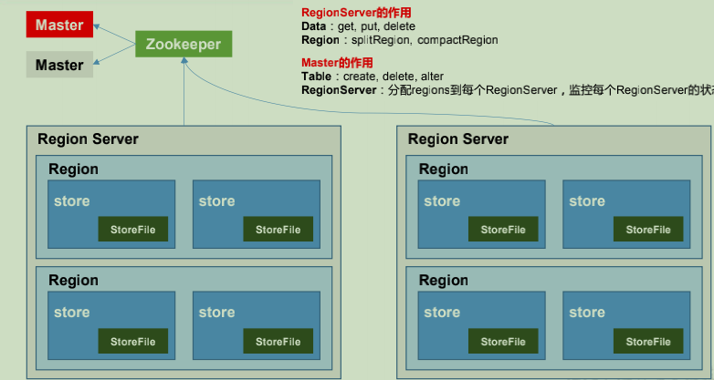

+ **Region Server**

  Region Server 为 Region 的管理者，其实现类为 HRegionServer，主要作用如下:

  对于数据的操作：get, put, delete；

  对于 Region 的操作：splitRegion、compactRegion。

+ **Master**

  Master 是所有 Region Server 的管理者，其实现类为 HMaster，主要作用如下：

  对于表的操作：create, delete, alter

  对于 RegionServer的操作：分配 regions到每个RegionServer，监控每个 RegionServer的状态，负载均衡和故障转移。

+ **Zookeeper**

  HBase 通过 Zookeeper 来做 Master 的高可用、RegionServer 的监控、元数据的入口以及集群配置的维护等工作。

+ **HDFS**

  HDFS 为 HBase 提供最终的底层数据存储服务，同时为 HBase 提供高可用的支持

# 3. HBase架构原理

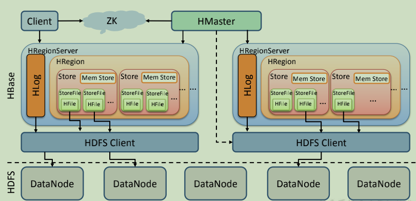

+ **StoreFile**

  保存实际数据的物理文件，StoreFile 以 HFile 的形式存储在 HDFS 上。每个 Store 会有一个或多个 StoreFile（HFile），数据在每个 StoreFile 中都是有序的。

+ **MemStore**

  写缓存，由于 HFile 中的数据要求是有序的，所以数据是先存储在 MemStore 中，排好序后，等到达刷写时机才会刷写到 HFile，每次刷写都会形成一个新的 HFile。

+ **WAL**

  由于数据要经 MemStore 排序后才能刷写到 HFile，但把数据保存在内存中会有很高的概率导致数据丢失，为了解决这个问题，数据会先写在一个叫做 Write-Ahead logfile 的文件中，然后再写入 MemStore 中。所以在系统出现故障的时候，数据可以通过这个日志文件重建。

# 4.HBase写流程

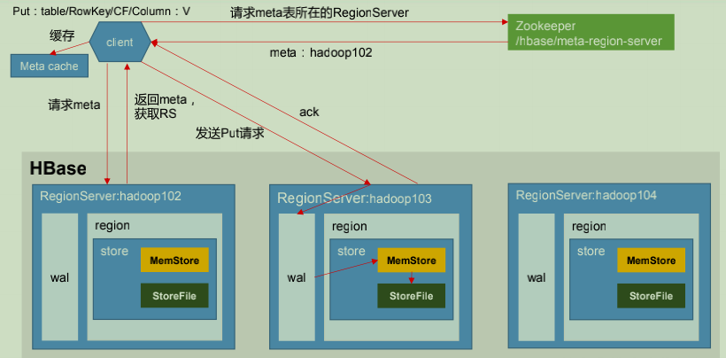

1）Client 先访问 zookeeper，获取 hbase:meta 表位于哪个 Region Server。 

2）访问对应的 Region Server，获取 hbase:meta 表，根据读请求的 namespace:table/rowkey，查询出目标数据位于哪个 Region Server 中的哪个 Region 中。并将该 table 的 region 信息以及 meta 表的位置信息缓存在客户端的 metacache，方便下次访问。

3）与目标 Region Server 进行通讯；

4）将数据顺序写入（追加）到 WAL； 

5）将数据写入对应的 MemStore，数据会在 MemStore 进行排序； 

6）向客户端发送 ack； 

7）等达到 MemStore 的刷写时机后，将数据刷写到 HFile。

# 5. **MemStore** **刷写时机**

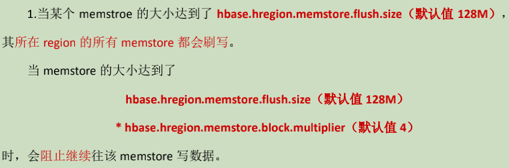

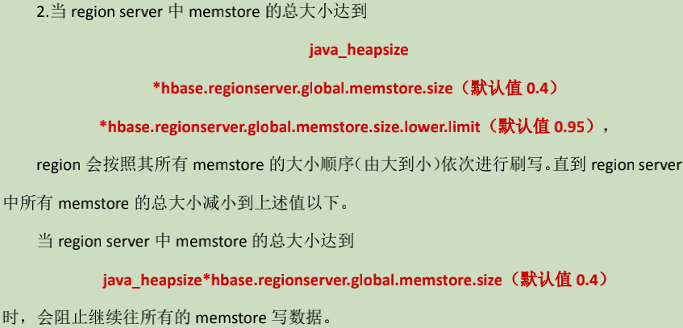

# 6.HBase读流程

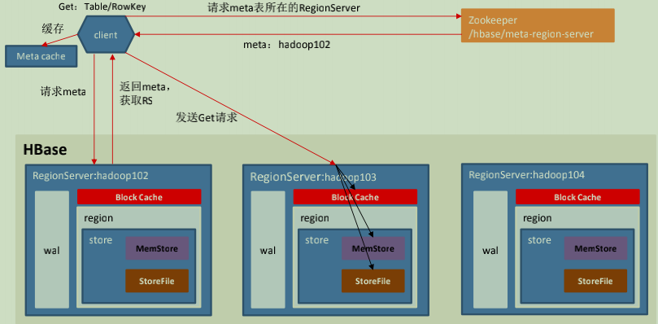

1）Client 先访问 zookeeper，获取 hbase:meta 表位于哪个 Region Server。 

2）访问对应的 Region Server，获取 hbase:meta 表，根据读请求的 namespace:table/rowkey，查询出目标数据位于哪个 Region Server 中的哪个 Region 中。并将该 table 的 region 信息以及 meta 表的位置信息缓存在客户端的 meta cache，方便下次访问。

3）与目标 Region Server 进行通讯；

4）分别在 Block Cache（读缓存），MemStore 和 Store File（HFile）中查询目标数据，并将查到的所有数据进行合并。此处所有数据是指同一条数据的不同版本（time stamp）或者不同的类型（Put/Delete）。

5） 将从文件中查询到的数据块（Block，HFile 数据存储单元，默认大小为 64KB）缓存到Block Cache。 

6）将合并后的最终结果返回给客户端。

# 7. 小合并与大合并的原理及区别

由于memstore每次刷写都会生成一个新的HFile，且同一个字段的不同版本（timestamp）和不同类型（Put/Delete）有可能会分布在不同的 HFile 中，因此查询时需要遍历所有的 HFile。为了减少 HFile 的个数，以及清理掉过期和删除的数据，会进行 StoreFile Compaction。Compaction 分为两种，分别是 Minor Compaction 和 Major Compaction。Minor Compaction会将临近的若干个较小的 HFile 合并成一个较大的 HFile，但**不会**清理过期和删除的数据。Major Compaction 会将一个 Store 下的所有的 HFile 合并成一个大 HFile，并且**会**清理掉过期和删除的数据。

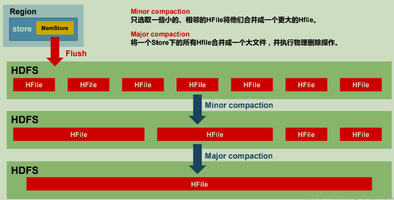

# 8. Region切分的时机

默认情况下，每个 Table 起初只有一个 Region，随着数据的不断写入，Region 会自动进行拆分。刚拆分时，两个子 Region 都位于当前的 Region Server，但处于负载均衡的考虑，HMaster 有可能会将某个 Region 转移给其他的 Region Server。

Region Split 时机：

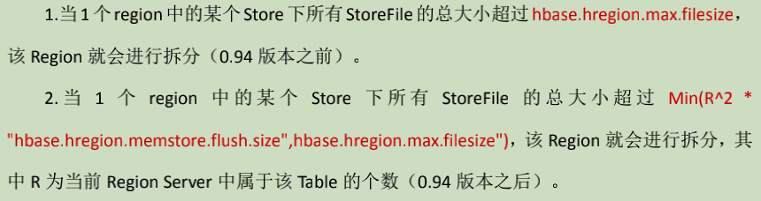

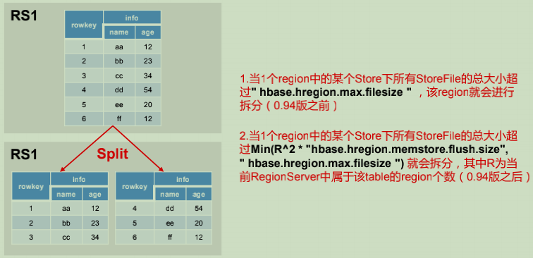

# 9. HBase优化点

## 9.1 **高可用**

在 HBase 中 HMaster 负责监控 HRegionServer 的生命周期，均衡 RegionServer 的负载，如果 HMaster 挂掉了，那么整个 HBase 集群将陷入不健康的状态，并且此时的工作状态并不会维持太久。所以 HBase 支持对 HMaster 的高可用配置。

## 9.2 **预分区**

每一个 region 维护着 StartRow 与 EndRow，如果加入的数据符合某个 Region 维护的RowKey 范围，则该数据交给这个 Region 维护。那么依照这个原则，我们可以将数据所要投放的分区提前大致的规划好，以提高 HBase 性能。

## 9.3 **RowKey** **设计**

一条数据的唯一标识就是 RowKey，那么这条数据存储于哪个分区，取决于 RowKey 处于哪个一个预分区的区间内，设计 RowKey 的主要目的 ，就是让数据均匀的分布于所有的region 中，在一定程度上防止数据倾斜

## 9.4 内存优化

HBase 操作过程中需要大量的内存开销，毕竟 Table 是可以缓存在内存中的，一般会分配整个可用内存的 70%给 HBase 的 Java 堆。但是不建议分配非常大的堆内存，因为 GC 过程持续太久会导致 RegionServer 处于长期不可用状态，一般 16~48G 内存就可以了，如果因为框架占用内存过高导致系统内存不足，框架一样会被系统服务拖死

## 9.5 其他基本优化项

+ 允许在 HDFS 的文件中追加内容
+ 优化 DataNode 允许的最大文件打开数
+ 优化延迟高的数据操作的等待时间
+ 优化数据的写入效率(启用压缩)
+ 设置 RPC 监听数量
+ 优化 HStore 文件大小
+ 优化 HBase 客户端缓存
+ 指定 scan.next 扫描 HBase 所获取的行数

# 10. RowKey设计方案

## 10.1 生成随机数、hash、散列值

## 10.2 字符串反转

## 10.2 字符串拼接

# 11. HBase热点问题(数据倾斜)原因及解决方案

热点问题(数据倾斜)：读写请求集中到某一个RegionServer上

## 11.1 原因

1. HBase中的数据是按照字典序排序的，当大量连续的RowKey集中写在个别Region上就会导致数据倾斜
2. 创建表时没有提前预分区，创建表时只有一个Region,大量的数据写入当前Region就会造成数据倾斜
3. 创建表时已经提前预分区，但是设计的RowKey没有规律可循

## 11.2 解决方案

1. RowKey设计成随机数+业务主键，如果向让最近的数据快速get到，可以将时间戳加上
2. RowKey设计越短越好，最好在10~100字节
3. 映射ReginNo,这样既可以让数据均匀分布到各个Region中，同时可以根据StartKey和EndKey get到同一批数据

# 12. RowKey设计原则

## 12.1 **唯一性原则**

rowkey在设计上保证其唯一性。rowkey是按照字典顺序排序存储的，因此，设计rowkey的时候，要充分利用这个排序的特点，将经常读取的数据存储到一块，将最近可能会被访问的数据放到一块

## 12.2 **长度原则**

rowkey是一个二进制码流，可以是任意字符串，最大长度 64kb ，实际应用中一般为10-100bytes，以byte[] 形式保存，一般设计成定长。**建议越短越好，不要超过16个字节**，原因如下：数据的持久化文件HFile中是按照KeyValue存储的，如果rowkey过长，比如超过100字节，1000w行数据，光rowkey就要占用100*1000w=10亿个字节，将近1G数据，这样会极大影响HFile的存储效率；MemStore将缓存部分数据到内存，如果rowkey字段过长，内存的有效利用率就会降低，系统不能缓存更多的数据，这样会降低检索效率。**目前操作系统都是64位系统，内存8字节对齐，控制在16个字节，8字节的整数倍利用了操作系统的最佳特性**。

## 12.3 **散列原则**

如果rowkey按照时间戳的方式递增，不要将时间放在二进制码的前面，建议将rowkey的高位作为散列字段，由程序随机生成，低位放时间字段，这样将提高数据均衡分布在每个RegionServer，以实现负载均衡的几率。如果没有散列字段，首字段直接是时间信息，所有的数据都会集中在一个RegionServer上，这样在数据检索的时候负载会集中在个别的RegionServer上，造成热点问题，会降低查询效率

# 13. RegionServer挂了后如何恢复数据？

HBase检测宕机是通过Zookeeper实现的， 正常情况下RegionServer会周期性向Zookeeper发送心跳，一旦发生宕机，心跳就会停止，超过一定时间（SessionTimeout）Zookeeper就会认为RegionServer宕机离线，并将该消息通知给Master

一旦RegionServer发生宕机，HBase都会马上检测到这种宕机，并且在检测到宕机之后会将宕机RegionServer上的所有Region重新分配到集群中其他正常RegionServer上去，再根据HLog进行丢失数据恢复，恢复完成之后就可以对外提供服务，整个过程都是自动完成的，并不需要人工介入.

1. RegionServer宕机
2. Master检测RegionServer宕机
3. HLog切分
4. Region重新分配并打开
5. HLog回放补救数据
6. 恢复完成

# 14. HBase二级索引

默认情况下，Hbase只支持rowkey的查询，对于多条件的组合查询的应用场景，不够给力。

如果将多条件组合查询的字段都拼接在RowKey中显然又不太可能

全表扫描再结合过滤器筛选出目标数据(太低效)，所以通过设计HBase的二级索引来解决这个问题。

这里所谓的二级索引其实就是创建新的表，并建立各列值（family：column）与行键（rowkey）之间的映射关系。这种方式需要额外的存储空间，属于一种以空间换时间的方式

# 15. hbase中查询表名为test，rowkey为userl开头的

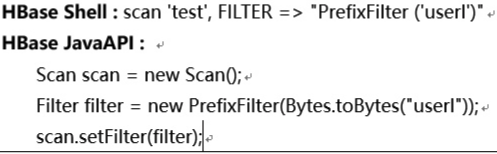

# 16. HBase表设计的注意点

+ RowKey的结构是什么以及包含的内容是什么
+ 表有多少个列族
+ 列族中要放什么数据
+ 每个列族中有多少个列
+ 列名是什么
+ 单元数据包含哪些信息
+ 每个单元数据需要存储的版本数量是多少

# 17. HBase与MySQL的区别

## 17.1 数据存储的方式

MySQL面向行存储数据，整个行的数据是一个整体，存储在一起

HBase面向列存储数据，整个列的数据是一个整体，存储在一起，有利于压缩和统计

## 17.2 数据之间的关系

MySQL存储关系型、结构化数据

HBase一般存储非关系型、非结构化数据

## 17.3 事务处理

MySQL存在事务

HBase侧重于海量数据的存储，没有事务的概念

## 17.4 存储容量

MySQL存储数据依赖于所在的硬件设备

HBase依托于Hadoop

# 18. HBase与Hive的区别与联系

## 18.1 共同点

hbase与hive都是架构在hadoop之上的。都是用hadoop作为底层存储

## 18.2 区别

1. Hive是建立在Hadoop之上为了减少MapReducejobs编写工作的批处理系统，HBase是为了支持弥补Hadoop对实时操作的缺陷的项
2. 如果是全表扫描，就用Hive+Hadoop,如果是索引访问，就用HBase+Hadoop
3. Hive query就是MapReduce jobs可以从5分钟到数小时不止，HBase是非常高效的
4. Hive本身不存储和计算数据，它完全依赖于HDFS和MapReduce，Hive中的表纯逻辑，hbase是物理表，不是逻辑表，提供一个超大的内存hash表，搜索引擎通过它来存储索引，方便查询操作

# 19. HBase实时查询的原理

实时查询，可以认为是从内存中查询，一般响应时间在 1 秒内。 HBase 的机制是数据先写入到内存中，当数据量达到一定的量（如 128M），再写入磁盘中， 在内存中，是不进行数据的更新或合并操作的，只增加数据，这使得用户的写操作只要进入内存中就可以立即返回，保证了 HBase I/O 的高性能

# 20. Hbase 中 scan 和 get 的功能以及实现的异同

1.按指定RowKey 获取唯一一条记录， get方法（org.apache.hadoop.hbase.client.Get）Get 的方法处理分两种 : 设置了 ClosestRowBefore 和没有设置的 rowlock .主要是用来保证行的事务性，即每个 get 是以一个 row 来标记的.一个 row 中可以有很多 family 和 column.

2.按指定的条件获取一批记录， scan 方法(org.apache.Hadoop.hbase.client.Scan)实现条件查询功能使用的就是 scan 方式.1)scan 可以通过 setCaching 与 setBatch 方法提高速度(以空间换时间)； 2)scan 可以通过 setStartRow 与 setEndRow 来限定范围([start， end]start 是闭区间， end 是开区间)。范围越小，性能越高。3)scan 可以通过 setFilter 方法添加过滤器，这也是分页、多条件查询的基础。

# 21. 描述 Hbase 中一个 Cell 的结构

HBase 中通过 row 和 columns 确定的一个存贮单元称为 cell。Cell：由{row key, column(=<family> + <label>), version}是唯一确定的单元 cell中的数据是没有类型的，全部是字节码形式存贮 

# 22. HBase scan setBatch和setCaching的区别

setCaching设置的值为每次rpc的请求记录数，默认是1；cache大可以优化性能，但是太大了会花费很长的时间进行一次传输。

setBatch设置每次取的column size；有些row特别大，所以需要分开传给client，就是一次传一个row的几个column。

batch和caching和hbase table column size共同决意了rpc的次数。

通过下表可以看出caching/batch/rpc次数的关系：

10 rows， 2 families， 10column per family，total：200 cell

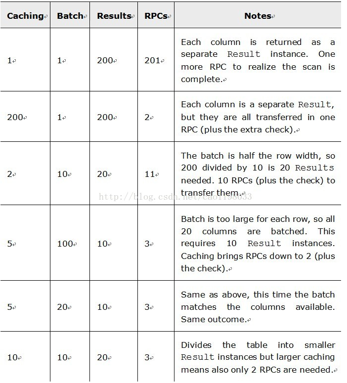

# 23. HBase 宕机如何处理

宕机分为 HMaster 宕机和 HRegisoner 宕机，如果是 HRegisoner 宕机， HMaster 会将其所管理的 region 重新分布到其他活动的 RegionServer 上，由于数据和日志都持久在 HDFS中，该操作不会导致数据丢失。所以数据的一致性和安全性是有保障的。如果是 HMaster 宕机， HMaster 没有单点问题， HBase 中可以启动多个 HMaster，通过Zookeeper 的 Master Election 机制保证总有一个 Master 运行。即 ZooKeeper 会保证总会有一个 HMaster 在对外提供服务。

# 24. 导致Hbase挂掉的场景

## 24.1 HMaster出现异常的场景

1. zk异常导致的master停止服务是最常见的场景，涉及操作包含但不限于以下：
   + Zk链接超时，超时时间通过zookeeper.session.timeout配置，默认为3分钟, 如果fail.fast.expired.active.master配置的值为false（默认为false），则不会立即abort，而是会尝试恢复zk的过期session
   + 在下线disabled的regoin时，从zk中删除disabled的region如果发生zk异常
2. 在assign时，如果设置region为offlined状态，但是region之前的状态不是closed或者offlined
3. 在assign时无法获取region信息
4. 把新的hbase集群加入到正在运行的hbase集群时，zk的/hbase/unassigned节点没有数据
5. 使用线程池批量分配region时，出现未被捕获的异常
6. 在启动master的服务线程时，出现了异常

## 24.2 HRegionServer出现异常的场景

1. 在读写hdfs时如果出现IOException异常，此时会发起hdfs的文件系统检查
2. Regionserver的服务线程出现了未捕获异常
3. 在启动HRegionServer时出现异常
4. 在进行HLog回滚时，出现异常
5. 在flush memstore时，如果持久化失败，会重启RS，在重启中把hlog的内容重新加载到memstore
6. 出现zk异常，包括但不限于以下场景
   + Zk链接超时
   + 启动HRegionServer时出现KeeperException异常
   + 在进行split操作时，如果出现异常会进行回滚操作，在回滚过程中需要从zk中删除region的spliting状态，如果删除时出现KeeperException或者回滚的其它操作出现异常
   + 在打开region时，出现了KeeperException异常

