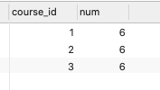
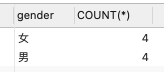
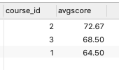
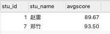
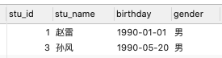
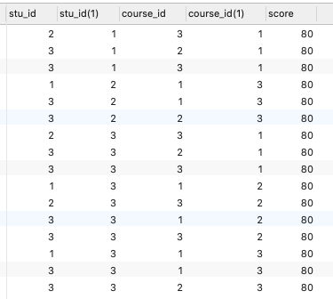
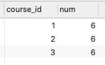
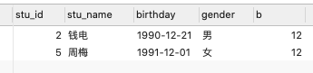
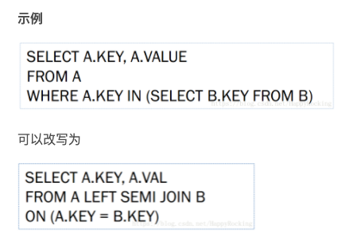

[TOC]

# 1.HQL题目系列

## 1.1 课程系列

查询"01"课程比"02"课程成绩高的学生的信息及课程分数:

```sql
SELECT
	stu.*,
	sc.score,
	a.score 
FROM
	t_stu_info stu
	JOIN t_score sc ON sc.course_id = 1 
	AND sc.stu_id = stu.stu_id
	LEFT JOIN t_score a ON a.course_id = 2 
	AND a.stu_id = stu.stu_id 
WHERE
	sc.score > a.score 
	OR a.score IS NULL 
GROUP BY
	stu.stu_id,
	stu.stu_name,
	stu.birthday,
	stu.gender,
	sc.score,
	a.score;

2	钱电		1990-12-21	男	70	60
4	李云		1990-08-06	男	50	30
6	吴兰		1992-03-01	女	31	NULL

```

查询平均成绩大于等于60分的同学的学生编号和学生姓名和平均成绩:


```sql
SELECT
	stu.stu_id,
	stu.stu_name,
	round( avg( sc.score ), 2 ) AS avgscore 
FROM
	t_stu_info stu
	JOIN t_score sc ON sc.stu_id = stu.stu_id 
GROUP BY
	stu.stu_id,
	stu.stu_name 
HAVING
	avgscore >= 60;

运行结果:

1	赵雷		89.67
2	钱电		70.0
3	孙风		80.0
5	周梅		81.5
7	郑竹		93.5
```


查询平均成绩小于60分的同学的学生编号和学生姓名和平均成绩:
(包括有成绩的和无成绩的)

```sql
SELECT
	stu.stu_id,
	stu.stu_name,
	ROUND( AVG( sc.score ), 2 ) AS avgscore 
FROM
	t_stu_info stu
	JOIN t_score sc ON sc.stu_id = stu.stu_id 
GROUP BY
	stu.stu_id,
	stu.stu_name 
HAVING
	avgscore <= 60 UNION ALL
SELECT
	stu.stu_id,
	stu.stu_name,
	0 AS avgscore 
FROM
	t_stu_info stu
	LEFT JOIN t_score sc ON sc.stu_id = stu.stu_id 
WHERE
	sc.score IS NULL;
	
	运行结果:

8	王菊	0.0
4	李云	33.33
6	吴兰	32.5
```

查询所有同学的学生编号、学生姓名、选课总数、所有课程的总成绩

```sql
SELECT
	a.stu_id,
	a.stu_name,
	count( a.stu_id ),
	sum( b.score ) 
FROM
	t_stu_info a
	LEFT JOIN t_score b ON a.stu_id = b.stu_id 
GROUP BY
	a.stu_id,
	a.stu_name;
	
	运行结果:

1	赵雷		3	269
2	钱电		3	210
3	孙风		3	240
4	李云		3	100
5	周梅		2	163
6	吴兰		2	65
7	郑竹		2	187
8	王菊		1	NULL
```


查询学过"张三"老师授课的同学的信息

```sql
SELECT
	a.stu_id,
	a.stu_name,
	a.birthday,
	a.gender,
	d.teach_name 
FROM
	t_stu_info a
	JOIN t_teach d ON d.teach_name = '张三'
	JOIN t_course c ON c.teach_id = d.teach_id
	JOIN t_score b ON a.stu_id = b.stu_id 
	AND b.course_id = c.course_id;
	
	
运行结果：
1	赵雷	1990-01-01	男
2	钱电	1990-12-21	男
3	孙风	1990-05-20	男
4	李云	1990-08-06	男
5	周梅	1991-12-01	女
7	郑竹	1989-07-01	女
```


查询没学过"张三"老师授课的同学的信息

```sql
SELECT
	stu.*,
	cs.course_id,
	sc.score 
FROM
	t_stu_info stu
	JOIN t_teach ter ON ter.teach_name = '张三'
	JOIN t_course cs ON ter.teach_id = cs.teach_id
	LEFT JOIN t_score sc ON sc.stu_id = stu.stu_id 
	AND sc.course_id = cs.course_id 
WHERE
	sc.score IS NULL;
```

查询学过编号为"01"并且也学过编号为"02"的课程的同学的信息

```sql
SELECT
	a.stu_id,
	a.stu_name,
	a.birthday,
	a.gender,
	count( a.stu_id ) 
FROM
	t_stu_info a
	LEFT JOIN t_score b ON a.stu_id = b.stu_id 
WHERE
	b.course_id IN ( 1, 2 ) 
GROUP BY
	a.stu_id,
	a.stu_id,
	a.stu_name,
	a.birthday,
	a.gender 
HAVING
	count( a.stu_id )> 1;
```

另一种解法

```sql
SELECT
	stu.stu_id,
	stu.stu_name 
FROM
	t_stu_info stu
	JOIN t_score sc ON sc.course_id = '01' 
	AND sc.stu_id = stu.stu_id
	JOIN t_score sc1 ON sc1.course_id = '02' 
	AND sc1.stu_id = sc.stu_id;
```

查询学过编号为"01"但是没有学过编号为"02"的课程的同学的信息

```sql
SELECT
	stu.stu_id,
	stu.stu_name 
FROM
	t_stu_info stu
	JOIN t_score sc ON sc.course_id = 1
	AND sc.stu_id = stu.stu_id
	LEFT JOIN t_score sc1 ON sc1.course_id = 2
	AND sc1.stu_id = sc.stu_id 
WHERE
	sc1.score IS NULL;
```


查询没有学全所有课程的同学的信息:
–先查询出课程的总数量–再查询所需结果

```sql
SELECT DISTINCT
	stu.stu_id,
	stu.stu_name 
FROM
	t_stu_info stu
	JOIN t_course cs
	LEFT JOIN t_score sc ON sc.stu_id = stu.stu_id 
	AND cs.course_id = sc.course_id 
WHERE
	sc.score IS NULL;
```

查询至少有一门课与学号为"1"的同学所学相同的同学的信息

下面是自己想到的一种解法：

```sql
SELECT
	* 
FROM
	t_stu_info st 
WHERE
	st.stu_id IN (
	SELECT DISTINCT
		sc.stu_id 
	FROM
		t_score sc 
	WHERE
		sc.course_id IN ( SELECT sc.course_id FROM t_score sc WHERE sc.stu_id = 1 AND sc.score IS NOT NULL ) 
	AND sc.stu_id != 1 
	);
```


别人的解法

```sql
SELECT DISTINCT
	stu.stu_id,
	stu.stu_name 
FROM
	t_stu_info stu
	JOIN t_score sc ON sc.stu_id = 1
	LEFT JOIN t_score sc1 ON sc1.stu_id = stu.stu_id 
	AND sc1.course_id = sc.course_id 
WHERE
	stu.stu_id != 1
	AND sc1.score IS NOT NULL;
```

查询和"01"号的同学学习的课程完全相同的其他同学的信息

```sql
SELECT
	* 
FROM
	(
	SELECT
		a.stu_id,
		concat_ws(
			",",
			collect_set (cast( a.course_id AS string ))) AS course1 
	FROM
		t_score a 
	WHERE
		a.stu_id = 1
	GROUP BY
		a.stu_id 
	) b
	JOIN ( SELECT c.stu_id, concat_ws( ",", collect_set ( cast( c.course_id AS string ))) AS course2 FROM t_score c GROUP BY c.stu_id ) d ON b.course1 = d.course2 
	AND d.stu_id != 1;
```

查询没学过"张三"老师讲授的任一门课程的学生姓名

自己想出来的解法

```sql
SELECT
	stu.stu_id,
	stu.stu_name,
	
FROM
	t_stu_info stu
	JOIN t_teach te ON te.teach_name = '张三'
	JOIN t_course cs ON cs.teach_id = te.teach_id
	LEFT JOIN t_score sc ON sc.course_id = cs.course_id 
	AND sc.stu_id = stu.stu_id 
WHERE
	sc.score IS NULL;
```

别人的解法：

```sql
SELECT
	stu.*
FROM
	t_stu_info stu
	LEFT JOIN t_score sc ON sc.stu_id = stu.stu_id
	LEFT JOIN t_course cs ON cs.course_id = sc.course_id
	LEFT JOIN t_teach te ON te.teach_id=cs.teach_id AND te.teach_name = '张三' 
GROUP BY
	stu.stu_id,
	stu.stu_name,
	stu.birthday,
	stu.gender 
HAVING
	SUM( CASE WHEN te.teach_name IS NULL THEN 0 ELSE 1 END)=0;
```


查询两门及其以上不及格课程的同学的学号，姓名及其平均成绩

```sql
SELECT
	a.stu_id,
	a.stu_name,
	round( avg( b.score ), 2 ) 
FROM
	t_stu_info a
	LEFT JOIN t_score b ON a.stu_id = b.stu_id 
WHERE
	b.score < 60 
GROUP BY
	a.stu_id,
	a.stu_name 
HAVING
	count( a.stu_id )> 1;
```


检索"1"课程分数小于60，按分数降序排列的学生信息

自己想出来的方案：

```sql
SELECT
	stu.*,
	sc.score 
FROM
	t_stu_info stu
	JOIN t_score sc ON sc.stu_id = stu.stu_id  AND sc.course_id=1
WHERE
	sc.score < 60 
ORDER BY
	sc.score DESC;
```

按平均成绩从高到低显示所有学生的所有课程的成绩以及平均成绩

```sql
SELECT
	a.*,
	b.course_id,
	b.score,
	round( avg( b.score ) over ( PARTITION BY a.stu_id ORDER BY b.score DESC rows BETWEEN unbounded preceding AND unbounded following ), 2 ) AS avg 
FROM
	t_stu_info a
	LEFT JOIN t_score b ON a.stu_id = b.stu_id 
ORDER BY
	avg DESC;
```

查询各科成绩最高分、最低分和平均分：以如下形式显示：课程ID，课程name，最高分，最低分，平均分，及格率，中等率，优良率，优秀率

```sql
SELECT
	sc.course_id,
	cs.course,
	MAX( sc.score ) AS max_score,
	MIN( sc.score ) AS min_score,
	ROUND( AVG( sc.score ), 2 ) AS avg_score,
	ROUND( SUM( CASE WHEN sc.score > 60 AND sc.score <= 70 THEN 1 ELSE 0 END )/ SUM( 1 ), 2 ) AS pass,
	ROUND( SUM( CASE WHEN sc.score > 70 AND sc.score <= 80 THEN 1 ELSE 0 END )/ SUM( 1 ), 2 ) AS middle,
	ROUND( SUM( CASE WHEN sc.score > 80 AND sc.score <= 90 THEN 1 ELSE 0 END )/ SUM( 1 ), 2 ) AS good,
	ROUND( SUM( CASE WHEN sc.score > 90 AND sc.score <= 100 THEN 1 ELSE 0 END )/ SUM( 1 ), 2 ) AS excellent 
FROM
	t_score sc
	JOIN t_course cs ON sc.course_id = cs.course_id 
GROUP BY
	sc.course_id,
	cs.course;
```


按各科成绩进行排序，并显示排名:– row_number() over()分组排序功能

```sql
SELECT
	course_id,
	score,
	row_number() over ( PARTITION BY course_id ORDER BY score ) 
FROM
	t_score;
```

查询学生的总成绩并进行排名

```sql
SELECT
	a.stu_name,
	sum( b.score ) AS total 
FROM
	t_stu_info a
	LEFT JOIN t_score b ON a.stu_id = b.stu_id 
GROUP BY
	a.stu_name 
ORDER BY
	total DESC;
```


查询不同老师所教不同课程平均分从高到低显示

自己想出的解决方案

```sql
SELECT
	te.teach_name,
	cs.course,
	ROUND( AVG( sc.score ), 2 ) AS avgscore 
FROM
	t_teach te
	LEFT JOIN t_course cs ON te.teach_id = cs.teach_id
	LEFT JOIN t_score sc ON sc.course_id = cs.course_id 
GROUP BY
	te.teach_name,
	cs.course 
ORDER BY
	avgscore DESC;
```

查询所有课程的成绩第2名到第3名的学生信息及该课程成绩:

```sql
SELECT
	a.stu_id,
	a.course_id,
	b.stu_name,
	b.birthday,
	b.gender,
	a.score,
	a.rank 
FROM
	( SELECT stu_id, course_id, score, row_number() over ( PARTITION BY course_id ORDER BY score ) AS rank FROM t_score ) a
	JOIN t_stu_info b ON a.stu_id = b.stu_id 
WHERE
	a.rank IN ( '2', '3' );
```


统计各科成绩各分数段人数：课程编号,课程名称,[100-85],[85-70],[70-60],[0-60]及所占百分比

```sql
SELECT
	sc.course_id,
	cs.course,
	ROUND( SUM( CASE WHEN sc.score >= 85 AND sc.score < 100 THEN 1 ELSE 0 END )/ SUM( 1 )* 100, 2 ) AS 85_100,
	ROUND( SUM( CASE WHEN sc.score >= 70 AND sc.score < 85 THEN 1 ELSE 0 END )/ SUM( 1 )* 100, 2 ) AS 70_85,
	ROUND( SUM( CASE WHEN sc.score >= 60 AND sc.score < 70 THEN 1 ELSE 0 END )/ SUM( 1 )* 100, 2 ) AS 60_70,
	ROUND( SUM( CASE WHEN sc.score >= 0 AND sc.score < 60 THEN 1 ELSE 0 END )/ SUM( 1 )* 100, 2 ) AS 0_60 
FROM
	t_score sc
	LEFT JOIN t_course cs ON cs.course_id = sc.course_id 
GROUP BY
	sc.course_id,
	cs.course;
```


查询学生平均成绩及其名次

```sql
SELECT
	a.stu_id,
	a.avg,
	row_number() over ( ORDER BY avg DESC ) 
FROM
	( SELECT stu_id, round( avg( score ), 2 ) AS avg FROM t_score GROUP BY stu_id ) a;
```


查询各科成绩前三名的记录三个语句

```sql
SELECT
	sc.course_id,
	row_number() over ( PARTITION BY sc.course_id ORDER BY sc.score DESC ) AS rn 
FROM
	t_score sc 
WHERE
	rn <= 3;
```


查询每门课程被选修的学生数

```sql
SELECT
	sc.course_id,
	COUNT( sc.stu_id ) AS num 
FROM
	t_score sc 
GROUP BY
	sc.course_id;
```



查询出只有两门课程的全部学生的学号和姓名

```sql
SELECT
	stu.stu_id,
	stu.stu_name 
FROM
	t_stu_info stu
	LEFT JOIN t_score sc ON sc.stu_id = stu.stu_id 
	AND sc.score IS NOT NULL 
GROUP BY
	stu.stu_id,
	stu.stu_name 
HAVING
	COUNT( sc.course_id ) = 2;
```


查询男生、女生人数

```sql
SELECT
	gender,
	COUNT(*) 
FROM
	t_stu_info stu 
GROUP BY
	gender;
```




查询名字中含有"风"字的学生信息

```sql
SELECT
	stu.* 
FROM
	t_stu_info stu 
WHERE
	stu.stu_name LIKE '%风%';
```


查询同名同性学生名单，并统计同名人数

```sql
SELECT
	stu.stu_name,
	stu.gender,
	COUNT( stu.stu_name ) AS num 
FROM
	t_stu_info stu 
GROUP BY
	stu.stu_name,
	stu.gender 
HAVING
	num >= 2;
```


查询1990年出生的学生名单

```sql
SELECT
	t_stu_info.* 
FROM
	t_stu_info 
WHERE
	substring( birthday, 1, 4 )= '1990';
```


查询每门课程的平均成绩，结果按平均成绩降序排列，平均成绩相同时，按课程编号升序排列

```sql
SELECT
	sc.course_id,
	ROUND( AVG( sc.score ), 2 ) AS avgscore 
FROM
	t_score sc 
GROUP BY
	sc.course_id 
ORDER BY
	avgscore DESC,
	sc.course_id;
```



查询平均成绩大于等于85的所有学生的学号、姓名和平均成绩

```sql
SELECT
	stu.stu_id,
	stu.stu_name,
	ROUND( AVG( sc.score ), 2 ) AS avgscore 
FROM
	t_score sc
	LEFT JOIN t_stu_info stu ON stu.stu_id = sc.stu_id 
GROUP BY
	stu.stu_id,
	stu.stu_name 
HAVING
	avgscore >= 85;
```



查询课程名称为"数学"，且分数低于60的学生姓名和分数

```sql
SELECT
	a.*,
	b.score,
	c.course 
FROM
	t_stu_info a
	LEFT JOIN t_score b ON a.stu_id = b.stu_id
	LEFT JOIN t_course c ON b.course_id = c.course_id 
WHERE
	( c.course = '数学' AND b.score < 60 ) 
	OR c.course IS NULL;
```


查询所有学生的课程及分数情况

```sql
SELECT
	stu.stu_id,
	stu.stu_name,
	cs.course_id,
	cs.course,
	sc.score 
FROM
	t_stu_info stu
	LEFT JOIN t_score sc ON sc.stu_id = stu.stu_id
	LEFT JOIN t_course cs ON cs.course_id = sc.course_id;
```


查询任何一门课程成绩在70分以上的学生姓名、课程名称和分数

```sql
SELECT
	stu.stu_name,
	cs.course,
	sc.score 
FROM
	t_stu_info stu
	LEFT JOIN t_score sc ON sc.stu_id = stu.stu_id
	LEFT JOIN t_course cs ON cs.course_id = sc.course_id 
WHERE
	sc.score > 70;
```


查询课程不及格的学生

```sql
SELECT DISTINCT
	stu.* 
FROM
	t_stu_info stu
	LEFT JOIN t_score sc ON sc.stu_id = stu.stu_id 
WHERE
	sc.score < 60;
```


查询课程编号为1且课程成绩在80分以上的学生的学号和姓名

```sql
SELECT
	a.* 
FROM
	t_stu_info a
	JOIN t_score b ON a.stu_id = b.stu_id 
	AND b.course_id = 1 
	AND b.score >= 80;
```




求每门课程的学生人数

```sql
SELECT
	sc.course_id,
	COUNT( sc.stu_id ) AS nu 
FROM
	t_score sc 
GROUP BY
	sc.course_id;	
```


查询选修"张三"老师所授课程的学生中，成绩最高的学生信息及其成绩

```sql
SELECT
	stu.*,
	sc.score 
FROM
	t_stu_info stu
	JOIN t_score sc ON sc.stu_id = stu.stu_id
	JOIN t_course cs ON cs.course_id = sc.course_id
	JOIN t_teach te ON te.teach_id = cs.teach_id 
WHERE
	te.teach_name = '张三' 
ORDER BY
	sc.score DESC 
	LIMIT 1;
```


查询不同课程成绩相同的学生的学生编号、课程编号、学生成绩

```sql
SELECT DISTINCT
	a.stu_id,
	b.stu_id,
	a.course_id,
	b.course_id,
	b.score 
FROM
	t_score a
	JOIN t_score b ON a.score = b.score 
WHERE
	a.course_id <> b.course_id;
```



查询每门课程成绩最好的前三名

```sql
SELECT
	* 
FROM
	( SELECT course_id, score, row_number() over ( PARTITION BY course_id ORDER BY score DESC ) AS rn FROM t_score ) a 
WHERE
	a.rn < 4;
```


统计每门课程的学生选修人数（超过5人的课程才统计）

```sql
SELECT
	sc.course_id,
	COUNT( sc.stu_id ) AS num 
FROM
	t_score sc 
GROUP BY
	sc.course_id 
HAVING
	num > 5;
```



检索至少选修两门课程的学生学号

```sql
SELECT
	stu.stu_id,
	COUNT( sc.course_id ) AS num 
FROM
	t_stu_info stu
	JOIN t_score sc ON sc.stu_id = stu.stu_id 
GROUP BY
	stu.stu_id 
HAVING
	num >= 2;
```


查询选修了全部课程的学生信息

自己想出的解决方案

```sql
SELECT
	* 
FROM
	t_stu_info 
WHERE
	stu_id IN (
	SELECT
		stu_id 
	FROM
		(
		SELECT
			stu.stu_id,
			COUNT( sc.course_id ) AS num 
		FROM
			t_stu_info stu
			JOIN t_score sc ON sc.stu_id = stu.stu_id 
		GROUP BY
			stu.stu_id 
		HAVING
			num = 3 
		) t 
	) ;
```


别人的解法：

```sql
SELECT
	stu.stu_id,
	stu.stu_name 
FROM
	t_stu_info stu
	JOIN t_course cs
	LEFT JOIN t_score sc ON sc.stu_id = stu.stu_id 
	AND cs.course_id = sc.course_id 
GROUP BY
	stu.stu_id,
	stu.stu_name 
HAVING
	sum( CASE WHEN sc.score IS NULL THEN 1 ELSE 0 END )= 0;
```


查询各学生的年龄(周岁)

```sql
SELECT
	a.*,
	(
	CASE
			
			WHEN MONTH ( a.birthday )>= MONTH ( CURRENT_DATE ) 
			AND dayofmonth( a.birthday )> dayofmonth( CURRENT_DATE ) THEN
				YEAR ( CURRENT_DATE )- YEAR ( a.birthday )- 1 ELSE YEAR ( CURRENT_DATE )- YEAR ( a.birthday ) 
			END 
			) AS age 
	FROM
	t_stu_info a;
```


查询本周过生日的学生

```sql
SELECT
	a.*,
	weekofyear( a.birthday ),
	weekofyear( CURRENT_DATE ) 
FROM
	t_stu_info a 
WHERE
	(
	weekofyear( a.birthday )= weekofyear( CURRENT_DATE ));
```

查询下周过生日的学生

```sql
SELECT
	a.*,
	weekofyear( a.birthday ),
	weekofyear( CURRENT_DATE ) 
FROM
	t_stu_info a 
WHERE
	( CASE WHEN weekofyear( CURRENT_DATE )= 52 THEN 1 ELSE weekofyear( CURRENT_DATE )+ 1 END )= weekofyear( a.birthday );
```


查询本月过生日的学生

```sql
SELECT
	stu.*,
	MONTH ( CURRENT_DATE ) AS c,
	MONTH ( stu.birthday ) AS b 
FROM
	t_stu_info stu 
WHERE
	MONTH ( CURRENT_DATE )= MONTH ( stu.birthday );
```


查询12月份过生日的学生

```sql
SELECT
	stu.*,
	MONTH ( stu.birthday ) AS b 
FROM
	t_stu_info stu 
WHERE
	MONTH ( stu.birthday )= 12;
```




https://blog.csdn.net/qq_35954433/article/details/85275478

https://www.e-learn.cn/content/qita/1862551


## 1.2 统计用户登录时间

给定

user_id login_time login_ip要求统计出

user_id first_login_time first_login_ip last_login_time last_login_ip


```sql
select user_name,first_value(login_date)over(partition by user_name order by login_date) as first_login_time,first_value(ip)over(partition by user_name order by login_date) as first_login_ip, last_value(login_date) over(partition by user_name order by login_date) as last_login_time,last_value(ip)over(partition by user_name order by login_date) from login;
```

接着上面

统计距离上次登录时间的时间间隔

user_id login_time login_ip date_sub

```sql
select user_name,
       datediff(to_date(from_unixtime(
               UNIX_TIMESTAMP(lag(login_date, 0) over (partition by user_name order by login_date), 'yyyyMMdd'))),
                to_date(from_unixtime(
                        UNIX_TIMESTAMP(lag(login_date, 1,'19700101') over (partition by user_name order by login_date),
                                       'yyyyMMdd')))) as data_sub
from login;
```

**总结**：

把一个类似`20210101`的字符串转成date格式的步骤：

先通过`UNIX_TIMESTAMP()`函数获取时间戳，然后通过`from_unixtime()`函数以及`to_date()`函数转换成date类型

注意在UNIX_TIMESTAMP()函数中需要指定日期格式


## 1.3 相互关注(要求不使用join实现)

相互关注sql题

使用join的写法

```sql
SELECT
	a.uid1,
	a.uid2,
IF
	( b.uid1 IS NOT NULL, 1, 0 ) AS is_friend 
FROM
	follow a
	LEFT JOIN follow b ON a.uid1 = b.uid2 
	AND a.uid2 = b.uid1;
```

不使用join的写法：

```sql
SELECT
	a.uid1,
	a.uid2,
IF
	( sum( 1 ) over ( PARTITION BY feature ) > 1, 1, 0 ) AS is_friend 
FROM
	(
	SELECT
		a.uid1,
		a.uid2,
	IF
		(uid1 > uid2,	concat( uid2, uid1 ),concat( uid1, uid2 )) AS feature 
	FROM
	follow 
	) a;
```

# 2. grouping sets/grouping_id/cube/rollup

参考这篇博客：https://www.cnblogs.com/Allen-rg/p/10648231.html


这几个分析函数通常用于OLAP中，不能累加，而且需要根据不同维度上钻和下钻的指标统计，比如分小时、天、月的UV数

## 1.1 grouping sets

在一个group by 查询中，根据不同的维度组合进行聚合，等价于将不同维度的group by 结果进行union all


## 1.2 cube

根据group by的维度的所有组合进行聚合


## 1.3 rollup

是cube的子集，以最左侧的维度为主，从该维度进行层级聚合


# 3. Order by/sort by/distribute by/cluster by的区别

order by是全局排序

sort by 是每个reduce内部排序

distribute by 可以控制某个特定行到哪个reducer，通常是为了进行后续的聚集操作，distribute by 类似MR中partition,结合sort by 使用。distribute by的分区规则是根据分区字段的hash码与reduce的个数进行模除后，余数相同的分到一个区。hive要求distribute by语句要写在sort by语句之前。

当distribute by和sort by字段相同时，可以使用cluster by方式，cluster by除了具有distribute by的功能外还兼具有sort by的功能。但是排序只能是升序排序，不能指定排序规则为ASC或者DESC 


# 4. Hive中reduce个数怎么设置


# 5. left semi join

`left semi join`(左半连接)是in/exists子查询的一种更高效的实现




# 6. 数据倾斜的解决方案

## 6.1 Hive ETL对数据进行预处理

经过预处理之后的数据到spark之后就不会出现数据倾斜了，这种方法只是将数据倾斜提前了。

## 6.2 过滤少数导致倾斜的key

## 6.3 提高shuffle操作的并行度

在对RDD执行shuffle算子时，给shuffle算子传入一个参数，比如reduceByKey(1000)，该参数就设置了这个shuffle算子执行时shuffle read task的数量。对于Spark SQL中的shuffle类语句，比如group by、join等，需要设置一个参数，即spark.sql.shuffle.partitions，该参数代表了shuffle read task的并行度，该值默认是200，对于很多场景来说都有点过小

## 6.4 两阶段聚合

先进行局部聚合，然后再进行全局聚合

## 6.5 将reduce join转为map join

当join操作中的两张表中其中一张表或者RDD的数据量比较小的时候适用这种方案

## 6.6 采样倾斜key并分拆join操作

对包含少数几个数据量过大的key的那个RDD，通过sample算子采样出一份样本来，然后统计一下每个key的数量，计算出来数据量最大的是哪几个key。  然后将这几个key对应的数据从原来的RDD中拆分出来，形成一个单独的RDD，并给每个key都打上n以内的随机数作为前缀，而不会导致倾斜的大部分key形成另外一个RDD。 接着将需要join的另一个RDD，也过滤出来那几个倾斜key对应的数据并形成一个单独的RDD，将每条数据膨胀成n条数据，这n条数据都按顺序附加一个0~n的前缀，不会导致倾斜的大部分key也形成另外一个RDD。 再将附加了随机前缀的独立RDD与另一个膨胀n倍的独立RDD进行join，此时就可以将原先相同的key打散成n份，分散到多个task中去进行join了。 而另外两个普通的RDD就照常join即可。 最后将两次join的结果使用union算子合并起来即可，就是最终的join结果

## 6.7 采用随机前缀和扩容RDD进行join


# 7. 外部表和内部表的区别

## 7.1 存储

外部表数据由HDFS管理，内部表由hive自身管理

## 7.2 存储位置

外部表数据存储位置由自己指定，内部表数据存储在`hive.metastore.warehouse.dir`(默认在/usr/hive/warehouse)

## 7.3 创建

创建时外部表被external修饰，内部表没有

## 7.4 删除

删除外部表只删除元数据，删除内部表会删除元数据和存储数据

# 8. SQL/HQL是怎么转换成MR任务的？

总的来说，Hive是通过给用户提供的一系列交互接口，接收到用户的指令(SQL)，使用自己的Driver，结合元数据(MetaStore)，将这些指令翻译成MapReduce，提交到Hadoop中执行，最后，将执行返回的结果输出到用户交互接口


# 9. Hive SQL优化

1. join优化

   ```bash
   hive.optimize.skewjoin=true;如果是join过程中出现倾斜 应该设置为true
   set hive.skewjoin.key=100000; 这个是join的键对应的记录条数，超过这个值则会进行优化
   ```

2. mapjoin

   ```bash
   set hive.auto.convert.join=true;
   hive.mapjoin.smalltable.filesize默认值是25mb
   select /*+mapjoin(A)*/f.a, f.b from A t join B f on (f.a=t.a)
   ```

3. mapjoin的使用场景

   - 关联操作中有一张表非常小
   - 不等值的连接操作

4. bucket join

   - 两个表以相同方式划分桶
   - 两个表的桶个数是倍数关系

5. where放在join前

   优化前：

   ```sql
   select m.cid, u.id
   from order m
   join customer u
   on m.cid = u.id
   where m.dt='2018-06-08'
   ```

   优化后：

   ```sql
   select m.cid, u.id
   from
   (select cid from order
   where dt = '2018-06-08')m
   join customer u
   on m.cid = u.id;
   ```

6. group by 优化

   ```bash
   hive.group.skewindata=true; 如果是group by过程出现倾斜，应该设置为true
   set hive.groupby.mapaggr.checkinterval=100000; 这个是group的键对应的记录条数超过这个值则会进行优化
   ```

7. count distinct 优化

   优化前：

   ```sql
   select count(distinct id) from tablename;
   ```

   优化后：

   ```sql
   select count(1) from (select distinct id from tablename) tmp;
   select count(1) from (select id from tablename group by id) tmp;
   ```

# 10. 编写HQL过程中遇到的坑

1. distinct

   语句：select distinct uid,gender …
   错误理解：distinct只会将紧跟在distinct后的第一个字段去重。
   正确理解：distinct会按照后面的所有字段，去重。

2. insert

   语句：insert overwrite table a select uid,telephone,gender…
   往hdfs中插入数据时，select 后的字段的顺序，必须与目标表a的字段顺序相同。否则，会插入数据，但是字段对应错误

3. **Sqoop** **导入导出** **Null** **存储一致性问题**

   Hive 中的 Null 在底层是以“\N”来存储，而 MySQL 中的 Null 在底层就是 Null，为了

   保证数据两端的一致性。在导出数据时采用--input-null-string 和--input-null-non-string 两个参

   数。导入数据时采用--null-string 和--null-non-string。 

4. join后的on语句中的null值

   on语句中等式两边的字段，若有null时会出错，因为在SQL中"null = null"结果为unknown。所以须提前处理，再join连接。比如提前为null值赋值。
   例如下面的例子，两个表中uid都为null，在连接后就找不到第二个表中的数据了，这时须将两个表中的null都改为字符串’默认’。（实际工作中的需求时，null为默认，须统计默认分组中telephone的数量）

   

5. Full join多表连接中的on语句   

​             各on语句后的字段，必须为相邻表中的字段

6. left join中的右表

   left join时一定要确认右表中数据是否完整，若有完整的表不用，会致使最终结果缺失数据。
   确实，右表的大小不会影响left join语法的正确使用,左表中数据不会丢失，但最终数据缺失了，对一个报表来说，统计出错，一样是错误。
   总结：lef join时要确认，是否需要右表是全的，确认右表是否是全的

   full join多表连接中的on语句


# 11. 如何优化来减少shuffle


# 12. hive和mysql的区别

1. 数据存储位置

   hive中的数据存储在HDFS上，数据库将数据保存到块设备或者本地文件系统中

2. 数据格式

   hive没有定义专门的数据格式，数据格式可以由用户指定，而mysql定义了自己的数据格式，所有数据都按照一定的组织存储

3. 数据更新

   由于hive是针对数据仓库应用设计的并且数据仓库的内容读多写少，因此hive中不支持对数据的改写和添加，所有的数据都是在加载的时候确定好的，而数据库中的数据是经常需要修改的。

4. 索引

   hive没有对数据中的某些key建立索引，hive要访问数据中满足条件的特定值时，需要暴力扫描整个数据，因此访问延迟比较高，数据库中通常会针对一个或几个列建立索引

5. 执行

   hive可以对接MR、tez、spark等引擎，数据库也都有各自的执行引擎

6. 执行延迟

   hive在查询数据时，由于没有索引需要扫描整个表，因此延迟较高，另一个导致hive执行延迟高的因素是MapReduce框架，由于MapReduce本身具有较高的延迟，因此在利用MapReduce执行hive查询时，也会有较高的延迟，相对的数据库的延迟较低

7. 可扩展性

   由于hive是建立在hadoop之上，因此hive的可扩展性是和hadoop的可扩展性是一致的，而数据库由于ACID的严格限制，扩展性非常有限


# 13. 关系型数据库和非关系型数据库的区别

1. 存储方式

   关系型数据库是表格式的，因此存储在表的行和列中，NoSQL数据库则与其相反，通常存储在数据集中，比如文档、键值对或者图结构

2. 存储结构

   关系型数据库对应的是结构化数据，数据表都预先定义了结构，NoSQL数据库基于动态结构，可以很容易适应数据类型和结构的变化

3. 存储规范

   关系型数据库的数据存储为了更高的规范性，把数据分割为最小的关系表以避免重复，而NoSQL数据存储在平面集中，数据经常可能重复

4. 存储扩展

   关系型数据库是纵向扩展，也就是说想要提高处理能力，要使用速度更快的计算机，而NoSQL数据库是横向扩展的，它的存储天然就是分布式的，可以通过给资源池添加更多的普通数据库服务器来分担负载

5. 查询方式

   关系型数据库通过结构化查询语言来操作数据库，而NoSQL查询以块为单元操作数据，使用的是非结构化的语言

6. 事务

   关系型数据库遵循ACID原则，而NoSQL数据库循序BASE**（基本可用（Basically Availble）、软/柔性事务（Soft-state ）、最终一致性（Eventual Consistency））**原则

7. 性能

   关系型数据库为了维护数据的一致性付出了巨大的代价，读写性能比较差，NoSQL存储的格式都是key-value类型的，并且存储在内存中，非常容易存储，NoSQL无需sql的解析，提高了读写性能。


各自的适用场景是什么？

非关系型数据库：日志、埋点、论坛、博客

关系型数据库：所有有逻辑关系的数据存储


# 14. 缓慢变化维的数据是怎么处理的？


# 15. join的原理

