[TOC]


# 总结

## 1.连续相同

这种需求要想到使用row_number() over()


# 1.题目185 部门工资前三高的所有员工

## 1.1 题目描述

https://leetcode-cn.com/problems/department-top-three-salaries/


## 1.2 解答

```sql
select t.*, t2.Name
from (
         select DepartmentId,
                id,
                name,
                Salary,
                dense_rank() over (partition by DepartmentId order by Salary desc ) as rn

         from lc_185_employee
     ) t
         left join lc_185_department t2
                   on t.DepartmentId = t2.Id
where t.rn <= 3;
```


# 2. 题目262 行程和用户


## 2.1 题目描述

https://leetcode-cn.com/problems/trips-and-users/


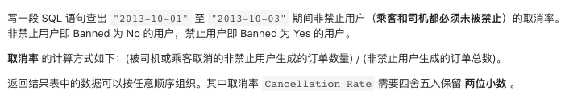

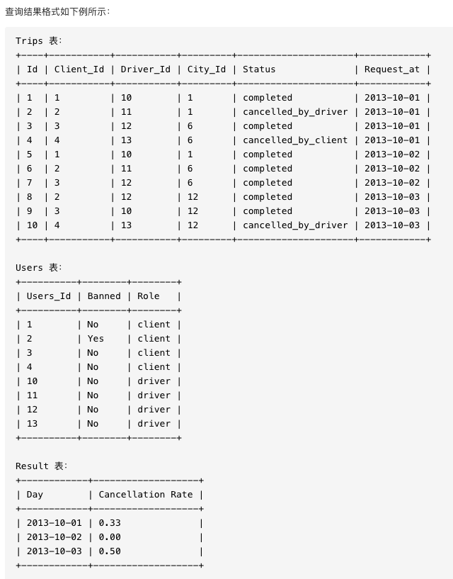

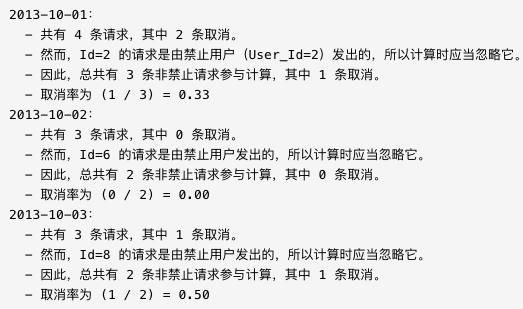

## 2.2 解答

```sql

SELECT T.request_at AS `Day`,
       ROUND(
                   SUM(
                           IF(T.STATUS = 'completed', 0, 1)
                       )
                   /
                   COUNT(T.STATUS),
                   2
           )        AS `Cancellation Rate`
FROM lc_262_tripes AS T
WHERE T.Client_Id NOT IN (
    SELECT users_id
    FROM lc_262_users
    WHERE banned = 'Yes'
)
  AND T.Driver_Id NOT IN (
    SELECT users_id
    FROM lc_262_users
    WHERE banned = 'Yes'
)
  AND T.request_at BETWEEN '2013-10-01' AND '2013-10-03'
GROUP BY T.request_at;
```


# 3. 题目569 员工薪水中位数

## 3.1 题目描述

https://leetcode-cn.com/problems/median-employee-salary/


## 3.2 解答

```sql
select Id, Company, Salary
from (
         select Id,
                Company,
                Salary,
                row_number() over (partition by Company order by Salary) as rnk,
                count(Salary) over (partition by Company)                as cnt
         from lc_569_employee
     ) t
where rnk in (cnt / 2, cnt / 2 + 1, cnt / 2 + 0.5);
```


# 4. 题目571 给定数字的频率查询中位数

## 4.1 题目描述


## 4.2 解答

中位数核心思想：按照asc排序，再按desc排序，amount都要大于等于总数/2

```sql
select avg(number) as median
from (select number,
             sum(frequency) over (order by number)  as asc_amount,
             sum(frequency) over (order by number desc) as desc_amount,
             sum(frequency) over ()                     as total_num
      from lc_571_numbers) a
where asc_amount >= total_num / 2
  and desc_amount >= total_num / 2;
```


# 5. 题目579 查询员工的累计薪水

## 5.1 题目描述

https://leetcode-cn.com/problems/find-cumulative-salary-of-an-employee/


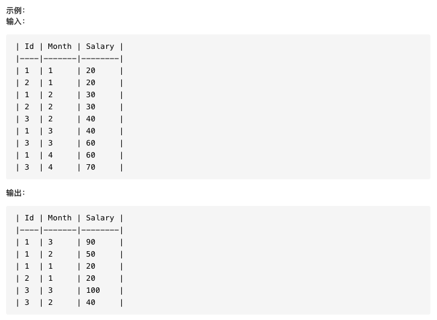

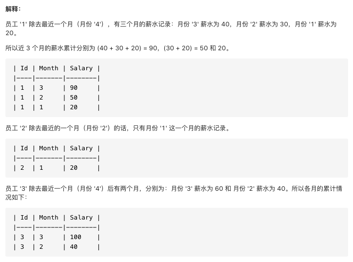


## 5.2 题目解答

```sql
SELECT Id, Month, Salary
FROM (SELECT Id,
             Month,
             SUM(Salary) OVER (PARTITION BY Id ORDER BY Month ROWS 2 PRECEDING) AS Salary,
             rank() OVER (PARTITION BY Id ORDER BY Month DESC)                  AS r
      FROM lc_579_employee) t
WHERE r > 1
ORDER BY Id, Month DESC;
```


# 6. 题目601 体育馆的人流量

## 6.1 题目描述

https://leetcode-cn.com/problems/human-traffic-of-stadium/

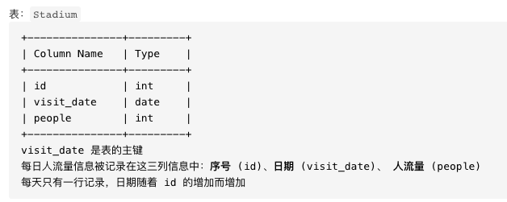


## 6.2 解答

```sql
with t60101 as (
    select id,
           visit_date,
           people,
           id - rank() over (order by id) as rn
    from lc_601_stadium
    where people >= 100
)

select id,
       visit_date,
       people
from t60101
where rn in (
    select rn
    from t60101
    group by rn
    having count(1) >= 3);
```


# 7. 题目615 平均工资：部门与公司比较

## 7.1 题目描述


## 7.2 解答

```sql
with t61501 as (
    select sal.employee_id,
           amount,
           pay_date,
           emp.department_id as dep_id
    from lc_615_salary sal
             left join lc_615_employee emp
                       on sal.employee_id = emp.employee_id
)
select substr(pay_date, 1, 7)                                                                          as pay_month,
       dep_id                                                                                          as department_id,
       (case when dep_avg > com_avg then 'higher' when dep_avg < com_avg then 'lower' else 'same' end) as comparision
from (
         select pay_date,
                dep_id,
                round(avg(amount) over (partition by dep_id,month(pay_date)), 2) as dep_avg,
                round(avg(amount) over (partition by month(pay_date)), 2)        as com_avg
         from t61501
     ) t
group by dep_id, substr(pay_date, 1, 7),
         (case when dep_avg > com_avg then 'higher' when dep_avg < com_avg then 'lower' else 'same' end)
order by pay_month desc
```


# 8. 题目618 学生地理信息报告

## 8.1 题目描述

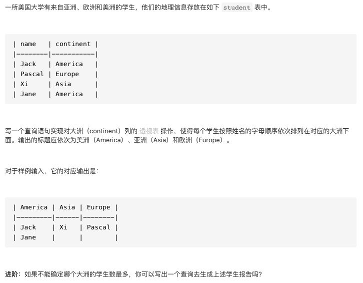

## 8.2 解答

```sql
select max(if(continent = 'America', name, null)) as America,
       max(if(continent = 'Asia', name, null))    as Asia,
       max(if(continent = 'Europe', name, null))  as Europe
from (select name, continent, row_number() over (partition by continent order by name) rk
      from lc_618_student) t
group by rk;
```


# 9. 题目1097 游戏玩法分析V

## 9.1 题目描述

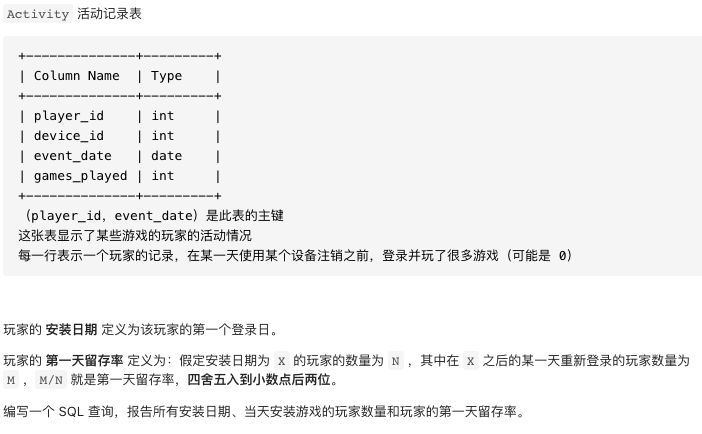


## 9.2 解答

```sql
SELECT first_day                 as install_dt,
       count(DISTINCT player_id) as installs,
       ROUND(
                   (SUM(if(datediff(event_date, first_day) = 1, 1, 0))) / (count(DISTINCT player_id)), 2
           )                     as Day1_retention
FROM (
         SELECT player_id,
                event_date,
                MIN(event_date) over (partition by player_id) as first_day
         FROM lc_1097_activity
     ) a
GROUP BY first_day;
```


# 10. 题目1127 用户购买平台

## 10.1 题目描述

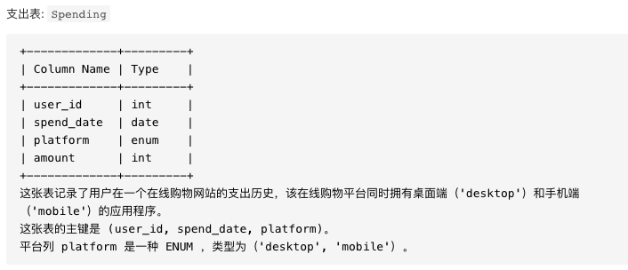


## 10.2 解答

```sql
-- 先构造出目标结果所需结构
with tbl1 as (
    select distinct spend_date, tmp2.platform
    from lc_1127_spending tmp1,
         (
             select 'both' as platform union all select 'mobile'  union all select 'desktop'
         ) tmp2
),
--      查询用户在各个平台的支出总额
     tbl2 as (
         select spend_date,
                user_id,
                sum(amount) as total_amount,
                (
                    case
                        when sum(if(platform = 'mobile', 1, 0)) >= 1 and sum(if(platform = 'desktop', 1, 0)) >= 1
                            then 'both'
                        when sum(if(platform = 'mobile', 1, 0)) >= 1 and sum(if(platform = 'desktop', 1, 0)) = 0
                            then 'mobile'
                        else 'desktop' end
                    )       as platform


         from lc_1127_spending
         group by spend_date, user_id
     ),
--      统计各个平台上的用户数
     tbl3 as (
         select spend_date,
                platform,
                sum(total_amount) as total_amount,
                count(user_id)    as total_users
         from tbl2
         group by spend_date, platform
     )

select tbl1.spend_date      as spend_date,
       tbl1.platform        as platform,
       nvl(total_amount, 0) as total_amount,
       nvl(total_users, 0)  as total_users
from tbl1
         left join tbl3
                   on tbl1.spend_date = tbl3.spend_date and tbl1.platform = tbl3.platform;
```


# 11. 题目1159 市场分析2

## 11.1 题目描述

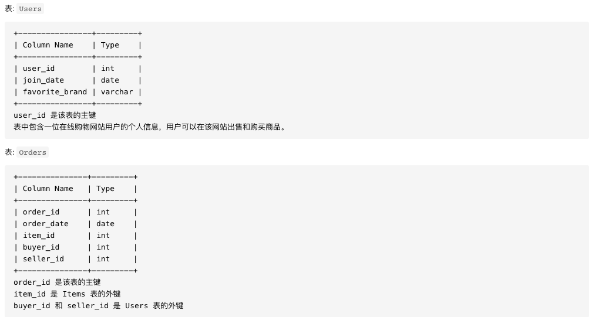

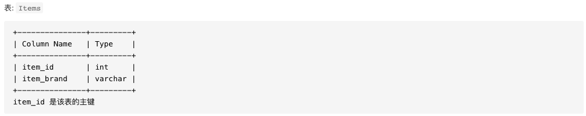


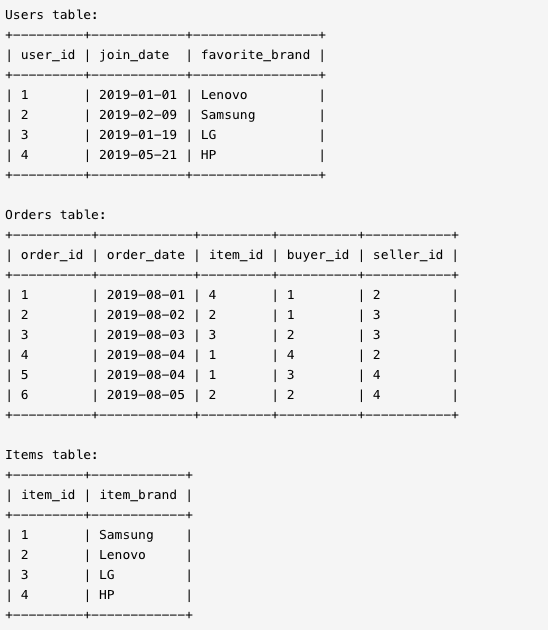

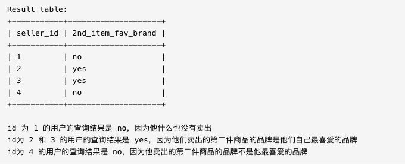

## 11.2 解答

```sql
-- 两次 row_number() 可以实现 limit n, m 的效果
select seller_id,
       case
           when rn = 2 and item_brand = favorite_brand then "yes"
           else 'no'
           end as 2nd_item_fav_brand
from (
         select seller_id,
                item_brand,
                favorite_brand,
                rn,
                row_number() over (partition by seller_id order by rn desc) as rn_desc
         from ( -- 这是核心逻辑，要注意一个商品都没有卖出去的用户也要出现在最终结果中
                  select users.user_id                                                             as seller_id,
                         items.item_brand,
                         users.favorite_brand,
                         row_number() over (partition by users.user_id order by orders.order_date) as rn
                  from lc_1159_users users
                           left join lc_1159_orders as orders on users.user_id = orders.seller_id
                           left join lc_1159_items as items on orders.item_id = items.item_id
             ) as a
         where rn <= 2
     ) as b
where rn_desc = 1
order by seller_id;
```

格式看起来更好理解的

```sql
-- 先把3张表进行join获取所需的所有字段
with t115901 as (
    select users.user_id        as user_id,
           users.favorite_brand as favorite_brand,
           item_brand,
           order_date

    from lc_1159_users as users
             left join lc_1159_orders as orders on orders.seller_id = users.user_id
             left join lc_1159_items l1159i on orders.item_id = l1159i.item_id
),
--      按照user_id进行分组，order_date进行排名
     t115902 as (
         select user_id                                                       as seller_id,
                favorite_brand,
                item_brand,
                order_date,
                row_number() over (partition by user_id order by order_date ) as rn
         from t115901
     ),
     t115903 as (
         select seller_id,
                favorite_brand,
                item_brand,
                rn,
                row_number() over (partition by seller_id order by rn desc ) rk
         from t115902
         where rn <= 2
     )

select seller_id,
       (
           case when rn = 2 and favorite_brand = item_brand then 'yes' else 'no' end
           ) as 2nd_item_fav_brand
from t115903
where rk = 1
order by seller_id;
```

# 12. 题目1194 锦标赛优胜者

## 12.1 题目描述

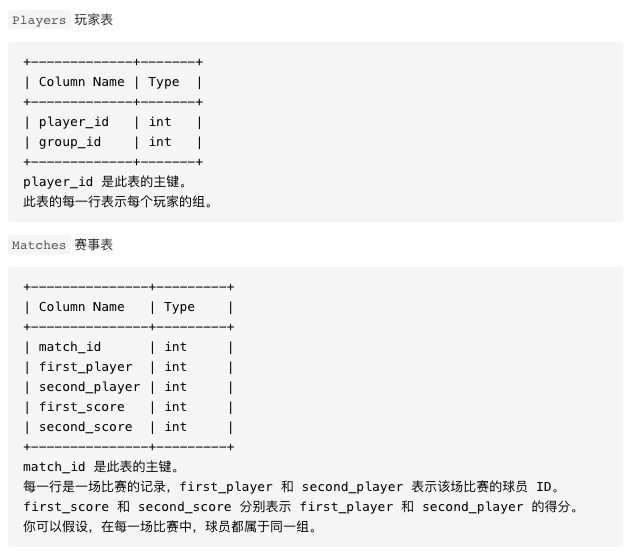

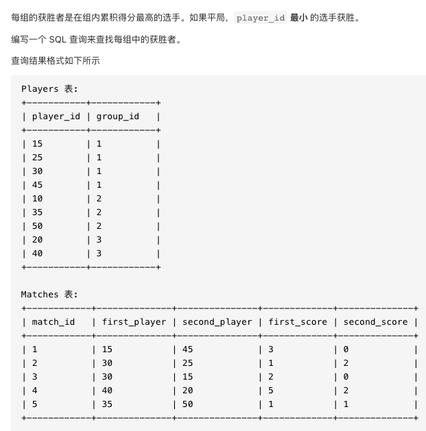

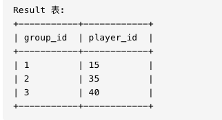

## 12.2 解答

```sql
-- 1. 把各个队员的成绩查询出来
with t119401 as (
    select first_player as player_id,
           first_score  as score
    from lc_1194_matches
    union all
    select second_player as player_id,
           second_score  as score
    from lc_1194_matches
),
--      2.根据队员id进行分组，统计每个队员的总分
     t119402 as (
         select player_id,
                sum(score) over (partition by player_id) as total_score
         from t119401
     ),
--      3.将group_id与队员id进行拼接
     t119403 as (
         select p.player_id,
                group_id,
                row_number() over (partition by group_id order by total_score desc,p.player_id) as rn
         from lc_1194_players p
                  left outer join
              t119402 t2
              on p.player_id = t2.player_id
     )

select group_id,
       player_id
from t119403
where rn = 1
order by group_id
;
```

# 13. 题目1225 报告系统状态的连续日期

## 13.1 题目描述

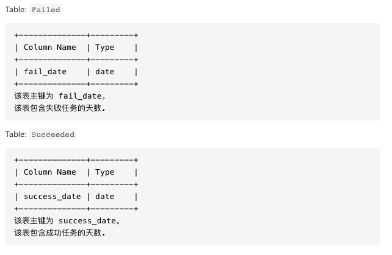

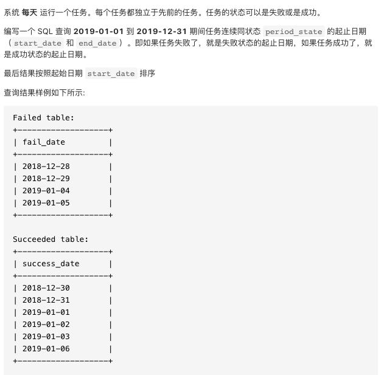

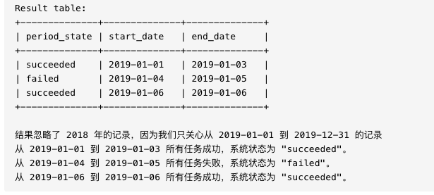

## 13.2 解答

```sql
select type as period_state, min(d) as start_date, max(d) as end_date
from (
         select type, d, date_sub(d, row_number() over (partition by type order by d)) as diff
         from (
                  select 'failed' as type, fail_date as d
                  from lc_1225_failed
                  union all
                  select 'succeeded' as type, success_date as d
                  from lc_1225_succeeded
              ) a
     ) a
where d between '2019-01-01' and '2019-12-31'
group by type, diff
order by start_date;
```

更容易理解的方式

```sql
-- 1.先构造出目标结构数据
with t119401 as (
    select 'succeeded'  as type,
           success_date as d
    from lc_1225_succeeded
    union all
    select 'failed'  as type,
           fail_date as d
    from lc_1225_failed
),

-- 2.利用row_number找出连续的
     t119402 as (
         select type,
                d,
                date_sub(d, row_number() over (partition by type order by d)) as diff
         from t119401
     )
--      3.过滤、得出最终结果
select type   as period_state,
       min(d) as start_date,
       max(d) as end_date


from t119402
where d between '2019-01-01' and '2019-12-31'
group by type, diff
order by min(d);
```


# 14. 题目1336 每次访问的交易次数

## 14.1 题目描述

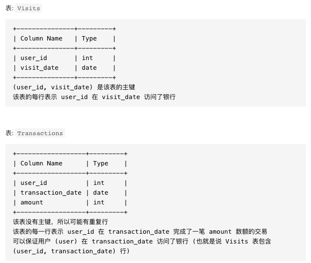

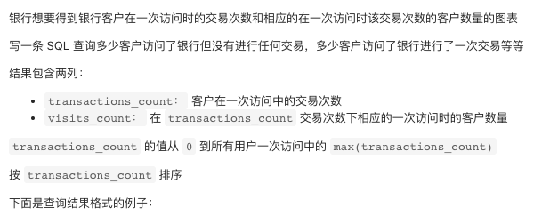

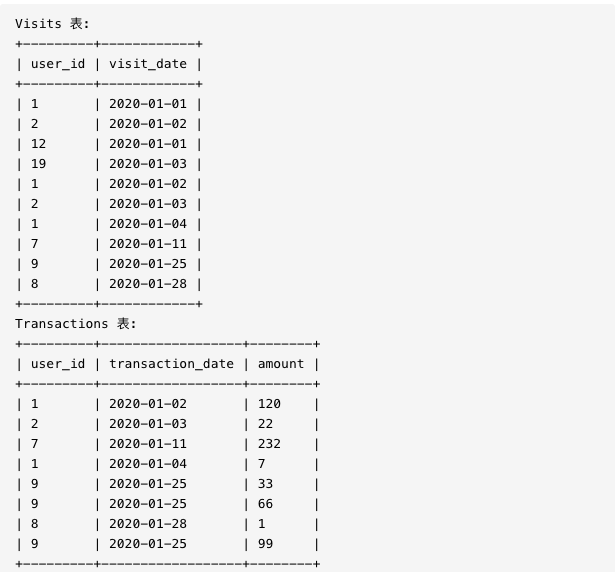

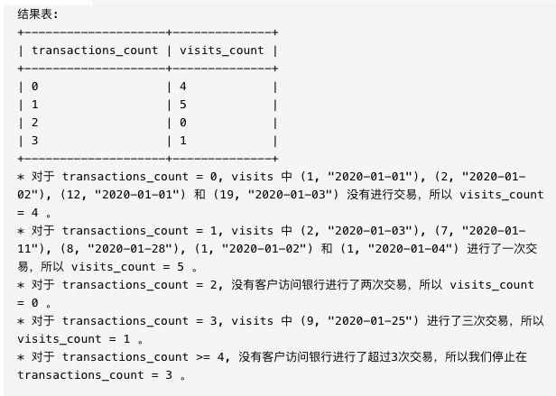


## 14.2 解答

该题难点在于用两个table union后生成一列连续数字。
思路：

t1为join两个table后的结果
t2从t1处得到每个类别的count. 这里用了tag区分transactions_count次数(为0时tag=1，为>0时tag=0).
t3用两个table union后生成一列连续数字用于填补漏掉的index.


```sql
with t1 as
         (select v.user_id, v.visit_date, nvl(amount, 0) as amount
          from lc_1336_visits as v
                   left join lc_1336_transactions as t
                             on v.visit_date = t.transaction_date and v.user_id = t.user_id),

     t2 as
         (select if(tag = 0, cnt, 0) as transactions_count, count(cnt) as visits_count
          from (
                   select tag, user_id, count(amount) as cnt
                   from (
                            select *, if(amount = 0, 1, 0) as tag
                            from t1
                        ) as b
                   group by user_id, visit_date, tag
               ) as a
          group by cnt, tag
         ),

     t3 as
         (select row_number() over () - 1 as rn
          from (
                   select user_id
                   from lc_1336_visits
                   union all
                   select user_id
                   from lc_1336_transactions
               ) as a)

select nvl(transactions_count, rn) as transactions_count, nvl(visits_count, 0) as visits_count
from t3
         left join t2
                   on t2.transactions_count = t3.rn
where rn <= (select max(transactions_count) from t2);
```


# 15. 题目1369 获取最近第二次的活动

## 15.1 题目描述

https://leetcode-cn.com/problems/get-the-second-most-recent-activity/

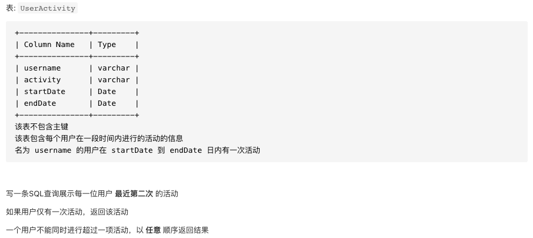

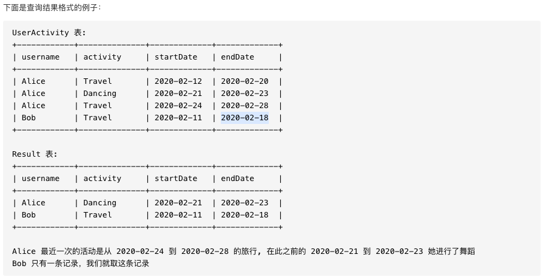


## 15.2 解答

```sql
with t1369201 as (
    select *,
           rank() over (partition by username order by startDate desc) as rn,
           count(*) over (partition by username)                       as cnt
    from lc_1369_user_activity
)

select username,
       activity,
       startDate,
       endDate
from t1369201
where rn = 2
   or cnt = 1
order by username;
```


# 16. 题目1384 按年度列出销售总额

## 16.1 题目描述

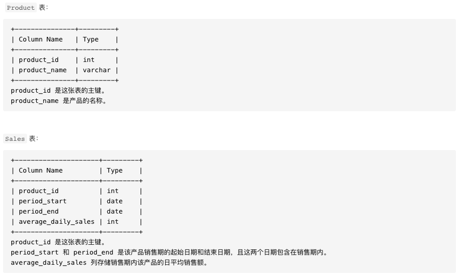

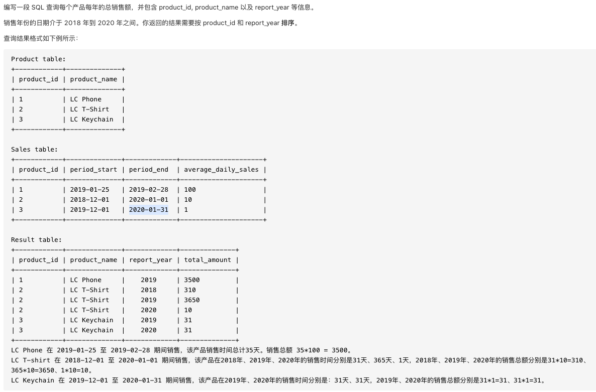


## 16.2 解答

```sql
with t1384201 as (
    select s.product_id,
           product_name,
           '2018'                       as report_year,
           if(period_start < '2019-01-01',
              (datediff(if(period_end < '2019-01-01', period_end, date('2018-12-31')),
                        if(period_start < '2018-01-01', '2018-01-01', period_start)) + 1) *
              s.average_daily_sales, 0) as total_amount
    from lc_1384_sales s
             left join lc_1384_product p on s.product_id = p.product_id
),

     t1384202 as (
         select s.product_id,
                product_name,
                '2019'                       as report_year,
                if(period_start < '2020-01-01',
                   (datediff(if(period_end < '2020-01-01', period_end, date('2019-12-31')),
                             if(period_start < '2019-01-01', '2019-01-01', period_start)) + 1) *
                   s.average_daily_sales, 0) as total_amount
         from lc_1384_sales s
                  left join lc_1384_product p on s.product_id = p.product_id
     ),
     t1384203 as (
         select s.product_id,
                product_name,
                '2020'                as report_year,
                (datediff(if(period_end < '2021-01-01', period_end, date('2020-12-31')),
                          if(period_start < '2020-01-01', '2020-01-01', period_start)) + 1) *
                s.average_daily_sales as total_amount
         from lc_1384_sales s
                  left join lc_1384_product p on s.product_id = p.product_id
     )

    (select *
     from t1384201
     where total_amount > 0)
union
(select *
 from t1384202
 where total_amount > 0)
union
(select *
 from t1384203
 where total_amount > 0)
order by product_id, report_year;
```


# 17. 题目1412 查找成绩处于中游的学生

## 17.1 题目描述

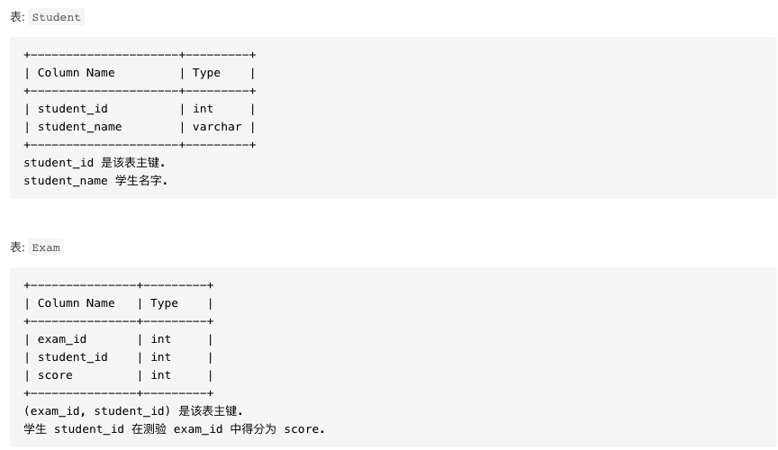

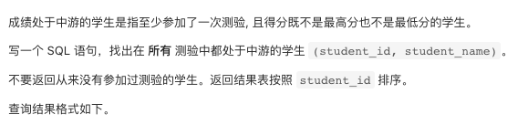

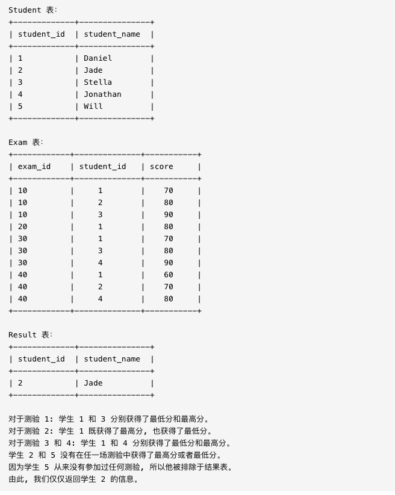


## 17.2 解答

```sql
with t141201 as (
    select e.student_id,
           s.student_name,
           exam_id,
           score

    from lc_1412_exam e
             left join lc_1412_student s
                       on e.student_id = s.student_id
),
     t141202 as (
         select *,
                row_number() over (partition by exam_id order by score) as rn
         from t141201
     ),

-- select *
-- from t141202;
     t141203 as (
         select *, max(rn) over (partition by exam_id) as max_rn, min(rn) over (partition by exam_id) as min_rn
         from t141202
     ),

-- select * from t141203;
     t141204 as (
         select distinct student_id

         from t141203
         where rn = max_rn
            or rn = min_rn
     )
select distinct student_id,
       student_name
from t141203
where student_id not in (select student_id from t141204)
;
```

# 18. 题目1479 周内每天的销售情况

## 18.1 题目描述

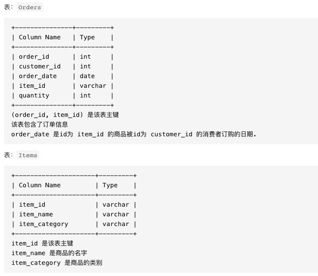


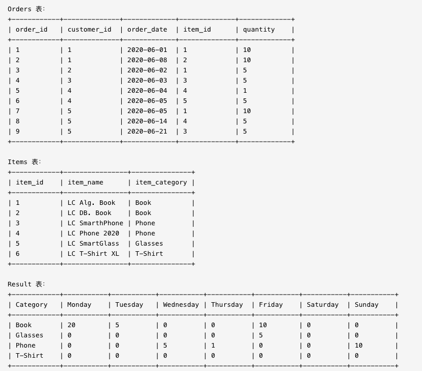

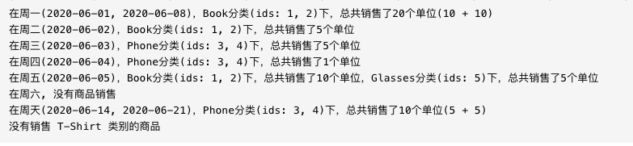

## 18.2 解答

```sql
with t147901 as (
    select order_id,
           customer_id,
           order_date,
           o.item_id,
           item_name,
           item_category,
           nvl(quantity, 0) as quantity
    from lc_1479_orders o
             full join lc_1479_items i on o.item_id = i.item_id
)
select item_category                                   as Category,
       sum(if(dayofweek(order_date) = 2, quantity, 0)) as Monday,
       sum(if(dayofweek(order_date) = 3, quantity, 0)) as Tuesday,
       sum(if(dayofweek(order_date) = 4, quantity, 0)) as Wednesday,
       sum(if(dayofweek(order_date) = 5, quantity, 0)) as Thursday,
       sum(if(dayofweek(order_date) = 6, quantity, 0)) as Friday,
       sum(if(dayofweek(order_date) = 7, quantity, 0)) as Saturday,
       sum(if(dayofweek(order_date) = 1, quantity, 0)) as Sunday
from t147901
group by item_category
order by item_category;
```


# 19. (快手)统计各科成绩均高于每科平均成绩的学生信息

## 19.1 题目描述

```sql
create table tsc
(
    student_id int,
    course_id  int,
    score      int
)
    row format delimited fields terminated by ',';

insert overwrite table tsc
values (1, 1, 90),
       (1, 2, 60),
       (2, 1, 90),
       (2, 2, 30),
       (3, 1, 60);
```

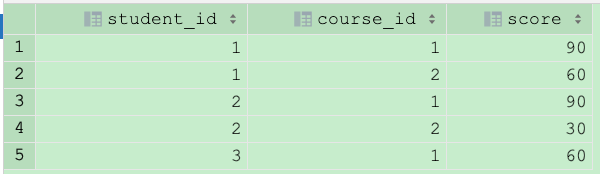

## 19.2 解答

```sql
with tt1 as (
    select course_id,
           avg(score) as avg_score
    from tsc
    group by course_id
),
     tt2 as (
         select *
         from (select * from tsc) t1
                  join
                  (select * from tt1) t2
                  on t1.course_id = t2.course_id
     ),
     tt3 as (
         select *, if(score > avg_score, 1, 0) as flag

         from tt2
     )
select distinct student_id
from tt3
where student_id not in (select distinct student_id from tt3 where flag = 0);
```

