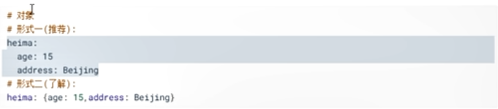
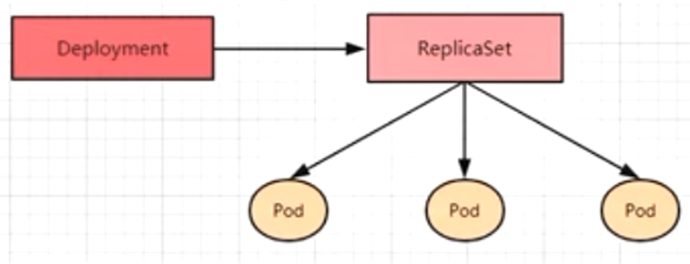
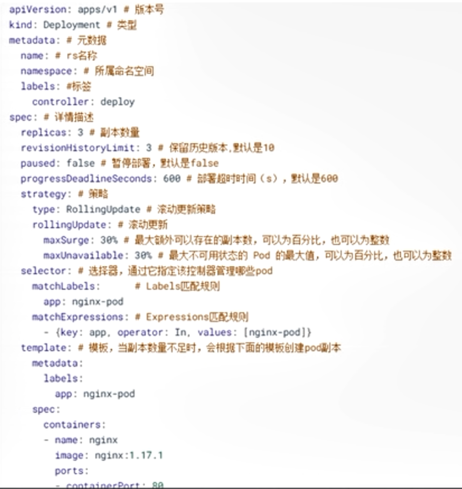
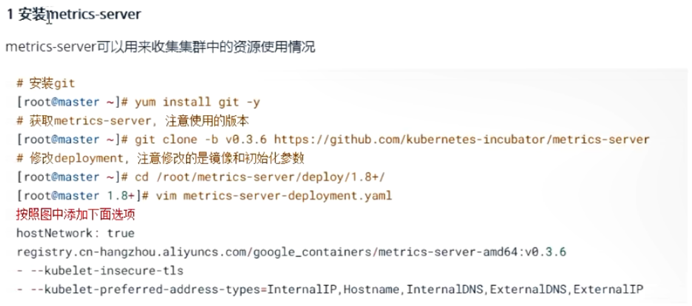
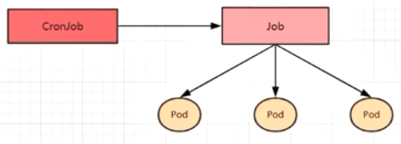
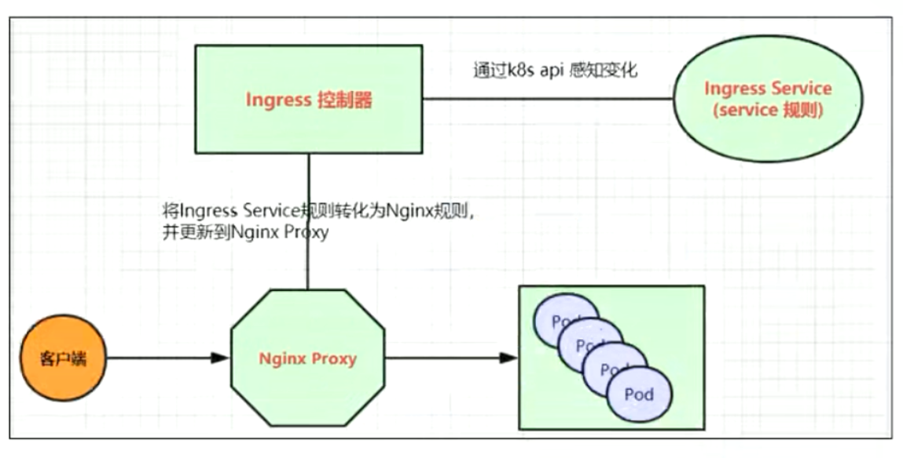
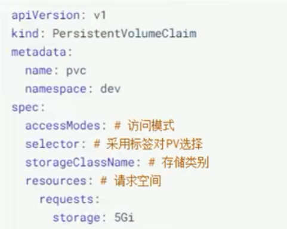
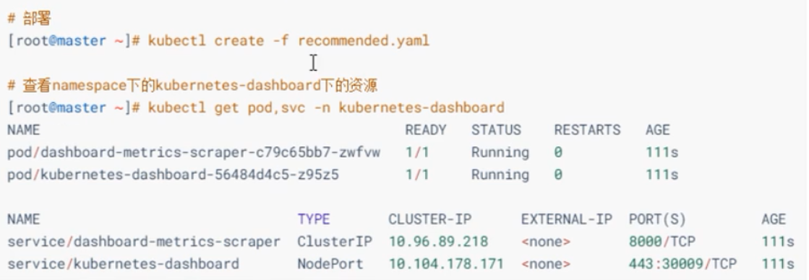

[TOC]


# 1. 简介

## 1.1 应用部署方式演变

在部署应用程序方式上，主要经历了3个时代

### 1.1.1 传统部署

互联网早期，会直接将应用程序部署在物理机上

- 优点

  简单，不需要其他技术的参与

- 缺点

  不能为应用程序定义资源使用边界，很难合理地分配计算资源，而且程序之间容易产生影响

### 1.1.2 虚拟化部署

可以在一台物理机上运行多个虚拟机，每个虚拟机都是独立的一个环境

- 优点

  程序环境不会相互产生影响，提供了一定程度的安全性

- 缺点

  增加了操作系统，浪费了部分资源

### 1.1.3 容器化部署

与虚拟化类似，但是共享了操作系统

- 优点

  可以保证每个容器拥有自己的文件系统、CPU、内存、进程空间等

  运行应用程序所需要的资源都被容器包装并和底层基础架构解耦

   容器化的应用程序可以跨云服务商、跨Linux操作系统发行版进行部署


容器化部署方式带来了很多便利，但是也会出现一些问题，比如说:

- 一个容器故障停机了，怎么样让另外一个容器立刻启动去替补停机的容器
- 当并发访问量变大的时候，怎么样做到横向扩展容器数量

这些容器管理的问题统称为容器编排问题，为了解决这些容器编排问题，就产生了一些容器编排的软件:

- Swarm:Docker自己的 容器编排工具
- Mesos:Apache的一个资源统一管控的工具，需要和Marathon结合使用
- Kubernetes：Google开源的容器编排工具


## 1.2 K8S简介

Kubernetes是一个全新的基于容器技术的分布式架构领先方案，是谷歌严格保密十几年的秘密武器--Borg系统的一个开源版本，于2014年9月发布第一个版本，2015年7月发布第一个正式版本

Kubernetes的本质是一组服务器集群，它可以在集群的每个节点上运行特定的程序，来对节点的容器进行管理。它的目的就是实现资源管理的自动化，主要提供了如下的主要功能:

- 自我修复

  一旦某个容器奔溃，能够在1秒左右迅速启动新的容器

- 弹性伸缩

  可以根据需要，自动对集群中正在运行的容器数量进行调整

- 服务发现

  服务可以通过自动发现的形式找到它所依赖的服务

- 负载均衡

  如果一个服务启动了多个容器，能够自动实现请求的负载均衡

- 版本回退

  如果发现新发布的程序版本有问题，可以立即回退到原来的版本

- 存储编排

  可以根据容器自身的需求自动创建存储卷


## 1.3 K8S组件

一个K8S集群主要是由控制节点(master)、工作节点(node)构成，每个节点上都会安装不同的组件。

 master:集群的控制平面，负责集群的决策

- ApiServer

  资源操作的唯一入口，接收用户输入的命令，提供认证、授权、API注册和发现等机制

- Scheduler

  负责集群资源调度，按照预定的调度策略将Pod调度到相应的node节点上

- ControllerManger

  负责维护集群的状态，比如程序部署安排、故障检测、自动扩展，滚动更新等

- Etcd

  负责存储集群中各种资源对象的信息

node:集群的数据平面，负责为容器提供运行环境

- Kubelet

  负责维护容器的生命周期，即通过控制docker，来创建、更新、销毁容器

- KubeProxy

  负责提供集群内部的服务发现和负载均衡

- Docker

  负责节点上容器的各种操作


下面以部署一个nginx服务来说明K8S系统各个组件调用关系:

1. 首先要明确，一个K8S环境启动之后，master和node都会将自身的信息存储到etcd数据库中
2. 一个nginx服务的安装请求首先会被发送到master节点的apiServer组件
3. apiServer组件会调用scheduler组件来决定到底应该把这个服务安装到哪个node节点上，在此时，它会从etcd中读取各个node节点的信息，然后按照一定的算法进行选择，并将结果告知apiServer
4. apiServer调用controller-manager去调度Node节点安装nginx服务
5. kubelet接收到指令后，会通知docker，然后由docker来启动一个nginx的pod，pod是K8S的最小操作单元，容器必须跑在pod中
6. 一个nginx服务就运行了，如果需要访问nginx,就需要通过kube-proxy来对pod产生访问的代理，这样，外界用户就可以访问集群中的nginx服务了。

## 1.4 K8S概念

- Master

  集群控制节点，每个集群需要至少一个master节点负责集群的管控

- Node

  工作负载节点，由master分配容器到这些node工作节点上，然后node节点上的docker负责容器的运行

- Pod

  K8S的最小控制单元，容器都是运行在pod中的，一个pod中可以有1个或者多个容器

- Controller

  控制器，通过它来实现对pod的管理，比如启动pod、停止pod、伸缩pod的数量等

- Service

  pod对外服务的统一入口，下面可以维护着同一类的多个pod

- Label

  标签，用于对pod进行分类，同一类pod会拥有相同的标签

- NameSpace

  命名空间，用来隔离pod的运行环境


# 2. 集群环境搭建

## 2.1 环境规划

### 2.1.1 集群类型

K8S集群大体上分为两类：一主多从和多主多从

- 一主多从

  一台Master节点和多台Node节点，搭建简单，但是有单机故障风险，适合用于测试环境

- 多主多从

  多台Master节点和多台Node节点，搭建麻烦，安全性高，适合用于生产环境


### 2.1.2 安装方式

K8S有多种不舒服方式，目前主流的方式有kubeadm、minikube、二进制包

- minikube

  一个用于快速搭建单节点K8S的工具

- kubeadm

  一个用于快速搭建kubernetes集群的工具

- 二进制包

  从官网下载每个组件的二进制包，依次去安装，此方式对于理解K8S组件更加更有效

  

### 2.1.3 主机规划


## 2.2 环境搭建

### 2.2.1 环境初始化

1. 检查操作系统的版本

   此方式下安装K8s要求Centos版本在7.5及以上

2. 主机名解析

   测试的时候配置`/etc/hosts`文件，企业中推荐使用内部DNS服务器

3. 时间同步

   K8s要求集群中的节点时间必须精确一致，这里直接使用`chronyd`服务从网络同步时间，企业中建议配置内部的时间同步服务器

4. 禁用`iptables`和`firewalld`服务

   K8s和docker在运行中会产生大量的iptables规则，为了不让系统规则跟它们混淆，直接关闭系统的规则

   ```bash
   # 关闭firewall服务
   systemctl stop firewalld
   systemctl disable firewalld
   
   # 关闭iptables服务
   systemctl stop iptables
   systemctl disabele iptalbes
   ```

5. 禁用`selinux`

   selinux是linux系统下的一个安全服务，如果不关闭它，在安装集群中会产生各种各样的奇葩问题

   ```bash
   # 编辑 /etc/selinux/config文件，修改SELINUX的值为disabled
   # 注意修改完毕之后需要重启linux服务
   SELINUX=disabled
   ```

6. 禁用swap分区

   swap分区指的是虚拟内存分区，它的作用是在物理内存使用完之后，将磁盘空间虚拟成内存来使用。启用swap设备会对系统产生非常负面的影响，因此K8s要求每个节点都要禁用swap设备 ，但是如果因为某些原因确实不能关闭swap分区，就需要在集群安装过程中通过明确的参数进行配置说明

   ```bash
   # 编辑分区配置文件 /etc/fstab,注释掉swap分区一行
   # 注意修改完毕之后需要重启Linux服务
   ```

7. 修改linux的内核参数

   ```bash
   # 修改linux的内核参数，添加网桥过滤和地址转发功能
   # 编辑/etc/sysctl.d/kubernetes.conf文件，添加如下配置
   net.bridge-nf-call-ip6tables = 1
   net.bridge-nf-call-iptables = 1
   net.ipv4.ip_forward = 1
   ```

   重新加载配置

   ```bash
   sysctl -p
   ```

   加载网桥过滤模块

   ```bash
   modprobe br_netfilter
   ```

   查看网桥过滤模块是否加载成功

   ```bash
   lsmod | grep br_netfilter
   ```

8. 配置ipvs功能

   K8s中的service有两种代理模型，一种基于iptables的，一种是基于ipvs的，两者比较的话，ipvs的性能明显要高一些，但是如果要使用它，需要手动载入ipvs模块

   ```bash
   # 1.安装ipset和ipvsadm
   yum install ipset ipvsadm -y
   
   # 2.添加需要加载的模块写入脚本文件
   cat <<EOF > /etc/sysconfig/modules/ipvs.modules
   #!/bin/bash
   modprobe -- ip_vs
   modprobe -- ip_vs_rr
   modprobe -- ip_vs_wrr
   modprobe -- ip_vs_sh
   modprobe -- nf_connntrack_ipv4
   EOF
   
   # 3.为脚本文件添加执行权限
   chmod +x /etc/sysconfig/modules/ipvs.modules
   
   # 4.执行脚本文件
   /bin/bash	/etc/sysconfig/modules/ipvs.modules
   
   # 5.查看对应的模块是否加载成功
   lsmod | grep -e ip_vs -e nf_conntrack_ipv4
   
   ```

9. 重启服务器

### 2.2.2 安装docker

1. 切换镜像源头

   ```bash
   wget https://mirrors.aliyun.com/docker-ce/linux/centos/docker-ce.repo -O /etc/yum.repos.d/docker-ce.repo
   ```

   

2. 查看当前镜像源中支持的docker版本

   ```bash
   yum list docker-ce --showuplicates
   ```

   

3. 安装特定版本的docker-ce

   ```bash
   # 必须指定 --setopt=obsoletes=0,否则yum会自动安装更高版本
   yum install--setopt=obsletes=0 docker-ce-18.06.3.ce-3.el7 -y
   ```

   

4. 添加一个配置文件

   ```bash
   # docker在默认情况下使用的是Cgroup Driver为cgroupfs,而kubernetes推荐使用systemd来代替#cgroupfs
   mkdir /etc/docker
   cat <<EOF > /etc/docker/daemon.json
   {
   	"exec-opts":["nataive.cgroupdriver=systemd"]
   	"registry-mirrors":["https://kn0t2bca.mirror.aliyuncs.com"]
   }
   EOF
   
   ```

   

5. 启动docker

   ```bash
   systemctl restart docker
   systemctl enable docker
   ```

   

6. 检查docker状态和版本

   ```bash
   docker version
   ```

### 2.2.3 安装K8s组件

```bash
#由于K8s的镜像源在国外，速度比较慢，这里切换成国内的镜像源
#编辑/etc/yum.repos.d/kubernetes.repo,添加下面的配置
[kubernetes]
name=Kubernetes
baseurl=http://mirror.aliyun.com/kubernetes/yum/repos/kubernetes-el7-x86_64
enabled=1
gpgcheck=0
repo_gpgcheck=0
gpgkey=http://mirrors.aliyun.com/kubernetes/yum/doc/yum-key.gpg
       http://mirrors.aliyun.com/kubernetes/yum/doc/rpm-package-key.gpg
       
# 安装kubeadm、kubelet和kubectl
yum install --setopt=obsoletes=0 kubeadm-1.17.4.0 kubelet-1.17.4-0 kubectl-1.17.4-0 -y

# 配置kubelet的cgroup
# 编辑/etc/sysconfig/kubelet,添加下面的配置
KUBELET_CGROUP_ARGS="--cgroup-driver=systemd"
KUBE_PROXY_MODE="ipvs"

# 设置kubelet开机自启
systemctl enable kubelet


```

### 2.2.4 准备集群镜像


### 2.2.5 集群初始化

下面的操作只需要在master节点上执行即可

1. 创建集群

   ```bash
   kubeadm init \
   --kubernetes-version=v1.17.4 \
   --pod-network-cidr=10.244.0.0/16 \
   --service-cidr=10.96.0.0/12 \
   --apiserver-advertise-address=192.168.109.100
   ```

2. 创建必要的文件

   ```bash
   mkdir -p $HOME/.kube
   sudo cp -i /etc/kubernetes/admin.conf $HOME/.kube/config
   sudo chown $(id -u):$(id -g) $HOME/.kube/config
   ```

下面的操作只需要在node节点上执行即可

将node节点加入集群


```bash
# 查看集群的状态，此时的集群状态为NotReady,这是因为还没有配置网络插件
kubectl get nodes
```

### 2.2.6 安装网络插件


## 2.3 服务部署

```bash
# 部署nginx
kubectl create deployment nginx --image=nginx:1.14-alpine
# 暴露端口
kubectl expose deployment nginx --port=80 --type=NodePort
# 查看服务状态
kubectl get pods,svc
# 最后在电脑上访问部署的nginx服务
```


# 3. 资源管理

## 3.1 资源管理介绍

在K8s中，所有的内容都抽象为资源，用户需要通过操作资源来管理K8s

> K8s的本质是一个集群系统，用户可以在集群中部署各种服务，所谓的部署服务，其实就是在K8s集群中运行一个个的容器，并将指定的程序跑在容器中
>
> K8s的最小管理单元是pod而不是容器，所以只能将容器放在pod中，而K8s一般也不会直接管理pod，而是通过Pod控制器来管理pod的
>
> pod可以提供服务之后，就要考虑如何访问pod中服务，K8s提供了Service资源实现这个功能。
>
> 当然，如果pod中的程序的数据需要持久化，K8s还提供了各种存储系统


学习K8s的核心，就是学习如何对集群上的Pod、Pod控制器、Service、存储等各种资源进行操作


## 3.2 YAML语法介绍





## 3.3 资源管理方式


### 3.3.1 命令式对象管理

直接使用命令去操作kubernetes资源

```bash
kubectl run nginx-pod --image=nginx:1.17.1 --port=80
```

- kubectl命令

  kubectl是K8s集群的命令行工具，通过它能对集群本身进行管理，并能够在集群上进行容器化应用的安装部署。kubectl命令的语法如下:

  ```bash
  kubectl [command] [type] [name] [flags]
  ```

- command

  指定要对资源执行的操作，例如create、get、delete

- type

  指定资源类型，比如deployment、pod、service

- name

  指定资源的名称，名称大小写敏感

- flags

  指定额外的可选参数

  ```bash
  # 查看所有pod
  kubectl get pod
  # 查看某个pod
  kubectl get pod pod_name
  # 查看某个pod,以yaml格式展示结果
  kubectl get pod pod_name -o yaml
  ```

资源类型

K8s中所有的内容都抽象为资源，可以通过下面的命令进行查看:

```bash
kubectl api-resources
```

经常使用的资源有下面这些:


操作

K8s允许对资源进行多种操作，可以通过`--help`查看详细的操作命令

```bash
kubectl --help
```

经常使用的操作有下面这些:


下面以一个namespace/pod的创建和删除简单演示下命令的使用:


### 3.3.2 命令式对象配置

通过命令配置和配置文件去操作kubernetes资源

```bash
kubectl create/patch -f nginx-pod.yaml
```

1. 创建一个nginxpod.yaml，内容如下:


2. 执行create命令，创建资源:

   ```bash
   kubectl create -f nginxpod.yaml
   ```

   此时发现创建了两个资源对象，分别是namespace和pod

3. 执行get命令，查看资源

   ```bash
   kubectl get -f nginxpod.yaml
   ```

   这样就显示了两个资源对象的信息

4. 执行delete命令，删除资源

   ```bash
   kubectl delete -f nginxpod.yaml
   ```

   此时发现两个资源对象被删除了

5. 总结

   命令式对象配置的方式操作资源，可以简单地认为:命令 + yaml配置文件(里面是命令需要的各种参数)

### 3.3.3 声明式对象配置

通过apply命令和配置文件去操作kubernetes资源

```bash
kubectl apply -f nginx-pod.yaml
```


总结：

其实声明式对象配置就是使用apply描述一个资源最终的状态(在yaml中定义状态)

使用apply操作资源:

- 如果资源不存在，就创建，相当于 `kubectl create`
- 如果资源已存在，就更新，相当于`kubectl patch`

> 扩展：kubectl可以在node节点上运行吗？
>
> kubectl的运行是需要进行配置的，它的配置文件是$HOME/.kube,如果想要在node节点上运行此命令，需要将master上的`.kube`文件复制到node节点上，即在master节点上执行下面操作:
>
> `scp -r  $HOME/.kube node1:$HOME/`


> 使用推荐：三种方式应该怎么用？
>
> - 创建/更新资源
>
>   使用声明式对象配置 `kubectl apply -f xxx.yaml`
>
> - 删除资源
>
>   使用命令式对象配置 `kubectl delete -f xxx.yaml`
>
> - 查询资源
>
>   使用命令式对象管理 `kubectl get(describe) 资源名称`


# 4. 实战入门

本章节将介绍如何在K8s集群中部署一个nginx服务，并且能够对其进行访问

## 4.1 Namespace

Namespace是K8s系统中的一种非常重要的资源，主要作用是用来实现多套环境的资源隔离或者多租户的资源隔离

默认情况下，K8s集群中的所有pod都是可以相互访问的，但是实际中，可能不想让两个pod之间进行相互的访问，那此时可以将两个pod划分到不同的namespace下，K8s通过将集群内部的资源分配到不同的namespace中，可以形成逻辑上的"组"，以方便不同的组的资源进行隔离使用和管理

可以通过K8s的授权机制，将不同的namespace交给不同租户进行管理，这样就实现了多租户的资源隔离。此时还能结合K8s的资源配额机制，限定不同租户能占用的资源，例如CPU使用量、内存使用量等来实现租户可用资源的管理。


下面是namespace资源的具体操作:

- 查看

  

  


  

  

- 创建

  

- 删除

  

- 使用配置的方式

  首先准备一个yaml文件:ns-dev.yaml

  

  

## 4.2 Pod


Pod是K8s集群进行管理的最小单元，程序要运行必须部署在容器中，而容器必须存在于Pod中。

Pod可以认为是容器的封装，一个Pod中可以存在一个或多个容器


K8s在集群启动之后，集群中的各个组件也都是以Pod方式运行的，可以通过下面的命令查看:

```bash
kubectl get pod -n kube-system
```

**创建并运行**


**查看pod信息**


**访问pod**


**删除指定的pod**


**基于配置操作**


## 4.3 Label

Label是K8s集群中的一个重要概念，作用是在资源上添加标识，用来对它们进行区分和选择

Lable的特点:

- 一个Label以key/value键值对的形式附加到各种对象上，如Node、Pod、Service等
- 一个资源对象可以定义任意数量的Label，同一个Label也可以被添加到任意数量的资源对象上
- Label通常在资源对象定义时确定，当然也可以在对象创建后动态添加或者删除

可以通过Label实现资源的多维度分组，以便灵活、方便地进行资源分配、调度、配置、部署等管理工作

> 一些常用的Label示例如下:
>
> - 版本标签
>
>   `"version":"release","version":"stable"`
>
> - 环境标签
>
>   `"environment":"dev","environment":"test","environment":"pro"`
>
> - 架构标签
>
>   `"tier":"frontend","tier":"backend"`

标签定义完毕之后，还要考虑到标签的选择，这就要使用到Label Selector,即:

- Label用于给某个资源对象定义标识
- Label Selector用于查询和筛选拥有某些标签的资源对象

当前有两种Label Selector

- 基于等式的Label Selector

  name = slave :选择所有包含Label中key="name"且value="slave"的对象

  env!=production: 选择所有包括Label中的key="env"且value不等于"production"的对象

- 基于集合的Label Selector

  name in (master,slave): 选择所有包含Label中的key="name"且value="master"或"slave"的对象

  name not in (frontend):选择所有包含Label中的key="name"且value不等于"frontend"的对象

标签的选择条件可以使用多个，此时将多个 Label Selector进行组合，使用逗号进行分隔即可。例如:

```bash
name=salve,env!=production
name not in (frontend),env!=production
```

**命令方式**


**配置方式**


## 4.4 Deployment

在K8s中，Pod是最小的控制单元，但是K8s很少直接控制Pod，一般都是通过Pod控制器来完成的。Pod控制器用于Pod的管理，确保pod资源符合预期的状态，当pod的资源出现故障时，会尝试进行重启或重建pod

在K8s中pod控制器的种类有很多，本章节只介绍一种:Deployment


**命令操作**


**配置操作**


## 4.5 Service

虽然每个Pod都会分配一个单独的Pod IP,然而却存在如下两个问题:

- Pod IP会随着Pod的重建产生变化
- Pod IP仅仅是集群内可见的虚拟IP,外部无法访问

这样对于访问这个服务带来了难度，因此K8s设计了Service来解决这个问题

Service可以看作是一组同类Pod对外的访问接口。借助Service，应用可以方便地实现服务发现和负载均衡


**操作一:创建集群内部可访问的Service**


**操作二:创建集群外部也可以访问的Service**


**删除Service**


**配置方式**


# 5. Pod详解

## 5.1 Pod介绍

### 5.1.1 Pod结构


每个Pod都可以包含一个或者多个容器，这些容器可以分为两类：

- 用户程序所在的容器，数量可多可少

- Pause容器，这是每个Pod都会有的一个根容器，它的作用有两个:

  - 可以以它为依据，评估整个Pod的健康状态

    - 可以在根容器上设置IP地址，其他容器都共享此IP,以实现Pod内部的网络通信

    > 这里是Pod内部的通讯，Pod之间的通讯采用虚拟二层网络技术来实现，当前环境用的是Flannel


### 5.1.2 Pod定义

下面是Pod的资源清单：


在K8s中基本所有资源的一级属性都是一样的，主要包含5部分:

- apiVersion <string>

  版本，由K8s内部定义，版本号必须可以用`kubectl api-version`查询到

- kind <string>

  类型，由K8s内部定义，版本号必须可以用`kubectl api-resources`查询到

- metadata <Object>

  元数据，主要是资源标识和说明，常用的有name,namespace,labels等

- spec <Object>

  描述，这是配置中最重要的一部分，里面是对各种资源配置的详细描述

- status <Object>

  状态信息，里面的内容不需要定义，由K8s自动生成

在上面的属性中，spec是接下来研究的重点，下面是spec的常见子属性:

- containers <[]Object>

  容器列表，用于定义容器的详细信息

- nodeName <String>

  根据nodeName的值将pod调度到指定的Node节点上

- nodeSelector <map[]>

  根据NodeSelector中定义的信息选择将该Pod调度到包含这些label的Node上

- hostNetwork <boolean>

  是否使用主机网络，默认为false，如果设置为true，表示使用宿主机网路

- volumes <[]Object>

  存储卷，用于定义Pod上面挂载的存储信息

- restartPolicy <string>

  重启策略，表示Pod在遇到故障时的处理策略


## 5.2 Pod配置

本小节主要来研究`pod.spec.containers`属性，这也是pod配置中最为关键的一项配置


### 5.2.1 基本配置

### 5.2.2 镜像拉取

`imagePullPolicy`用于设置镜像拉取策略，K8s支持配置3种拉取策略

- `always`

  总是从远程仓库拉取镜像(一直用远程的)

- `IfNotPresent`

  本地有则使用本地镜像，本地没有则从远程仓库拉取镜像(本地有就本地，本地没有就远程)

- `Never`

  只使用本地镜像，从不去远程仓库拉取，本地没有就报错(一直使用本地)

> 默认值说明
>
> - 如果镜像tag为具体版本号，默认策略是：`IfNotPresent`
> - 如果镜像tag为：latest,默认策略是：`always`

### 5.2.3 启动命令

command用于在pod中的容器初始化完毕之后运行一个命令

进入某个pod的某个容器的命令：

```bash
kubectl exec pod名称 -n 名称空间 -it -c 容器名称 /bin/sh
```

> 特别说明
>
> ​	通过上面发现command已经可以完成启动命令和传递参数的功能，为什么这里还要提供一个`args`选项用于传递参数呢？这其实跟docker有点关系，`K8s`中的command、`args`两项其实是实现覆盖`Dockerfile`中`ENTRYPOINT`的功能.
>
> - 如果command和`args`均没有写，那么用`Dockerfile`的配置
> - 如果command写了，但`args`没有写，那么`Dockerfile`默认的配置会被忽略，执行输入的command
> - 如果command没写，但是`args`写了，那么`Dockerfile`中配置的`ENTRYPOINT`的命令会被执行，使用当前`args`的参数
> - 如果command和`args`都写了，那么`Dockerfile`的配置被忽略，执行command并追加上`args`参数


### 5.2.4 环境变量


env,环境变量，用于在pod中的容器设置环境变量

这种方式不是很推荐，推荐将这些配置单独存储在配置文件中

### 5.2.5 端口设置

ports支持的子选项：


### 5.2.6 资源配额

容器中的程序要运行，肯定是要占用一定资源的，比如CPU和内存等，如果不对某个容器的资源做限制，那么它就可能吃掉大量资源，导致其他容器无法运行。针对这种情况，K8s提供了对内存和cpu的资源进行配额的机制，这种机制主要通过resource选项实现。它有两个子选项:

- limits

  用于限制运行时容器的最大占用资源，当容器占用资源超过limits时会被终止，并进行重启

- requests

  用于设置容器需要的最小资源，如果环境资源不够，容器将无法启动

可以通过上面两个选项设置资源的上下限


在这对cpu和memory的单位做一个说明

- cpu

  core数，可以为整数或小数

- memory

  内存大小，可以使用Gi、Mi、G、M等形式


## 5.3 Pod生命周期

我们一般将pod对象从创建至终的这段时间范围称为pod的生命周期，它主要包含下面的过程:

- pod创建过程
- 运行初始化容器(init container)过程
- 运行主容器(main container)过程
  - 容器启动后钩子(post start)、容器终止前钩子(pre stop)
  - 容器的存活性探测(liveness probe)、就绪性探测(readiness probe)
- pod终止过程


在整个生命周期中，Pod会出现5种状态(相位)，分别如下:

- 挂起(Pending)

  `apiserver`已经创建了pod资源对象，但它尚未被调度完成或者仍处于下载镜像的过程中

- 运行中(Running)

  pod已经被调度至某节点，并且所有容器都已经被`kubelet`创建完成

- 成功(Succeeded)

  pod中的所有容器都已经成功终止并且不会被重启

- 失败(Failed)

  所有容器都已经终止，但至少有一个容器终止失败，即容器返回了非0值的退出状态

- 未知(Unknown)

  apiserver无法正常获取到pod对象的状态信息，通常由网络通信失败导致

### 5.3.1 创建和终止

**pod的创建过程**

1. 用户通过kubectl或其他api客户端提交需要创建的pod信息给apiServer
2. apiServer开始生成pod对象的信息，并将信息存入etcd，然后返回确认信息至客户端
3. apiServer开始反映etcd中的pod对象的变化，其他组件使用watch机制来跟踪检查apiServer上的变动
4. scheduler发现有新的pod对象要创建，开始为pod分配主机并将结果信息更新至apiServer
5. node节点上的kubelet发现有pod调度过来，尝试调用docker启动容器，并将结果回送至apiServer
6. apiServer将接收到的pod状态信息存入etcd


**pod的终止过程**

1. 用户向apiServer发送删除pod对象的命令
2. apiServer中的pod对象信息会随着时间的推移而更新，在宽限期内(默认30s),pod被视为dead
3. 将pod标记为terminating状态
4. kubelet在监控到pod对象转为terminating状态的同时启动pod关闭过程
5. 端点控制器监控到pod对象的关闭行为时将其从所有匹配到此端点的service资源的端点列表中移除
6. 如果当前pod对象定义了preStop钩子处理器，则在其标记为terminating后即会以同步的方式启动执行
7. pod对象中的容器进程收到停止信号
8. 宽限期结束后，若pod中还存在仍在运行的进程，那么pod对象会收到立即终止的信号
9. kubelet请求apiServer将此pod资源的宽限期设置为0从而完成删除操作，此时pod对于用户已经不可见

### 5.3.2 初始化容器

初始化容器是在pod的主容器启动之前要运行的容器，主要是做一些主容器的前置工作，它具有两大特征:

- 初始化容器必须运行完成直至结束，若某初始化容器运行失败，那么K8s需要重启它直到成功完成
- 初始化容器必须按照定义的顺序执行，当且仅当前一个成功之后，后面一个才运行

初始化容器有很多应用场景，下面列出常见的几个：

- 提供主容器镜像中不具备的工具程序或自定义代码
- 初始化容器要先于应用容器串行启动并运行完成，因此可用于延后应用容器的启动直至其依赖的条件得到满足


### 5.3.3 钩子函数


### 5.3.4 容器探测

容器探测用于检测容器中的应用实例是否正常工作，是保障业务可用性的一种传统机制。如果经过探测，实例的状态不符合预期，那么K8s就会把该问题实例"摘除"，不承担业务流量。K8s提供了两种探针来实现容器探测，分别是:

- liveness probes

  存活性探针，用于检测应用实例当前是否处于正常运行息状态，如果不是，K8s会重启容器

- readiness probes

  就绪性探针，用于检测应用实例当前是否可以接收请求，如果不能，K8s不会转发流量

> livenessProbe决定是否重启容器，readinessProbe决定是否将请求转发给容器

上面两种探针，目前均支持三种探测方式：

- Exec命令

  在容器内执行一次命令，如果命令执行的退出码为0，则认为程序正常，否则不正常

  

- TCPSocket

  将会尝试访问一个用户容器的端口，如果能够建立这条连接，则认为程序正常，否则不正常

  

- HTTPGet

  调用容器内Web应用的URL，如果返回的状态码在200和399之间，则认为程序正常，否则不正常

  


**方式二：TCPSocket**


### 5.3.5 重启策略

pod的重启策略有3种:

- Always

  容器失效时，自动重启该容器，默认值

- OnFailure

  容器终止运行且退出码不为0时重启

- Never

  不论状态如何，都不重启该容器

重启策略适用于pod对象中的所有容器，首次需要重启的容器，将在其需要时立即进行重启，随后再次需要重启的操作将由kubelet延迟一段时间后进行，且反复的重启操作的延迟时长依次为10s、20s、40s、80s、160s和300s，300s是最大延迟时长


## 5.4 Pod调度

### 5.4.1 定向调度

定向调度，指的是利用在pod上生命`nodeName`或者`nodeSelector`，以此将Pod调度到期望的node节点上。注意，这里的调度是强制的，这就意味着即使要调度的目标Node不存在，也会向上面进行调度，只不过pod运行失败而已。

**`NodeName`**

`NodeName`用于强制约束将Pod调度到指定的Name的Node节点上。这种方式，其实是直接跳过Scheduler的调度逻辑，直接将Pod调度到指定名称的节点


**NodeSelector**

NodeSelector用于将pod调度到添加了指定标签的node节点上，它是通过K8s的label-selector机制实现的，也就是说，在pod创建之前，会由scheduler使用MatchNodeSelector调度策略进行label匹配，找出目标node，然后将pod调度到目标节点，该匹配规则是强制约束。


### 5.4.2 亲和性调度

上面介绍的两种定向调度的方式使用起来非常方便，但是也有一定的问题，就是如果没有满足条件的Node，那么Pod将不会被运行，即使在集群中还有可用Node列表也不行，这就限制了它的使用场景

基于上面的问题，K8s还提供了一种亲和性调度(Affinity)。它在NodeSelector的基础上进行了扩展，可以通过配置的形式，实现优先选择满足条件的Node进行调度，如果没有，也可以调度到不满足条件的节点上，使调度更加灵活

Affinity主要分为三类:

- nodeAffinity(node亲和性)

  以node为目标，解决pod可以调度到哪些node的问题

- podAffinity(pod亲和性)

  以pod为目标，解决pod可以和哪些已存在的pod部署在同一个拓扑域中的问题

- podAntiAffinity(pod反亲和性)

  以pod为目标，解决pod不能和哪些已存在pod部署在同一个拓扑域中的问题

> 关于亲和性(反亲和性)使用场景的说明:
>
> - 亲和性
>
>   如果两个应用频繁交互，那就有必要利用亲和性让两个应用尽可能地靠近，这样可以减少因网络通信而带来的性能损耗
>
> - 当应用采用多副本部署时，有必要采用反亲和性让各个应用实例打散分布在各个node上，这样可以提高服务的高可用性。


### 5.4.3 污点和容忍

**污点(Taints)**

前面的调度方式都是站在Pod的角度上，通过在Pod上添加属性，来确定Pod是否要调度到指定的Node上，其实我们也可以站在Node的角度上，通过在Node上添加污点属性，来决定是否允许Pod调度进来。

Node被设置上污点之后就和Pod之间存在一种相斥的关系，进而拒绝Pod调度进来，甚至可以将已经存在的Pod驱逐出去。

污点的格式为:key=value:effect,key和value是污点的标签，effect描述污点的作用，支持如下三个选项:

- PreferNoSchedule

  K8s将尽量避免把Pod调度到具有该污点的Node上，除非没有其他节点可调度

- NoSchedule

  K8s将不会把Pod调度到具有该污点的Node上，但不是影响当前Node上已存在的Pod

- NoExecute

  K8s将不会把Pod调度到具有该污点的Node上，同时也会将Node上已存在的Pod驱离


使用kubectl设置和去除污点的命令示例如下:

```bash
# 设置污点
kubectl taint nodes node1 key=value:effect
# 去除污点
kubectl taint nodes node1 key:effect-
# 去除所有污点
kubectl taint nodes node1 key-
```

**小提示：**

使用kubeadm搭建的集群，默认就会给master节点添加一个污点标记，所以pod就不会调度到master节点上


容忍(Toleration)

上面介绍了污点的作用，可以在node上添加污点用于拒绝pod调度上来，但是如果就是想将一个pod调度到一个有污点的node上去，这时候该怎么办呢？这就要用到容忍


> 污点就是拒绝，容忍就是忽略，node通过污点拒绝pod调度上去，pod通过容忍忽略拒绝


下面是容忍的详细配置：


# 6. Pod控制器详解

## 6.1 Pod控制器介绍

在K8s中，按照pod的创建方式可以将其分为两类：

- 自主式pod

  K8s直接创建出来的pod，这种pod删除后就没有了，也不会重建

- 控制器创建的pod

  通过控制器创建的pod，这种pod删除了之后还会自动重建

> 什么是pod控制器
>
> pod控制器是管理pod的中间层，使用了pod控制器之后，我们只需要告诉pod控制器想要多少个什么样的pod就可以了，它就会创建出满足条件的pod并确保每一个pod处于用户期望的状态，如果pod在运行中出现故障，控制器会基于指定策略重启或者重建pod

在K8s中，有很多类型的pod控制器，每种都有自己的适合的场景，常见的有下面这些：

- ReplicationController

  比较原始的pod控制器，已经被废弃，由ReplicaSet替代

- ReplicaSet

  保证指定数量的pod运行，并支持pod数量变更，镜像版本变更

- Deployment

  通过控制ReplicaSet控制pod，并支持滚动升级、版本回退

- Horizontal Pod Autoscaler

  可以根据集群负载均衡自动调整pod的数量，实现削峰填谷

- DaemonSet

  在集群中的指定Node上都运行一个副本，一般用于守护进程类的任务

- Job

  创建出来的pod只要完成任务就立即退出，用于执行一次性任务

- CronJob

  创建的pod会周期性地执行，用于执行周期性任务

- StatefulSet

  管理有状态应用

## 6.2 ReplicaSet(RS)

ReplicaSet的主要作用是保证一定数量的pod能够正常运行，它会持续监听这些pod的运行状态，一旦pod发生故障，就会重启或重建。同时它还支持对pod数量的扩缩容和版本镜像的升级


ReplicaSet的资源清单文件:


**扩缩容**


## 6.3 Deployment

为了更好地解决服务编排问题，K8s在V1.2版本开始，引入了Deployment控制器。值得一提的是，这种控制器并不直接管理pod，而是通过管理ReplicaSet来间接管理pod，即:Deployment管理ReplicaSet,ReplicaSet管理pod。所以Deployment比ReplicaSet功能更加强大



Deployment主要功能有下面几个:

- 支持ReplicaSet的所有功能
- 支持发布的停止、继续
- 支持版本滚动升级和版本回退

Deployment的资源清单文件:




## 6.4 Horizontal Pod Autoscaler(HPA)

在之前可以通过手工执行kubectl scale命令实现pod扩容，但是这显然不符合K8s的目标定位--自动化、智能化。K8s期望可以通过监测pod的使用情况，实现pod数量的自动调整，于是就产生了HPA这种控制器。

HPA可以获取每个pod利用率然后和HAP中定义的指标进行对比，同时计算出需要伸缩的具体值，最后实现pod的数量的调整。其实HPA与之前的Deployment一样，也属于一种K8s资源对象，它通过追踪分析目标pod的负载变化情况，来确定是否需要针对性地调整目标pod的副本数。





## 6.5 DaemonSet(DS)

DaemonSet类型的控制器可以保证集群中的每一台(或指定)节点上都运行一个副本，一般适用于日志收集、节点监控等场景。也就是说，如果一个pod提供的功能是节点级别的(每个节点都需要且只需要一个)，那么这类pod就适合使用DaemonSet类型的控制器创建


DaemonSet控制器的特点:

- 每当向集群中添加一个节点时，指定的pod副本也将添加到该节点上
- 当节点从集群中移除时，pod也就被垃圾回收了

下面是DaemonSet的资源清单文件


## 6.6 Job

主要用于负责批量处理短暂的一次性任务，特点如下:

- 当Job创建的pod执行成功时，Job将记录成功结束的pod数量
- 当成功结束的pod达到指定的数量时，Job将完成执行 


Job的资源清单文件:


## 6.7 CronJob

CronJob控制器以Job控制器资源为其管控对象，并借助它管理pod资源对象，Job控制器定义的作业任务在其控制器资源创建之后便会立即执行，但CronJob可以以类似Linux操作系统的周期性任务作业计划的方式控制其运行时间点及重复运行的方式。也就是说，CronJob可以在特定的时间点(反复的)去运行Job任务



CronJob的资源清单文件:


## 6.8 StatefulSet


# 7. Service详解

## 7.1 Service介绍

在K8s中，pod是应用程序的载体，可以通过pod的ip来访问应用程序，但是pod的ip地址不是固定的，这也就意味着不方便直接采用pod的ip对服务进行访问。

为了解决这个问题，K8s提供了Service资源，Service会对提供同一个服务的多个pod进行聚合，并且提供一个统一的入口地址。通过访问Service的入口地址就能访问到后面的pod服务


Service在很多情况下只是一个概念，真正起作用的其实是kube-proxy服务进程，每个node节点上都运行着一个kube-proxy服务进程。当创建Service的时候会通过api-server向etcd写入创建时的service的信息，而kube-proxy会基于监听的机制发现这种Service的变动，然后它会将最新的Service信息转换成对应的访问规则。


kube-proxy目前支持3中工作模式：

**userspace模式**

userspace模式下，kube-proxy会为每一个Service创建一个监听端口，发现Cluster IP的请求被Iptables规则重定向到kube-proxy监听的端口上，kube-proxy根据LB算法选择一个提供服务的Pod并和其建立连接，以将请求转发到pod上。

该模式下，kube-proxy充当了一个四层负载均衡器的角色。由于kube-proxy运行在userspace中，在进行转发处理时会增加内核和用户空间之间的数据拷贝，虽然比较稳定，但是效率比较低。


**iptables 模式**

iptables模式下，kube-proxy为service后端的每个pod创建对应的iptables规则，直接将发往Cluster IP的请求重定向到一个Pod IP。

该模式下kube-proxy不承担四层负载均衡器的角色，只负责创建iptables规则。该模式的优点是较userspace模式效率更高，但不能提供灵活的LB策略，当后端Pod不可用时也无法进行重试。


**ipvs模式**

ipvs模式和iptables类似，kube-proxy监控pod的变化并创建相应的ipvs规则。ipvs相对iptables转发效率更高，除此以外，ipvs支持更过的LB算法。


## 7.2 Service类型

Service的资源清单文件:


## 7.3 Service的使用

### 7.3.1 实验环境准备


### 7.3.2 ClusterIP类型的Service


**Endpoint**

Endpoint是K8s中的一个资源对象，存储在etcd中，用来记录一个service对应的所有pod的访问地址，它是根据service配置文件中selector描述产生的。

一个service由一组pod组成，这些pod通过Endpoints暴露出来，Endpoints是实现实际服务的端点集合，换句话说，service和pod之间的联系是通过endpoints实现的。


**负载分发策略**

对service的访问被分发到了后端的pod上去，目前K8s提供了两种负载分发策略:

- 如果不定义，默认使用kube-proxy的策略，比如随机、轮询
- 基于客户端地址的会话保持模式，即来自同一个客户端发起的请求都会转发到固定的一个pod上，此模式可以在spec中添加`sessionAffinity:ClientIP`选项


### 7.3.3 HeadLiness类型的Service

在某些场景，开发人员可能不想使用Service提供的负载均衡功能，而希望自己来控制负载均衡策略，针对这种情况，K8s提供了HeadLiness Service，这类Service不会分配ClusterIP,如果想要访问service，只能通过service的域名进行查询


### 7.3.4 NodePort类型的Service

在之前的样例中，创建的Service的ip地址只有集群内部才可以访问，如果希望将Service暴露给集群外部使用，那么就要使用另外一种类型的Service，称为NodePort类型。NodePort的工作原理其实就是将service的端口映射到Node的一个端口上，然后就可以通过NodeIP:NodePort来访问service了


### 7.3.5 LoadBalancer类型的Service

LoadBalancer和NodePort很相似，目的都是向外部暴露一个端口，区别在于LoadBalancer会在集群的外部再来做一个负载均衡设备，而这个设备是需要外部环境支持的，外部服务发送到这个设备上的请求，会被设备负载之后转发到集群中。


### 7.3.5 ExternalName类型的Service

ExternalName类型的Service用于引入集群外部的服务，它通过externalName属性指定外部一个服务的地址，然后在集群内部访问此service就可以访问到外部的服务了。


## 7.4 Ingress介绍

Service对集群之外暴露服务的主要方式有两种:NodePort和LoadBalancer，但是这两种方式都有一定的缺点:

- NodePort方式的缺点是会占用很多集群机器的端口，那么当集群服务变多的时候，这个缺点就愈发明显
- LB方式的缺点是每个service需要一个LB，浪费、麻烦，并且需要K8s之外设备的支持

基于这种现状，K8s提供了Ingress资源对象，Ingress只需要一个NodePort或者一个LB就可以满足暴露多个Service的需求。工作机制大致如下如所示:


实际上，Ingress相当于一个7层的负载均衡器，是K8s对反向代理的一个抽象，它的工作原理类似于Nginx，可以理解成在Ingress里建立诸多映射规则，Ingress Controller通过监听这些配置并转化成Nginx的配置，然后对外部提供服务。在这里有两个核心概念:

- ingress

  K8s中的一个对象，作用是定义请求如何转发到service的规则

- ingress controller

  具体实现反向代理及负载均衡的程序，对ingress定义的规则进行解析，根据配置的规则来实现请求转发，实现方式有很多，比如Nginx,Contour,Haproxy等

Ingress(以Nginx为例)的工作原理如下:

1. 用户编写Ingress规则，说明哪个域名对应K8s集群中的哪个Service
2. Ingress控制器动态感知Ingress服务规则的变化，然后生成一段对应的Nginx配置
3. Ingress控制器会将生成的Nginx配置写入到一个运行着的Nginx服务中，并动态更新
4. 到此为止，其实真正在工作的就是一个Nginx了，内部配置了用户定义的请求转发规则




## 7.5 Ingress使用

### 7.5.1 环境准备

**搭建ingress环境**


**准备service和pod**

为了后面的实验比较方便，创建如下图所示的模型


### 7.5.2 Http代理


### 7.5.3 Https代理


# 8. 数据存储

容器的生命周期很短，会被频繁的创建和销毁。为了持久化容器中的数据，K8s引入了Volume的概念

Volume是Pod中能够被多个容器访问的共享目录，它被定义在Pod上，然后被一个Pod里的多个容器挂载到具体的文件目录下，K8s通过Volume实现同一个Pod中不同容器之间的数据共享以及数据的持久化存储。

Volume的生命周期不与pod中单个容器的生命周期相关，当容器终止或者重启时，Volume中的数据也不会丢失。

K8s的Volume支持多种类型，比较常见的有下面几个:

- 简单存储

  EmptyDir、HostPath、NFS

- 高级存储

  PV、PVC

- 配置存储

  ConfigMap、Secret

## 8.1 基本存储

### 8.1.1 EmptyDir

EmptyDir是最基础的Volume类型，一个EmptyDir就是Host上的一个空目录。

EmptyDir是在Pod分配到Node时创建的，它的初始内容为空，并且无须指定宿主机上对应的目录文件，因为K8s会自动分配一个目录，当Pod销毁时，EmptyDir中的数据也会被永久删除。EmptyDir用途如下:

- 临时空间

  例如用于某些应用程序运行时所需的临时目录，且无须永久保留

- 多容器共享目录

  一个容器需要从另一个容器中获取数据的目录

下面通过一个容器之间文件共享的案例来使用一下EmptyDir

在一个Pod中准备两个容器nginx和busybox，然后声明一个Volume分别挂载在两个容器的目录中，然后nginx容器负责向Volume中写日志，busybox中通过命令将日志内容读到控制台


### 8.1.2 HostPath

EmptyDir中的数据不会被持久化，它会随着Pod的结束而销毁，如果想简单的将数据持久化到主机中，可以选择HostPath

HostPath就是将Node主机中一个实际目录挂载到Pod中，以供容器使用，这样的设计就可以保证Pod销毁了，但是数据依旧可以存在于Node主机上。


### 8.1.3 NFS

HostPath可以解决数据持久化的问题，但是一旦Node节点故障了，Pod如果转移到了别的节点，又会出现问题了，此时需要准备单独的网络存储系统，比较常用的有NFS、CIFS

NFS是一个网络文件存储系统，可以搭建一台NFS服务器，然后将Pod中的存储直接连接到NFS系统上，这样的话，无论Pod在节点上怎么转移，只要node跟NFS的对接没问题，数据就可以成功访问。


## 8.2 高级存储


### 8.2.1 PV和PVC

使用NFS来进行存储要求用户会搭建NFS系统，并且会在Yaml中配置NFS。由于K8s支持的存储系统有很多，要求用户全部掌握显然不现实。为了能够屏蔽底层存储实现的细节，方便用户使用，K8s引入PV和PVC两种资源对象

PV(Persistent Volume)是持久化卷的意思，是对底层的共享存储的一种抽象。一般情况下PV由K8s管理员进行创建和配置，它与底层具体的共享存储技术有关，并通过插件完成与共享存储的对接

PVC(Persistent Volume Claim)是持久化卷声明的意思，是用户对于存储需求的一种声明。换句话说，PVC其实就是用户向K8s系统发出的一种资源需求申请。


使用了PV和PVC之后，工作可以得到进一步的细分:

- 存储

  存储工程师维护

- PV

  K8s管理员维护

- PVC

  K8s用户维护

### 8.2.2 PV

PV作为存储资源，主要包括存储能力、访问模式、存储类型、回收策略等关键信息的设置。下面是资源清单文件:


PV的关键配置参数说明:

- 存储类型

  底层实际存储的类型，K8s支持多种存储类型，每种存储类型的配置都有所差异
  
- 存储能力(capacity)

  目前只支持存储空间的设置(storage=1Gi),不过未来可能会加入IOPS、吞吐量等指标的配置

- 访问模式(accessModes)

  用于描述用户应用对存储资源的访问权限，访问权限包括下面几种方式:

  - ReadWriteOnce(RWO)

    读写权限，但是只能被单个节点挂载

  - ReadOnlyMany(ROX)

    只读权限，可以被多个节点挂载

  - ReadWriteMany(RWX)

    读写权限，可以被多个节点挂载

  需要注意的是，底层不同的存储类型可能支持的访问模式不同

- 回收策略

  当PV不再使用之后，对其处理方式目前支持3种策略

  - Retain(保留)

    保留数据，需要管理员手动清理数据

  - Recycle(回收)

    清除PV中的数据，效果相当于执行`rm -rf /thevolume/*`

  - Delete(删除)

    与PV相连的后端存储完成volume的删除操作，当然这常见于云服务商的存储服务

  需要注意的是，底层不同的存储类型可能支持的回收策略不同

- 存储类别

  PV可以通过storageClassName参数指定一个存储类别

  - 具有特定类别的PV只能与请求了该类别的PVC进行绑定
  - 未设定类别的PV则只能与不请求任何类别的PVC进行绑定

- 状态(status)

  一个PV的生命周期中，可能会处于4中不同的阶段:

  - Available(可用)

    表示可用状态，还未被任何PVC绑定

  - Bound(已绑定)

    表示PV已经被PVC绑定

  - Released(已释放)

    表示PVC被删除，但是资源还未被集群重新声明

  - Failed(失败)

    表示该PV的自动回收失败

**实验**

使用NFS作为存储来演示PV的使用，创建3个PV,对应NFS中的3个暴露的路径


### 8.2.3 PVC

PVC是资源的申请，用来声明对存储空间、访问模式、存储类别需求信息。下面是资源清单文件:



PVC的关键配置参数说明:

- 访问模式(accessModes)

  用于描述用户应用对存储资源的访问权限

- 选择条件(selector)

  通过Label Selector的设置，可使PVC对于系统中已存在的PV进行筛选

- 存储类别(storageClassName)

  PVC在定义时可以设定需要的后端存储的类别，只有设置了该class的PV才能被系统选出

- 资源请求(Resources)

  描述对存储资源的请求

**实验**


### 8.2.4 生命周期

PVC和PV是一一对应的，PV和PVC之间的相互作用遵循一下生命周期:

- 资源供应

  管理员手动创建底层存储和PV

- 资源绑定

  用户创建PVC,K8s负责根据PVC的声明去寻找PV,并绑定

  在用户定义好PVC之后，系统将根据PVC对存储资源的请求在已存在的PV中选择一个满足条件的

  - 一旦找到就将该PV与用户定义的PVC进行绑定，用户的应用就可以使用这个PVC了
  - 如果找不到，PVC则会无限期处于Pending状态，直到等到系统管理员创建了一个符合其要求的PV

  PV一旦绑定到某个PVC上就会被这个PVC独占，不能再与其他PVC进行绑定了

- 资源使用

  用户可在pod中像volume一样使用pvc

  Pod使用Volume的定义，将PVC挂载到容器内的某个路径进行使用

- 资源释放

  用户删除PVC来释放PV

  当存储资源使用完毕后，用户可以删除PVC,与该PVC绑定的PV将会被标记为"已释放"，但还不能立刻与其他PVC进行绑定。通过之前的PVC写入的数据可能还被保留在存储设备上，只有在清除之后该PV才能再次使用

- 资源回收

  K8s根据PV设置的回收策略进行资源的回收

  对于PV,管理员可以设定回收策略，用于设置与之绑定的PVC释放资源之后如何处理遗留数据的问题，只有PV的存储空间完成回收，才能供新的PVC绑定和使用


## 8.3 配置存储

### 8.3.1 ConfigMap

ConfigMap是一种比较特殊的存储卷，它的主要作用是用来存储配置信息的


### 8.3.2 Secret

在K8s中还存在一种和ConfigMap非常类似的对象，称为Secret对象。它主要用于存储敏感信息，例如密码、密钥、证书等等


# 9. 安全认证

## 9.1 访问控制概述

K8s作为一个分布式集群的管理工具，保证集群的安全性是其一个重要的任务。所谓的安全性其实就是保证对K8s的各种客户端进行认证和鉴权操作。

**客户端**

在K8s集群中，客户端通常有两类:

- User Account

  一般是独立于K8s之外的其他服务管理的用户账号

- Service Account

  K8s管理的账号，用于为pod中的服务进程在访问K8s时提供身份标识。


**认证、授权与准入控制**

ApiServer是访问及管理资源对象的唯一入口。任何一个请求访问ApiServer，都要经过下面三个流程:

- Authentication(认证)

  身份鉴别，只有正确的账号才能通过认证

- Authorization(授权)

  判断用户是否有权限对访问的资源指定特定的操作

- Admission Control(准入控制)

  用于补充授权机制以实现更加精细的访问控制功能


## 9.2 认证管理

K8s集群安全的最关键点在于如何识别并认证客户端身份，它提供了3种客户端身份认证方式:

- HTTP Base认证:通过用户名+密码的方式认证

  这种认证方式是把"用户名:密码"用BASE64算法进行编码后的字符串放在HTTP请求中的Header Authorization域里发送给服务端。服务端接收到后进行解码，获取用户名及密码，然后进行用户身份认证的过程

- HTTP Token认证:通过一个Token来识别合法用户

  这种认证方式是用一个很长的难以被模仿的字符串--Token来表明客户身份的一种方式。每个Token对应一个用户名，当客户端发起API调用请求时，需要在HTTP Header里放入Token，API Server接到Token后会跟服务器中保存的token进行比对，然后进行用户身份认证的过程

- HTTPS证书认证:基于CA根证书签名的双向数字证书认证方式

  这种认证方式是安全性最高的一种方式，但是同时也是操作起来最麻烦的一种方式


HTTPS认证大体分为3个过程:

1. 证书申请和下发

   HTTPS通信双方的服务器向CA机构申请证书，CA机构下发根证书、服务端证书以及私钥给申请者

2. 客户端和服务端双向认证

   - 客户端向服务器发发起请求，服务端下发自己的证书给客户端，客户端接收到证书后，通过私钥解密证书，在证书中获得服务端的公钥，客户端利用服务器端的公钥认证证书中的信息，如果一致，则认可这个服务器
   - 客户端发送自己的证书给服务器端，服务端接收到证书后，通过私钥解密证书，在证书中获得客户端的公钥，并用该公钥认证证书信息，确认客户端是否合法。

3. 服务器端和客户端进行通信

   服务器端和客户端协商好加密方案后，客户端会产生一个随机的密钥并加密，然后发送给服务器端。服务器端接收这个密钥后，双方接下来通信的所有内容都通过该随机密钥加密。

> 注意：K8s允许同时配置多种认证方式，只要其中一个方式认证通过即可


## 9.3 授权管理

授权发生在认证成功之后，通过认证就可以知道请求用户是谁，然后K8s会根据事先定义的授权策略来决定用户是否有权限访问，这个过程就称为授权。

每个发送到ApiServer的请求都带上了用户和资源的信息:比如发送请求的用户、请求的路径、请求的动作等，授权就是根据这些信息和授权策略进行比较，如果符合策略，则认为授权通过，否则会返回错误。

API Server目前支持以下几种授权策略:

- AlwaysDeny

  表示拒绝所有请求，一般用于测试

- AlwaysAllow

  允许接收所有请求，相当于集群不需要授权(K8s默认的策略)

- ABAC

  基于属性的访问控制，表示使用用户配置的授权规则对用户请求进行匹配和控制

- Webhook

  通过调用外部REST服务对用户进行授权

- Node

  是一种专用模式，用于对kubelet发出的请求进行访问控制

- RBAC

  基于角色的访问控制(kubeadm安装方式下的默认选项)

  RBAC(Role-Based Access Control)基于角色的访问控制，主要是在描述一件事情:给哪些对象授予了哪些权限

  其中涉及到了下面几个概念:

  - 对象:User、Group、ServiceAccount
  - 角色:代表着一组定义在资源上的可操作动作(权限)的集合
  - 绑定:将定义好的角色跟用户绑定在一起

  

  

RBAC引入了4个顶级资源对象:

- Role、ClusterRole:角色，用于指定一组权限
- RoleBinding、ClusterRoleBinding:角色绑定，用于将角色(权限)赋予给对象

**Role、ClusterRole**

一个角色就是一组权限的集合，这里的权限都是许可形式的(白名单)


**RoleBinding、ClusterRoleBinding**

角色绑定用来把一个角色绑定到一个目标对象上，绑定目标可以是User、Group或者ServiceAccount


RoleBinding引用ClusterRole进行授权

RoleBinding可以引用ClusterRole，对属于同一个命名空间内ClusterRole定义的资源主体进行授权

> 一种常用的做法就是，集群管理员为集群范围预定义好一组角色(ClusterRole),然后在多个命名空间中重复使用这些ClusterRole。这样可以大幅提高授权管理工作效率，也使得各个命名空间下的基础性授权规则与使用体验保持一致


**实战：创建一个只能管理dev空间下Pods资源的账号**


## 9.4 准入控制

通过了前面的认证和授权之后，还需要经过准入控制处理通过之后，apiserver才会处理这个请求。

准入控制是一个可配置的控制器列表，可以通过在Api-Server上通过命令行设置选择执行哪些准入控制器


只有当所有的准入控制器都检查通过之后，apiserver才执行该请求，否则返回拒绝

当前可配置的Admission Control准入控制如下:

- AlwaysAdmit

  允许所有请求

- AlwaysDeny

  禁止所有请求，一般用于测试

- AlwaysPullImages

  在启动容器之前总去下载镜像

- DenyExecOnPrivileged

  它会拦截所有想在Privileged Container上执行命令的请求

- ImagePolicyWebhook

  这个插件将允许后端的一个Webhook程序来完成admission controller的功能

- Service Account

  Service Account实现了自动化

- SecurityContextDeny

  这个插件将使SecurityContext的Pod中的定义全部失效

- ResourceQuota

  用于资源配额管理，观察所有请求，确保在namespace上的配额不会超标

- LimitRanger

  用于资源限制管理，作用于namespace上，确保对Pod进行资源限制

- InitialResources

  为未设置资源请求与限制的pod，根据其镜像的历史资源的使用情况进行设置

- NamespaceLifecycle

  如果尝试在一个不存在的namespace中创建资源对象，则该创建请求将被拒绝。当删除一个namespace时，系统将会删除该namespace中所有对象

- DefaultStorageClass

  为了实现共享存储的动态供应，为未指定StorageClass或PV的PVC尝试匹配默认的StorageClass，尽可能减少用户在申请PVC时所需了解的后端存储细节

- DefaultTolerationSeconds

  这个插件为那些没有设置forgiveness tolerations并具有notready:NoExecute和unreachable:NoExecute两种taints的Pod设置默认的"容忍"时间，为5min

- PodSecurityPolicy

  这个插件用于在创建或修改Pod时决定是否根据Pod的security context和可用的PodSecurityPolicy的安全策略进行控制

# 10. DashBoard

之前在K8s中完成的所有操作都是通过命令行工具kubectl完成的。其实，为了提供更丰富的用户体验，K8s还开发了一个基于web的用户界面(Dashboard)。用户可以使用Dashboard部署容器化的应用，还可以监控应用的状态，执行故障排查以及管理K8s中各种资源

## 10.1 部署Dashboard





