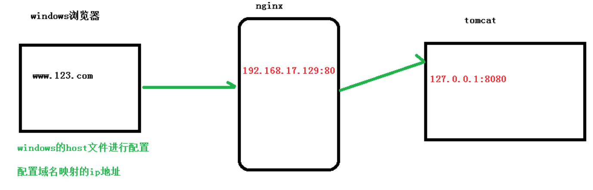

[TOC]

# 1. Nginx的基本概念

## 1.1 是什么？

Nginx 是高性能的 HTTP 和反向代理的服务器，处理高并发能力是十分强大的，能经受高负载的考验,有报告表明能支持高达 50,000 个并发连接数。

## 1.2 反向代理

正向代理：需要在客户端配置代理服务器进行指定网站访问


反向代理:暴露的是代理服务器地址，隐藏了真实服务器 IP 地址。


## 1.3 负载均衡

增加服务器的数量，然后将请求分发到各个服务器上，将原先请求集中到单个服务器上的情况改为将请求分发到多个服务器上，将负载分发到不同的服务器，也就是我们所说的负载均衡


## 1.4 动静分离

为了加快网站的解析速度，可以把动态页面和静态页面让不同的服务器来解析，降低单个服务器的压力


# 2. 安装、配置

## 2.1 安装

官网地址：**http://nginx.org/**

## 2.2 常用命令

使用nginx操作命令的前提条件:必须进入nginx的目录`/usr/local/nginx/sbin`

### 2.2.1 查看nginx的版本号

```bash
./nginx  -v
```


### 2.2.2 启动Nginx

```bash
./nginx
```

### 2.2.3 关闭Nginx

```bash
./nginx  -s stop
```

### 2.2.4 重新加载Nginx

```bash
./nginx  -s reload
```

## 2.3 配置文件

配置文件位置:`/usr/local/nginx/conf/nginx.conf`

### 2.3.1 配置文件的组成

配置文件由3部分组成，分别是:

1. 全局块

   从配置文件开始到events块之间的内容，主要会设置一些影响nginx服务器整体运行的配置指令，主要包括配置运行Nginx服务器的用户(组)、允许生成的worker process数，进程PID存放路径、日志存放路径和类型以及配置文件的引入等

   比如下面这行配置

   ```bash
   worker_processes  1;
   ```

   上面这行配置是Nginx服务器并发处理服务的关键配置，work_processes值越大，可以支持的并发处理量也越多，但是会受到硬件、软件等设备的制约

2. events块

   events块涉及的指令主要影响Nginx服务器与用户的网络连接，常用的设置包括是否开启对多work process下的网络连接进行序列化，是否允许同时接收多个网络连接，选取哪种事件驱动模型来处理连接请求，每个work process可以同时支持的最大连接数等

   ```bash
   events {
       worker_connections  1024;
   }
   ```

   比如上面这段配置表示work process支持的最大连接数为1024 这部分的配置对Nginx的性能影响较大，在实际中应该灵活配置

3. http块

   这算是Nginx服务器配置中最频繁的部分，代理、缓存和日志定义等绝大多数功能和第三方模块的配置都在这里

   需要注意的是:http块可以 包括http全局块、server块

   - http全局块

     http全局块配置的指令包括文件引入、MIME-TYPE定义、日志自定义、连接超时时间、单链接请求数上限等

   - server块

     这块和虚拟主机有密切关系，虚拟主机从用户角度看，和一台独立的硬件主机是完全一样的，该技术的产生是为了节省互联网服务器硬件成本

     每个http块可以包括多个server块，而每个server块就相当于一个虚拟主机

     而每个server块也分为全局server块以及可以同时包含多个location块

     - 全局server块

       最常见的配置是本虚拟机主机的监听配置和本虚拟机主机的名称或IP配置

     - location块

       一个server块可以配置多个location块

       这块的主要作用是基于Nginx服务器接收到的请求字符串(例如server_name/uri-string)，对虚拟主机名称(也可以是IP别名)之外的字符串(例如前面的/uri-string)进行匹配，对特定的请求进行处理。地址定向、数据缓存和应答控制等功能，还有许多第三方模块的配置也在这里进行。


# 3. 配置实例


## 3.1 反向代理实例1

### 3.1.1 实现效果

打开浏览器，在浏览器地址栏输入地址www.123.com,跳转到linux系统tomcat主页面中

### 3.1.2 访问过程分析



### 3.1.3 配置


## 3.2 反向代理实例2

### 3.2.1 实现效果

实现效果：使用 nginx 反向代理，根据访问的路径跳转到不同端口的服务中nginx 监听端口为 9001，

访问 http://127.0.0.1:9001/edu/ 直接跳转到 127.0.0.1:8081

访问 http://127.0.0.1:9001/vod/ 直接跳转到 127.0.0.1:8082

### 3.2.2 配置


### 3.2.3 location配置说明

该指令用于匹配url，语法如下:

```bash
location [ = | ~ | ~* | ^~] uri {

}
```

1. = ：用于不含正则表达式的 uri 前，要求请求字符串与 uri 严格匹配，如果匹配成功，就停止继续向下搜索并立即处理该请求。

2. ~：用于表示 uri 包含正则表达式，并且区分大小写。

3. ~*：用于表示 uri 包含正则表达式，并且不区分大小写。

4. ^~：用于不含正则表达式的 uri 前，要求 Nginx 服务器找到标识 uri 和请求字符串匹配度最高的 location 后，立即使用此 location 处理请求，而不再使用 location 块中的正则 uri 和请求字符串做匹配。

注意：如果 uri 包含正则表达式，则必须要有 ~ 或者 ~* 标识。


## 3.3 负载均衡实例

### 3.3.1 实现效果

在浏览器地址栏中输入Hadoop02/edu.a.html,负载均衡效果，流量平均到8080和8081端口中


### 3.3.2 配置文件


### 3.3.3 负载均衡策略

1. 轮询(默认)

   每个请求按时间顺序逐一分配到不同的后端服务器，如果后端服务器 down 掉，能自动剔除。

2. weight

   weight 代表权,权重默认为 1,权重越高被分配的客户端越多

   指定轮询几率，weight 和访问比率成正比，用于后端服务器性能不均的情况

   例如:

   ```bash
   upstream server_pool{
   server 192.168.5.21 weight=10;
   server 192.168.5.22 weight=10;
   }
   ```

   

3. ip_hash

   每个请求按访问 ip 的 hash 结果分配，这样每个访客固定访问一个后端服务器，可以解决 session 的问题

   例如:

   ```bash
   upstream server_pool{
   ip_hash;
   server 192.168.5.21:80;
   server 192.168.5.22:80;
   }
   ```

   

4. fair(第三方)

   按后端服务器的响应时间来分配请求，响应时间短的优先分配。

   例如:

   ```bash
   upstream server_pool{
   server 192.168.5.21:80; server 192.168.5.22:80;
   fair;
   }
   ```

## 3.4 动静分离实例

### 3.4.1 什么是动静分离

Nginx 动静分离简单来说就是把动态跟静态请求分开，不能理解成只是单纯的把动态页面和静态页面物理分离。严格意义上说应该是动态请求跟静态请求分开，可以理解成使用 Nginx 处理静态页面，Tomcat 处理动态页面。动静分离从目前实现角度来讲大致分为两种，一种是纯粹把静态文件独立成单独的域名，放在独立的服务器上，也是目前主流推崇的方案；

另外一种方法就是动态跟静态文件混合在一起发布，通过 nginx 来分开。通过 location 指定不同的后缀名实现不同的请求转发。通过 expires 参数设置，可以使浏览器缓存过期时间，减少与服务器之前的请求和流量。具体 Expires 定义：是给一个资源设定一个过期时间，也就是说无需去服务端验证，直接通过浏览器自身确认是否过期即可，

所以不会产生额外的流量。此种方法非常适合不经常变动的资源。（如果经常更新的文件，不建议使用 Expires 来缓存），我这里设置 3d，表示在这 3 天之内访问这个 URL，发送一个请求，比对服务器该文件最后更新时间没有变化，则不会从服务器抓取，返回状态码304，如果有修改，则直接从服务器重新下载，返回状态码 200。


### 3.4.2 配置


## 3.5 高可用

### 3.5.1 什么是Nginx的高可用


# 4. Nginx原理

见资料中的笔记课件