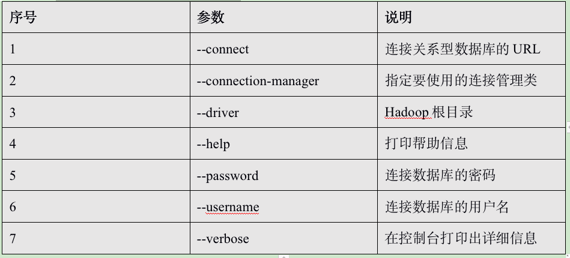
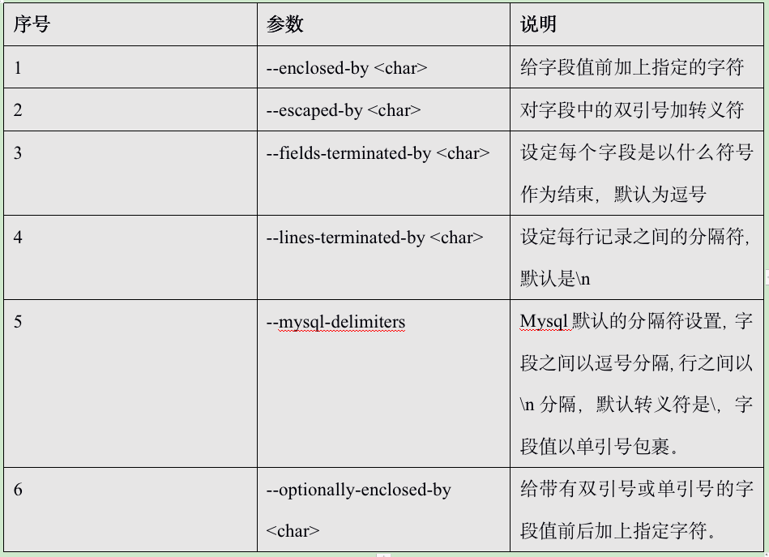
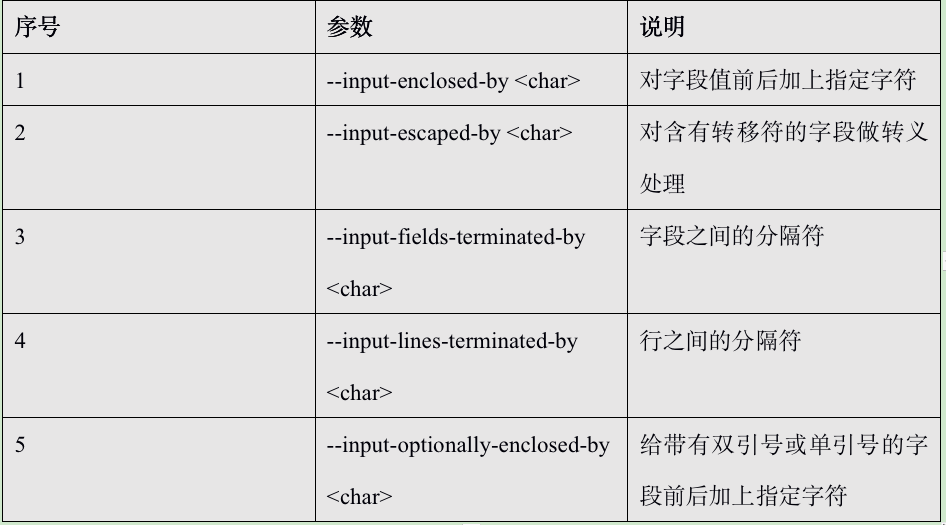

[TOC]

# 1. Sqoop简介

Sqoop是一款开源的工具，主要用于在Hadoop(Hive)与传统的数据库(mysql、postgresql...)间进行数据的传递，可以将一个关系型数据库（例如 ： MySQL ,Oracle ,Postgres等）中的数据导进到Hadoop的HDFS中，也可以将HDFS的数据导进到关系型数据库中。

Sqoop项目开始于2009年，最早是作为Hadoop的一个第三方模块存在，后来为了让使用者能够快速部署，也为了让开发人员能够更快速的迭代开发，Sqoop独立成为一个[Apache](https://baike.baidu.com/item/Apache/6265)项目。

Sqoop2的最新版本是1.99.7。请注意，2与1不兼容，且特征不完整，它并不打算用于生产部署

# 2. Sqoop原理

将导入或导出命令翻译成mapreduce程序来实现。

在翻译出的mapreduce中主要是对inputformat和outputformat进行定制

# 3. Sqoop安装

安装Sqoop的前提是已经具备Java和Hadoop的环境

## 3.1 下载并解压

+ 下载地址：http://mirrors.hust.edu.cn/apache/sqoop/1.4.6/

+ 上传安装包sqoop-1.4.6.bin__hadoop-2.0.4-alpha.tar.gz到虚拟机中

+ 解压sqoop安装包到指定目录，如：

+ tar -zxf sqoop-1.4.6.bin__hadoop-2.0.4-alpha.tar.gz -C /opt/module/

## 3.2 修改配置文件

Sqoop的配置文件与大多数大数据框架类似，在sqoop根目录下的conf目录中

1. 重命名配置文件

   ```bash
   mv sqoop-env-template.sh sqoop-env.sh
   ```

2. 修改配置文件

   sqoop-env.sh

   ```bash
   export HADOOP_COMMON_HOME=/opt/module/hadoop-2.7.2
   export HADOOP_MAPRED_HOME=/opt/module/hadoop-2.7.2
   export HIVE_HOME=/opt/module/hive
   export ZOOKEEPER_HOME=/opt/module/zookeeper-3.4.10
   export ZOOCFGDIR=/opt/module/zookeeper-3.4.10
   export HBASE_HOME=/opt/module/hbase
   ```

## 3.3 拷贝JDBC驱动

拷贝jdbc驱动到sqoop的lib目录下，如：

```bash
cp mysql-connector-java-5.1.27-bin.jar /opt/module/sqoop-1.4.6.bin__hadoop-2.0.4-alpha/lib/
```

## 3.4 验证Sqoop

我们可以通过某一个command来验证sqoop配置是否正确

```bash
bin/sqoop help
```

出现一些Warning警告（警告信息已省略），并伴随着帮助命令的输出

```bash
Available commands:
  codegen            Generate code to interact with database records
  create-hive-table     Import a table definition into Hive
  eval               Evaluate a SQL statement and display the results
  export             Export an HDFS directory to a database table
  help               List available commands
  import             Import a table from a database to HDFS
  import-all-tables     Import tables from a database to HDFS
  import-mainframe    Import datasets from a mainframe server to HDFS
  job                Work with saved jobs
  list-databases        List available databases on a server
  list-tables           List available tables in a database
  merge              Merge results of incremental imports
  metastore           Run a standalone Sqoop metastore
  version            Display version information
```

## 3.5 测试Sqoop是否能够成功连接数据库

```bash
bin/sqoop list-databases --connect jdbc:mysql://hadoop102:3306/ --username root --password 000000
```

出现如下输出：

```bash
information_schema
metastore
mysql
oozie
performance_schema
```

# 4. Sqoop的简单使用案例

## 4.1 导入数据

在Sqoop中，“导入”概念指：从非大数据集群（RDBMS）向大数据集群（HDFS，HIVE，HBASE）中传输数据，叫做：导入，即使用import关键字

### 4.1.1 RDBMS到HDFS

1. 确定Mysql服务开启正常

2. 在Mysql中新建一张表并插入一些数据

   ```bash
   mysql -uroot -p000000
   mysql> create database company;
   mysql> create table company.staff(id int(4) primary key not null auto_increment, name varchar(255), sex varchar(255));
   mysql> insert into company.staff(name, sex) values('Thomas', 'Male');
   mysql> insert into company.staff(name, sex) values('Catalina', 'FeMale');
   ```

3. 导入数据

   （1）全部导入

   ```bash
   bin/sqoop import \
   --connect jdbc:mysql://hadoop102:3306/company \
   --username root \
   --password 000000 \
   --table staff \
   --target-dir /user/company \
   --delete-target-dir \
   --num-mappers 1 \
   --fields-terminated-by "\t"
   ```

   （2）查询导入

   ```bash
   bin/sqoop import \
   --connect jdbc:mysql://hadoop102:3306/company \
   --username root \
   --password 000000 \
   --target-dir /user/company \
   --delete-target-dir \
   --num-mappers 1 \
   --fields-terminated-by "\t" \
   --query 'select name,sex from staff where id <=1 and $CONDITIONS;'
   ```

   提示：must contain '$CONDITIONS' in WHERE clause.

   如果query后使用的是双引号，则$CONDITIONS前必须加转移符，防止shell识别为自己的变量。

   （3）导入指定列

   ```bash
   bin/sqoop import \
   --connect jdbc:mysql://hadoop102:3306/company \
   --username root \
   --password 000000 \
   --target-dir /user/company \
   --delete-target-dir \
   --num-mappers 1 \
   --fields-terminated-by "\t" \
   --columns id,sex \
   --table staff
   ```

   提示：columns中如果涉及到多列，用逗号分隔，分隔时不要添加空格

   （4）使用sqoop关键字筛选查询导入数据

   ```bash
   bin/sqoop import \
   --connect jdbc:mysql://hadoop102:3306/company \
   --username root \
   --password 000000 \
   --target-dir /user/company \
   --delete-target-dir \
   --num-mappers 1 \
   --fields-terminated-by "\t" \
   --table staff \
   --where "id=1"
   ```

### 4.1.2 RDBMS到Hive

   ```bash
   bin/sqoop import \
   --connect jdbc:mysql://hadoop102:3306/company \
   --username root \
   --password 000000 \
   --table staff \
   --num-mappers 1 \
   --hive-import \
   --fields-terminated-by "\t" \
   --hive-overwrite \
   --hive-table staff_hive
   ```

   提示：该过程分为两步，第一步将数据导入到HDFS，第二步将导入到HDFS的数据迁移到Hive仓库，第一步默认的临时目录是/user/atguigu/表名

### 4.1.3 RDBMS到Hbase

   ```bash
   bin/sqoop import \
   --connect jdbc:mysql://hadoop102:3306/company \
   --username root \
   --password 000000 \
   --table company \
   --columns "id,name,sex" \
   --column-family "info" \
   --hbase-create-table \
   --hbase-row-key "id" \
   --hbase-table "hbase_company" \
   --num-mappers 1 \
   --split-by id
   ```

   提示：sqoop1.4.6只支持HBase1.0.1之前的版本的自动创建HBase表的功能

   解决方案：手动创建HBase表

   ```bash
   hbase> create 'hbase_company','info'
   ```

   (5) 在HBase中scan这张表得到如下内容

   ```bash
   hbase> scan ‘hbase_company’
   ```

   

## 4.2 导出数据

   在Sqoop中，“导出”概念指：从大数据集群（HDFS，HIVE，HBASE）向非大数据集群（RDBMS）中传输数据，叫做：导出，即使用export关键字。

### 4.2.1 HIVE/HDFS到RDBMS

   ```bash
   bin/sqoop export \
   --connect jdbc:mysql://hadoop102:3306/company \
   --username root \
   --password 000000 \
   --table staff \
   --num-mappers 1 \
   --export-dir /user/hive/warehouse/staff_hive \
   --input-fields-terminated-by "\t"
   ```

   提示：Mysql中如果表不存在，不会自动创建

## 4.3 脚本打包

   使用opt格式的文件打包sqoop命令，然后执行

   1. 创建一个.opt文件

      ```bash
      mkdir opt
      touch opt/job_HDFS2RDBMS.opt
      ```

   2. 编写sqoop脚本

      ```bash
      vi opt/job_HDFS2RDBMS.opt
      
      export
      --connect
      jdbc:mysql://hadoop102:3306/company
      --username
      root
      --password
      000000
      --table
      staff
      --num-mappers
      1
      --export-dir
      /user/hive/warehouse/staff_hive
      --input-fields-terminated-by
      "\t"
      ```

   3. 执行该脚本

      ```bash
      bin/sqoop --options-file opt/job_HDFS2RDBMS.opt
      ```

      

  # 5. Sqoop一些常用命令及参数

## 5.1 常用命令列举

这里给大家列出来了一部分Sqoop操作时的常用参数，以供参考，需要深入学习的可以参看对应类的源代码

| 序号 | 命令              | 类                  | 说明                                                         |
| ---- | ----------------- | ------------------- | ------------------------------------------------------------ |
| 1    | import            | ImportTool          | 将数据导入到集群                                             |
| 2    | export            | ExportTool          | 将集群数据导出                                               |
| 3    | codegen           | CodeGenTool         | 获取数据库中某张表数据生成Java并打包Jar                      |
| 4    | create-hive-table | CreateHiveTableTool | 创建Hive表                                                   |
| 5    | eval              | EvalSqlTool         | 查看SQL执行结果                                              |
| 6    | import-all-tables | ImportAllTablesTool | 导入某个数据库下所有表到HDFS中                               |
| 7    | job               | JobTool             | 用来生成一个sqoop的任务，生成后，该任务并不执行，除非使用命令执行该任务。 |
| 8    | list-databases    | ListDatabasesTool   | 列出所有数据库名                                             |
| 9    | list-tables       | ListTablesTool      | 列出某个数据库下所有表                                       |
| 10   | merge             | MergeTool           | 将HDFS中不同目录下面的数据合在一起，并存放在指定的目录中     |
| 11   | metastore         | MetastoreTool       | 记录sqoop job的元数据信息，如果不启动metastore实例，则默认的元数据存储目录为：~/.sqoop，如果要更改存储目录，可以在配置文件sqoop-site.xml中进行更改。 |
| 12   | help              | HelpTool            | 打印sqoop帮助信息                                            |
| 13   | version           | VersionTool         | 打印sqoop版本信息                                            |


## 5.2 命令&参数详解

刚才列举了一些Sqoop的常用命令，对于不同的命令，有不同的参数，让我们来一一列举说明。

首先来我们来介绍一下公用的参数，所谓公用参数，就是大多数命令都支持的参数。

### 5.2.1 公用参数：数据库连接



### 5.2.2 公用参数：import



### 5.2.3 公用参数：export



### 5.2.4 公用参数：hive

| 序号 | 参数                            |                           说明                            |
| ---- | ------------------------------- | :-------------------------------------------------------: |
| 1    | --hive-delims-replacement <arg> |    用自定义的字符串替换掉数据中的\r\n和\013 \010等字符    |
| 2    | --hive-drop-import-delims       |  在导入数据到hive时，去掉数据中的\r\n\013\010这样的字符   |
| 3    | --map-column-hive <arg>         |         生成hive表时，可以更改生成字段的数据类型          |
| 4    | --hive-partition-key            |  创建分区，后面直接跟分区名，分区字段的默认类型为string   |
| 5    | --hive-partition-value <v>      |               导入数据时，指定某个分区的值                |
| 6    | --hive-home <dir>               |   hive的安装目录，可以通过该参数覆盖之前默认配置的目录    |
| 7    | --hive-import                   |            将数据从关系数据库中导入到hive表中             |
| 8    | --hive-overwrite                |              覆盖掉在hive表中已经存在的数据               |
| 9    | --create-hive-table             | 默认是false，即，如果目标表已经存在了，那么创建任务失败。 |
| 10   | --hive-table                    |         后面接要创建的hive表,默认使用MySQL的表名          |
| 11   | --table                         |                   指定关系数据库的表名                    |

公用参数介绍完之后，我们来按照命令介绍命令对应的特有参数。

### 5.2.5 命令&参数：import

将关系型数据库中的数据导入到HDFS（包括Hive，HBase）中，如果导入的是Hive，那么当Hive中没有对应表时，则自动创建。

1. 命令

   如：导入数据到hive中

   ```bash
   bin/sqoop import \
   --connect jdbc:mysql://hadoop102:3306/company \
   --username root \
   --password 000000 \
   --table staff \
   --hive-import
   ```

   如：增量导入数据到hive中，mode=append

   ```bash
   bin/sqoop import \
   --connect jdbc:mysql://hadoop102:3306/company \
   --username root \
   --password 000000 \
   --table staff \
   --num-mappers 1 \
   --fields-terminated-by "\t" \
   --target-dir /user/hive/warehouse/staff_hive \
   --check-column id \
   --incremental append \
   --last-value 3
   ```

   尖叫提示：append不能与--hive-等参数同时使用（Append mode for hive imports is not yet supported. Please remove the parameter --append-mode）

   

   如：增量导入数据到hdfs中，mode=lastmodified

   ```bash
   先在mysql中建表并插入几条数据：
   mysql> create table company.staff_timestamp(id int(4), name varchar(255), sex varchar(255), last_modified timestamp DEFAULT CURRENT_TIMESTAMP ON UPDATE CURRENT_TIMESTAMP);
   mysql> insert into company.staff_timestamp (id, name, sex) values(1, 'AAA', 'female');
   mysql> insert into company.staff_timestamp (id, name, sex) values(2, 'BBB', 'female');
   先导入一部分数据：
   $ bin/sqoop import \
   --connect jdbc:mysql://hadoop102:3306/company \
   --username root \
   --password 000000 \
   --table staff_timestamp \
   --delete-target-dir \
   --m 1
   再增量导入一部分数据：
   mysql> insert into company.staff_timestamp (id, name, sex) values(3, 'CCC', 'female');
   $ bin/sqoop import \
   --connect jdbc:mysql://hadoop102:3306/company \
   --username root \
   --password 000000 \
   --table staff_timestamp \
   --check-column last_modified \
   --incremental lastmodified \
   --last-value "2017-09-28 22:20:38" \
   --m 1 \
   --append
   ```

   尖叫提示：使用lastmodified方式导入数据要指定增量数据是要--append（追加）还是要--merge-key（合并）

   尖叫提示：last-value指定的值是会包含于增量导入的数据中

   

2. 参数

   | 序号 | 参数                            | 说明                                                         |
   | ---- | ------------------------------- | ------------------------------------------------------------ |
   | 1    | --append                        | 将数据追加到HDFS中已经存在的DataSet中，如果使用该参数，sqoop会把数据先导入到临时文件目录，再合并。 |
   | 2    | --as-avrodatafile               | 将数据导入到一个Avro数据文件中                               |
   | 3    | --as-sequencefile               | 将数据导入到一个sequence文件中                               |
   | 4    | --as-textfile                   | 将数据导入到一个普通文本文件中                               |
   | 5    | --boundary-query <statement>    | 边界查询，导入的数据为该参数的值（一条sql语句）所执行的结果区间内的数据。 |
   | 6    | --columns <col1, col2, col3>    | 指定要导入的字段                                             |
   | 7    | --direct                        | 直接导入模式，使用的是关系数据库自带的导入导出工具，以便加快导入导出过程。 |
   | 8    | --direct-split-size             | 在使用上面direct直接导入的基础上，对导入的流按字节分块，即达到该阈值就产生一个新的文件 |
   | 9    | --inline-lob-limit              | 设定大对象数据类型的最大值                                   |
   | 10   | --m或–num-mappers               | 启动N个map来并行导入数据，默认4个。                          |
   | 11   | --query或--e <statement>        | 将查询结果的数据导入，使用时必须伴随参--target-dir，--hive-table，如果查询中有where条件，则条件后必须加上$CONDITIONS关键字 |
   | 12   | --split-by <column-name>        | 按照某一列来切分表的工作单元，不能与--autoreset-to-one-mapper连用（请参考官方文档） |
   | 13   | --table <table-name>            | 关系数据库的表名                                             |
   | 14   | --target-dir <dir>              | 指定HDFS路径                                                 |
   | 15   | --warehouse-dir <dir>           | 与14参数不能同时使用，导入数据到HDFS时指定的目录             |
   | 16   | --where                         | 从关系数据库导入数据时的查询条件                             |
   | 17   | --z或--compress                 | 允许压缩                                                     |
   | 18   | --compression-codec             | 指定hadoop压缩编码类，默认为gzip(Use Hadoop codec default gzip) |
   | 19   | --null-string <null-string>     | string类型的列如果null，替换为指定字符串                     |
   | 20   | --null-non-string <null-string> | 非string类型的列如果null，替换为指定字符串                   |
   | 21   | --check-column <col>            | 作为增量导入判断的列名                                       |
   | 22   | --incremental <mode>            | mode：append或lastmodified                                   |
   | 23   | --last-value <value>            | 指定某一个值，用于标记增量导入的位置                         |

### 5.2.6 命令&参数：export

从HDFS（包括Hive和HBase）中奖数据导出到关系型数据库中。

1. 命令

   ```bash
   bin/sqoop export \
   --connect jdbc:mysql://hadoop102:3306/company \
   --username root \
   --password 000000 \
   --table staff \
   --export-dir /user/company \
   --input-fields-terminated-by "\t" \
   --num-mappers 1
   ```

2. 参数

   | 序号 | 参数                                  | 说明                                                         |
   | ---- | ------------------------------------- | ------------------------------------------------------------ |
   | 1    | --direct                              | 利用数据库自带的导入导出工具，以便于提高效率                 |
   | 2    | --export-dir <dir>                    | 存放数据的HDFS的源目录                                       |
   | 3    | -m或--num-mappers <n>                 | 启动N个map来并行导入数据，默认4个                            |
   | 4    | --table <table-name>                  | 指定导出到哪个RDBMS中的表                                    |
   | 5    | --update-key <col-name>               | 对某一列的字段进行更新操作                                   |
   | 6    | --update-mode <mode>                  | updateonlyallowinsert(默认)                                  |
   | 7    | --input-null-string <null-string>     | 请参考import该类似参数说明                                   |
   | 8    | --input-null-non-string <null-string> | 请参考import该类似参数说明                                   |
   | 9    | --staging-table <staging-table-name>  | 创建一张临时表，用于存放所有事务的结果，然后将所有事务结果一次性导入到目标表中，防止错误。 |
   | 10   | --clear-staging-table                 | 如果第9个参数非空，则可以在导出操作执行前，清空临时事务结果表 |

### 5.2.7 命令&参数：codegen

将关系型数据库中的表映射为一个Java类，在该类中有各列对应的各个字段

```bash
bin/sqoop codegen \
--connect jdbc:mysql://hadoop102:3306/company \
--username root \
--password 000000 \
--table staff \
--bindir /home/admin/Desktop/staff \
--class-name Staff \
--fields-terminated-by "\t"
```

| 序号 | 参数                               | 说明                                                         |
| ---- | ---------------------------------- | ------------------------------------------------------------ |
| 1    | --bindir <dir>                     | 指定生成的Java文件、编译成的class文件及将生成文件打包为jar的文件输出路径 |
| 2    | --class-name <name>                | 设定生成的Java文件指定的名称                                 |
| 3    | --outdir <dir>                     | 生成Java文件存放的路径                                       |
| 4    | --package-name <name>              | 包名，如com.z，就会生成com和z两级目录                        |
| 5    | --input-null-non-string <null-str> | 在生成的Java文件中，可以将null字符串或者不存在的字符串设置为想要设定的值（例如空字符串） |
| 6    | --input-null-string <null-str>     | 将null字符串替换成想要替换的值（一般与5同时使用）            |
| 7    | --map-column-java <arg>            | 数据库字段在生成的Java文件中会映射成各种属性，且默认的数据类型与数据库类型保持对应关系。该参数可以改变默认类型，例如：--map-column-java id=long, name=String |
| 8    | --null-non-string <null-str>       | 在生成Java文件时，可以将不存在或者null的字符串设置为其他值   |
| 9    | --null-string <null-str>           | 在生成Java文件时，将null字符串设置为其他值（一般与8同时使用） |
| 10   | --table <table-name>               | 对应关系数据库中的表名，生成的Java文件中的各个属性与该表的各个字段一一对应 |

### 5.2.8 命令&参数：create-hive-table

生成与关系数据库表结构对应的hive表结构

```bash
bin/sqoop create-hive-table \
--connect jdbc:mysql://hadoop102:3306/company \
--username root \
--password 000000 \
--table staff \
--hive-table hive_staff
```

| 序号 | 参数                | 说明                                                  |
| ---- | ------------------- | ----------------------------------------------------- |
| 1    | --hive-home <dir>   | Hive的安装目录，可以通过该参数覆盖掉默认的Hive目录    |
| 2    | --hive-overwrite    | 覆盖掉在Hive表中已经存在的数据                        |
| 3    | --create-hive-table | 默认是false，如果目标表已经存在了，那么创建任务会失败 |
| 4    | --hive-table        | 后面接要创建的hive表                                  |
| 5    | --table             | 指定关系数据库的表名                                  |

### 5.2.9 命令&参数：eval

可以快速的使用SQL语句对关系型数据库进行操作，经常用于在import数据之前，了解一下SQL语句是否正确，数据是否正常，并可以将结果显示在控制台

```bash
bin/sqoop eval \
--connect jdbc:mysql://hadoop102:3306/company \
--username root \
--password 000000 \
--query "SELECT * FROM staff"
```

| 序号 | 参数         | 说明              |
| ---- | ------------ | ----------------- |
| 1    | --query或--e | 后跟查询的SQL语句 |

### 5.2.10 命令&参数：import-all-tables

可以将RDBMS中的所有表导入到HDFS中，每一个表都对应一个HDFS目录

```bash
bin/sqoop import-all-tables \
--connect jdbc:mysql://hadoop102:3306/company \
--username root \
--password 000000 \
--warehouse-dir /all_tables
```

| 序号 | 参数                    | 说明                                   |
| ---- | ----------------------- | -------------------------------------- |
| 1    | --as-avrodatafile       | 这些参数的含义均和import对应的含义一致 |
| 2    | --as-sequencefile       |                                        |
| 3    | --as-textfile           |                                        |
| 4    | --direct                |                                        |
| 5    | --direct-split-size <n> |                                        |
| 6    | --inline-lob-limit <n>  |                                        |
| 7    | --m或—num-mappers <n>   |                                        |
| 8    | --warehouse-dir <dir>   |                                        |
| 9    | -z或--compress          |                                        |
| 10   | --compression-codec     |                                        |

### 5.2.11 命令&参数：job

用来生成一个sqoop任务，生成后不会立即执行，需要手动执行

```bash
bin/sqoop job \
 --create myjob -- import-all-tables \
 --connect jdbc:mysql://hadoop102:3306/company \
 --username root \
 --password 000000
$ bin/sqoop job \
--list
$ bin/sqoop job \
--exec myjob
```

尖叫提示：注意import-all-tables和它左边的--之间有一个空格

尖叫提示：如果需要连接metastore，则--meta-connect jdbc:hsqldb:hsql://linux01:16000/sqoop

| 序号 | 参数                      | 说明                     |
| ---- | ------------------------- | ------------------------ |
| 1    | --create <job-id>         | 创建job参数              |
| 2    | --delete <job-id>         | 删除一个job              |
| 3    | --exec <job-id>           | 执行一个job              |
| 4    | --help                    | 显示job帮助              |
| 5    | --list                    | 显示job列表              |
| 6    | --meta-connect <jdbc-uri> | 用来连接metastore服务    |
| 7    | --show <job-id>           | 显示一个job的信息        |
| 8    | --verbose                 | 打印命令运行时的详细信息 |

尖叫提示：在执行一个job时，如果需要手动输入数据库密码，可以做如下优化

```xml
<property>
	<name>sqoop.metastore.client.record.password</name>
	<value>true</value>
	<description>If true, allow saved passwords in the metastore.</description>
</property>
```

### 5.2.12 命令&参数：list-databases

```bash
bin/sqoop list-databases \
--connect jdbc:mysql://hadoop102:3306/ \
--username root \
--password 000000
```

参数：与公用参数一样

### 5.2.13 命令&参数：list-tables

```bash
bin/sqoop list-tables \
--connect jdbc:mysql://hadoop102:3306/company \
--username root \
--password 000000
```

参数：与公用参数一样

### 5.2.1 4 命令&参数：merge

将HDFS中不同目录下面的数据合并在一起并放入指定目录中

数据环境：

```bash
new_staff
1       AAA     male
2       BBB     male
3       CCC     male
4       DDD     male
old_staff
1       AAA     female
2       CCC     female
3       BBB     female
6       DDD     female
```

尖叫提示：上边数据的列之间的分隔符应该为\t，行与行之间的分割符为\n，如果直接复制，请检查之。

```bash
创建JavaBean：
$ bin/sqoop codegen \
--connect jdbc:mysql://hadoop102:3306/company \
--username root \
--password 000000 \
--table staff \
--bindir /home/admin/Desktop/staff \
--class-name Staff \
--fields-terminated-by "\t"

开始合并：
$ bin/sqoop merge \
--new-data /test/new/ \
--onto /test/old/ \
--target-dir /test/merged \
--jar-file /home/admin/Desktop/staff/Staff.jar \
--class-name Staff \
--merge-key id
结果：
1	AAA	MALE
2	BBB	MALE
3	CCC	MALE
4	DDD	MALE
6	DDD	FEMALE
```

参数：

| 序号 | 参数                 | 说明                                                   |
| ---- | -------------------- | ------------------------------------------------------ |
| 1    | --new-data <path>    | HDFS 待合并的数据目录，合并后在新的数据集中保留        |
| 2    | --onto <path>        | HDFS合并后，重复的部分在新的数据集中被覆盖             |
| 3    | --merge-key <col>    | 合并键，一般是主键ID                                   |
| 4    | --jar-file <file>    | 合并时引入的jar包，该jar包是通过Codegen工具生成的jar包 |
| 5    | --class-name <class> | 对应的表名或对象名，该class类是包含在jar包中的         |
| 6    | --target-dir <path>  | 合并后的数据在HDFS里存放的目录                         |

### 5.2.15 命令&参数：metastore

记录了Sqoop job的元数据信息，如果不启动该服务，那么默认job元数据的存储目录为~/.sqoop，可在sqoop-site.xml中修改。

命令：

如：启动sqoop的metastore服务

```bash
 bin/sqoop metastore
```

参数：

| 序号 | 参数       | 说明          |
| ---- | ---------- | ------------- |
| 1    | --shutdown | 关闭metastore |

