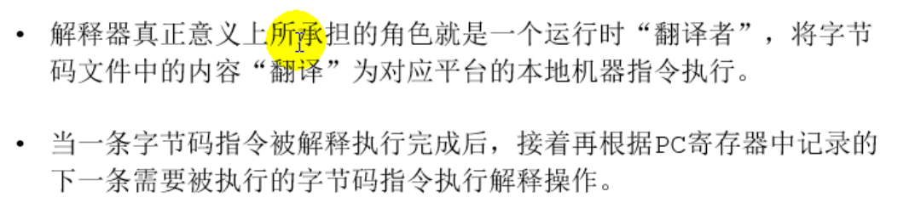

# 12.执行引擎

## 12.1 执行引擎概述

## 12.2 Java代码编译和执行过程

## 12.3 机器码、指令、汇编语言

### 12.3.1 机器码

### 12.3.2 指令

### 12.3.3 指令集

### 12.3.4 汇编语言

### 12.3.5 高级语言

### 12.3.6 字节码

## 12.4 解释器

### 12.4.1 解释器工作机制(工作任务)

### 12.4.2 解释器分类

### 12.4.3 现状

## 12.5 JIT编译器

### 12.5.1 Java代码的执行分类

### 12.5.2 HotSpot JVM的执行方式

### 12.5.3 JIT编译器概念解释

### 12.5.4 如何选择

### 12.5.5 热点代码及探测方式

### 12.5.6 方法调用计数器

### 12.5.7 回边计数器

### 12.5.8 HotSpot VM可以设置程序执行方式

### 12.5.9 HotSpot VM中JIT分类

