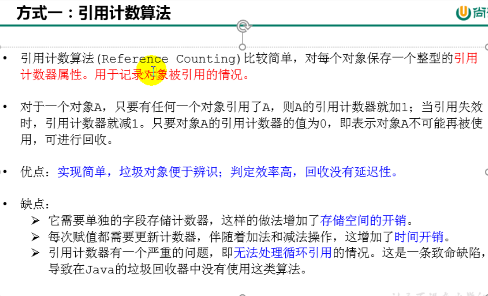
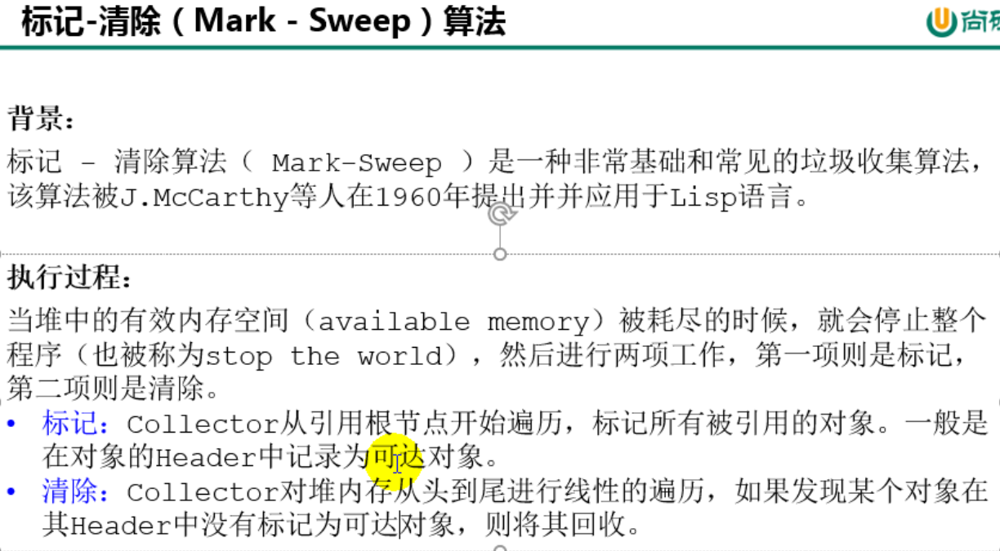
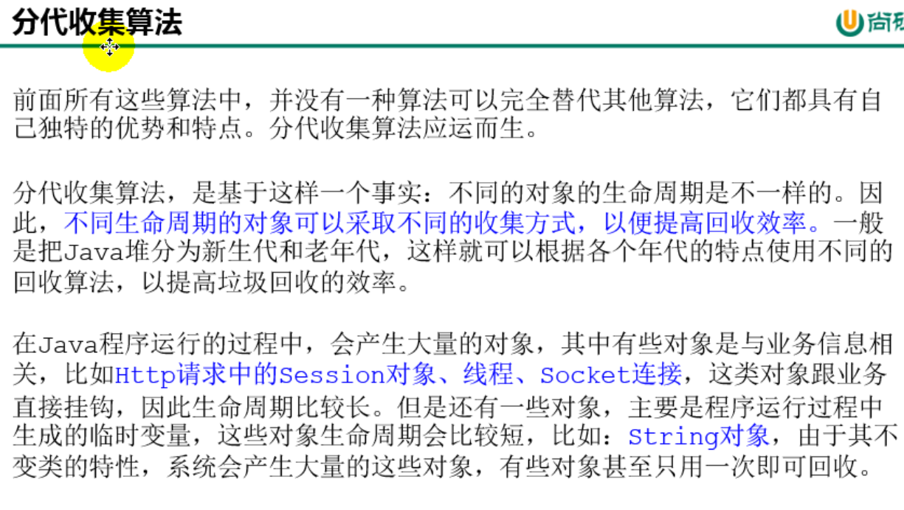

# 15. 垃圾回收的相关算法

## 15.1 标记阶段：引用计数算法

## 15.2 标记阶段：可达性分析算法

## 15.3 对象的的finallization机制

## 15.4 MAT与JProfiler的GC Roots溯源

## 15.5 清除阶段：标记-清除算法

## 15.6 清除阶段：复制算法

## 15.7 清除阶段：标记-压缩算法

## 15.8 小结

## 15.9 分代收集算法

## 15.10 增量收集算法、分区算法

# 