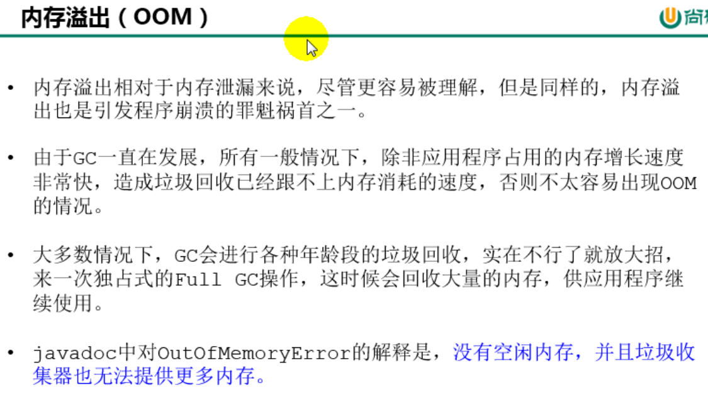
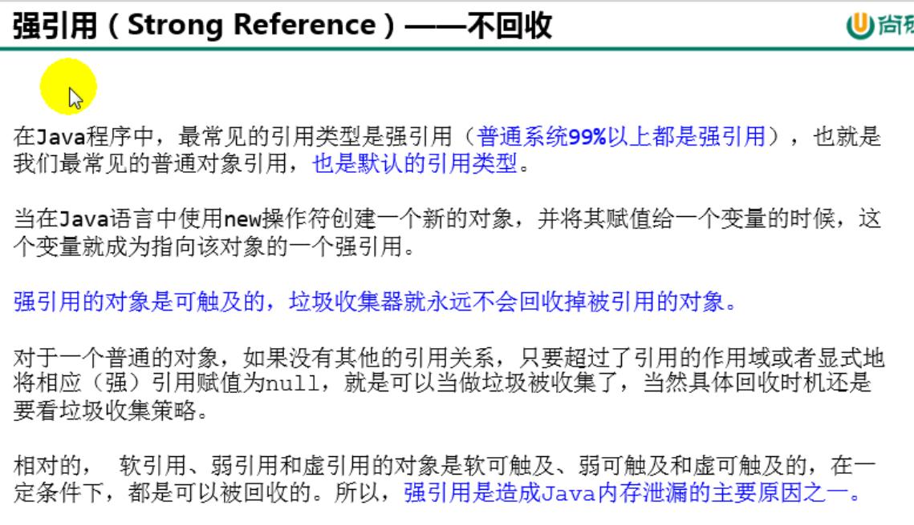

# 16. 垃圾回收相关概念

## 16.1 System.gc()的理解

## 16.2 内存溢出与内存泄漏

## 16.3 Stop The World

## 16.4 垃圾回收的并行与并发

## 16.5 安全点与安全区域

## 16.6 强引用(不回收)

## 16.7 软引用(内存不足即回收)

## 16.8 弱引用

## 16.9 虚引用

## 16.10 终结器引用

# 