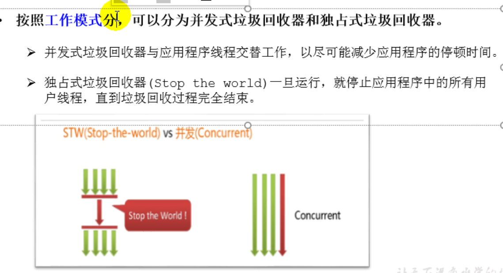
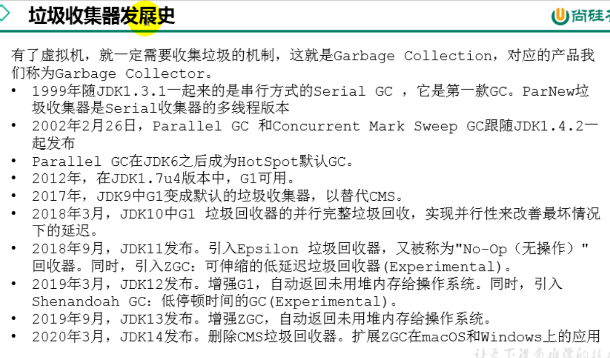
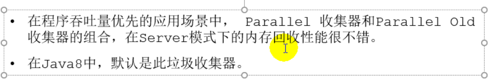
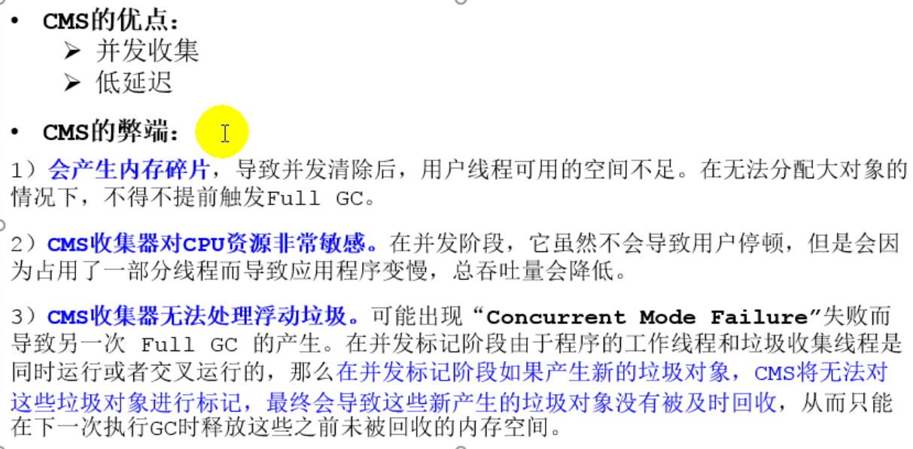
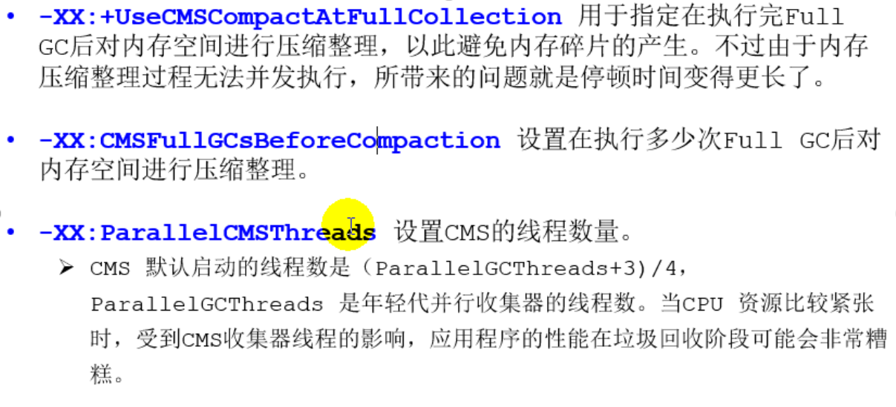
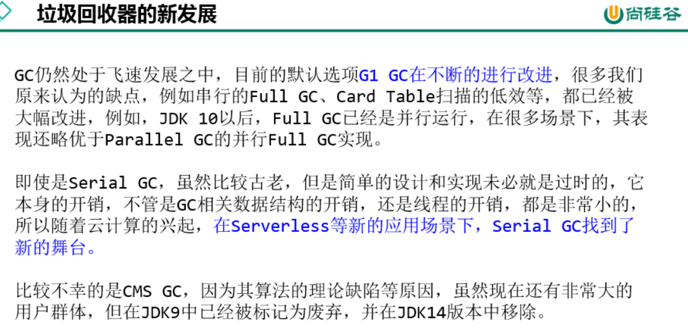

# 17. 垃圾回收器

## 17.1 GC分类与性能指标

## 17.2 不同的垃圾回收器概述

## 17.3 Serial回收器：串行回收

## 17.4 ParNew回收器：并行回收

## 17.5 Parallel回收器：吞吐量优先

## 17.6 CMS回收器：低延迟

## 17.7 G1回收器：区域化分代式

## 17.8 垃圾回收器总结

## 17.9 GC日志分析

## 

## 17.10 垃圾回收器的新发展

