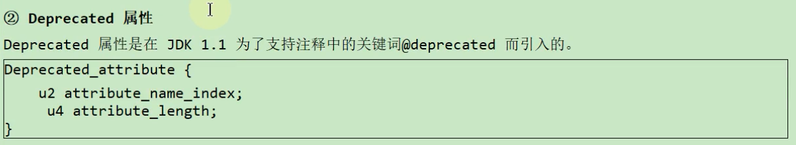

# 18. class文件结构

## 18.1 概述

### 18.1.1 字节码文件的跨平台性

### 18.1.2 Java的前端编译器

### 18.1.3 透过字节码指令看代码细节

## 18.2 虚拟机的基石:class文件

### 18.2.1 魔数

### 18.2.2 class文件版本号

### 18.2.3 常量池:存放所有常量

### 18.2.4 访问标识

### 18.2.5 类索引、父类索引、接口索引集合

### 18.2.6 字段表集合

### 18.2.7 方法表集合

### 18.2.8 属性表集合

**③code属性**

### 18.2.9 小结

## 18.3 使用javap指令解析class文件

### 18.3.1 解析字节码的作用

### 18.3.2 javac -g操作

### 18.3.3 javap的用法

### 18.3.4 使用举例

### 18.3.5 总结

