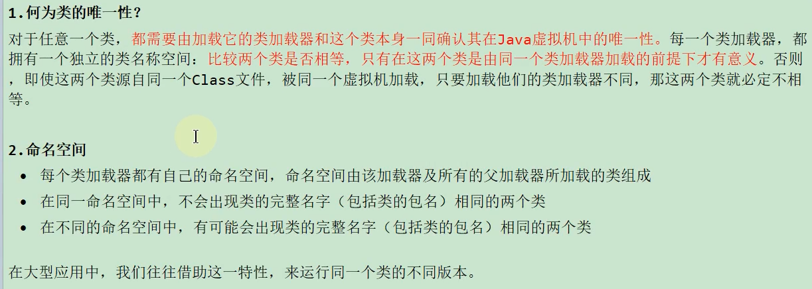
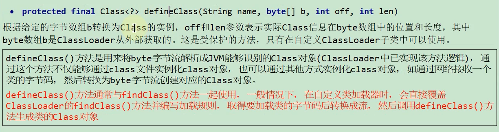
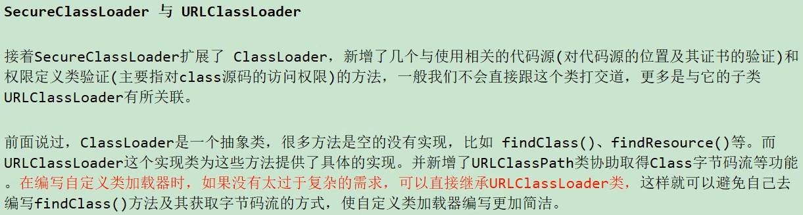
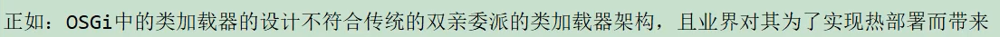
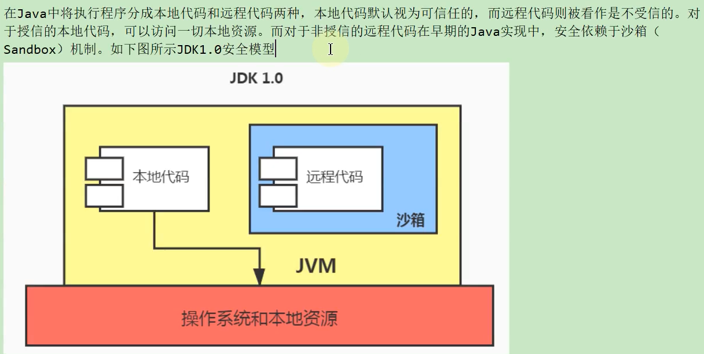
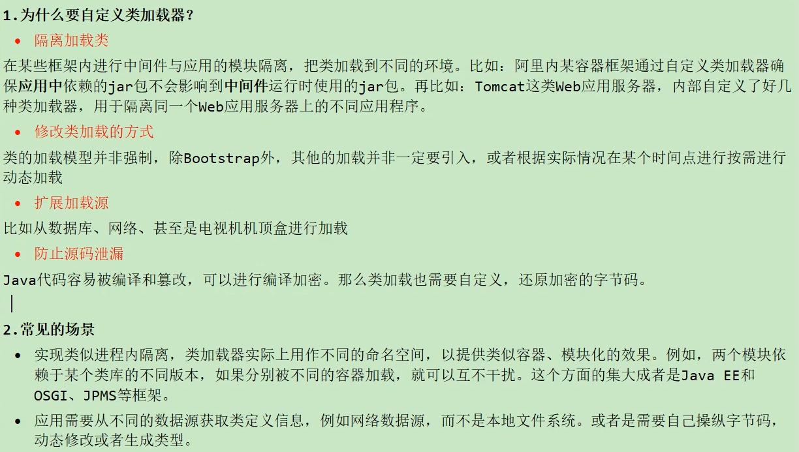
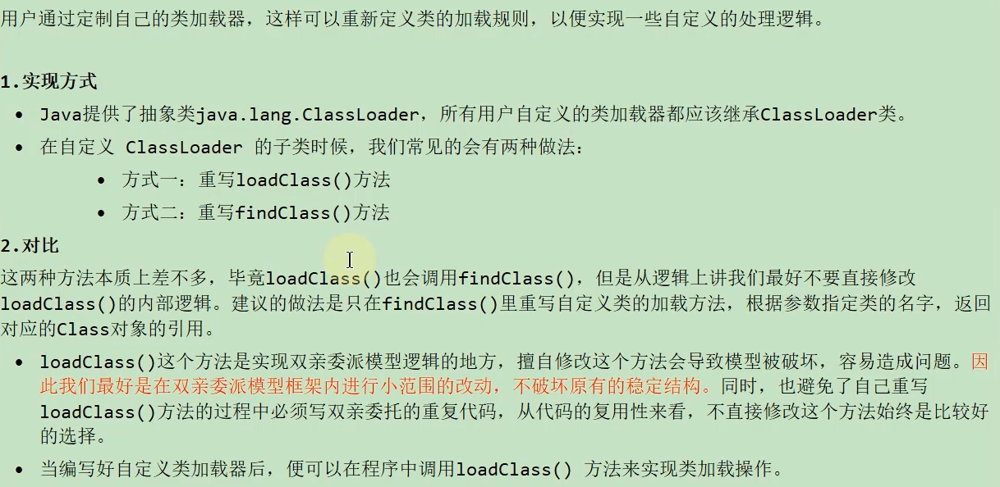

# 21. 类的加载器

## 21.1 概述

### 21.1.1 大厂面试题

### 21.1.2 类加载的分类

### 21.1.3 类加载器的必要性

### 21.1.4 命名空间

### 21.1.5 类加载机制的基本特征

## 21.2 类的加载器分类

### 21.2.1 引导类加载器

### 21.2.2 扩展类加载器

### 21.2.3 系统类加载器

### 21.2.4 用户自定义类加载器

## 21.3 测试不同的类加载器

## 21.4 ClassLoader源码解析

### 21.4.1 ClassLoader的主要方法

### 21.4.2 SecureClassLoader与URLClassLoader

### 21.4.3 Class.forName()与ClassLoader.loadClass()

## 21.5 双亲委派模型

### 21.5.1 定义与本质

### 21.5.2 优势与劣势

### 21.5.3 破坏双亲委派机制

### 21.5.4 热替换的实现

## 21.6 沙箱安全机制

### 21.6.1 JDK1.0时期

### 21.6.2 JDK1.1时期

### 21.6.3 JDK1.2时期

### 21.6.4 JDK1.6时期

## 21.7 自定义类的加载器

**实现方式**

## 21.8 Java9新特性

