# 22. 性能监控与调优概述

## 22.1 大厂面试题

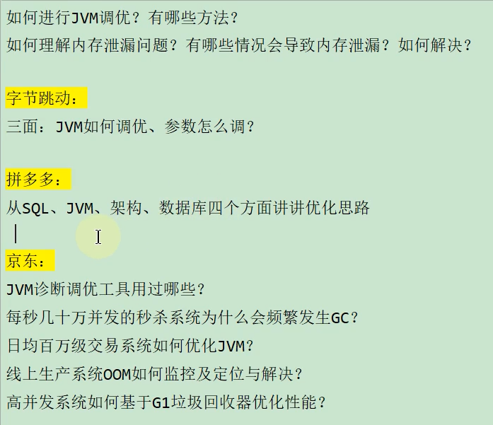

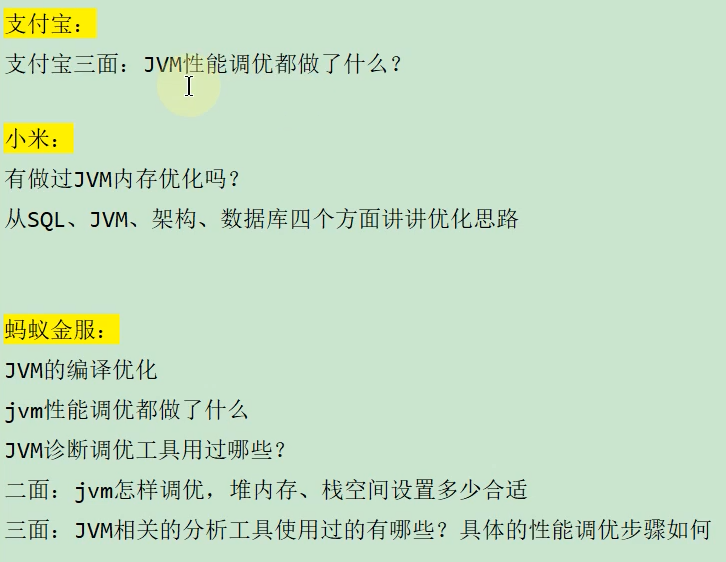

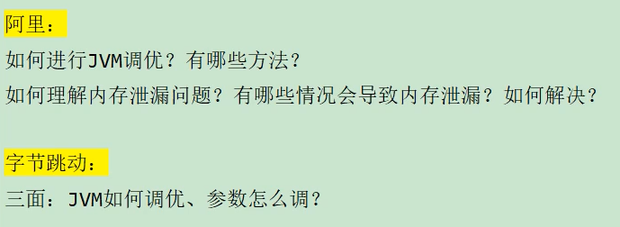

## 22.2 背景说明

### 22.2.1 生产环境中的问题

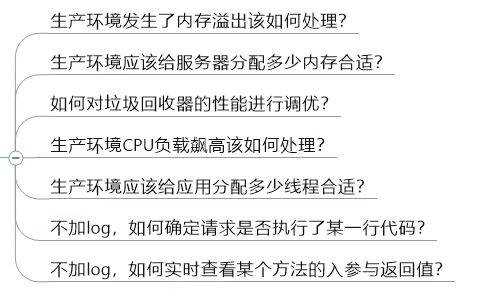

### 22.2.2 为什么要调优

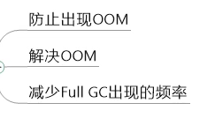

### 22.2.3 不同阶段的考虑

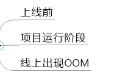

## 22.3 调优概述

### 22.3.1 监控的依据

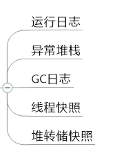

### 22.3.2 调优的大方向

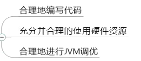

## 22.4 性能优化的步骤

### 22.4.1 性能监控(发现问题)

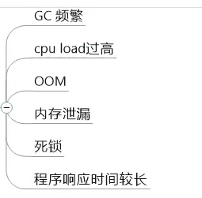

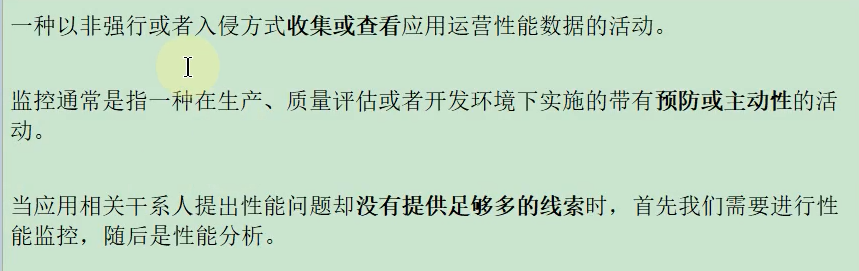

### 22.4.2 性能分析(排查问题)

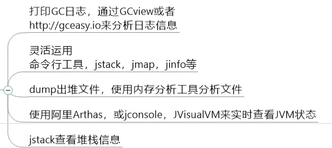

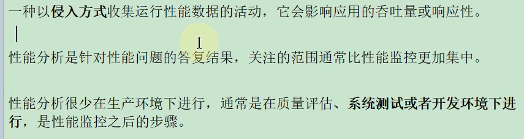

### 22.4.3 性能调优(解决问题)

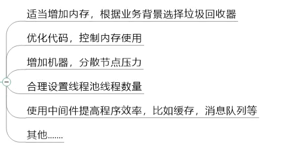

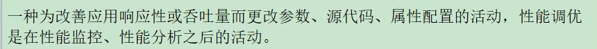

## 22.5 性能评价/测试指标

### 22.5.1 停顿时间/响应时间

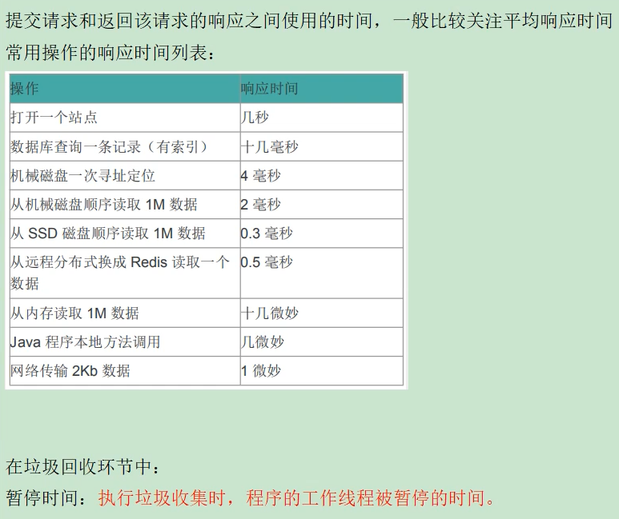

### 22.5.2 吞吐量

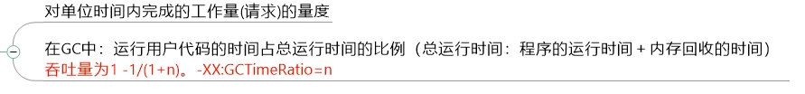

### 22.5.3 并发数

同一时刻，对服务器有实际交互的请求数

### 22.5.4 内存占用

Java堆区所占的内存大小

### 22.5.5 相互间的关系

