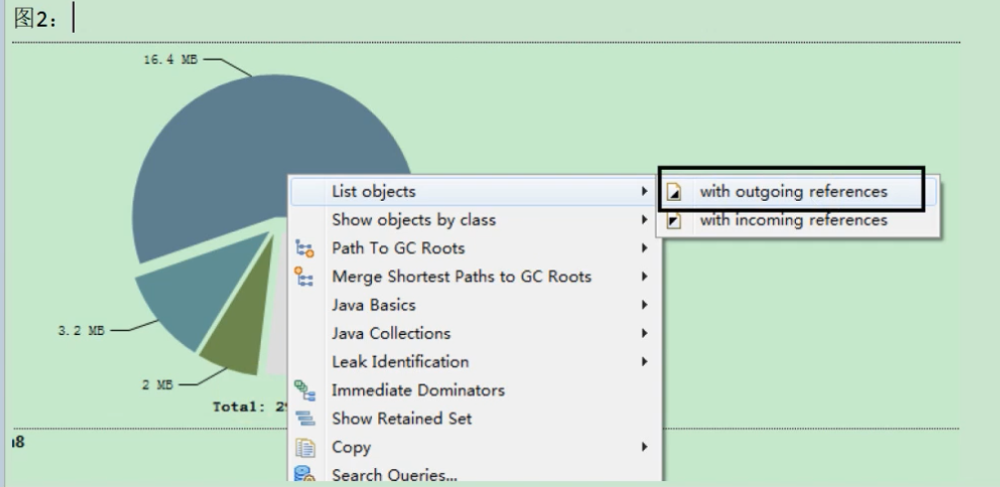
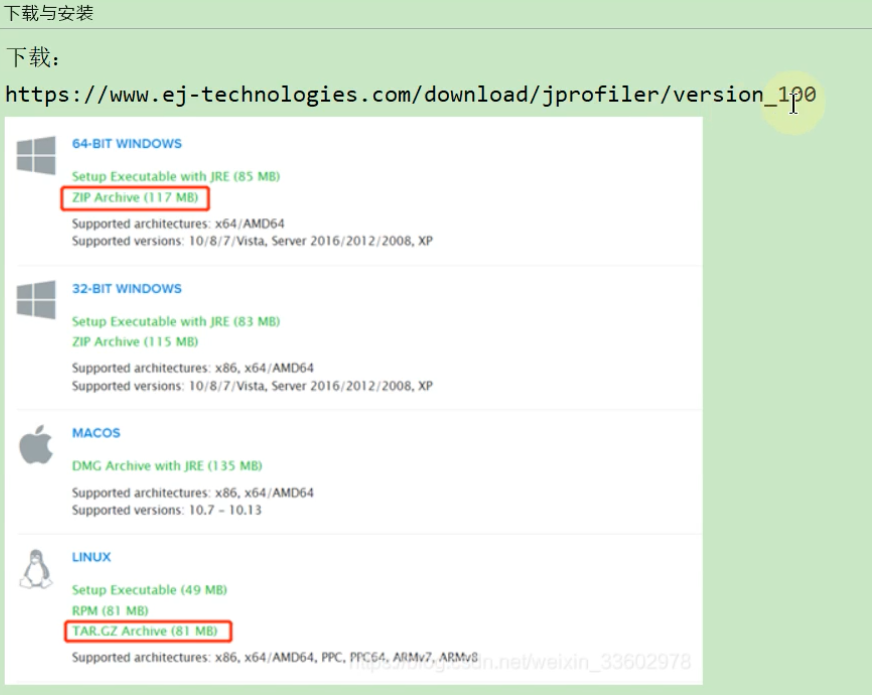
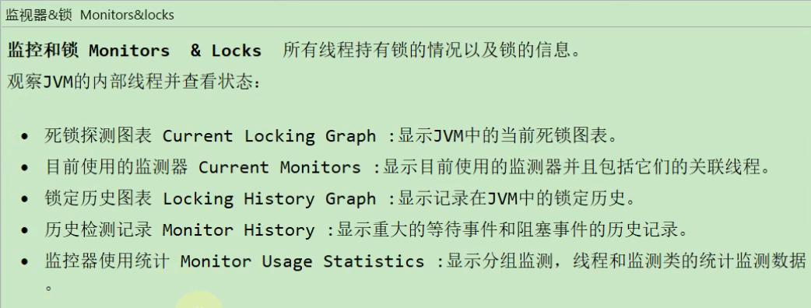
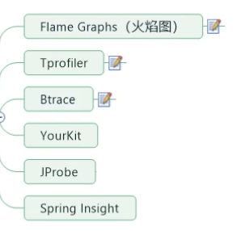
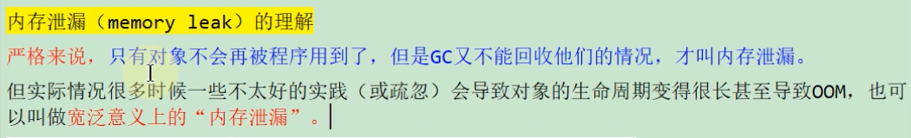
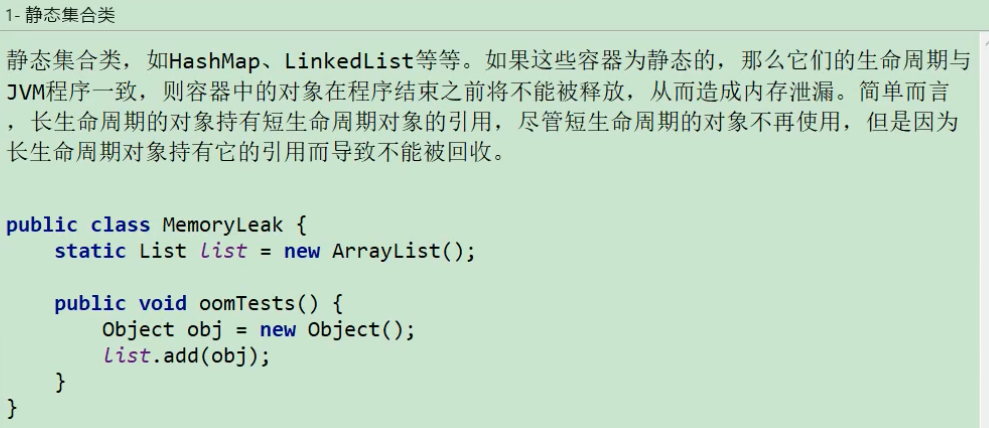

# 24.JVM监控及诊断工具-GUI篇

## 24.1 工具概述

## 24.2 jConsole

### 24.2.1 基本概述

### 24.2.2 启动

### 24.2.3 三种连接方式

### 24.2.4 主要作用

## 24.3 Visual VM

### 24.3.1 基本概述

### 24.3.2 插件的安装

### 24.3.3 连接方式

### 24.3.4 主要功能

## 24.4 eclipse MAT

### 24.4.1 基本概述

### 24.4.2 获取堆dump文件

### 24.4.3 分析堆dump文件

### 24.4.4 案例:Tomcat堆溢出分析

### 24.4.5 支持使用OQL语言查询对象信息

## 24.5 JProfiler

### 24.5.1 基本概述

### 24.5.2 安装与配置

### 24.5.3 具体使用

### 24.5.4 案例分析

## 24.6 Arthas

### 24.6.1 基本概述

### 24.6.2 安装与使用

### 24.6.3 相关诊断指令

## 24.7 Java Mission Control

### 24.7.1 历史

### 24.7.2 启动

### 24.7.3 概述

### 24.7.4 功能:实时监控JVM运行时的状态

### 24.7.5 Java Flight Recorder

## 24.8 Btrace

## 24.9 Flame Graphs(火焰图)

## 24.10 其他工具

## 24.11 补充1:内存泄漏

### 24.11.1 内存泄漏的理解与分类

内存泄漏与内存溢出的关系：

### 24.11.2 Java中内存泄漏的8种情况

### 24.11.3 内存泄漏案例分析

