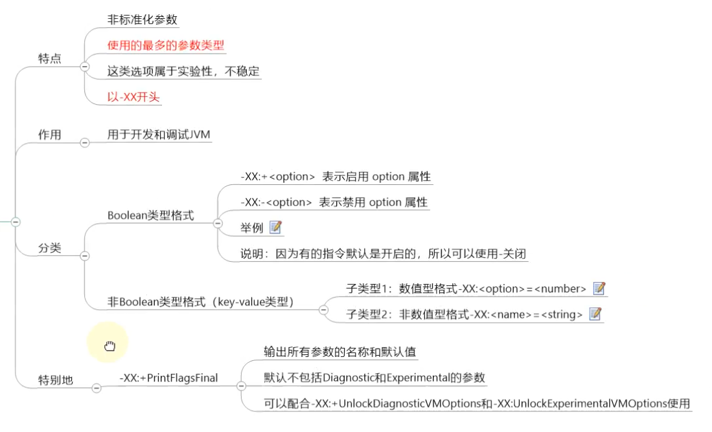

# 25.JVM运行时参数

## 25.1 JVM参数选项类型

### 25.1.1 类型一:标准参数选项

### 25.1.2 类型二:-X参数选项

### 25.1.3 类型三:-XX参数选项

## 25.2 添加JVM参数选项

## 25.3 常用的JVM参数选项

### 25.3.1 打印设置的XX选项及值

### 25.3.2 堆、栈、方法区等内存大小设置

### 25.3.3 OutofMemory相关的选项

### 25.3.4 垃圾收集器相关选项

该看70

**Serial回收器**

**ParNew回收器**

**Parallel回收器**

CMS回收器

**G1回收器**

**怎么选择垃圾回收器**

### 25.3.5 GC日志相关选项

### 25.3.6 其他参数

## 25.4 通过Java代码获取JVM参数

