# 26.分析GC日志

## 26.1 GC日志参数

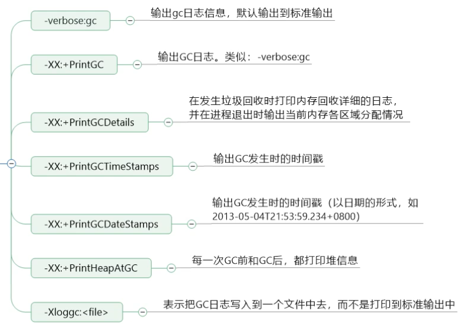

## 26.2 GC日志格式

### 26.2.1 复习:GC分类

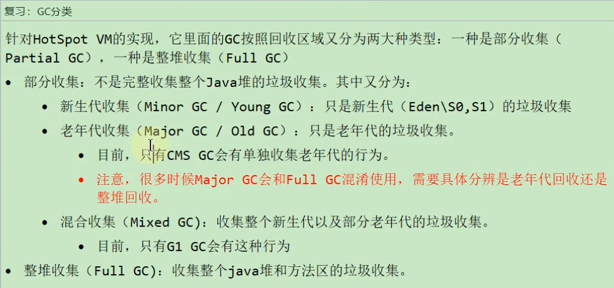

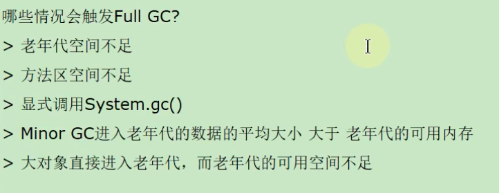

### 26.2.2 GC日志分类

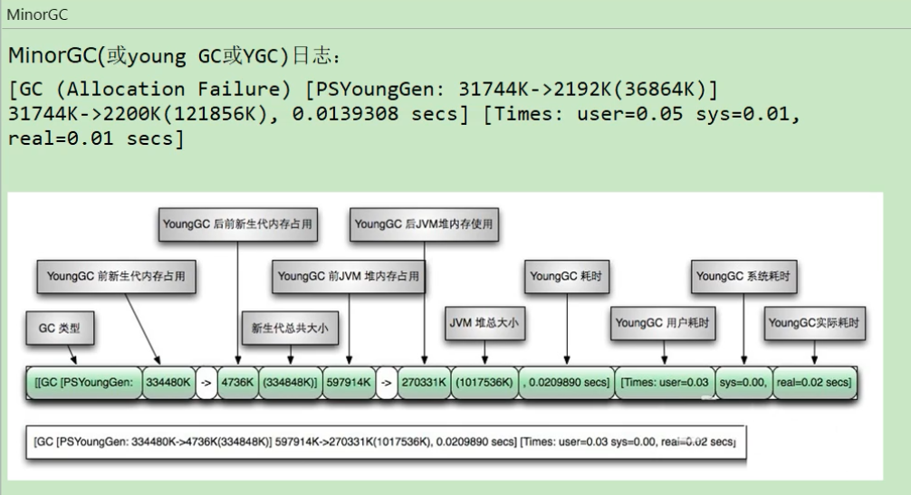

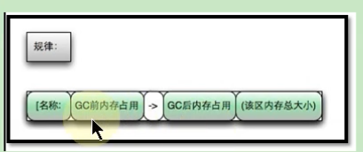

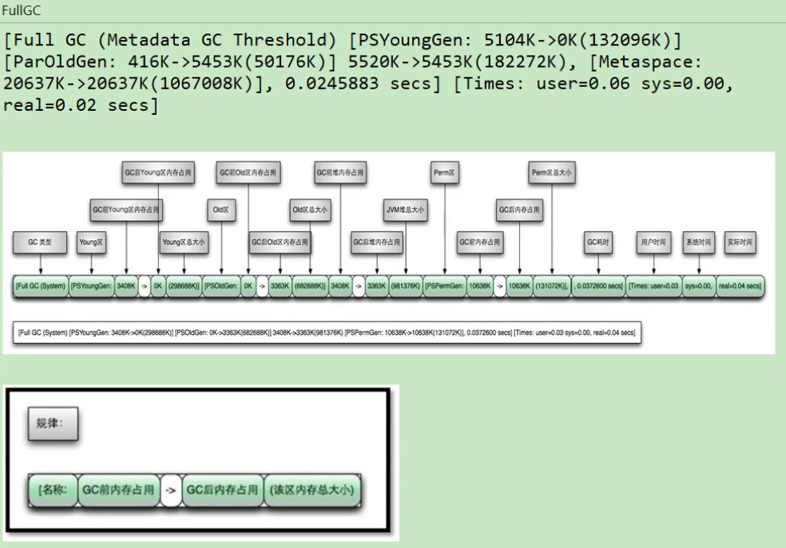

### 26.2.3 GC日志结构剖析

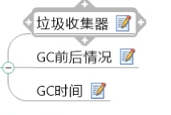

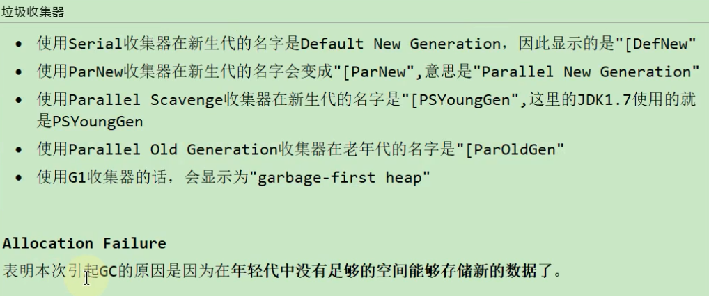

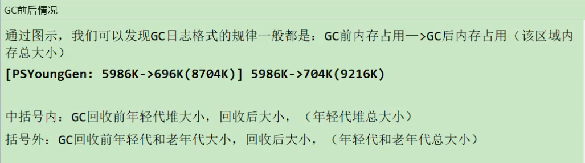

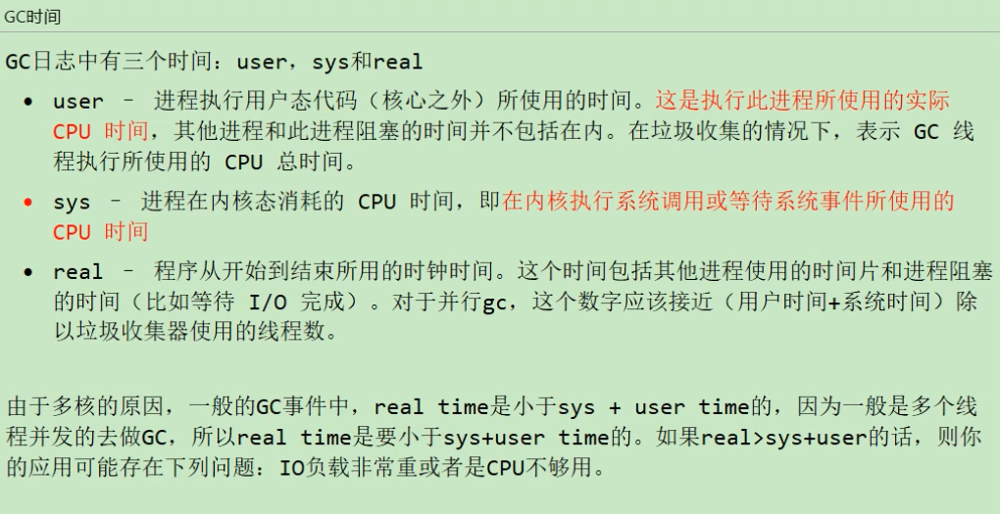

### 26.2.4 Minor GC 日志解析

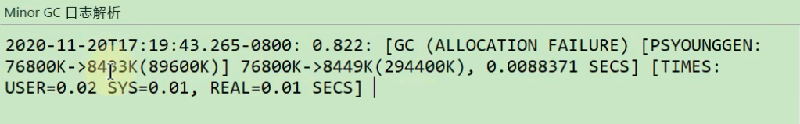

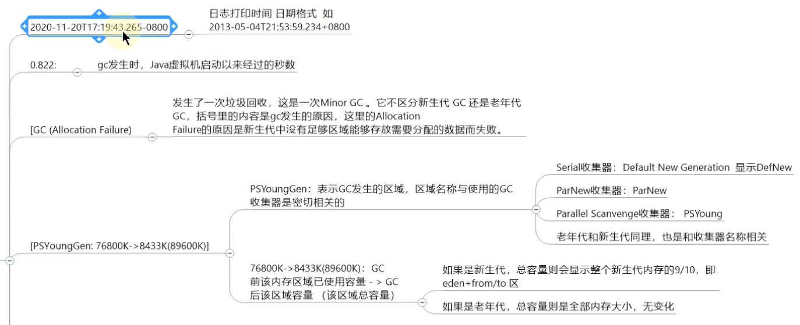

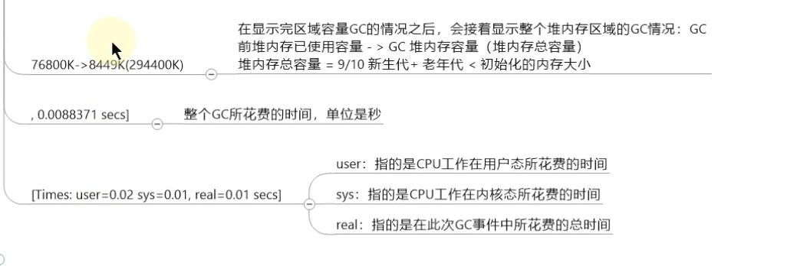

### 26.2.5 Full GC日志解析

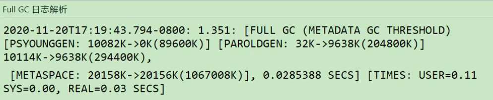

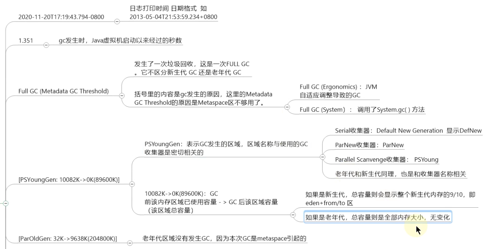

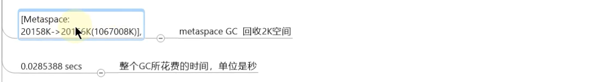

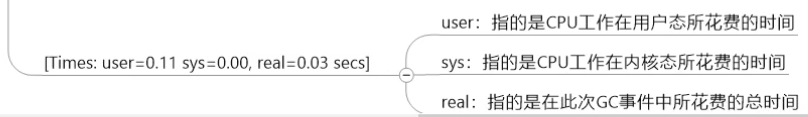

## 26.3 GC日志分析工具

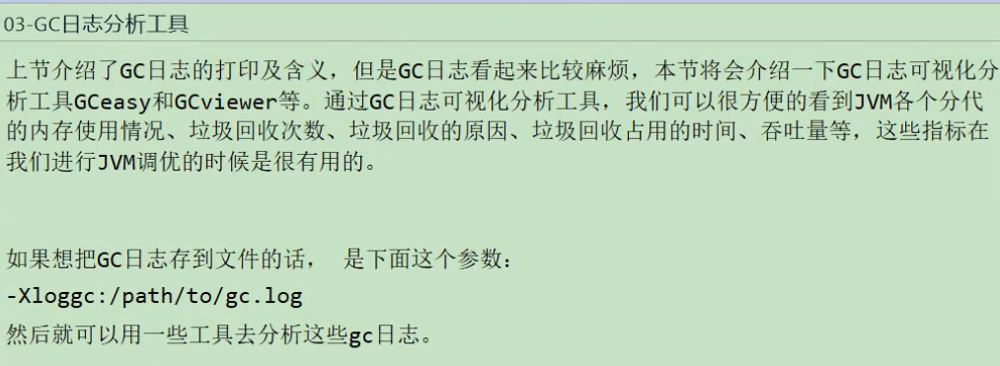

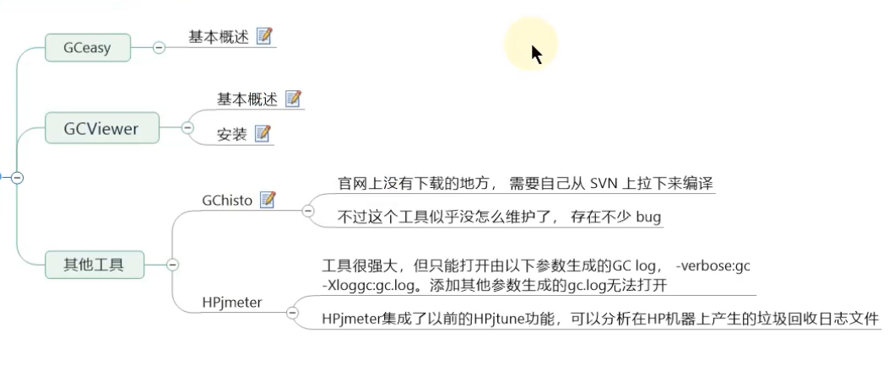

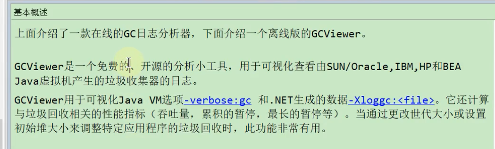

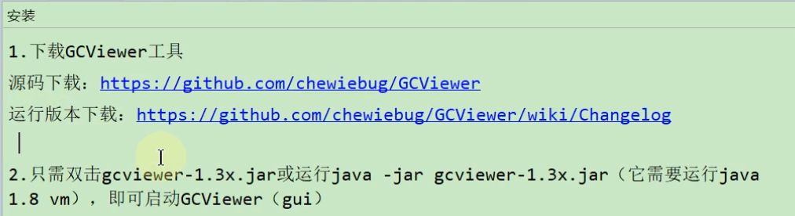

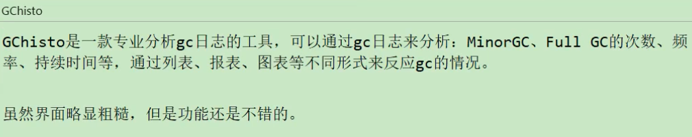

