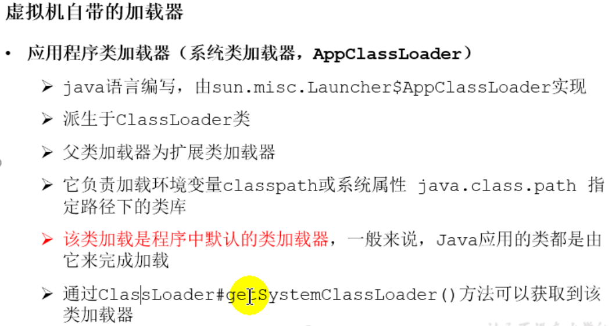

# 2. 类加载子系统

## 2.1 内存结构概述

## 2.2 类加载器与类的加载过程

### 2.2.1 类加载子系统作用

### 2.2.2 类加载器ClassLoader角色

### 2.2.3 类的加载过程

#### 2.2.3.1 类的加载过程一：Loading

#### 2.2.3.2 类的加载过程二：Linking

#### 2.2.3.3 类的加载过程三：Initialization

 ## 2.3 类加载器分类

## 2.4ClassLoader的使用说明

## 2.5 双亲委派机制

## 2.6 其他

# 