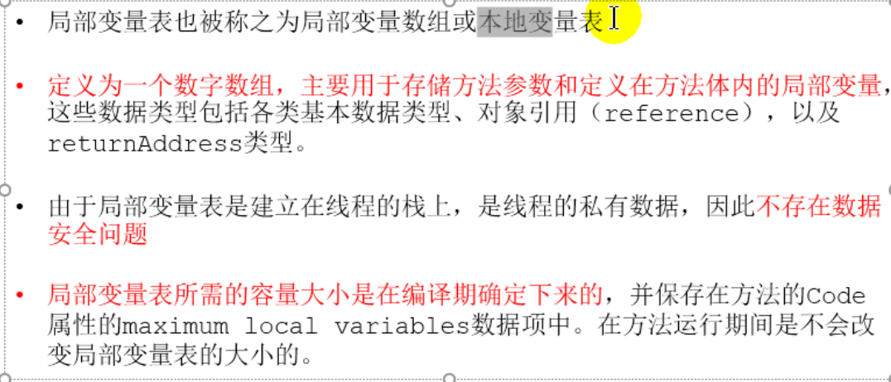

# 5. 虚拟机栈

## 5.1 虚拟机栈概述

## 5.2 栈的存储单位

## 5.3 局部变量表

## 5.4 操作数栈

## 5.5 代码追踪

## 5.6 栈顶缓存技术(Top-of-Stack Cashing)

## 5.7 动态链接

为什么需要常量池呢？

常量池的作用，就是为了提供一些符号和常量，便于指令的识别

## 5.8 方法的调用：解析与委派

### 5.9.1 虚方法与非虚方法

### 5.9.2 关于invokedynamic指令

- JVM字节码指令集一直比较稳定，一直到Java7中才增加了一个invokedynamic指令，这是Java为了实现动态类型语言支持而做的一种改进
- 但是在Java7中并没有提供直接生成invokedynamic指令的方法，需要借助ASM这种底层字节码工具来产生invokedynamic指令。直到Java8的Lambda表达式的出现，invokeddynamic指令的生成，在Java中才有了直接的生成方式
- Java7中增加的动态语言类型支持的本质是对Java虚拟机规范的修改，而不是对Java语言规则的修改，这一块相对来讲比较复杂，增加了虚拟机的方法调用，最直接的受益者就是运行在Java平台的动态语言的编译器。

**动态类型语言和静态类型语言**

动态类型语言和静态类型语言两者的区别就在于对类型的检查是在编译期还是在运行期，满足前者就是静态类型语言，反之是动态类型语言。

说的再直白一点就是，静态类型语言是判断变量自身的类型信息；动态类型语言是判断变量值的类型信息，变量没有类型信息，变量值才有类型信息，这是动态语言的一个重要特征。

### 5.9.3 方法重写的本质

1. 找到操作数栈顶的第一个元素所执行的对象的实际类型，记作C
2. 如果在类型C中找到与常量中的描述符和简单名称都相符的方法，则进行访问权限校验，如果通过则返回这个方法的直接引用，查找过程结束；如果不通过，则返回`java.lang.IllegalAccessError`异常
3. 否则，按照继承关系从下往上依次对C的各个父类进行第2步的搜索和验证过程。
4. 如果始终没有找到合适的方法，则抛出`java.lang.AbstractMethodError`异常

IllegalAccessError介绍：

程序视图访问或修改一个属性或调用一个方法，这个属性或方法，你没有权限访问。一般的，这个会引起编译器异常。这个错误如果发生在运行时，就说明一个类发生了不兼容的改变。

### 5.9.4 虚方法表

- 在面向对象的编程中，会很频繁地使用到动态分派，如果在每次动态分派的过程中都要重新在类的方法元数据中搜索合适的目标的话就可能影响到执行效率。因此，为了提高性能，JVM采用在类的方法区建立一个虚方法表(virtual method table)(非虚方法不会出现在表中)来实现。使用索引表来代替查找

- 每个类中都有一个虚方法表，表中存放这各个方法的实际入口

- 那么虚方法表什么时候被创建？

  虚方法表会在类加载的连接阶段被创建并开始初始化，类的变量初始值准备完成之后，JVM会把

## 5.9 方法返回地址(Return Address)

**该看61**

## 5.10 一些附加信息

## 5.11 栈的相关面试题

**从61跳到134先看垃圾回收**

# 