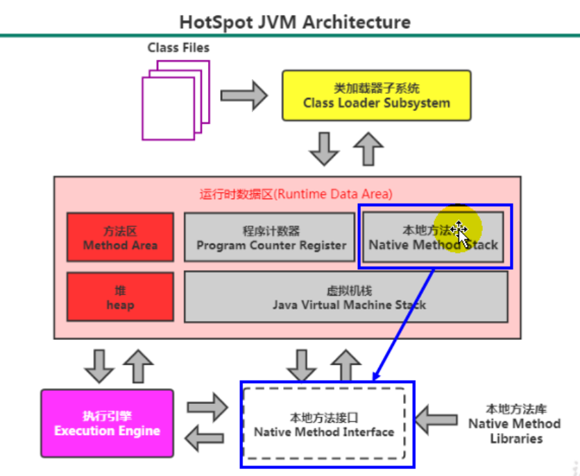
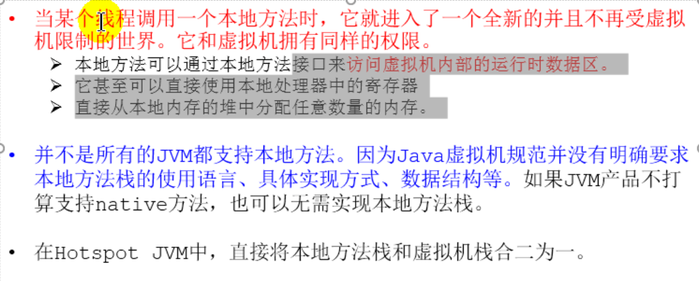

# 7.本地方法栈

- Java虚拟机用于管理Java方法的调用，而本地方法栈用于管理本地方法的调用
- 本地方法栈也是线程私有的
  允许被实现成固定或者可动态扩展的内存大小(在内存溢出方面是相同的)
  - 如果线程请求分配的栈容量超过本地方法栈允许的最大容量，Java虚拟机将会抛出一个StackOverflowError异常
  - 如果本地方法栈可以动态扩展，并且在尝试扩展的时候无法申请到足够的内存，或者在创建新的线程时没有足够的内存去创建对应的本地方法栈，那么Java虚拟机将会抛出一个OutOfMemoryError异常
- 本地方法是使用C语言实现的
- 它的具体做法是Native Method Stack中登记native方法，在Execution Engine执行时加载本地方法库

