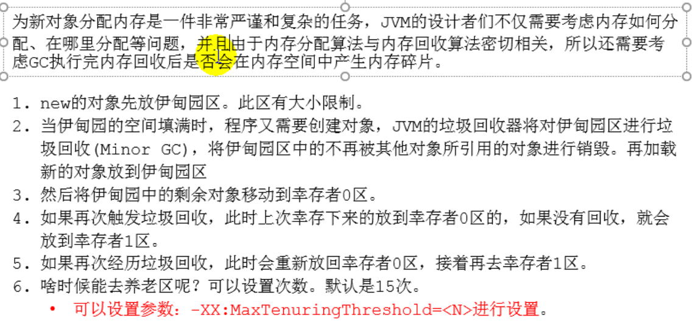

# 8.堆

## 8.1 堆的核心概述

### 8.1.1 堆的细分内存结构

## 8.2 设置堆内存大小与OOM

### 8.2.1 堆空间大小的设置

### 8.2.2 OutOfMemory举例

## 8.3 年轻代与老年代

## 8.4 图解对象分配过程

### 8.4.1 对象分配过程：概述

### 8.4.2 总结

### 8.4.3 对象分配的特殊情况

### 8.4.4 常用调优工具

## 8.5 Minor GC、Major GC、Full GC

### 8.5.1 最简单的分代式GC策略的触发条件

## 8.6 堆空间分代思想

## 8.7 内存分配策略(对象提升(Promotion)规则)

## 8.8 为对象分配内存：TLAB

## 8.9 小结堆空间的参数设置

## 8.10 堆是分配对象的唯一选择吗

### 8.10.1 逃逸分析概述

### 8.10.2 逃逸分析：代码优化

### 8.10.3 代码优化之栈上分配

### 8.10.4 代码优化之同步省略(消除)

### 8.10.5 代码优化之标量替换

## 8.11 代码优化及堆的小结

