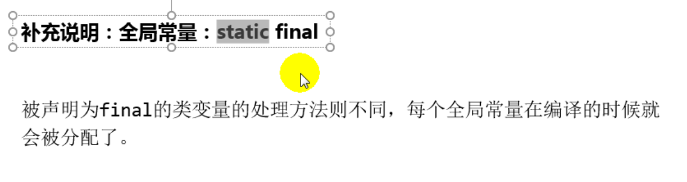
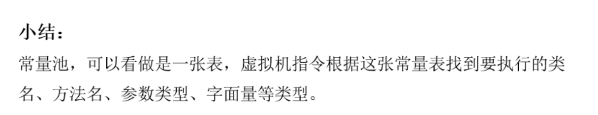

# 9.方法区

## 9.1 栈、堆、方法区的交互关系

### 9.1.1 运行时数据区结构图

### 9.1.2 堆、栈、方法区的交互关系

## 9.2 方法区的理解

### 9.2.1 官方文档

### 9.2.2 方法区在哪里

### 9.2.3 Hotspot中方法区的演进

## 9.3 设置方法区大小与OOM

### 9.3.1 设置方法区内存的大小

### 9.3.2 OOM的代码例子

### 9.3.3 如何解决OOM

## 9.4 方法区的内部结构

### 9.4.1 方法区(Method Area)存储什么

### 9.4.2 类型信息

### 9.4.3 域(Field)信息

### 9.4.4 方法(Method)信息

### 9.4.5 non-final的类变量

### 9.4.6 运行时常量池VS常量池

### 9.4.7 为什么需要常量池

### 9.4.8 常量池中有什么

### 9.4.9 运行时常量池

## 9.5 方法区使用举例

## 9.6 方法区的演进细节

## 9.6.1 永久代为什么要被元空间替换？

### 9.6.2 StringTable为什么要调整

### 9.6.3 静态变量放在哪

## 9.7 方法区的垃圾回收

## 9.8 总结

### 9.8.1 常见面试题

