[TOC]

# 1.JVM与Java体系结构

## 1.1 JVM的整体结构

+ HotSpot VM

## 1.2 JVM的架构模型

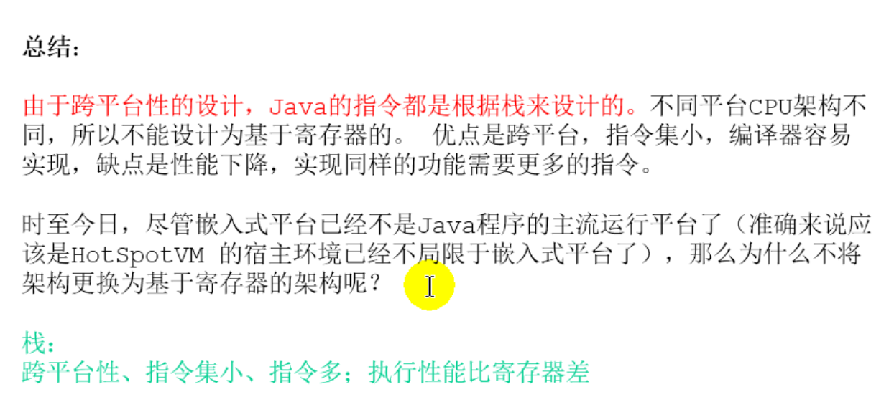

## 1.3 JVM的生命周期

## 1.4 JVM的发展历程(虚拟机的种类)

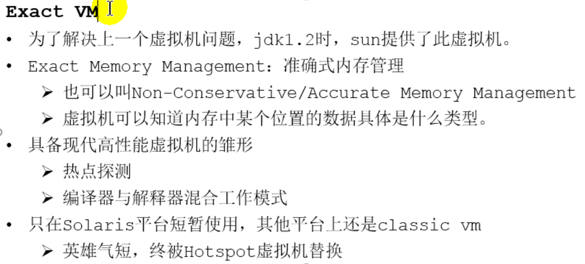

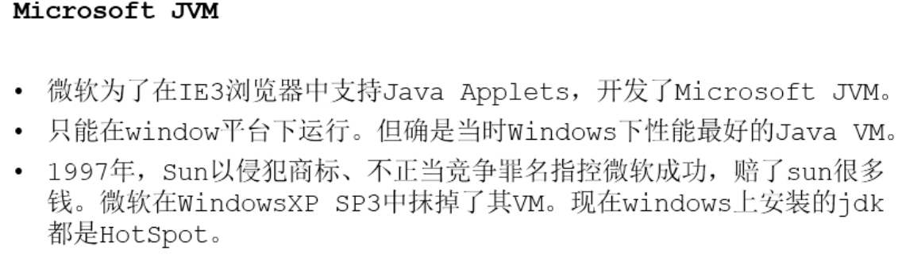

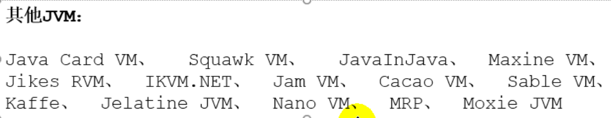

# 2. 类加载子系统

## 2.1 内存结构概述

## 2.2 类加载器与类的加载过程

### 2.2.1 类加载子系统作用

### 2.2.2 类加载器ClassLoader角色

### 2.2.3 类的加载过程

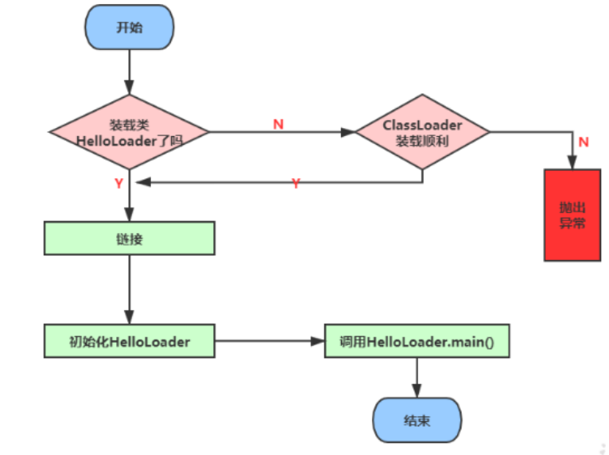

#### 2.2.3.1 类的加载过程一：Loading

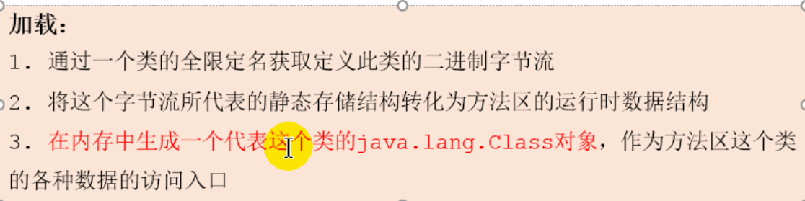

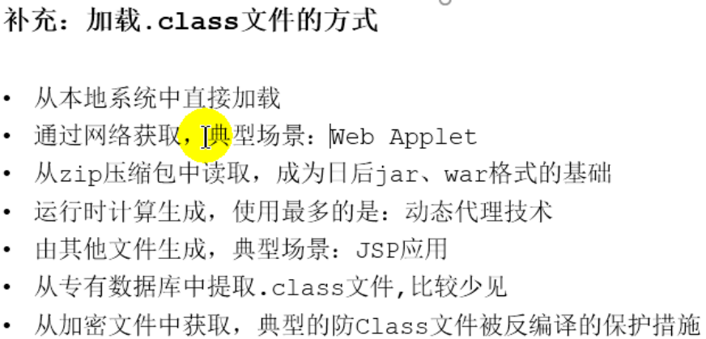

#### 2.2.3.2 类的加载过程二：Linking

#### 2.2.3.3 类的加载过程三：Initialization

 ## 2.3 类加载器分类

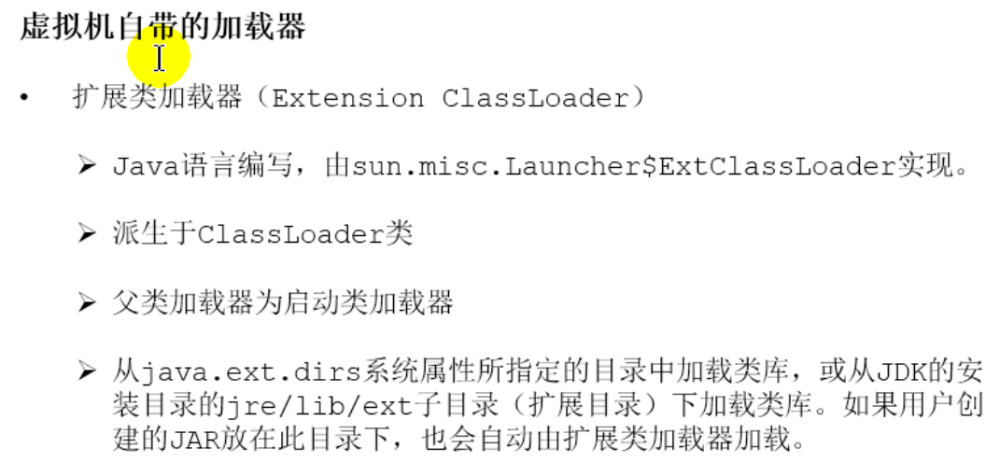

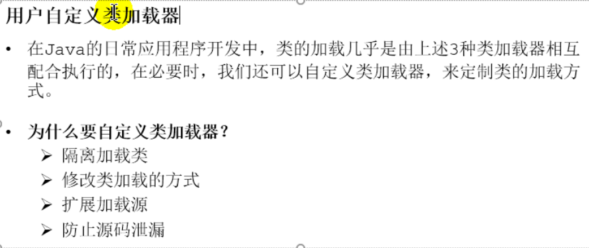

## 2.4ClassLoader的使用说明

## 2.5 双亲委派机制

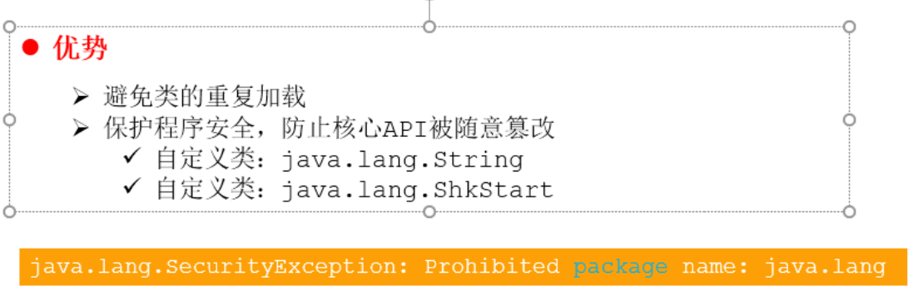

## 2.6 其他

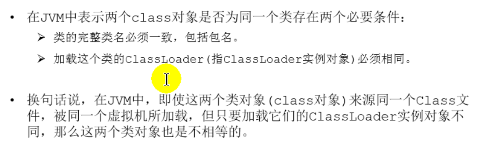

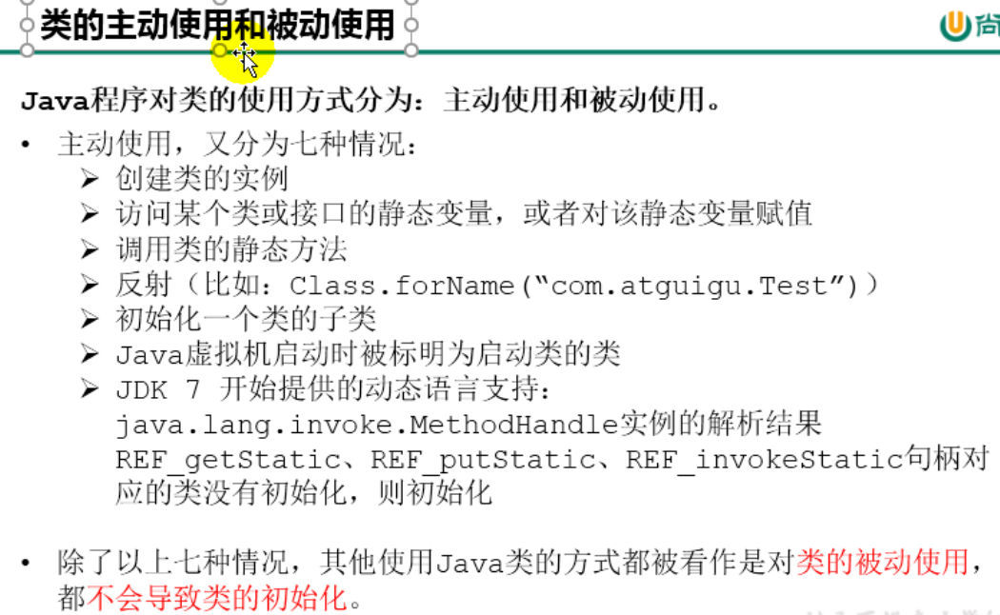

# 3. 运行时数据区及线程

## 3.1 概述

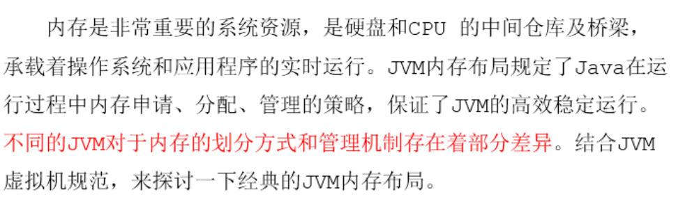

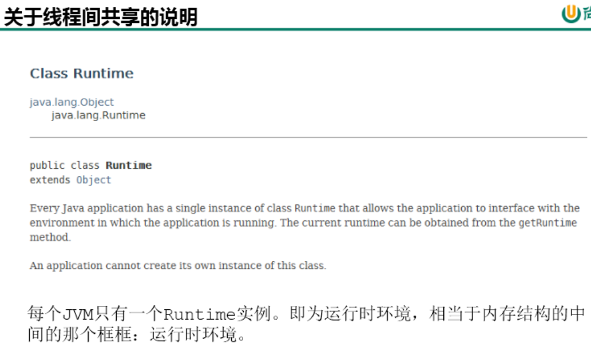

## 3.2 线程

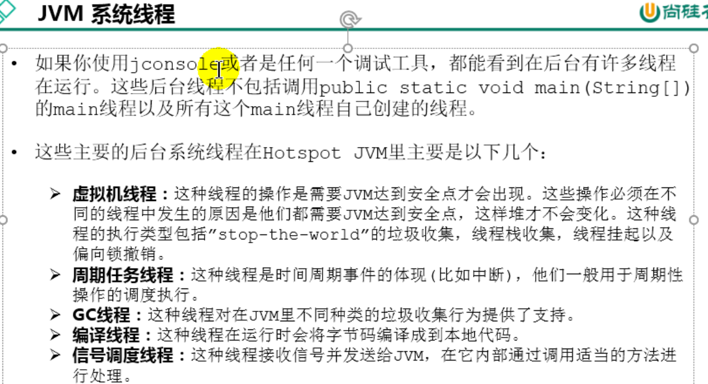

# 4. 程序计数器

## 4.1 PC Register介绍

 

## 4.2 举例说明

## 4.3 两个常见问题

注意上图中两个问题是同一个问题，只是问法不一样

# 5. 虚拟机栈

## 5.1 虚拟机栈概述

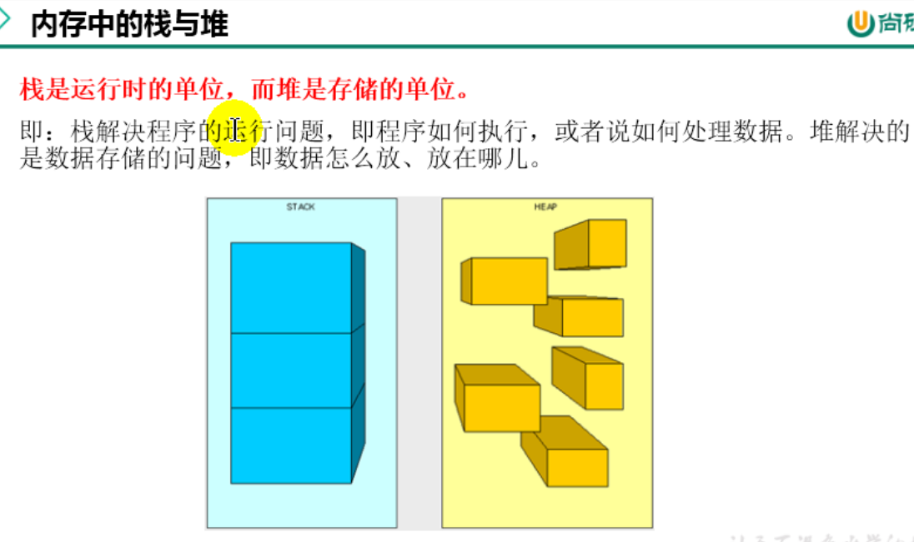

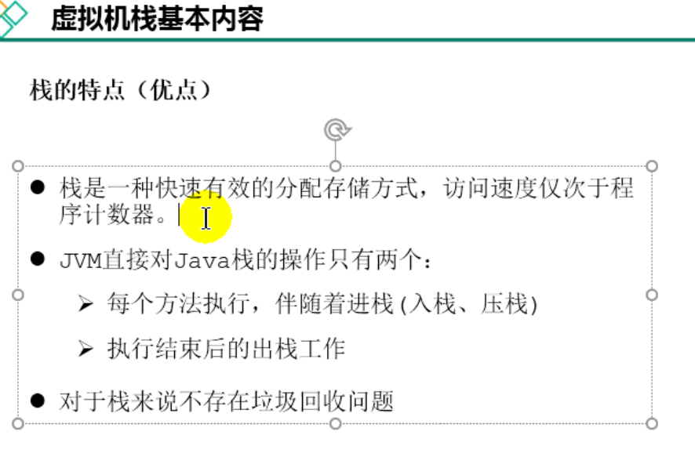

## 5.2 栈的存储单位

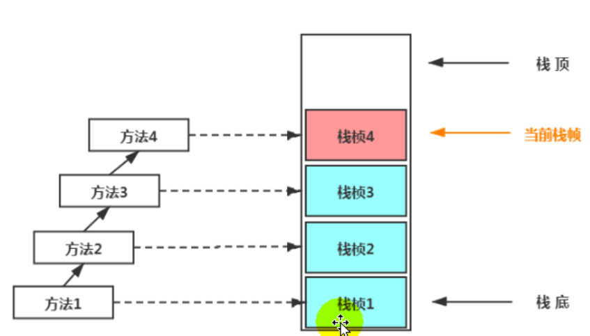

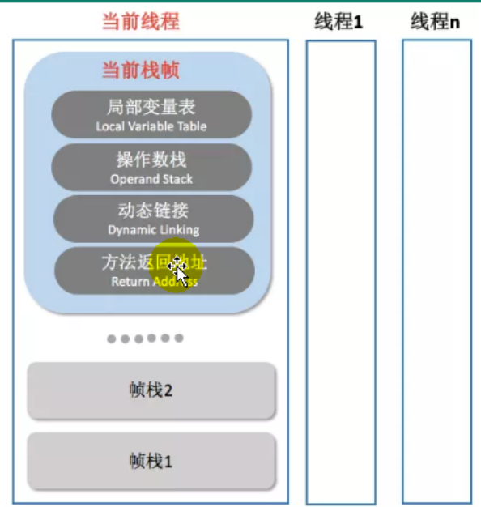

## 5.3 局部变量表

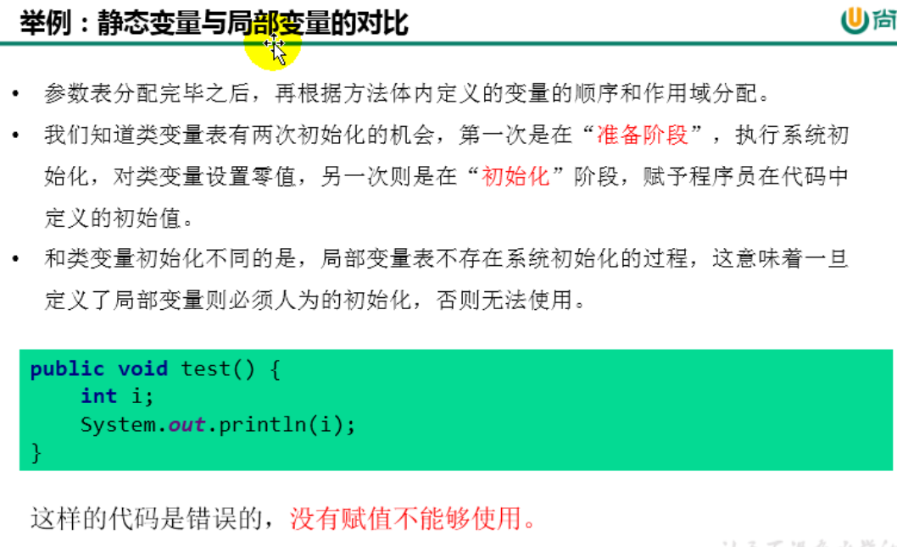

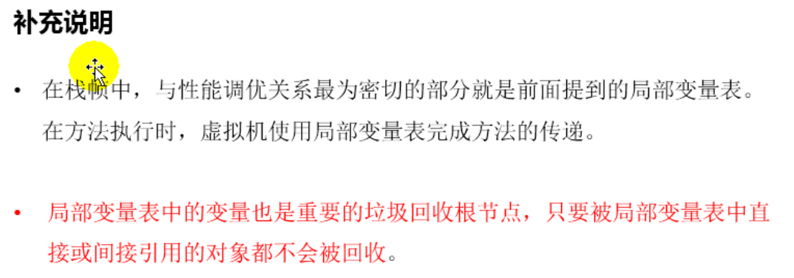

## 5.4 操作数栈

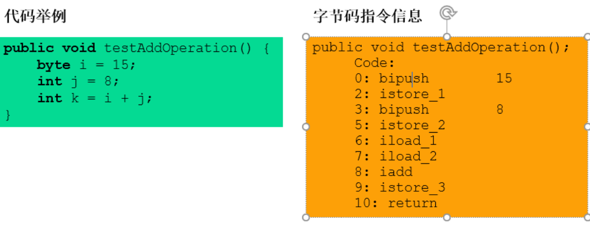

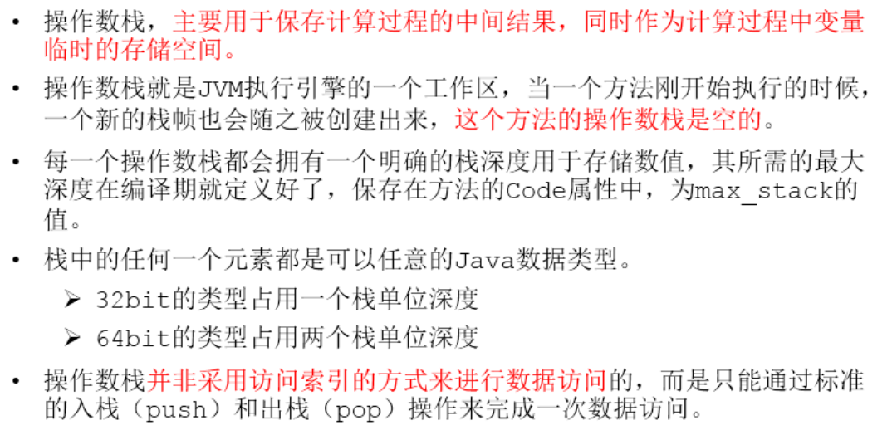

## 5.5 代码追踪

## 5.6 栈顶缓存技术(Top-of-Stack Cashing)

## 5.7 动态链接

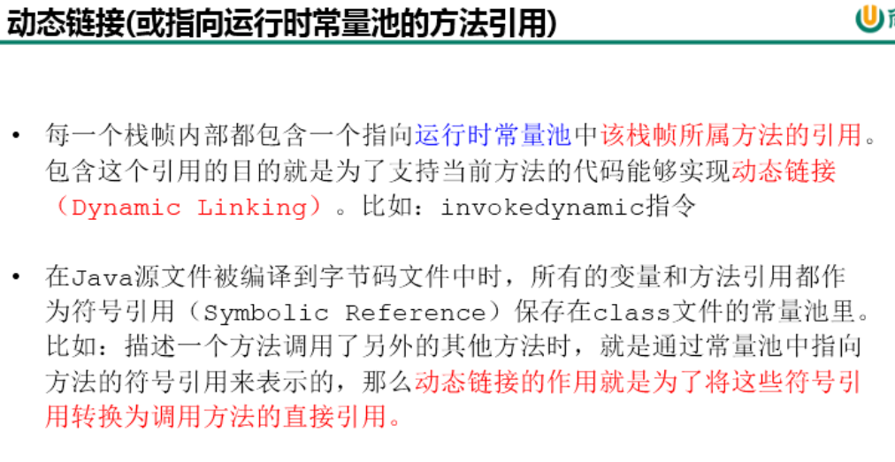

该看56

## 5.8 方法的调用：解析与委派

## 5.9 方法返回地址

## 5.10 一些附加信息

## 5.11 栈的相关面试题

