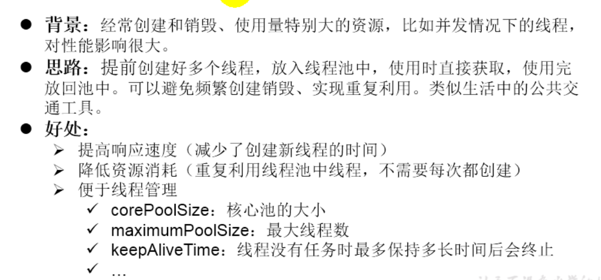
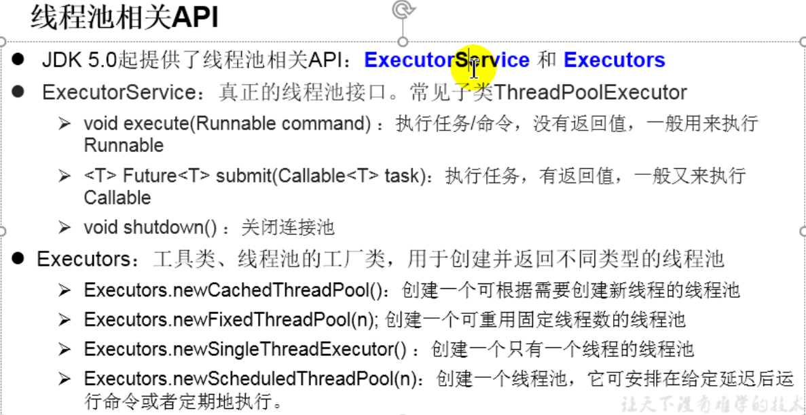
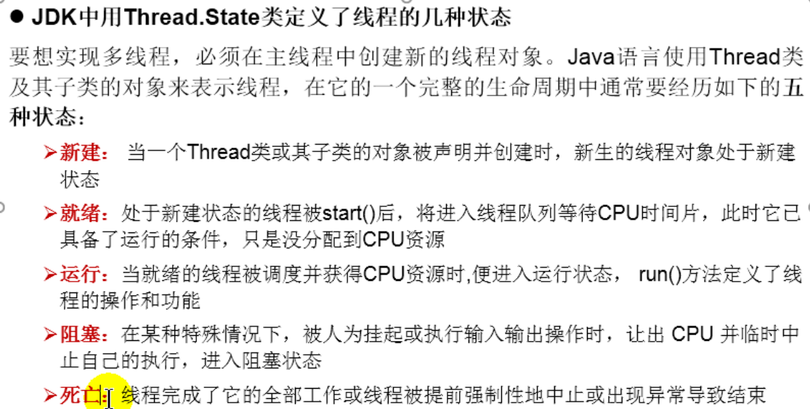
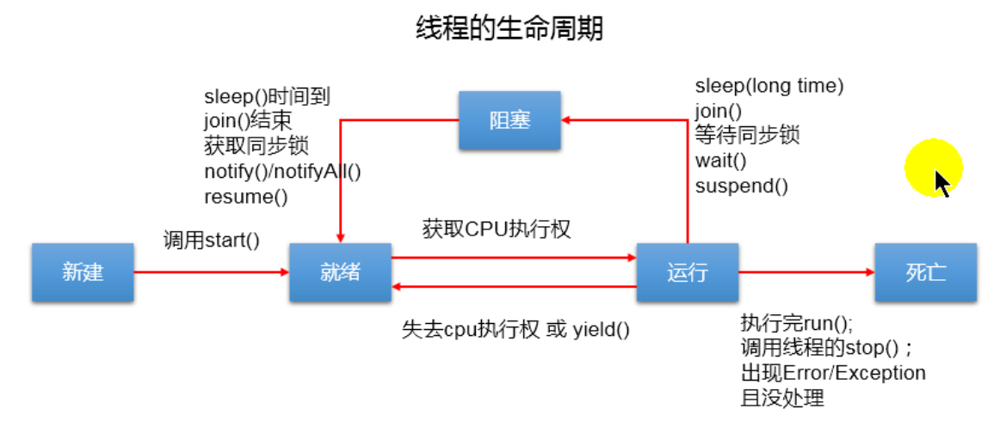
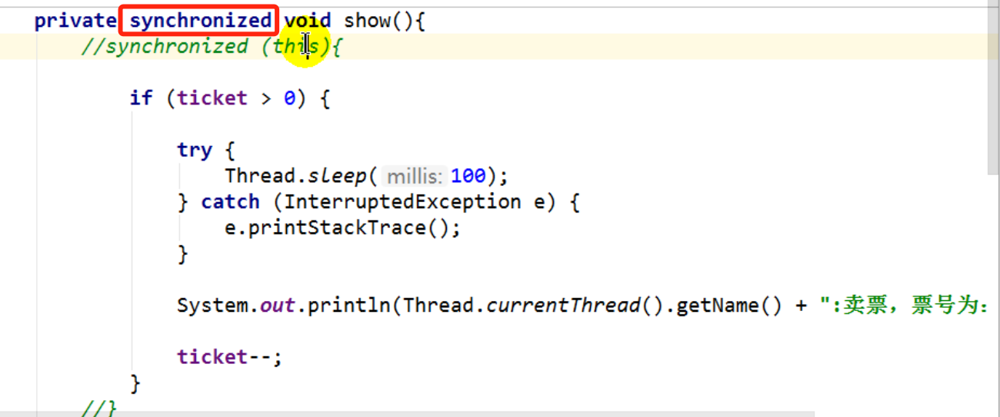
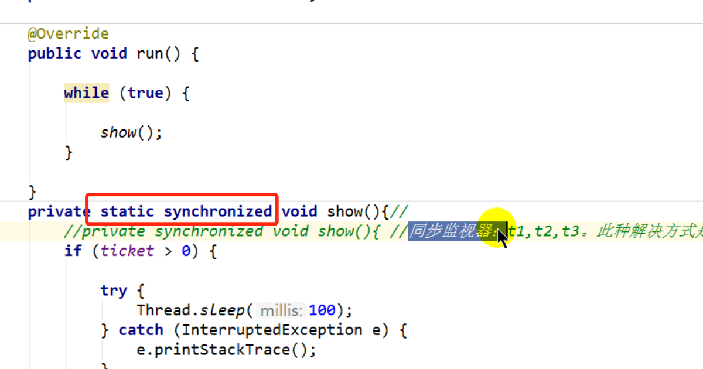
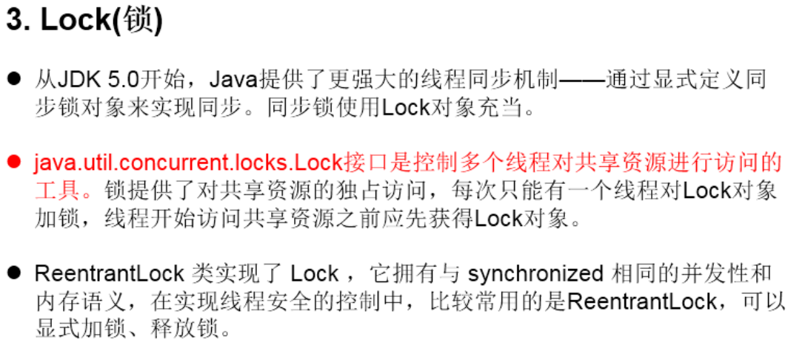
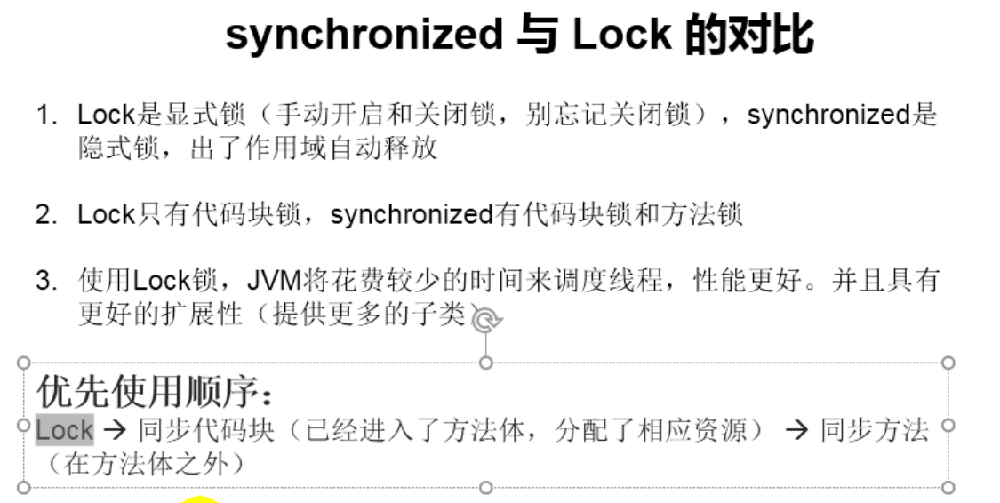
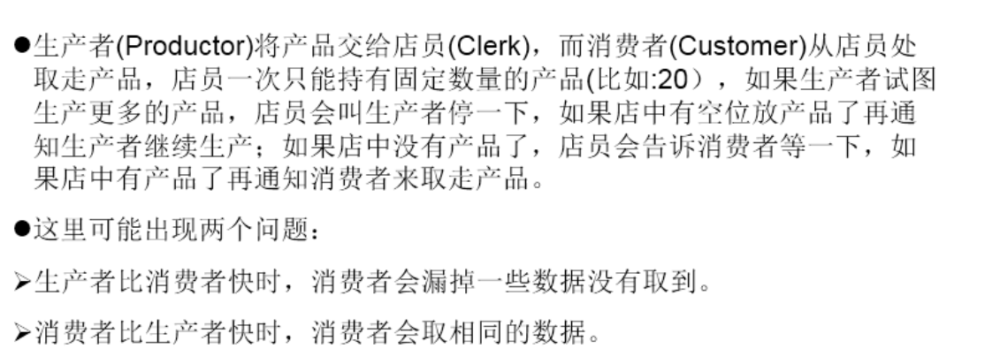

[TOC]


# 1.线程的创建和使用

## 1.1 创建方式1 继承Thread类


1. 创建一个继承于Thread类的子类
2. 重写Thread类的run()
3. 创建Thread类的子类的对象
4. 通过此对象调用start()


注意不能直接调用对象的run()方法

### 1.1.1 Thread类中常用的方法


### 1.1.2 线程的调度


### 1.1.3 通过继承Thread类的方式创建线程的示例代码

```java
class MyThread extends Thread {
    @Override
    public void run() {
        for (int i = 0; i < 100; i++) {
            if (i % 2 == 0) {
                System.out.println(i);
            }
        }
    }
}

public class ThreadDemo {
    public static void main(String[] args) {
        MyThread t1 = new MyThread();
        t1.start();
    }
}
```


## 1.2 实现Runnable接口

### 1.2.1 步骤

1. 创建一个实现了Runnable接口的类
2. 实现类去实现Runnable中的抽象方法:run()
3. 创建实现类的对象
4. 将此对象作为参数传递到Thread类的构造器中，创建Thread类的对象
5. 通过Thread类的对象调用start()

### 1.2.2 示例代码

```java
class MThread implements Runnable {

    public void run() {
//        遍历100以内的偶数
        for (int i = 0; i < 100; i++) {
            if (i % 2 == 0) {
                System.out.println(i);
            }
        }
    }
}

public class ThreadDemo2 {
    public static void main(String[] args) {
        MThread mThread = new MThread();
        Thread t1 = new Thread(mThread);
        t1.start();
    }
}
```

## 1.3 创建线程两种方式对比

在通过继承Thread类和实现Runnable接口两种创建线程的方式中，在开发时优先选择实现Runnable接口的方式，原因如下：

1. 实现的方式没有类的单继承性的局限性
2. 实现的方式更适合来处理多个线程有共享数据的情况

两种方式的联系

Thread类本身也实现了Runnable接口

相同点：两种方式都需要重写run()


## 1.4 实现Callable接口

这种方式是JDK5.0新增的创建线程的方式


```java
class NumThread implements Callable {

    public Object call() throws Exception {
        int sum = 0;
        for (int i = 0; i <= 100; i++) {
            if (i % 2 == 0) {
                System.out.println(i);
                sum += i;
            }

        }
        return sum;
    }
}

public class ThreadNew {

    public static void main(String[] args) {
        NumThread numThread = new NumThread();
        FutureTask futureTask = new FutureTask(numThread);
        new Thread(futureTask).start();
        try {
//            get()返回值即为FutureTask构造器参数Callable实现类重写的call()的返回值
            Object sum = futureTask.get();
            System.out.println("总和为:" + sum);
        } catch (InterruptedException e) {
            e.printStackTrace();
        } catch (ExecutionException e) {
            e.printStackTrace();
        }
    }
}
```

**如何理解实现Callable接口的方式创建多线程比实现Runnable接口创建多线程要强大**

1. call()可以有返回值
2. call()可以抛出异常,被外面的操作捕获，获取异常信息
3. Callable是支持泛型的

## 1.5 使用线程池

这种方式也是JDK5.0新增的





```java
class NumberThread implements Runnable {

    public void run() {
        for (int i = 0; i <= 100; i++) {
            if (i % 2 == 0) {
                System.out.println(Thread.currentThread().getName() + ":" + i);
            }


        }
    }
}

class NumberThread2 implements Runnable {

    public void run() {
        for (int i = 0; i <= 100; i++) {
            if (i % 2 != 0) {
                System.out.println(Thread.currentThread().getName() + ":" + i);
            }


        }
    }
}

public class ThreadPool {
    public static void main(String[] args) {
        ExecutorService service = Executors.newFixedThreadPool(10);
        service.execute(new NumberThread());//适合适用于Runnable
        service.execute(new NumberThread2());//适合适用于Runnable
//        service.submit();//适合适用于Callable

//        关闭线程池
        service.shutdown();

    }
}
```


# 2. 线程的生命周期






# 3. 线程的同步

## 3.1 同步代码块

使用同步代码块处理实现Runnable的线程安全问题

```java
synchronized(同步监视器){
  //需要被同步的代码
}
```

**说明**：操作共享数据的代码，即为需要被同步的代码

**共享数据**：多个线程共同操作的变量

**同步监视器**：俗称锁，任何一个类的对象都可以充当锁，要求：多个线程必须要共用同一把锁


使用同步代码块处理继承Thread类的线程安全问题步骤同上，需要注意：在继承Thread类创建多线程的方式中，慎用this充当同步监视器，考虑使用当前类充当同步监视器


## 3.2 同步方法

**使用同步方法解决实现Runnable接口的线程安全问题**

如果操作共享数据的代码完整地声明在一个方法中，我们不妨将此方法声明成同步的。



在同步方法中的同步监视器是`this`

**使用同步方法解决继承Thread类的线程安全问题**



此时的同步监视器是当前类

**关于同步方法的总结：**

1. 同步方法仍然涉及到同步监视器，只是不需要我们显式地声明
2. 非静态的同步方法，同步监视器是`this`,静态的的同步方法，同步监视器是当前类本身


# 4. 线程安全

## 4.1 单例模式-懒汉式

使用同步机制将单例模式中的懒汉式改写为线程安全的

### 4.1.1 方式1

```java
class Bank {
    private Bank() {
    }

    private static Bank instance = null;

    public static synchronized Bank getInstance() {
        if (instance == null) {
            instance = new Bank();
        }
        return instance;
    }
}
```

```java
class Bank2 {
    private Bank2() {
    }

    private static Bank2 instance = null;
    public static Bank2 getInstance() {
        synchronized (Bank2.class) {
            if (instance == null) {
                instance = new Bank2();
            }
            return instance;
        }
    }
}
```

两种方式是一样的，性能稍差

### 4.1.2 方式2

```java
class Bank2 {
    private Bank2() {
    }

    private static Bank2 instance = null;

    public static Bank2 getInstance() {
        if (instance == null) {
            synchronized (Bank2.class) {
                if (instance == null) {
                    instance = new Bank2();
                }
            }
        }
        return instance;
    }
}
```

方式2的效率比方式1的效率要高一些


## 4.2 线程的死锁问题


## 4.3 Lock锁解决线程安全问题



```java
class Window implements Runnable {
    private int ticket = 100;
    private ReentrantLock lock = new ReentrantLock();

    public void run() {
        while (true) {
            try {
                lock.lock();
                if (ticket > 0) {
                    try {
                        Thread.sleep(100);
                    } catch (InterruptedException e) {
                        e.printStackTrace();
                    }
                    System.out.println(Thread.currentThread().getName() + ":售票，票号为:" + ticket);
                    ticket--;
                } else {
                    break;
                }
            } finally {
                lock.unlock();
            }
        }
    }
}

public class LockTest {

    public static void main(String[] args) {

        Window w = new Window();
        Thread t1 = new Thread(w);
        Thread t2 = new Thread(w);
        Thread t3 = new Thread(w);
        t1.setName("窗口1");
        t2.setName("窗口2");
        t3.setName("窗口3");

        t1.start();
        t2.start();
        t3.start();
    }
}
```

**面试题:synchronized与Lock的异同**

相同点：二者都可以解决线程安全问题

不同点：synchronized机制在执行完相应的同步代码以后，自动的释放同步监视器，Lock需要手动的启动同步(lock()),同时结束同步也需要手动地实现(unlock())



**解决线程安全的方法有几种？**

3种：同步代码块、同步方法、Lock


# 5. 线程通信

## 5.1 交替打印

线程通信的例子：

使用两个线程打印1-100。线程1，线程2交替打印

```java
class Number implements Runnable {
    private int number = 1;

    public void run() {
        while (true) {
            synchronized (this) {
                notify();
                if (number <= 100) {
                    try {
                        Thread.sleep(10);
                    } catch (InterruptedException e) {
                        e.printStackTrace();
                    }
                    System.out.println(Thread.currentThread().getName() + ":" + number);
                    number++;
                    try {
                        wait();
                    } catch (InterruptedException e) {
                        e.printStackTrace();
                    }
                } else {
                    break;
                }
            }
        }

    }
}

public class CommucationTest {
    public static void main(String[] args) {
        Number number = new Number();
        Thread t1 = new Thread(number);
        Thread t2 = new Thread(number);
        t1.setName("线程1");
        t2.setName("线程2");
        t1.start();
        t2.start();
    }
}
```

wait():一旦执行此方法，线程就进入阻塞状态，并释放同步监视器

notify():一旦执行此方法，就会唤醒被wait的一个线程。如果有多个线程被wait,就唤醒优先级高的

notifyAll():一旦执行此方法，就会唤醒所有被wait的线程

**注意：**

1. wait(),notify(),notifyAll()三个方法必须使用在同步代码块或者同步方法中
2. wait(),notify(),notifyAll()三个方法的调用者必须是同步代码块或同步方法中的同步监视器，否则会出现IllegalMonitorStateexception异常
3. wait(),notify(),notifyAll()三个方法是定义在java.lang.Object类中的

**面试题：sleep()和wait()的异同**

相同点：一旦执行方法，都可以使得当前的线程进入阻塞状态

不同点：

1. 声明的位置不同，`Thread`类中声明`sleep()`,`Object`类中声明`wait()`
2. 调用的要求不同:`sleep()`可以在任何需要的场景下调用。wait()必须使用在同步代码块或同步方法中
3. 关于是否释放同步监视器:如果两个方法都使用在同步代码块或同步方法中，`sleep()`不会释放锁，`wait()`会释放锁

## 5.2 生产者消费者问题



```java
class Clerk {
    private int productCount = 0;

    //    生产产品
    public synchronized void produceProduct() {
        if (productCount < 20) {
            productCount++;
            System.out.println(Thread.currentThread().getName() + "开始生产第" + productCount + "个产品");
            notify();
        } else {
            try {
                wait();
            } catch (InterruptedException e) {
                e.printStackTrace();
            }

        }
    }

    //消费产品
    public synchronized void consumeProduct() {
        if (productCount > 0) {
            System.out.println(Thread.currentThread().getName() + ":开始消费第" + productCount + "个产品");
            productCount--;
            notify();
        } else {
            try {
                wait();
            } catch (InterruptedException e) {
                e.printStackTrace();
            }
        }
    }
}

class Producer extends Thread {
    private Clerk clerk;

    public Producer(Clerk clerk) {
        this.clerk = clerk;
    }

    @Override
    public void run() {
        System.out.println(getName() + ":开始生产产品...");
        while (true) {
            try {
                Thread.sleep(10);
            } catch (InterruptedException e) {
                e.printStackTrace();
            }
            clerk.produceProduct();
        }

    }
}

class Consumer extends Thread {
    private Clerk clerk;

    public Consumer(Clerk clerk) {
        this.clerk = clerk;
    }

    @Override
    public void run() {
        System.out.println(getName() + ":开始消费产品...");
        while (true) {
            try {
                Thread.sleep(10);
            } catch (InterruptedException e) {
                e.printStackTrace();
            }
            clerk.consumeProduct();
        }
    }
}

public class ProductTest {
    public static void main(String[] args) {
        Clerk clerk = new Clerk();
        Producer p1 = new Producer(clerk);
        p1.setName("生产者1");
        Consumer c1 = new Consumer(clerk);
        c1.setName("消费者1");
        p1.start();
        c1.start();
    }
}
```


