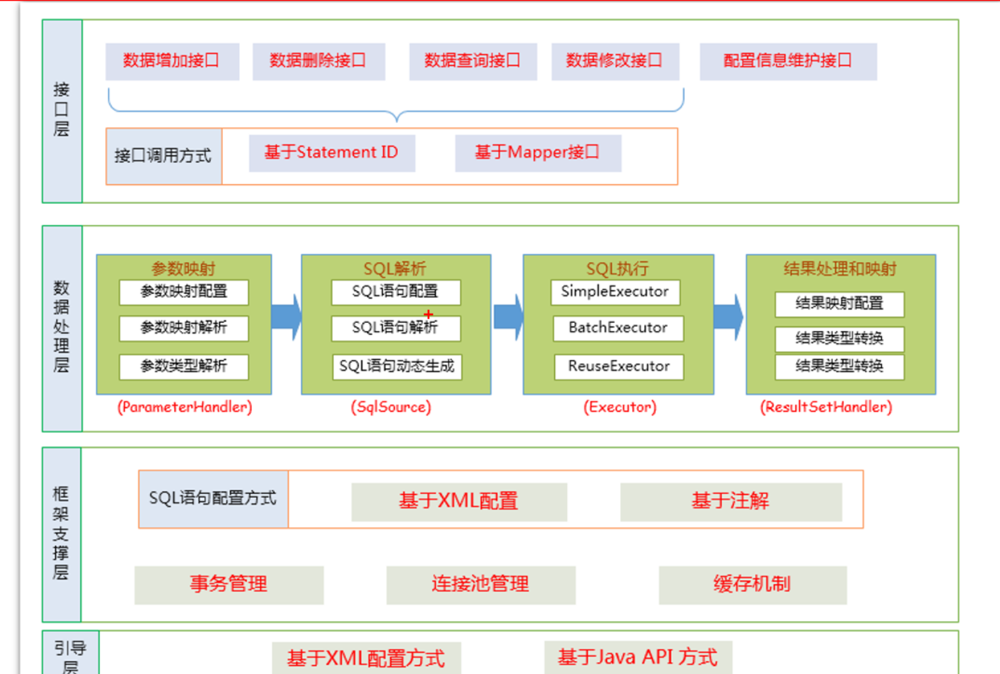
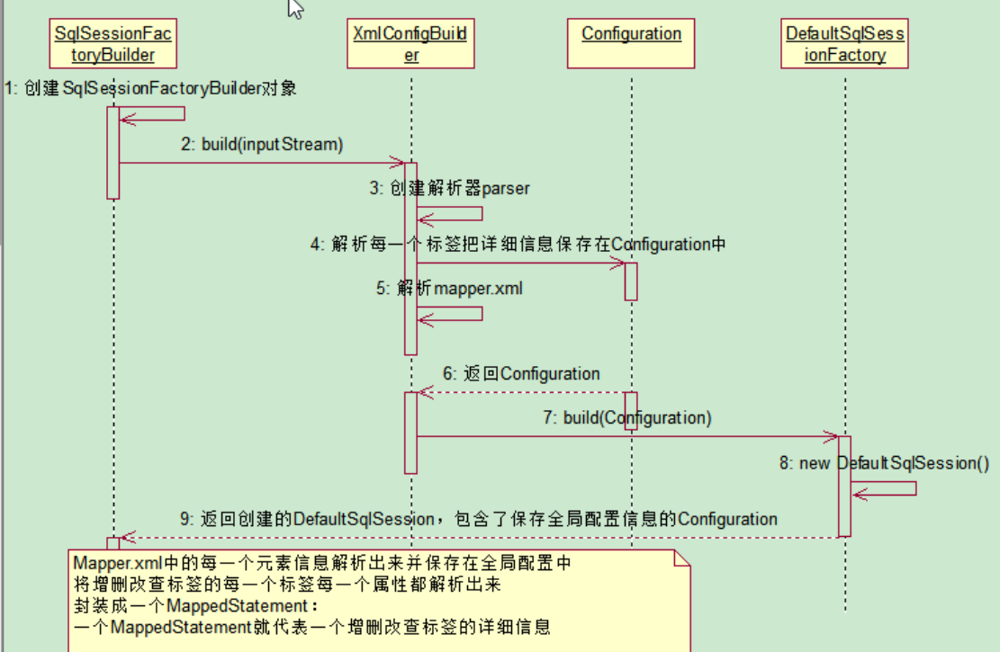
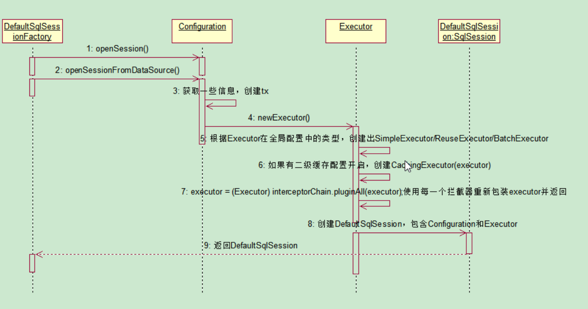
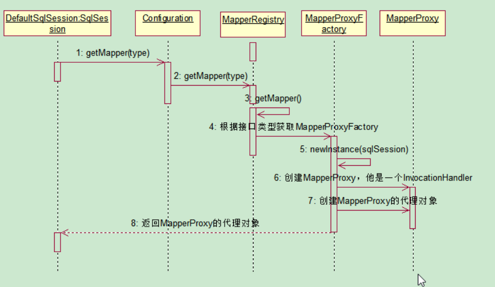
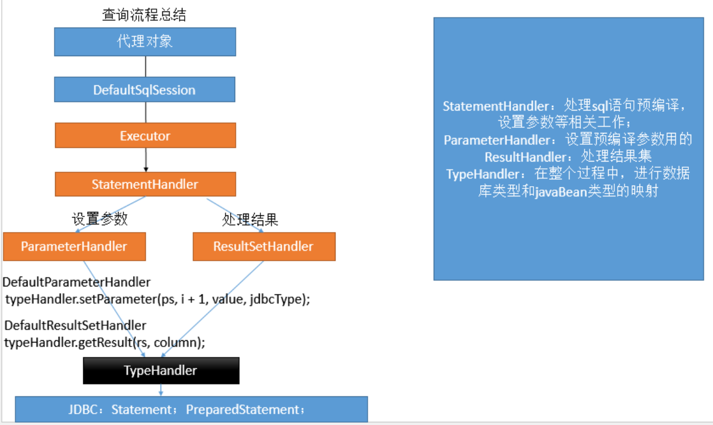
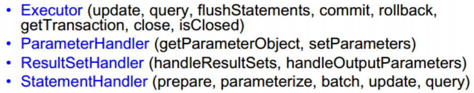

[TOC]

# 1. 简介

Hibernate:全自动全映射ORM(Object Relation Mapping)框架；旨在消除sql

- 长难复杂SQL,对于Hibernate而言处理也不容易
- 内部自动产生的SQL，不容易做特殊优化
- 基于全映射的全自动框架，大量字段的POJO进行部分映射时比较困难。导致数据库性能下降

MyBatis:半自动，轻量级的持久化层框架

JDBC:

- SQL夹在Java代码里，耦合度高导致硬编码内伤
- 维护不易且实际开发需求中SQL是有变化，频繁修改的情况多见


# 2.快速入门

## 2.1 官方文档

https://mybatis.org/mybatis-3/zh/getting-started.html

## 2.1 使用步骤

1. 根据`xml`配置文件(全局配置文件)创建一个`SqlSessionFactory`对象，该配置文件中有数据源一些运行环境信息
2. 编写`SQL`映射文件:配置了每一个`SQL`以及`SQL`的封装规则
3. 将`SQL`映射文件注册在全局配置文件中
4. 写代码
   - 根据全局配置文件得到`SqlSessionFactory`
   - 使用`sqlSessoin`工厂获取到`sqlSession`对象，是用该对象来执行增删改查，一个`sqlSession`就是代表和数据库的一次会话，用完需要关闭
   - 使用`SQL`的唯一标识来告诉`MyBatis`执行哪个`SQL`. `SQL`都是保存在`SQL`映射文件中的

几点说明:

- `SqlSession`代表和数据库的一次会话，用完必须关闭
- `SqlSession`和`connection`一样都是非线程安全的，每次使用都应该去获取新的对象
- `mapper`接口没有实现类，但是`mybatsi`会为这个接口生成一个代理对象，前提是将接口和`xml`文件进行绑定
- 两个重要的配置文件
  - `mybatis`全局配置文件，包含数据库是连接池信息，事务管理器信息...系统运行环境信息
  - `SQL`映射文件:保存了每一个`SQL`语句的映射信息，`mybatis`通过这个文件将`sql`抽取出来


# 3. 全局配置文件内容解析

## 3.1 `properties`

`mybatis`可以使用`properties`来引入外部`properties`配置文件的内容：

- resource:引入类路径下的资源
- url:引入网络路径或者磁盘路径下的资源


## 3.2 `settings`

`settings`包含很多重要的设置项

- `setting`用来设置每一个设置项
  - `name`:设置项名
  - `value`:设置项取值

## 3.3 `typeAliases`

别名处理器，可以为`java`类型起别名，注意**别名不区分大小写**

- `type`

  指定要起别名的类型全类名；默认别名就是类型小写

- `alias`

  指定新的别名

- `package`

  为某个包下的所有类批量起别名

  - name

    指定包名(为当前包以及下面所有的后代包的每一个类都起一个默认别名(类名小写))

## 3.4 `environments`

`mybatis`可以配置多种环境

`environment`：配置一个具体的环境信息，必须包含以下两个标签

- `transactionManager`

  事务管理器

  - type

    配至爱事务管理器的类型

- `dataSource`


## 3.5 `databaseIdProvider`

支持多数据库厂商

- `type="DB_VENDOR"`

  作用是得到数据库厂商的标识(驱动)，`mybatis`就能根据数据库厂商标识来执行不同的`SQL`

  

  

## 3.6 `mappers`

将`sql`映射注册到全局配置中

- `mapper`

  注册一个`sql`映射

  - `resource`	(注册配置文件用)

    引用类路径下的`sql`映射文件

  - `url`(注册配置文件用)

    引用网络路径或磁盘下的`sql`映射文件

  - `class`

    引用(注册)接口

    条件：

    有`sql`映射文件，映射文件名必须和接口同名，并且放在与接口同一目录下

    没有`sql`映射文件，所有的`sql`都是利用注解写在接口上

    推荐:

    比较重要的、复杂的`Dao`接口写`SQL`映射文件

    不重要、简单的`Dao`接口为了开发快速可以使用注解；


# 4. 映射文件

## 4.1 获取自增主键的值

`mysql`支持自增主键，自增主键值的获取，`mybatis`也是利用`statement.getGEnerateKeys()`  

配置`useGeneratedKeys="true"`使用自增主键获取主键值策略

`keyProperty`:指定对应的主键属性，也就是`mybatis`获取到主键值以后，将这个值封装给`javabean`的哪个属性


`oracle`不支持自增，`Oracle`使用序列来模拟自增；每次插入的数据的主键是从序列中拿到的值；如何获取到这个值？

`order="BEFORE"`:当前`sql`在插入`sql`之前运行

`order="AFTER"`:当前`sql`在插入`sql`之后运行

**`BEFORE`运行顺序:**

先运行`selectKey`查询`id`的`sql`,查出`id`值封装给`javaBean`的`id`属性

在运行插入的`sql`就可以取出`id`属性对应的值

`AFTER`的运行顺序：

先运行插入的`sql`(从序列中取出新值作为`id`),再运行`selectKey`查询`id`的`sql`

## 4.2 参数处理

### 4.2.1 单个参数

`mybatis`不会做特殊处理

`#{参数名}`:取出参数值

### 4.2.2 多个参数

`mybatis`会做特殊处理，多个参数会被封装成一个`map`,`#{}`就是从`map`中获取指定的`key`的值

格式:

`key:param1...paramN`或者参数的索引也可以

`value:传入的参数值`

### 4.2.3 命名参数

明确指定封装参数时使用的key，例如`@Param("id")`

多个参数会被封装成一个`map`

`key`：使用`@Param`注解指定的值

`value`:参数值

`#{指定的key}`:取出对应的参数值


如果多个参数正好是业务逻辑的数据模型，可以直接传入pojo

`#{属性名}`:取出传入的`pojo`的属性值

如果多个参数不是业务模型中的数据，没有对应的`pojo`,不经常使用，为了方便，可以传入`map`

如果多个参数不是业务模型中的数据，但是经常要使用， 推荐编写一个TO(Transfer Object)数据传输对象


如果是`Collection(List/Set)`类型或者是数组，也会特殊处理。也是把传入的`list`或者数组封装在`map`中

如果是`Collection`，key使用的是首字母小写的`collection`,如果是`List`还可以使用`list`作为key，如果是`Array`则使用`array`作为key，如下是一个例子

```java
public Employee getEmployeeById(List<Integer> ids);
取值：取出第一个id的值:#{list[0]}
```

### 4.2.4 通过源码来分析参数处理

```java
总结：参数多时会封装map，为了不混乱，我们可以使用@Param来指定封装时使用的key；
#{key}就可以取出map中的值；

(@Param("id")Integer id,@Param("lastName")String lastName);
ParamNameResolver解析参数封装map的；
//1、names：{0=id, 1=lastName}；构造器的时候就确定好了

	确定流程：
	1.获取每个标了param注解的参数的@Param的值：id，lastName；  赋值给name;
	2.每次解析一个参数给map中保存信息：（key：参数索引，value：name的值）
		name的值：
			标注了param注解：注解的值
			没有标注：
				1.全局配置：useActualParamName（jdk1.8）：name=参数名
				2.name=map.size()；相当于当前元素的索引
	{0=id, 1=lastName,2=2}
				

args【1，"Tom",'hello'】:

public Object getNamedParams(Object[] args) {
    final int paramCount = names.size();
    //1、参数为null直接返回
    if (args == null || paramCount == 0) {
      return null;
     
    //2、如果只有一个元素，并且没有Param注解；args[0]：单个参数直接返回
    } else if (!hasParamAnnotation && paramCount == 1) {
      return args[names.firstKey()];
      
    //3、多个元素或者有Param标注
    } else {
      final Map<String, Object> param = new ParamMap<Object>();
      int i = 0;
      
      //4、遍历names集合；{0=id, 1=lastName,2=2}
      for (Map.Entry<Integer, String> entry : names.entrySet()) {
      
      	//names集合的value作为key;  names集合的key又作为取值的参考args[0]:args【1，"Tom"】:
      	//eg:{id=args[0]:1,lastName=args[1]:Tom,2=args[2]}
        param.put(entry.getValue(), args[entry.getKey()]);
        
        
        // add generic param names (param1, param2, ...)param
        //额外的将每一个参数也保存到map中，使用新的key：param1...paramN
        //效果：有Param注解可以#{指定的key}，或者#{param1}
        final String genericParamName = GENERIC_NAME_PREFIX + String.valueOf(i + 1);
        // ensure not to overwrite parameter named with @Param
        if (!names.containsValue(genericParamName)) {
          param.put(genericParamName, args[entry.getKey()]);
        }
        i++;
      }
      return param;
    }
  }
}
```

### 4.2.5 参数值的获取

```shell
`#{}`：可以获取map中的值或者pojo对象属性的值；
`${}`：可以获取map中的值或者pojo对象属性的值；
```

`#{}`是以预编译的形式将参数设置到`sql`语句中，可以防止`sql`注入

`${}`取出的值直接拼装在`sql`语句中，会有安全问题

大多数情况下，取参数的值都应该使用`#{}`,原生`jdbc`不支持占位符(比如分表、排序都不支持占位符)的地方可以使用`${}`进行取值


`#{}`更丰富的用法(规定参数的一些规则):

```
javaType、 jdbcType、 mode（存储过程）、 numericScale、
resultMap、 typeHandler、 jdbcTypeName、 expression（未来准备支持的功能）；
```

jdbcType通常需要在某种特定的条件下被设置：
   在我们数据为null的时候，有些数据库可能不能识别mybatis对null的默认处理。比如Oracle（报错）；


## 4.3 `select`元素

`select`元素来定义查询操作

- `Id`:唯一标识符

  用来引用这条语句，需要和接口的方法名一致

- `parameterType`：参数类型

  可以不传，`MyBatis`会根据`TypeHandler`自动推断

- `resultType`:返回值类型

  别名或者全类名，如果返回的是集合，定义集合中元素的类型。不能和`resultMap`同时使用

### 4.3.1 `resultMap`自定义结果映射规则

1. 全局`setting`设置(自动映射)

   - `autoMappingBehavior`默认是`	PARTIAL`,开启自动映射的功能。唯一的要求是列名和`javaBean`属性名一致
   - 如果`autoMappingBehavior`设置为`null`则会取消自动映射
   - 数据库字段命名规范，`POJO`属性符合驼峰命名法，如`A_COLUMN->aColumn`，可以开启自动驼峰命名规则映射功能，`mapUnderscoreToCamelCase=true`

2. 自定义`resultMap`，实现高级结果集映射

3. `association`

4. `collection`

5. `鉴别器`

   `mybatis`可以使用`discriminator`判断某列的值，然后根据某列的值改变封装行为


# 5. 动态`SQL`

- 动态`SQL`是`MyBatis`强大特性之一。极大地简化我们拼装`SQL`的操作
- 动态`SQL`元素和使用`JSTL`或其他类似基于`XML`的文本处理器相似
- `MyBatis`采用功能强大的基于`OGNL`的表达式来简化操作
  - `if`
  - `choose(when,otherwise)`
  - `trim(where,set)`
  - `foreach`

注意:查询的时候如果某些条件没带，可能`sql`拼装会有问题

解决方案有如下集中:

1. 给`where`后面加上`1=1`,以后的条件都` and xxx`

2. `MyBatis`使用`where`标签来将所有的查询条件包括在内，`Mybatis`就会将`where`标签中拼装的`sql`,多出来的`and`或者`or`去掉，`where`只会去掉第一个多出来的`and`或者`or`

3. `trim`

   ```xml
   prefix="":前缀：trim标签体中是整个字符串拼串 后的结果。
         prefix给拼串后的整个字符串加一个前缀 
   prefixOverrides="":
         前缀覆盖： 去掉整个字符串前面多余的字符
   suffix="":后缀
         suffix给拼串后的整个字符串加一个后缀 
   suffixOverrides=""
         后缀覆盖：去掉整个字符串后面多余的字符
   ```


# 6. 缓存机制

`MyBatis`包含一个非常强大的查询缓存特性，它可以非常方便地配置和定制。缓存可以极大地提升查询效率

`MyBatis`系统中默认定义了两级缓存

## 6.1 一级缓存和二级缓存

1. 默认情况下，只有一级缓存(`SqlSession`级别的缓存，也称为本地缓存)开启
2. 二级缓存需要手动开启和配置，是基于`namespace`级别的缓存
3. 为了提高扩展性,`MyBatis`定义了缓存接口`Cache`。可以通过实现`Cache`接口来自定义二级缓存

### 6.1.1 一级缓存

一级缓存也叫本地缓存，是`sqlSession`级别的缓存。一级缓存是一直开启的

与数据库同一次会话期间查询到的数据会放在本地缓存中

以后如果需要获取相同的数据，直接从缓存中拿，没必要再去查询数据库

一级缓存失效的情况(没有使用到当前一级缓存的情况，效果就是还需要再向数据库发出查询):

1. `sqlSession`不同
2. `sqlSession`相同，但是查询条件不同
3. `sqlSession`相同，但是两次查询之间执行了增删改操作
4. `sqlSession`相同，但是手动清除了一级缓存

### 6.1.2 二级缓存

基于`namespace`级别的缓存，一个`namespace`对应一个二级缓存

不同`namespace`查出的数据会放在自己对应的缓存中(map)

工作机制:

1. 一个会话，查询一条数据，这个数据就会被放在当前会话的一级缓存中
2. 如果会话关闭，一级缓存中的数据会被保存到二级缓存中，新的会话查询信息就可以参照二级缓存中的内容

`eviction`:缓存的回收策略:

​	• LRU – 最近最少使用的：移除最长时间不被使用的对象。
​	• FIFO – 先进先出：按对象进入缓存的顺序来移除它们。
​	• SOFT – 软引用：移除基于垃圾回收器状态和软引用规则的对象。
​	• WEAK – 弱引用：更积极地移除基于垃圾收集器状态和弱引用规则的对象。
​	• 默认的是 LRU。

`flushInterval`:缓存刷新间隔

缓存多长时间清空一次，默认不清空，设置一个毫秒值

`readOnly`:是否只读

true：只读；mybatis认为所有从缓存中获取数据的操作都是只读操作，不会修改数据。
       mybatis为了加快获取速度，直接就会将数据在缓存中的引用交给用户。不安全，速度快
false：非只读：mybatis觉得获取的数据可能会被修改。


查出的数据都会默认先放在一级缓存中，只有会话提交或关闭以后，一级缓存中的数据才会转移到二级缓存中


## 6.2 缓存有关的设置以及属性

### 6.2.1 `cacheEnabled`

设置为`false`时表示关闭缓存(二级缓存关闭，一级缓存不关闭，一直可用)

### 6.2.2 `select`标签中的`useCache`属性

设置为`false`表示不使用缓存(一级缓存依然使用，二级缓存不使用)

### 6.2.3 增删改标签中的`flushCache`

默认值是`true`

设置为`true`表示增删改执行完成后就会清除缓存(一级缓存被清空,二级缓存也会被清空)

查询标签中的`flushCache`的默认值为`false`

### 6.2.4 `sqlSession.clearCache`

只清除当前`session`的一级缓存

### 6.2.5 `localCacheScope`

本地缓存作用域

一级缓存`SESSION`

当前会话的所有数据保存在会话缓存中

`STATEMENT`:可以禁用一级缓存


# 7. `MyBatis`逆向工程(`MyBatis Generator`)

简称`MBG`,是一个专门为`MyBatis`框架使用者定制的代码生成器，可以快速的根据表生成对应的映射文件、接口以及`bean`类。支持基本的增删改查以及`QBC`风格的条件查询。但是表连接、存储过程等这些复杂`sql`的定义需要我们手动编写


# 8. `MyBatis`工作原理



## 8.1 工作流程

### 8.1.1 获取`sqlSessionFactory`对象

解析文件的每一个信息保存在`Configuration`中，返回包含`Configuration`的`DefaultSqlSession`

注意：`MappedStatement`：代表一个增删改查的详细信息



### 8.1.2 获取`sqlSession`对象




### 8.1.3 获取接口的代理对象(`MapperProxy`)



### 8.1.4 执行增删改查方法

查询流程:




# 9. 插件开发

Mybatis在四大对象的创建过程中，都会有插件进行介入。插件可以利用动态代理机制一层层地包装目标对象，而实现在目标对象执行目标方法之前进行拦截的效果。

Mybatis允许在已映射语句执行过程中的某一点进行拦截调用

默认情况下，Mybatis允许使用插件来拦截的方法调用包括:




