[TOC]

# 1. Spring 概念

## 1.1 Spring框架概述

1. Spring是轻量级的开源JavaEE框架

2. Spring可以解决企业应用开发的复杂性

3. Spring有两个核心部分：IOC和AOP

   IOC:控制反转，把创建对象的过程交给Spring进行管理

   AOP:面向切面，不修改源代码进行功能增强

4. Spring特点

   - 方便解耦，简化开发
   - AOP编程支持
   - 方便程序测试
   - 方便和其他框架进行整合
   - 方便进行事务操作
   - 降低API开发难度

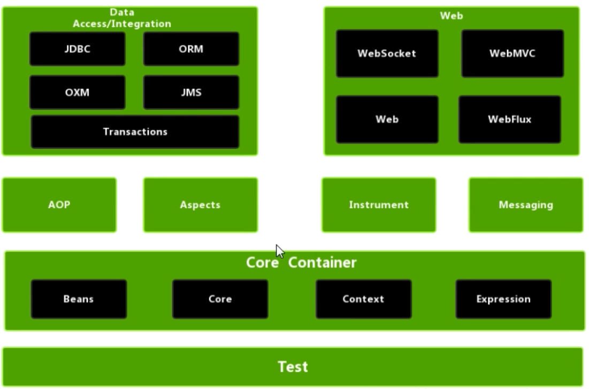


## 1.2 入门案例

### 1.2.1 下载Spring 5

1. 选择最新稳定版本

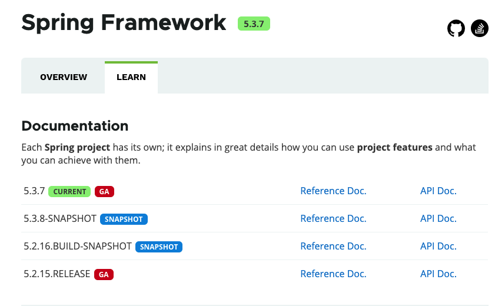

2. 下载地址

   https://repo.spring.io/release/org/springframework/spring/

3. 创建工程

4. 导入相应的jar包

5. 创建一个普通的类，在这个类创建普通方法

6. 创建Spring配置文件，在配置文件中配置创建的对象

   Spring配置文件使用xml格式

   ```xml
    <?xml version="1.0" encoding="UTF-8"?>
   <beans xmlns="http://www.springframework.org/schema/beans"
          xmlns:xsi="http://www.w3.org/2001/XMLSchema-instance"
          xsi:schemaLocation="http://www.springframework.org/schema/beans http://www.springframework.org/schema/beans/spring-beans.xsd">
   
       <!--配置User对象的创建-->
       <bean id="user" class="net.codeshow.spring5.User"></bean>
   </beans>
   ```

7. 测试代码编写

   ```java
   @Test
       public void testAdd() {
           //1. 加载spring配置文件
           ClassPathXmlApplicationContext context = new ClassPathXmlApplicationContext("bean1.xml");
           //2.获取配置创建的对象
           User user = context.getBean("user", User.class);
           System.out.println(user);
           user.add();
   
       }
   ```


# 2. IOC容器

## 2.1 IOC底层原理

### 2.1.1 什么是IOC?

1. 控制反转，把对象创建和对象之间的调用过程，交给Spring进行管理
2. 使用IOC目的:为了耦合降低
3. 入门案例就是IOC实现

### 2.1.2 IOC底层原理

1. xml解析、工厂模式、反射

- 原始方式

  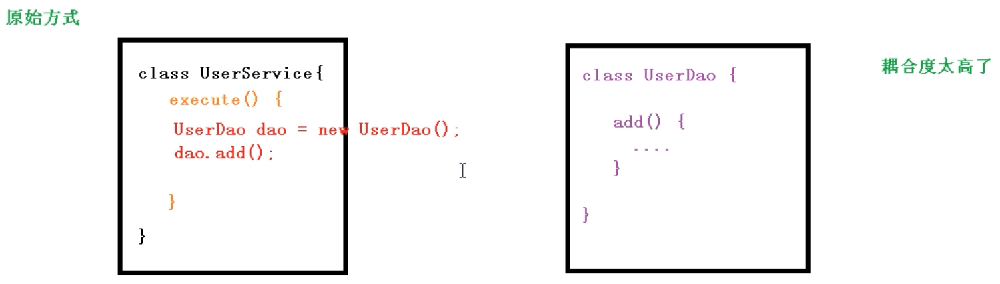

  

- 工厂模式

  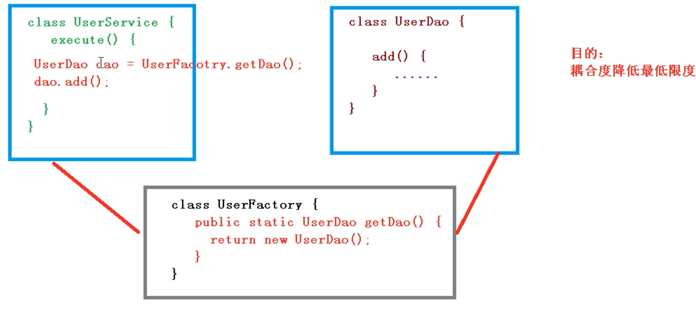

- IOC方式

  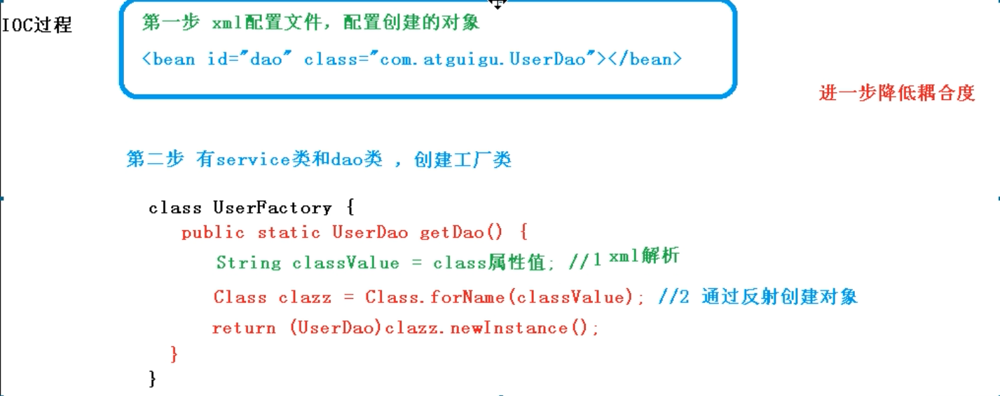

  

## 2.2 IOC接口(BeanFactory)

1. IOC思想基于IOC容器完成，IOC容器底层就是对象工厂

2. Spring提供了IOC容器实现的两种方式:(两个接口)

   - BeanFactory

     IOC容器基本实现，是Spring内部的使用接口，不提供给开发人员使用

     **加载配置文件的时候不会创建对象，使用对象的时候才创建**

   - ApplicationContext

     BeanFactory接口的子接口，提供更多更强大的功能，一般由开发人员进行使用

     加载配置文件的时候就会创建对象

3. ApplicationContext接口有实现类

   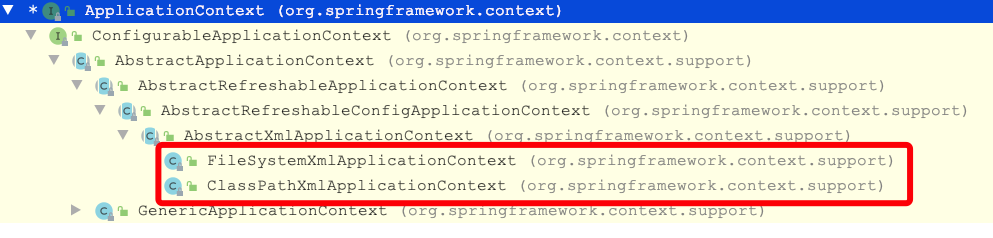

   两个实现类的区别：

   `FileSystemXmlApplicationContext`在创建对象的时候需要传入配置文件的绝对路径

   `ClassPathXmlApplicationContext`在创建对象的时候需要传入配置文件在`src`目录下的路径

   

## 2.3 IOC操作Bean管理(基于XML)

### 2.3.1 什么是Bean管理？

Bean管理指的是两个操作：

1. 由Spring创建对象
2. 由Spring注入属性

Bean管理操作有两种实现方式：

- 基于xml配置文件方式实现
- 基于注解方式实现


### 2.3.2 基于xml方式创建对象

```xml
<bean id="user" class="net.codeshow.spring5.User"></bean>
```

1. 在Spring配置文件中，使用bean标签，标签里面添加对应属性，就可以实现对象创建

2. 在bean标签有很多属性，常用的属性有以下几种:

   - id属性

     唯一标识

   - class属性

     类的全路径

   - name属性

     作用基本与id属性相同，两者的区别是name属性中可以有特殊符号，而id属性中不能有特殊符号

3. 创建对象的时候，默认也是执行无参数构造方法完成对象的创建


### 2.3.3 基于xml方式注入属性

1. DI:依赖注入，就是注入属性，是IOC的一种具体实现，需要在完成对象创建的基础上执行

   - 第一种注入方式:使用set方法进行注入

   - 第二种注入方式:通过有参构造器注入

     (1). 创建类，定义属性，创建属性对应有参构造方法

     (2). 在Spring配置文件中进行配置

     ```xml
       <!--有参构造注入属性-->
         <bean id="orders" class="net.codeshow.spring5.Orders">
             <constructor-arg name="name" value="电脑"></constructor-arg>
             <constructor-arg name="address" value="China"></constructor-arg>
             <!--        <constructor-arg index="0" value=""></constructor-arg>-->
     
         </bean>
     ```

   - p名称空间注入

     (1). 使用p名称空间注入，可以简化基于xml配置方式

     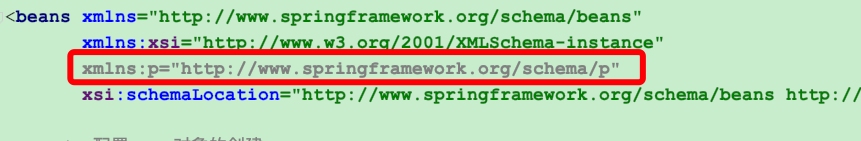

2. xml注入其他类型属性

   - 字面量

     (1). null值

     (2).属性值包含特殊符号

3. 注入属性-外部bean

   (1).创建两个类service类和dao类

   (2).在service调用dao里面的方法

   (3).在spring配置文件件中进行配置

4. 注入属性-内部bean和级联赋值

   (1). 一对多关系:部门和员工

   一个部门有多个员工，一个员工属于一个部门，部门是一，员工是多

   (2). 在实体类之间表示一对多关系

   ```xml
    <!--内部bean-->
       <bean id="emp" class="net.codeshow.spring5.bean.Emp">
           <!--设置两个普通属性-->
           <property name="ename" value="lucy"></property>
           <property name="gender" value="女"></property>
           <!--设置对象类型属性-->
           <property name="dept">
               <bean id="dept" class="net.codeshow.spring5.bean.Dept">
                   <property name="dname" value="安保部"></property>
               </bean>
   
           </property>
       </bean>
   ```

5. xml注入集合属性

   - 注入数组类型属性
   - 注入List集合类型属性
   - 注入Map集合类型属性

   创建类：

   ```java
   public class Stu {
       //    1.数组类型属性
       private String[] courses;
       //    2.List集合类型属性
       private List<String> list;
   
       //    3.map集合类型属性
       private Map<String, String> maps;
       //    4.set集合类型属性
       private Set<String> sets;
   
       public void setCourses(String[] courses) {
           this.courses = courses;
       }
   
       public void setList(List<String> list) {
           this.list = list;
       }
   
       public void setMaps(Map<String, String> maps) {
           this.maps = maps;
       }
   
       public void setSets(Set<String> sets) {
           this.sets = sets;
       }
   }
   ```

   在Spring 配置文件中进行配置

   ```xml
   <?xml version="1.0" encoding="UTF-8"?>
   <beans xmlns="http://www.springframework.org/schema/beans"
          xmlns:xsi="http://www.w3.org/2001/XMLSchema-instance"
          xmlns:p="http://www.springframework.org/schema/p"
          xsi:schemaLocation="http://www.springframework.org/schema/beans http://www.springframework.org/schema/beans/spring-beans.xsd">
   
       <!--集合类型属性注入-->
       <bean id="stu" class="net.codeshow.spring5.collectiontype.Stu">
           <!--数组类型属性注入-->
           <property name="courses">
               <array>
                   <value>java课程</value>
                   <value>数据库课程</value>
               </array>
           </property>
           <!--list类型属性注入-->
           <property name="list">
               <list>
                   <value>张三</value>
                   <value>小三</value>
               </list>
           </property>
           <!--map类型属性注入-->
           <property name="maps">
               <map>
                   <entry key="JAVA" value="java"></entry>
                   <entry key="PHP" value="php"></entry>
               </map>
           </property>
           <!--set类型属性注入-->
           <property name="sets">
               <set>
                   <value>MySQL</value>
                   <value>Redis</value>
               </set>
           </property>
       </bean>
   
   
   </beans>
   ```

6. 在集合里面设置对象类型的值

   ```xml
   <!--创建多个course对象-->
       <bean id="course1" class="net.codeshow.spring5.collectiontype.Course">
           <property name="cname" value="Spring5框架课程"/>
       </bean>
       <bean id="course2" class="net.codeshow.spring5.collectiontype.Course">
           <property name="cname" value="MyBatis框架课程"/>
       </bean>
   ```

   ```xml
     <!--注入list集合类型，值是对象-->
           <property name="courseList">
               <list>
                   <ref bean="course1"/>
                   <ref bean="course2"/>
               </list>
           </property>
   ```

   

7. 把集合注入部分提取出来

   - 在Spring配置文件中引入名称空间util

     ```xml
     <beans xmlns="http://www.springframework.org/schema/beans"
            xmlns:xsi="http://www.w3.org/2001/XMLSchema-instance"
            xmlns:p="http://www.springframework.org/schema/p"
            xmlns:util="http://www.springframework.org/schema/util"
            xsi:schemaLocation="http://www.springframework.org/schema/beans http://www.springframework.org/schema/beans/spring-beans.xsd
                                http://www.springframework.org/schema/util http://www.springframework.org/schema/util/spring-util.xsd">
     ```

     

   - 使用util标签完成list集合注入提取

8. FactoryBean

   - Spring有两种类型的bean，一种普通bean，另外一种工厂bean(FactoryBean)

   - 普通bean:在配置文件中定义的bean类型就是返回类型

   - 工厂bean:在配置文件中定义的bean的类型可以和返回的类型不一样

     第一步，创建类，让这个类作为工厂bean，实现接口`FactoryBean`

     第二步 实现接口里面的方法，在实现的方法中定义返回的bean类型

## 2.4 IOC操作Bean管理(基于注解)

### 2.4.1 什么是注解？

- 注解是代码特殊标记，格式：@注解名称(属性名称=属性值,属性名称=属性值...)
- 注解可以作用在类上面，方法上面，属性上面
- 使用注解的目的:简化配置

### 2.4.2 Spring针对Bean管理中创建对象提供注解

- @Component

- @Service

- @Controller

- @Respository

  上述4个注解功能是一样的，都可以用来创建bean实例

### 2.4.3 基于注解方式实现对象创建

1. 引入依赖

   

2. 开启组件扫描

   ```xml
   <!--开启组件扫描
               1、如果扫描多个包，多个包使用逗号隔开
               2、扫描包的上层目录
       -->
       <context:component-scan base-package="net.codeshow.spring5"></context:component-scan>
   ```

   

3. 开启组件扫描细节配置

   ```xml
   
      <!--
       use-default-filters="false" 表示现在不使用默认filter，自己配置filter
       context:exclude-filter 设置不扫描哪些内容
   
       -->
   <context:component-scan base-package="com.atguigu.springmvc" use-default-filters="false">
   	<context:include-filter type="annotation"
              expression="org.springframework.stereotype.Controller"/>
   </context:component-scan>
   
   
   <context:component-scan base-package="com.atguigu.springmvc">
   	<context:exclude-filter type="annotation"
           	expression="org.springframework.stereotype.Controller"/>
   </context:component-scan>
   
   ```

   

### 2.4.4 基于注解方式实现属性注入

- @AutoWired

  根据属性类型进行自动装配

  1. 把service和dao对象创建，在service和dao类添加创建对象注解
  2. 在service中注入dao对象，在service类添加dao类型属性，在属性上面使用注解

- @Qualifier

  根据属性名称进行注入

  这个@Qualifier注解的使用，和上面@AutoWired一起使用

- @Resource

  可以根据类型注入，也可以根据名称注入

- @Value

  注入普通类型属性

## 2.5 Bean的作用域

1. 在Spring里面，设置创建bean实例是单实例还是多实例

2. 在Spring里面，默认情况下，bean是单实例对象

3. 如何设置单实例还是多实例

   - 在Spring配置文件bean标签里面有属性(scope)用于设置单实例还是多实例

   - scope属性值

     - 默认值 singleton 表示单实例对象

     - prototype 表示是多实例对象

       ```xml
       <bean id="myBean" class="net.codeshow.spring5.factorybean.MyBean" scope="prototype"/>
       ```

     - singleton和prototype区别

       - singleton表示单实例，prototype表示多实例
       - 设置scope的值是singleton的时候，加载Spring配置文件的时候就会创建单实例对象
       - 设置scope的值是prototype的时候，不是加载spring配置文件的时候创建对象，在调用getbean方法创建多实例对象

     

## 2.6 Bean的生命周期

### 2.6.1 什么是生命周期？

从对象创建到对象销毁的过程

### 2.6.2 Bean的生命周期

1. 通过构造器创建bean实例(无参数构造)
2. 为bean的属性设置值和对其他bean引用(调用set方法)
3. 调用bean的初始化方法(需要进行配置)
4. bean可以使用了(对象获取到了)
5. 当容器关闭的时候，调用bean的销毁的方法(需要进行配置销毁的方法 )

### 2.6.3 bean的后置处理器

1. 通过构造器创建bean实例(无参数构造)
2. 为bean的属性设置值和对其他bean引用(调用set方法)
3. **把bean实例传递给bean后置处理器的方法**`postProcessBeforeInitialization`
4. 调用bean的初始化方法(需要进行配置)
5. **把bean实例传递给bean后置处理器的方法**`postProcessAfterInitialization`
6. bean可以使用了(对象获取到了)
7. 当容器关闭的时候，调用bean的销毁的方法(需要进行配置销毁的方法 )

## 2.7 xml自动装配

### 2.7.1 什么是自动装配？

根据执行装配规则(属性名称或属性类型)，Spring自动将匹配的属性值进行注入

### 2.7.2 自动装配过程

bean标签属性autowire,配置自动装配
autowire属性常用两个值：

- byName 根据属性名称注入，注入值bean的id值和类属性名称一

  ```xml
   <bean id="emp" class="net.codeshow.spring5.autowire.Emp" autowire="byName">
          <!--<property name="dept" ref="dept"></property>-->
      </bean>
  
      <bean id="dept" class="net.codeshow.spring5.autowire.Dept"></bean>
  ```

- byType根据属性类型注入

  ```xml
      <bean id="emp" class="net.codeshow.spring5.autowire.Emp" autowire="byType">
          <!--<property name="dept" ref="dept"></property>-->
      </bean>
  
      <bean id="dept" class="net.codeshow.spring5.autowire.Dept"></bean>
  ```


## 2.8 外部属性文件

```xml
 <context:property-placeholder location="classpath:jdbc.properties"/>
    <bean id="dataSource" class="com.alibaba.druid.pool.DruidDataSource">
        <property name="driverClassName" value="${prop.driverClass}"></property>
        <property name="url" value="${prop.url}"></property>
        <property name="username" value="${prop.userName}"></property>
        <property name="password" value="${prop.password}"></property>
    </bean>
```


## 2.9 完全注解开发

### 2.9.1 创建配置类，替代xml配置文件

```java
@Configuration
@ComponentScan(basePackages = {"net.codeshow"})
public class SpringConfig {
}
```


# 3. AOP

## 3.1 AOP基本概念

### 3.1.1 什么是AOP

1. 面向切面编程，利用AOP可以对业务逻辑的各个部分进行隔离，从而使得业务逻辑各部分之间的耦合度降低，提高程序的可重用性，同时提高了开发的效率
2. 通俗描述：不通过修改源代码方式，在主干功能里面添加新功能

## 3.2 底层原理

### 3.2.1 底层使用动态代理

动态代理有两种情况:

1. 有接口

   使用JDK动态代理，创建接口实现类代理对象，增强类的方法

   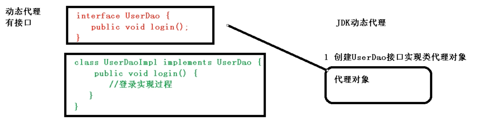

   

2. 没有接口

   使用CGLIB动态代理，创建子类的代理对象，增强类的方法

   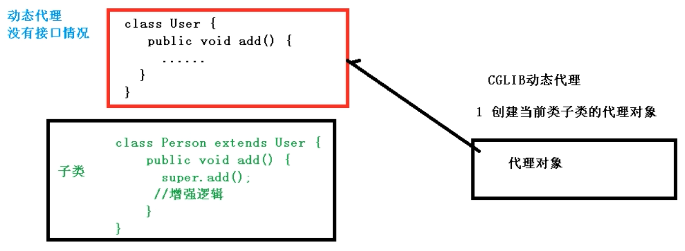

   

## 3.3 AOP术语

### 3.3.1 连接点

类里面哪些方法可以被增强，这些方法称为连接点

### 3.3.2 切入点

实际真正被增强的方法，称为切入点

### 3.3.3 通知(增强)

实际增强的逻辑部分称为通知

通知有多种类型:

1. 前置通知
2. 后置通知
3. 环绕通知
4. 异常通知
5. 最终通知

### 3.3.4 切面

切面:把通知应用到切入点的过程

## 3.4 AOP操作

Spring框架一般都是基于AspectJ实现AOP操作

### 3.4.1 什么是AspectJ

AspectJ不是Spring组成部分，是独立的AOP框架，一般把AspectJ和Spring框架一起使用进行AOP操作


### 3.4.2 基于AspectJ实现AOP的方式

1. 基于xml配置文件
2. 基于注解方式(推荐)

### 3.4.3 切入点表达式

- 切入点表达式的作用:指明要对哪个类里面的哪个方法进行增强

- 语法结构

  `execution([权限修饰符][返回类型][类全路径][方法名称]([参数列表]))`

  举例1:对`com.atguigu.dao.BookDao`类里面的add进行增强

  `execution(* com.atguigu.dao.BookDao.add(..))`

  举例2:对`com.atguigu.dao.BookDao`类里面的所有方法进行增强

  `execution(* com.atguigu.dao.BookDao.*(..))`

  举例2:对`com.atguigu.dao包里面的所有类，类里面的所有方法进行增强

  `execution(* com.atguigu.dao.*.*(..))`


### 3.4.4 AspectJ 注解操作

- 如果有多个增强类对同一个方法进行增强，设置增强类优先级

  可以在增强类上面添加注解`@Order(数字类型值)`，数字类型值越小，优先级越高


### 3.4.5 AspectJ xml配置操作


# 4. JDBCTemplate

## 4.1 概念和准备工作

### 4.1.1 什么是JDBCTemplate

Spring框架对JDBC进行封装，使用JDBCTemplate方便实现对数据库操作


### 4.1.2 准备工作

1. 引入相关jar包


## 4.2 JDBCTemplate 操作数据库(添加)

### 4.2.1 对应数据库创建实体类


### 4.2.2 编写service和dao

1. 在dao进行数据库添加操作


## 4.3 JDBCTemplate 操作数据库(修改和删除操作)


## 4.4  JDBCTemplate 操作数据库(查询返回某个值)

- 查询表里面有多少条记录

## 4.5 JDBCTemplate 操作数据库(查询返回对象)


## 4.6 JDBCTemplate 操作数据库(查询返回集合)


## 4.7 JDBCTemplate 操作数据库(批量操作)


# 5. 事务管理

## 5.1 基本概念

### 5.1.1 什么是事务？

1. 事务是数据库操作的最基本单元，逻辑上一组操作，要么都成功，如果有一个失败，所有操作都失败
2. 典型场景:银行转账

### 5.1.2 事务的四大特性

- 原子性
- 一致性
- 隔离性
- 持久性

### 5.1.3 事务管理介绍

1. 事务添加到JavaEE三层结构里面Service层(业务逻辑)

2. 在Spring进行事务管理操作

   - 有两种方式:编程式事务管理和声明式事务管理(推荐)

3. 声明式事务管理

   - 基于注解方式(推荐使用)
   - 基于xml配置文件方式

4. 在Spring进行声明式事务管理，底层使用AOP原理

5. Spring事务管理API

   - 提供一个接口，代表事务管理器，这个接口针对不同的框架提供不同的实现类

     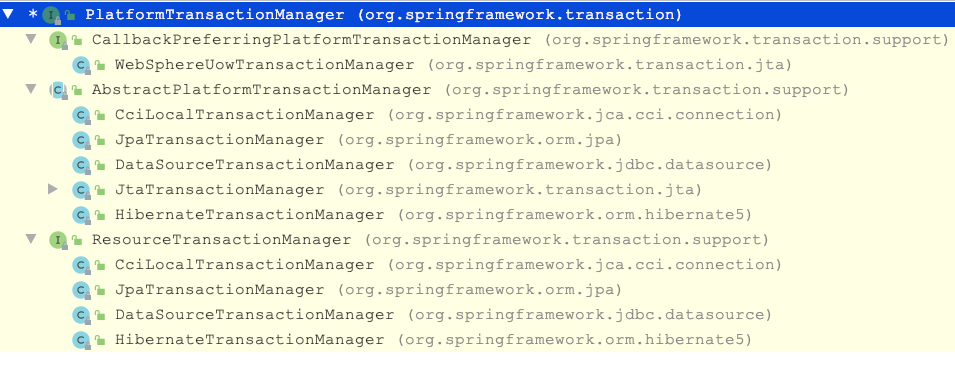


## 5.2 事务操作(注解声明式事务管理)

### 5.2.1 在spring配置文件中配置事务管理器

```xml
<!--创建事务管理器-->
    <bean id="transactionManager" class="org.springframework.jdbc.datasource.DataSourceTransactionManager">
        <!--注入数据源-->
        <property name="dataSource" ref="dataSource"/>
    </bean>
```


### 5.2.2 在Spring配置文件中开启事务注解

1. 在配置文件中引入名称空间`tx`

2. 开启事务注解

   ```xml
    <!--开启事务注解-->
       <tx:annotation-driven transaction-manager="transactionManager"/>
   ```

3. 在service类上面(或者service类里面的方法上面)添加事务注解

   - `@Transactional`这个注解可以添加到类上面也可以添加到方法上面
   - 如果把这个注解添加到类上面，这个类里面所有的方法都添加事务
   - 如果把这个注解添加到方法上面，为这个方法添加事务


## 5.3 声明式事务管理参数设置

### 5.3.1 在`@Transactional`这个注解里面可以配置事务相关的参数

- propagation

  事务传播行为：多事务方法之间进行调用，这个过程中事务是如何进行管理的

  传播行为有7种:

  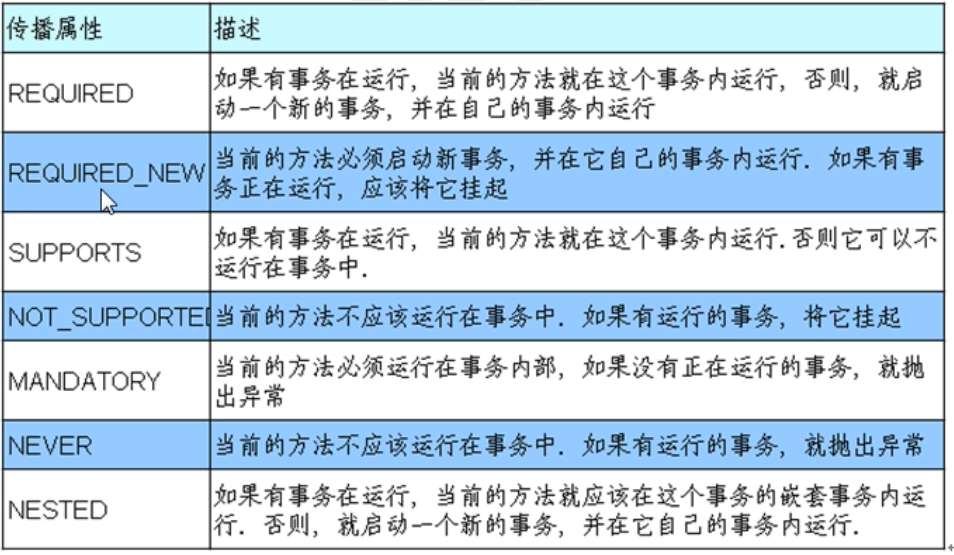

  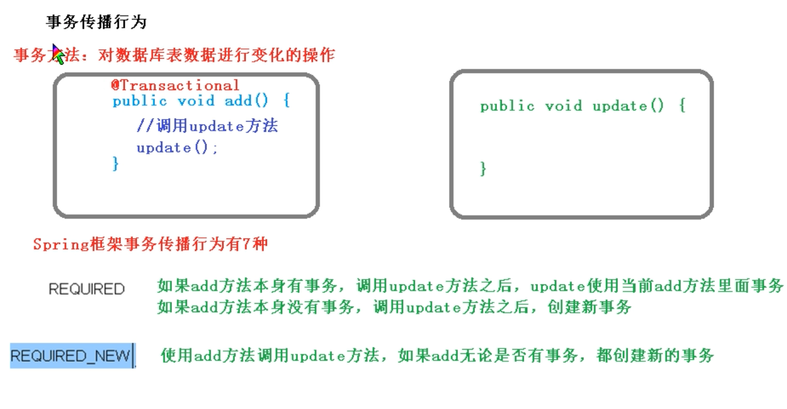

  默认是required

  

- isolation

  事务隔离级别

  隔离性:多事务之间不会产生影响

  不考虑隔离性会产生很多问题，有3个读的问题:脏读、不可重复读、幻读

  - 脏读:一个未提交事务读取到另一个未提交事务的数据
  - 不可重复读:一个未提交事务读取到另一个已提交事务修改的数据
  - 幻读:一个未提交事务读取到另一个已提交事务添加的数据

  通过设置事务的隔离级别就能解决上述读的问题

  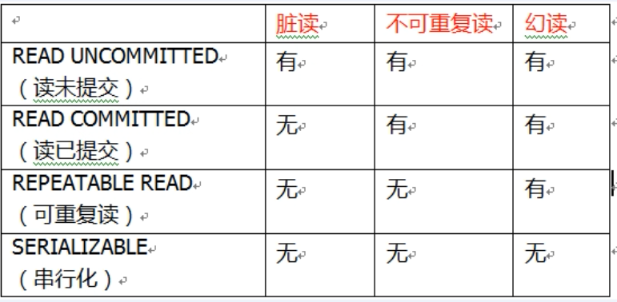

  

  

- timeout

  超时时间

  事务需要在一定的时间内进行提交，如果不提交就进行回滚

  默认值是-1，设置时间以秒为单位进行计算

- readOnly

  是否只读

  读:查询操作，写:添加、修改、删除

  readOnly默认值是false，表示可以查询，可以添加修改删除操作

  设置readOnly的值为true后，就只能进行查询操作

- rollbackFor

  回滚

  设置出现了哪些异常进行回滚

- noRollbackFor

  不回滚

  设置出现哪些异常不进行回滚

## 5.4 基于xml声明式事务管理

### 5.4.1 配置事务管理器

### 5.4.2 配置通知


### 5.4.3 配置切入点和切面


## 5.5 完全注解开发

创建配置类，使用配置类替代xml配置文件


# 6. Spring5新特性

1. 整个Spring5框架的代码基于Java8，运行时兼容JDK9,许多不建议使用的类和方法在代码库中被删除

2. Spring 5.0框架自带了通用的日志封装

   Spring5已经移除了`Log4jConfigListener`,官方建议使用`Log4j2`

## 6.1 Spring5 整合`Log4j2`

### 6.1.1 引入依赖jar包


### 6.1.2 创建`Log4j2`配置文件`log4j2.xml`


## 6.2 Nullable注解和函数式注册对象

Spring5框架核心容器支持`@Nullable`注解

`@Nullable`注解可以使用在方法上面，属性上面，参数上面，表示方法返回值可以为空，属性值可以为空，参数值可以为空

Spring5核心容器支持函数式风格`GenericApplicationContext`


## 6.3 JUnit5 单元测试框架

### 6.3.1 整合JUnit4

1. 引入Spring针对相关测试依赖
2. 创建测试类，使用注解方式完成

### 6.3.2 整合JUnit5

1. 引入JUnit5的jar包
2. 创建测试类，使用注解完成
3. 可以使用复合注解


# 7.Webflux

## 7.1 简介

### 7.1.1 什么是Webflux

- Webflux是Spring5新添加的模块，用于web开发，功能类似于SpringMVC,其使用当前一种比较流行的响应式编程而出现的框架
- 使用传统web框架，比如SpringMVC,这些基于Servlet容器，Webflux是一种异步非阻塞的框架，异步非阻塞的框架在Servlet 3.1以后才支持，核心是基于Reactor的相关API实现的，核心是基于Reactor的相关API实现的

### 7.1.2 什么是异步非阻塞？

异步和同步针对调用者，调用者发送请求，如果等着对方回应之后才去做其他事情就是同步，如果发送请求之后不等着对方回应就去做其他事情就是异步

阻塞和非阻塞针对被调用者，被调用者收到请求后，做完请求任务之后才给出反馈就是阻塞，收到请求之后马上给出反馈然后再去做事情就是非阻塞


### 7.1.3 Webflux特点

1. 非阻塞式:在有限资源下，提高系统吞吐量和伸缩性，以Reactor为基础实现响应式编程
2. 函数式编程:Spring5基于Java8,Webflux中可以使用Java8中的函数式编程实现路由请求


### 7.1.4 Spring MVC与Webflux的比较

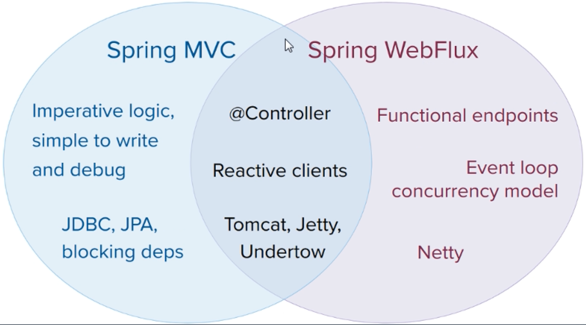

1. 两个框架都可以使用注解方式，都运行在tomcat等容器
2. Spring MVC采用命令式编程，Webflux采用异步响应式编程方式编程

## 7.2 响应式编程

### 7.2.1 什么是响应式编程

响应式编程是一种面向数据流和变化传播的编程范式。这意味着可以在编程语言中很方便地表达静态或动态的数据流，而相关的计算模型会自动将变化的值通过数据流进行传播


### 7.2.2 Java8及其之前版本代码实现

Java中提供的观察者模式有两个类`Observer`和`Observable`


### 7.2.3 响应式编程(Reactor实现)

1. 响应式编程操作中，Reactor是满足Reactive规范的框架
2. Reactor中有两个核心类，`Mono`和`Flux`,这两个类都实现了接口`Publisher`,提供丰富的操作符。Flux对象实现发布者，返回N个元素；Mono实现发布者，返回0或者1个元素
3. Flux和Mono都是数据流的发布者，使用Flux和Mono都可以发出3种数据信号:元素值、错误信号、完成信号，错误信号和完成信号都代表终止信号，终止信号用于告诉订阅者数据流结束了，错误信号终止数据流同时把错误信息传递给订阅者

三种信号特点:

- 错误信号和完成信号都是终止信号，不能共存
- 如果没有发送任何元素值，而是直接发送错误或者完成信号，表示是空数据
- 如果没有错误信号，没有完成信号，表示是无限数据流

调用`just`或者其他方法只是声明数据流，数据流并没有输出，只有进行订阅之后才会触发数据流，不订阅什么都不会发生。


### 7.2.4 操作符

对数据流进行一道道操作，这些操作就称为操作符，比如工厂流水线

常见的有如下几个:

- map:元素映射为新的元素
- flatmap:元素映射为流


## 7.3 Webflux执行流程

Webflux基于Reactor，默认容器是Netty,Netty是高性能，NIO框架，异步非阻塞框架

Webflux的执行过程和SpringMVC相似，Webflux的核心控制器是`DispatchHandler`,实现接口`WebHandler`

接口`WebHandler`有一个方法

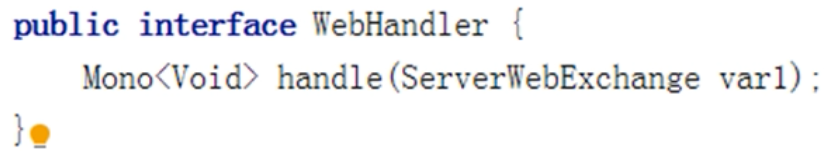

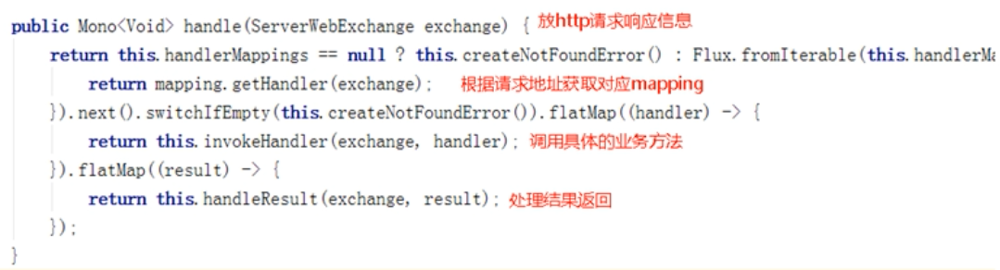


Webflux里面DispatcherHandler,负责请求的处理

- HandlerMapping:请求查询到处理的方法
- HandlerAdapter:真正负责请求处理
- HandleResultHandler:响应结果处理


## 7.4 Webflux实现函数式编程

两个接口：RouterFunction(路由处理)和HandlerFunction(处理函数)

1. 配置启动的端口号


说明:

SpringMVC方式实现，同步阻塞的方式，基于SpringMVC+Servlet+Tomcat

SpringWebflux方式实现，异步非阻塞方式，基于SpringWebflux+Reactor+Netty


1. 在使用函数式编程模型操作时，需要自己初始化服务器
2. 基于函数式编程模型时，有两个核心接口：RouterFunction(实习路由功能，请求转发给对应handler)和HandlerFunction(处理请求生成响应的函数)。核心任务定义两个函数式接口的实现并启动需要的服务器
3. SpringWebflux请求和响应不再是ServletRequest和ServletResponse,而是ServerRequest和Serverresponse
