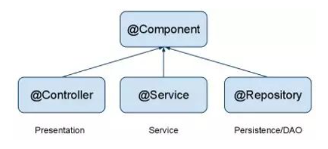
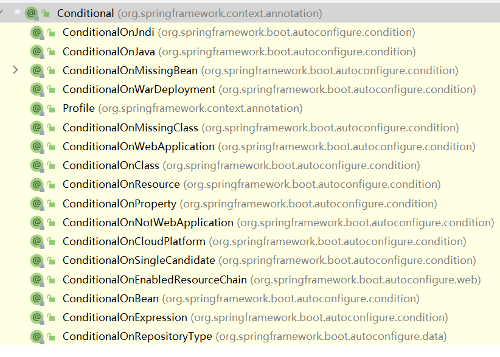
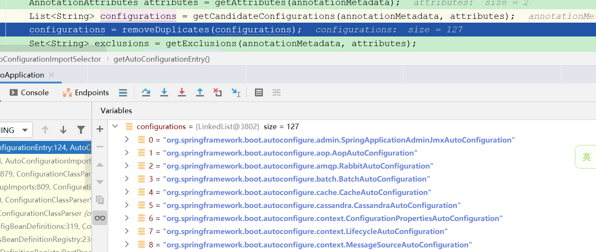
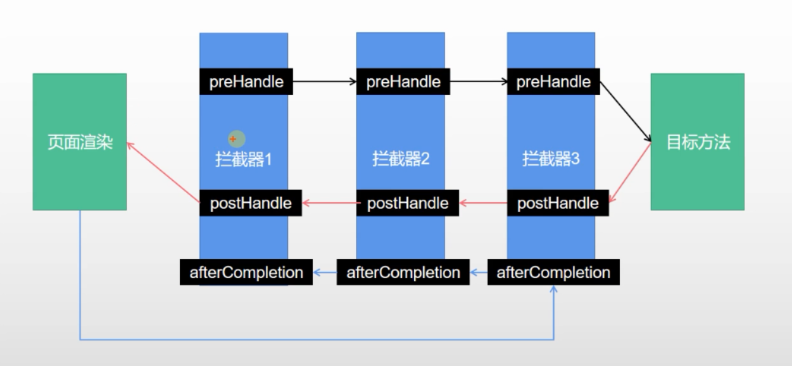

[TOC]

# 1. SpringBoot能做什么？


# 2. 什么是SpringBoot

## 2.1 优点


## 2.2 缺点


# 3. 快速体验SpringBoot

## 3.1 一些注解的作用说明

- @ResponseBody

  表示返回给浏览器的是字符串的方式

- @RequestMapping

  添加访问映射路径

- @RestController

  等价于`@Controller` + `@ResponseBody`


# 4. 自动配置原理入门

## 4.1 starter场景启动器

- 只要引入starter，这个场景的所有常规需要的依赖都会自动引入

- springboot所有支持的场景

  https://docs.spring.io/spring-boot/docs/current/reference/html/using.html#using.build-systems.starters

- 第三方场景启动器

  一般格式:`*-spring-boot-starter`

- 所有场景启动器最底层的依赖

  ```xml
  <dependency>
    <groupId>org.springframework.boot</groupId>
    <artifactId>spring-boot-starter</artifactId>
    <version>2.3.4.RELEASE</version>
    <scope>compile</scope>
  </dependency>
  ```

## 4.2 自动版本仲裁

- 引入依赖，默认都可以不写版本号
- 引入非版本仲裁的jar，要写版本号


## 4.3 自动配置

- 自动配置好SpringMVC

  - 引入SpringMVC全套组件
  - 自动配好SpringMVC常用组价(功能)

- 自动配置好web常见功能(比如字符编码问题)

  SpringBoot帮我们配置好了所有web开发的常见场景

- 默认的包结构

  - 主程序所在包及其下面的子包里面的组件都会被默认扫描进来

  - 无须以前的包扫描配置

  - 如果需要特别指定包扫描位置

    可以使用`@SpringBootApplication(scanBasePackages = "要扫描的包名")`

    或者使用`@ComponentScan`指定包扫描路径

- 各种配置拥有默认值

  - 默认配置最终都是映射到MultipartProperties
  - 配置文件的值最终会绑定到每个类上，这个类会在容器中创建对象

- 按需加载所有自动配置项

  - 非常多的starter
  - 引入了哪些场景这些场景的自动配置才会开启
  - SpringBoot所有的自动配置功能都在spring-boot-autoconfig包里面

# 5. 容器功能

## 5.1 组件添加

### 5.1.1 `@Configuration`

该注解添加到一个配置类上，告诉springboot这是一个配置类，作用相当于之前的配置文件

使用示例如下:

```java
@Configuration //告诉springboot这是一个配置类，相当于之前的配置文件
public class MyConfig {
    @Bean //给容器中添加组件。以方法名作为组件的id
    public User user01(){
        return new User("zhangsan",18);
    }
}
```

该注解有一个参数`proxyBeanMethods`,用来控制是否代理bean的方法，如果这个参数设置为true,那么springboot会保证多次调用bean方法返回的都是同一个实例，如果将`proxyBeanMethods`参数设置为false就是Lit模式，如果设置为true就是Full模式。最佳实践:

- 配置类组件之间无依赖关系用Lite模式加速容器启动过程，减少判断
- 配置类组件之间有依赖关系，方法会被调用得到之前单实例组件，用Full模式


### 5.1.2 `@Bean`

给容器中添加组件，以方法名作为组件的id，返回类型就是组件的类型，返回的值就是组件在容器中的实例，默认是单实例的

外部无论对配置类中的这个组件注册方法调用多少次获取的都是之前注册容器中的单实例对象


使用示例在5.1.1

可以通过给该注解添加参数改变默认组件名称

### 5.1.3 `@Component`、`@Controller`、`@Service`、`@Repository`

`@Controller`表示一个web控制层bean，如SpringMVC中的控制器

`@Service`用来表示一个业务层bean

`@Repository`用来表示一个持久层bean，即数据访问层DAO组件

`@Component`,用来表示一个非常普通的组件，当一个类不适合使用以上3个注解时用这个组件修饰

4者的关系可以使用下图表示



需要注意的是@Controller，@Service，@Repository都有带@Component父注解，说明它们除了基本组件的属性外还有其他的场景应用，即如果不用SpringMVC其实它们就是一个普通的组件，但是普通组件最好还是用@Component修饰

### 5.1.4 `@Import`注解

给容器中自动创建出对应类型的组件,默认组件的名称就是全类名

使用示例如下:

```java
@Import({User.class, DBHelper.class})
public class MyConfig {}
```


### 5.1.5 `@Conditional`注解

条件装配:满足Conditional指定的条件，则进行组件注入

继承树如下:



### 5.1.6 原生配置文件导入

导入一些原来的xml配置文件可以使用`@ImportResource`注解，参数中指定配置文件的路径


### 5.1.7 配置绑定

读取properties文件中的内容，封装到JavaBean中

`@EnableConfigurationProperties`注解有两个功能:

- 开启某个指定类的属性配置
- 把这个组件自动注册到容器中


# 6. 自动配置原理

## 6.1 引导加载自动配置类

- `@SpringBootConfiguration`

  表示当前是一个配置类

- `@ComponentScan`

  指定扫描哪些spring注解

- `@EnableAutoConfiguration`

  该注解是如下两个注解的合成注解

  ```java
  @AutoConfigurationPackage
  @Import(AutoConfigurationImportSelector.class)
  public @interface EnableAutoConfiguration {}
  ```

  该注解是由以下两个注解合成的注解:

  ```java
  @AutoConfigurationPackage
  @Import(AutoConfigurationImportSelector.class)
  public @interface EnableAutoConfiguration {}
  ```

  `@AutoConfigurationPackage`的代码如下:

  ```java
  @Import(AutoConfigurationPackages.Registrar.class)
  public @interface AutoConfigurationPackage {}
  ```

  该注解利用Registrar这个类给容器中导入一系列组件，也就是将指定包下(springboot	启动类所在的包)的所有组件导入。

  概括来讲，这个注解指定了默认的包规则

  `@Import(AutoConfigurationImportSelector.class)`注解：利用下面的方法给容器中导入一系列组件

  

  ```java
  getAutoConfigurationEntry(annotationMetadata)
  ```

  

  上述方法会调用

  ```java
  List<String> configurations = getCandidateConfigurations(annotationMetadata, attributes);
  ```

  获取到所有的需要导入容器的配置类

  然后调用下面的代码

  ```java
  List<String> configurations = SpringFactoriesLoader.loadFactoryNames(getSpringFactoriesLoaderFactoryClass(),
  				getBeanClassLoader());
  ```

  最终会调用下面的方法返回一个map

  ```java
  private static Map<String, List<String>> loadSpringFactories(@Nullable ClassLoader classLoader) 
  ```

  从`META-INF/spring.factories`加载一个文件，默认会扫描当前系统该位置的所有文件

  spring-boot-autoconfigure-2.3.7.RELEASE.jar包里面也有`META-INF/spring.factories`

  文件里面写死了上述截图要加载的127个类

  

## 6.2 按需开启自动配置项

  虽然127个场景的所有自动配置启动的时候默认全部加载，但是最终会按需配置

  

## 6.3 自动配置流程

  

## 6.4 总结

  - springboot先加载所有的自动配置类 xxxAutoConfiguration
  - 每个自动配置类按照条件进行生效，默认都会绑定配置文件指定的值
  - 生效的配置类就会给容器中装配很多组件
  - 只要容器中有这些组件，相当于这些功能就有了
  - 如果用户有自己配置的，有限使用用户的
  - 定制化配置
    - 用户直接自己@Bean替换底层的组件
    - 用户去看这个组件是获取的配置文件什么值就去修改

  

  

# 7. 开发小技巧

## 7.1 Lombok

  简化javabean开发

  

## 7.2 Spring Initailizr

  

  

## 7.3 dev-tools

  ```xml
          <dependency>
              <groupId>org.springframework.boot</groupId>
              <artifactId>spring-boot-devtools</artifactId>
              <optional>true</optional>
          </dependency>
  ```

  

# 8. 配置文件

  ## 8.1 yaml的用法

  ### 8.1.1 基本语法

  - 基本格式

    `key: value`,kv之间有空格

  - 大小写敏感

  - 使用缩进表示层级关系

  - 缩进不允许使用tab，只允许空格

  - 缩进的空格数不重要，只要相同层级的元素左对齐即可

  - `#`表示注释

  - `''`中的内容会被转义，`""`中的内容不会被转义

  ### 8.1.2 数据类型

  - 字面量:单个的、不可再分的值。

    date、boolean、string、number、null

    ```yaml
    k: v
    ```

    

    

  - 对象:键值对的集合

    map、hash、set、object

    ```yaml
    # 行内写法
    k: {k1:v1,k2:v2,k3:v3}
    # 上面的写法等价于下面的写法
    k:
      k1: v1
      k2: v2
      k3: v3
    ```

    

  - 数组:一组按次序排列的值

    array、list、queue

    ```yaml
    # 行内写法 k: [v1,v2,v3]
    # 等价于下面的写法
    k: 
      - v1
      - v2
      - v3
    ```

    

 # 9. web开发
## 9.1 静态资源访问

### 9.1.1 静态资源目录

类路径下这些文件夹`/static` (or `/public` or `/resources` or `/META-INF/resources`)都可以存放静态资源

访问方式:当前项目根路径 + 静态资源名

原理:静态映射/**

请求进来，先去找controller看能否处理，不能处理的所有请求又都交给静态资源处理器，静态资源也找不到就会返回404


### 9.1.2 静态资源访问前缀

默认无前缀

可以通过在配置文件中进行如下配置来配置前缀

```yaml
spring:
  mvc:
    static-path-pattern: /res/**
```

配置前缀后， 当前项目+static-path-pattern + 静态资源名 = 静态资源文件下找

改变默认的静态资源路径

### 9.1.3 webjar

https://www.webjars.com/

```xml
        <dependency>
            <groupId>org.webjars</groupId>
            <artifactId>jquery</artifactId>
            <version>3.6.0</version>
        </dependency>
```

访问地址: http://localhost:8080/webjars/jquery/3.6.0/jquery.js


### 9.1.4 欢迎页支持

- 静态资源路径下 index.html
- controller能处理/index

### 9.1.5 自定义Favicon

## 9.2 静态资源配置原理

- SpringBoot启动默认加载xxxAutoConfiguration类(自动配置类)

- SpringMVC功能的自动配置类WebMvcAutoConfiguration,生效

  ```java
  @Configuration(proxyBeanMethods = false)
  @ConditionalOnWebApplication(type = Type.SERVLET)
  @ConditionalOnClass({ Servlet.class, DispatcherServlet.class, WebMvcConfigurer.class })
  @ConditionalOnMissingBean(WebMvcConfigurationSupport.class)
  @AutoConfigureOrder(Ordered.HIGHEST_PRECEDENCE + 10)
  @AutoConfigureAfter({ DispatcherServletAutoConfiguration.class, TaskExecutionAutoConfiguration.class,
  		ValidationAutoConfiguration.class })
  public class WebMvcAutoConfiguration {
  ```

- 给容器配了什么？

  ```java
  	@Configuration(proxyBeanMethods = false)
  	@Import(EnableWebMvcConfiguration.class)
  	@EnableConfigurationProperties({ WebMvcProperties.class, ResourceProperties.class })
  	@Order(0)
  	public static class WebMvcAutoConfigurationAdapter implements WebMvcConfigurer {
  ```

  配置文件的相关属性和xxx进行了绑定,WebMvcProperties==spring.mvc,ResourceProperties==spring.resources

  

  有参构造器所有参数的值都会从容器中确定

  ```java
  	public WebMvcAutoConfigurationAdapter(ResourceProperties resourceProperties, WebMvcProperties mvcProperties,
  				ListableBeanFactory beanFactory, ObjectProvider<HttpMessageConverters> messageConvertersProvider,
  				ObjectProvider<ResourceHandlerRegistrationCustomizer> resourceHandlerRegistrationCustomizerProvider,
  				ObjectProvider<DispatcherServletPath> dispatcherServletPath,
  				ObjectProvider<ServletRegistrationBean<?>> servletRegistrations) {
  			this.resourceProperties = resourceProperties;
  			this.mvcProperties = mvcProperties;
  			this.beanFactory = beanFactory;
  			this.messageConvertersProvider = messageConvertersProvider;
  			this.resourceHandlerRegistrationCustomizer = resourceHandlerRegistrationCustomizerProvider.getIfAvailable();
  			this.dispatcherServletPath = dispatcherServletPath;
  			this.servletRegistrations = servletRegistrations;
  		}
  ```

  ResourceProperties resourceProperties:获取和spring.resources绑定的所有的值的对象

  WebMvcProperties mvcProperties:获取和spring.mvc绑定的所有的值的对象

  ListableBeanFactory beanFactory:Spring的beanFactory

  HttpMessageConverters:找到所有的HttpMessageConverters

  ResourceHandlerRegistrationCustomizer:找到资源处理器的自定义器

  ```yaml
  spring:
    mvc:
      static-path-pattern: /res/**
  
    resources:
      static-locations: classpath:/haha
      add-mappings: false # 禁用所有静态资源规则
  ```

  

  

## 9.3 请求参数处理

### 9.3.1 请求映射

Rest风格支持:

```java
	@Bean
	@ConditionalOnMissingBean(HiddenHttpMethodFilter.class)
	@ConditionalOnProperty(prefix = "spring.mvc.hiddenmethod.filter", name = "enabled", matchIfMissing = false)
	public OrderedHiddenHttpMethodFilter hiddenHttpMethodFilter() {
		return new OrderedHiddenHttpMethodFilter();
	}
```

需要把下面的配置设置为true来开启Rest风格支持

```yaml
 hiddenmethod:
      filter:
        enabled: true
```


  Rest原理(表单提交要使用REST的时候)：

- 表单提交会带上_method=PUT
- 请求过来被HiddenHttpMethodFilter拦截
  - 请求是否正常，并且是POST请求
    - 获取到_method的值
    - 兼容以下请求:PUT/DELETE/PATCH
    - 原生request(post),包装模式requestWrapper重写了getMethod方法，返回的是传入的值
    - 过滤器链放行的时候用wrapper。以后的方法调用getMethod是调用requestWrapper的


### 9.3.2 请求映射原理


### 9.3.3 常用参数注解

- @PathVariable

  获取路径变量

  用法示例:

  ```java
     @RequestMapping("/car/{id}/owner/{username}")
      public Map<String, Object> getCar(@PathVariable("id") Integer id, @PathVariable("username") String name,
                                        @PathVariable Map<String, String> pv) {
          HashMap<String, Object> map = new HashMap<>();
          map.put("id", id);
          map.put("name", name);
          map.put("pv", pv);
          return map;
  
      }
  ```

- `@RequestHeader`

  获取请求头中的值

- `@RequestParam`

  获取请求参数

- `@CookieValue`

  获取cookie的值

- `@ResponseBody`

  获取请求体[POST]

- `@RequestAttribute`

  获取request域属性


## 9.4 自定义参数绑定原理


## 9.5 数据响应与内容协商

### 9.5.1 响应JSON

`jackson.jar`+`@ResponseBody`


## 9.6 拦截器原理

1. 根据当前请求找到HandlerExecutionChain【可以处理请求的handler以及handler的所有拦截器】
2. 先来顺序执行所有拦截器的preHandle方法
   - 如果当前拦截器preHandler返回为true,则执行下一个拦截器的preHandler
   - 如果当前拦截器返回为true，直接倒序执行已经执行了的拦截器 afterCompletion
3. 如果任何一个拦截器返回false。直接跳出不执行目标方法
4. 所有拦截器都返回true，执行目标方法
5. 倒序执行所有拦截器的postHandle方法
6. 前面的步骤有任何异常都会直接触发afterCompletion
7. 页面成功渲染完成后也会倒序触发afterCompletion




## 9.7 文件上传

### 9.7.1 页面表单

该看50


  

  

  


  

  

  

  

