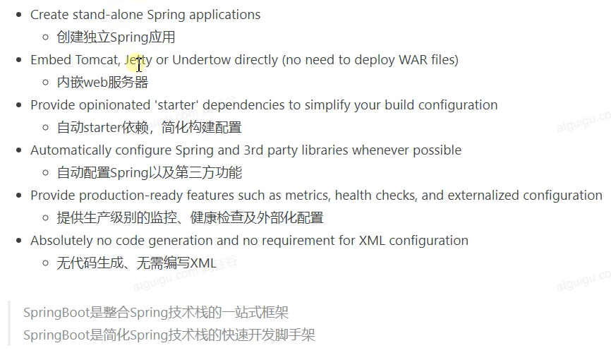

[TOC]

# 1. SpringBoot能做什么？


# 2. 什么是SpringBoot

## 2.1 优点



## 2.2 缺点


# 3. 快速体验SpringBoot

## 3.1 一些注解的作用说明

- @ResponseBody

  表示返回给浏览器的是字符串的方式

- @RequestMapping

  添加访问映射路径

- @RestController

  等价于`@Controller` + `@ResponseBody`


# 4. 自动配置原理入门

## 4.1 starter场景启动器

- 只要引入starter，这个场景的所有常规需要的依赖都会自动引入

- springboot所有支持的场景

  https://docs.spring.io/spring-boot/docs/current/reference/html/using.html#using.build-systems.starters

- 第三方场景启动器

  一般格式:`*-spring-boot-starter`

- 所有场景启动器最底层的依赖

  ```xml
  <dependency>
    <groupId>org.springframework.boot</groupId>
    <artifactId>spring-boot-starter</artifactId>
    <version>2.3.4.RELEASE</version>
    <scope>compile</scope>
  </dependency>
  ```

## 4.2 自动版本仲裁

- 引入依赖，默认都可以不写版本号
- 引入非版本仲裁的jar，要写版本号


## 4.3 自动配置

- 自动配置好SpringMVC

  - 引入SpringMVC全套组件
  - 自动配好SpringMVC常用组价(功能)

- 自动配置好web常见功能(比如字符编码问题)

  SpringBoot帮我们配置好了所有web开发的常见场景

- 默认的包结构

  - 主程序所在包及其下面的子包里面的组件都会被默认扫描进来

  - 无须以前的包扫描配置

  - 如果需要特别指定包扫描位置

    可以使用`@SpringBootApplication(scanBasePackages = "要扫描的包名")`

    或者使用`@ComponentScan`指定包扫描路径

- 各种配置拥有默认值

  - 默认配置最终都是映射到MultipartProperties
  - 配置文件的值最终会绑定到每个类上，这个类会在容器中创建对象

- 按需加载所有自动配置项

该看07

