[TOC]

# 1.版本选型与升级

## 1.1 版本选型

### 1.1.1 cloud

Hoxton.SR1

### 1.1.2 boot

2.2.2.RELEASE

### 1.1.3 cloud alibaba 

2.1.0.RELEASE

### 1.1.4 Java

8

### 1.1.5 Maven

3.5及以上

### 1.1.6 MySQL

5.7及以上

## 1.2 cloud停更与升级

### 1.2.1 服务注册中心

原先使用Eureka，目前已经停更，可用替代方案如下

1. Zookeeper

2. Consul

   go写的，有时间学习下

3. Nacos

   能够完美替代Eureka,强烈推荐

### 1.2.2 服务调用Ribbon

Ribbon目前进入维护状态

LoadBalancer后面会主键替代Ribbon

### 1.2.3 服务调用Feign

Feign目前已经停更，后面OpenFeign会逐渐替代它

### 1.2.4 服务降级Hystrix

Hystrix停更，可以使用resilience4j代替，强烈推荐使用alibaba的sentienl进行替代

### 1.2.5 服务网关Zuul

Zuul停更，可以使用gateway代替

### 1.2.6 服务配置

之前使用Config,目前不推荐使用，推荐使用alibaba的Nacos

### 1.2.7 服务总线

原先使用的是Bus，目前推荐使用alibaba的Nacos替代

# 2. 代码实战

## 2.1 复习:dependencyManagement

Maven使用dependencyManagement元素来提供一种管理依赖版本号的方式

通常会在一个组织或项目的最顶层的父POM中看到dependencyManagement元素

使用pom.xml中的dependencyManagement元素能让所有在子项目中引用一个依赖而不用显式的列出版本号。Maven会沿着父子层次向上走，直到找到一个拥有dependencyManagement元素的项目，然后它就会使用这个dependencyManagement元素中指定的版本号

这样做的好处就是:如果有多个子项目都引用同一样依赖，则可以避免在每个使用的子项目里都声明一个版本号，这样当想升级或切换到另一个版本时，只需要在顶层容器里更新，而不需要一个一个子项目的修改，另外如果某个子项目需要另外的一个版本，只需要声明version即可

dependencyManagement里只是声明依赖，并不实现引入，因此子项目需要显式的声明需要用的依赖。

如果不在子项目中声明依赖，是不会从父项目中继承下来的，只有在子项目中写了该依赖项，并且没有指定具体版本，才会从父项目中继承该项，并且version和scope都读取自父pom

如果子项目中指定了版本号，那么会使用子项目中指定的Jar版本

# 3. Eureka服务注册与发现

Eureka的相关知识请参考Spring Cloud第一季的笔记

# 4. 使用Zookeeper替代Eureka

## 4.1 服务节点是临时节点还是持久节点？

服务节点如果宕机，其之前在Zookeeper上注册的节点经过一段时间后会被删除，所以服务节点是临时节点

# 5. Consul

## 5.1 简介

### 5.1.1 是什么？

官网:consul.io

Consul是一套开源的分布式服务发现和配置管理系统，由HashiCorp公司用Go语言开发。

提供了微服务系统中心的服务治理、配置中心、控制总线等功能。这些功能中的每一个都可以根据需要单独使用，也可以一起使用以构建全方位的服务网格，总之Consul提供了一种完整的服务网格解决方案

它具有很多优点，包括：基于raft协议，比较简洁；支持健康检查，同时支持HTTP和DNS协议，支持跨数据中心的WAN集群，提供图形界面，跨平台，支持Linux、Mac、Windows

### 5.1.2 作用

- Service Discovery(服务发现)

  提供HTTP和DNS两种发现方式

- Health Checking(健康检测)

  支持多种方式，HTTP/TCP/Docker/shell脚本定制化

- KV Store(KV存储)

  Key/Value的存储方式

- Secure Service Communication(多数据中心)

  支持多数据中心

- Multi Datacenter(可视化WEB界面)

### 5.1.3 下载地址

官网地址:consul.io

# 6. 注册中心的比较

Zookeeper/Consul/Eureka对比

| 语言 |  组件名   | cap  | 服务健康检查 | 对外暴露接口 | Spring cloud集成 |
| ---- | :-------: | ---- | ------------ | ------------ | ---------------- |
| Java |  Eureka   | AP   | 可配支持     | HTTP         | 已集成           |
| Go   |  Consul   | CP   | 支持         | HTTP/DNS     | 已集成           |
| Java | Zookeeper | CP   | 支持         | 客户端       | 已集成           |
|      |   Nacos   | AP   |              |              |                  |

# 7. OpenFeign服务接口调用

## 7.1 简介

### 7.1.1 是什么？

在Feign的基础上做了增强

### 7.1.2 作用

同Feign

## 7.2 Feign和OpenFeign的区别

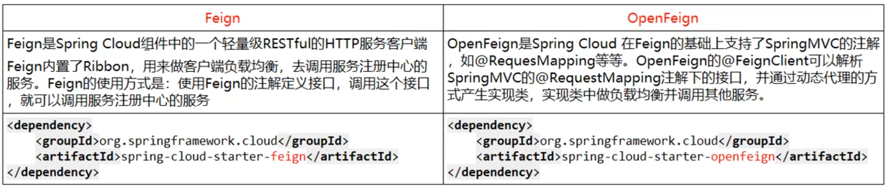

## 7.3 超时控制

OpenFeign默认等待1秒钟，超过后报错

为了避免这种情况，有时我们需要设置OpenFeign客户端的超时控制

## 7.4 日志增强

### 7.4.1 是什么？

Feign提供了日志打印功能，可以通过配置来调整日志级别，从而了解Feign中http请求的细节，也就是说可以对Feign接口的调用情况进行监控和输出

### 7.4.2 日志级别

- NONE

  默认的，不显示任何日志

- BASIC

  仅记录请求方法、URL、响应状态码及执行时间

- HEADERS

  除了BASIC中定义的信息之外，还有请求和响应的头信息

- FULL

  除了HEADERS中定义的信息之外，还有请求和响应的正文及元数据

# 8. Gateway 新一代网关

## 8.1 概述

### 8.1.1 官网

cloud.spring.io

### 8.1.2 是什么？

Cloud全家桶中有个很重要的组件就是网关，在1.x版本中都是采用的Zuul网关，但在2.x版本中，zuul的升级一直跳票，Spring Cloud最后自己研发了一个网关替代Zuul，那就是Spring Cloud Gateway 

一句话:gateway是原zuul1.x版的替代

Gateway是在Spring生态系统之上构建的API网关服务，基于Spring 5,Spring Boot 2和Project Reactor等技术。

Gateway旨在提供一种简单而有效的方式来对API进行路由，以及提供一些强大的过滤器功能，例如：熔断、限流、重试等

SpringCloud Gateway是Spring Cloud的一个全新项目，基于Spring 5.0+Spring Boot 2.0和Project Reactor等技术开发的网关，它旨在为微服务架构提供一种简单有效的统一的API路由管理方式

SpringCloud Gateway作为Spring Cloud生态系统中的网关，目标是替代Zuul,在Spring Cloud 2.0以上版本中，没有对新版本Zuul 2.0以上最新高性能版本进行集成，仍然还是使用的zuul 1.x非Reactor模式的老版本。而为了提升网关的性能，Spring Cloud Gateway是基于WebFlux框架实现的，而WebFlux框架底层则是使用了高性能的Reactor模式通信框架Netty

Spring Cloud Gateway 的目标是提供统一的路由方式且基于Filter链的方式提供了网关基本的功能，例如:安全，监控/指标、限流

一句话总结:Spring Cloud Gateway使用的是Webflux中的reactor-netty响应式编程组件，底层使用了Netty通讯框架

### 8.1.3 网关在微服务中的位置

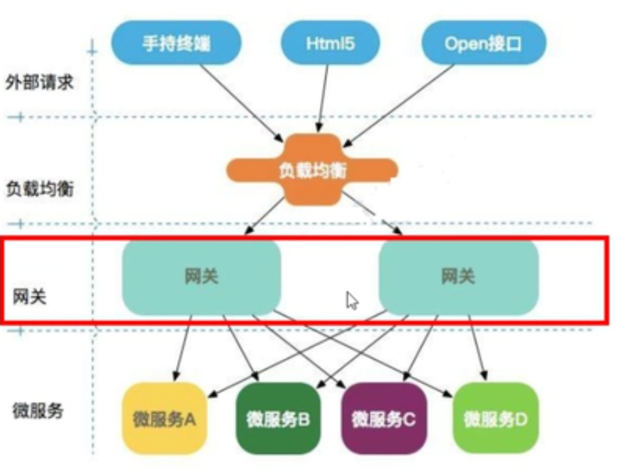

## 8.2 三大概念

### 8.2.1 Route(路由)

路由是构建网关的基本模块，它由ID,目标URI,一系列的断言和过滤器组成，如果断言为true则匹配该路由

### 8.2.2 Predicate(断言)

参考的是Java8的`java.util.function.Predicate`

开发人员可以匹配HTTP请求中的所有内容(例如请求头或请求参数)，如果请求与断言相匹配则进行路由

### 8.2.3 Filter(过滤)

值得是Spring框架中GatewayFilter的实例，使用过滤器，可以在请求被路由前或者之后对请求进行修改

### 8.2.4 整体架构

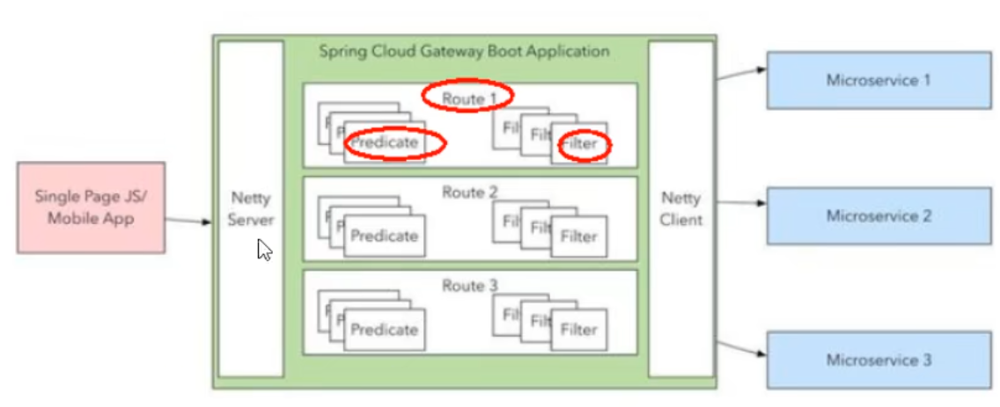

web请求，通过一些匹配条件，定位到真正的服务节点。并在这个转发过程的前后，进行一些精细化控制。predicate就是我们的匹配条件，而filter就可以理解为一个无所不能的拦截器。有了这两个元素，再加上目标uri，就可以实现一个具体的路由了

## 8.3 Gateway工作流程

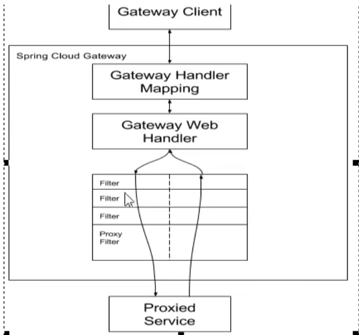

客户端向Spring Cloud Gateway发出请求，然后在Gateway Handler Mapping中找到与请求向匹配的路由，将其发送到Gateway Web Handler

Handler再通过指定的过滤器链来将请求发送到我们实际的服务执行业务逻辑，然后返回，过滤器之间用虚线分开是因为过滤器可能会在发送代理请求之前("pre")或之后("post")执行业务逻辑

Filter在"pre"类型的过滤器可以做参数校验、权限校验、流量监控，日志输出、协议转换

在"post"类型的过滤器中可以做响应内容、响应头的修改，日志的输出，流量监控等有着非常重要的作用

## 8.4 入门配置

## 8.5 通过微服务名实现动态路由

## 8.6 Predicate的使用

### 8.6.1 是什么？

Spring Cloud Gateway将路由匹配作为Spring WebFlux HandlerMapping基础架构的一部分

Spring Cloud Gateway包括许多内置的Route Predicate工厂。所有这些Predicate都与HTTP请求的不同属性匹配。多个Route Predicate工厂可以进行组合

Spring Cloud Gateway创建Route对象时，使用RoutePredicateFactory创建Predicate对象，Predicate对象可以赋值给Route。Spring Cloud Gateway包含许多内置的Route Predicate Factories

所有这些谓词都匹配HTTP请求的不同属性。多种谓词工厂可以组合，并通过逻辑and

### 8.6.2 常用的Predicate

1. After Route Predicate

2. Before Route Predicate

3. Between Route Predicate

4. Cookie Route Predicate

   Cookie Route Predicate 需要两个参数，一个是Cookie name，一个是正则表达式。

   路由规则会通过获取对应的Cookie name值和正则表达式去匹配，如果匹配上就会执行路由，如果没有匹配上则不执行

5. Header Route Predicate

   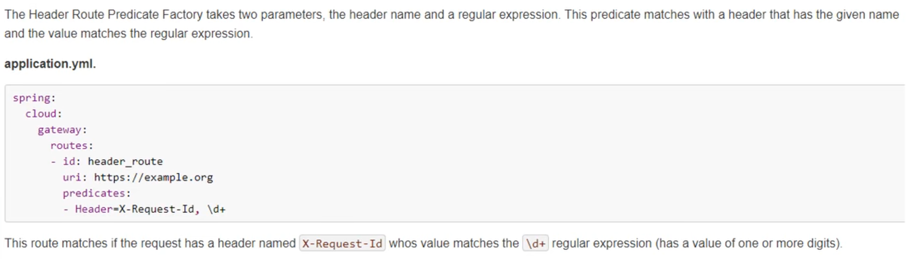

   两个参数：一个是属性名称和一个正则表达式，这个属性值和正则表达式匹配则执行

6. Host Route Predicate

7. Method Route Predicate

   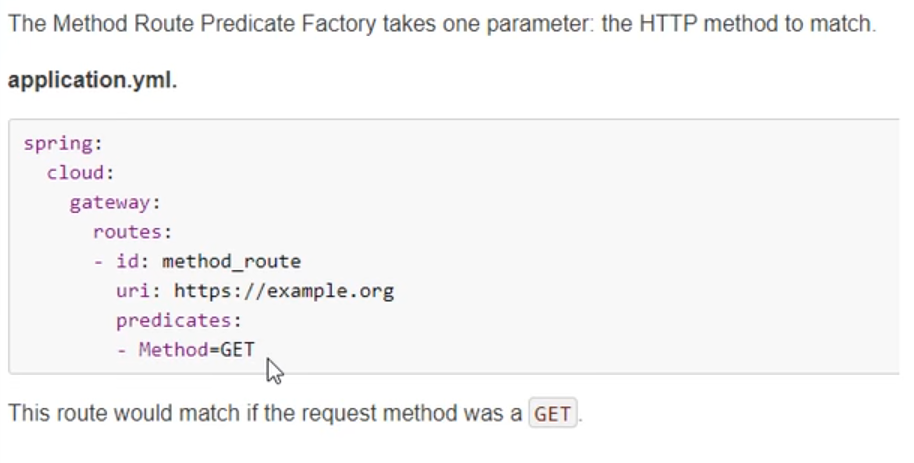

   

8. Path Route Predicate

9. Query Route Predicate

小总结：

Predicate就是为了实现一组匹配规则，让请求过来找到对应的Route进行处理

## 8.7 Filter的使用

### 8.7.1 是什么？

路由过滤器可用于修改进入的HTTP请求和返回的HTTP响应，路由过滤器只能指定路由进行使用。

Spring Cloud Gateway内置了多种路由过滤器，他们都由GatewayFilter的工厂类来产生

生命周期(只有2个)：

- pre
- post

种类(只有2个):

- GatewayFilter

  有31种

- GlobalFilter

  有10种

# 9. Spring Cloud Bus消息总线

## 9.1 简介

- 分布式自动刷新配置功能
- Spring Cloud Bus配合Spring Cloud Config使用可以实现配置的动态刷新

### 9.1.1 目前存在的问题

1. 假如有多个微服务客户端
2. 每个微服务都要执行一次post请求，手动刷新？
3. 可否广播，一次通知，处处生效？
4. 我们想大范围的自动刷新，求方法

### 9.1.2 是什么？

Bus支持两种消息代理:

- RabbitMQ
- Kafka

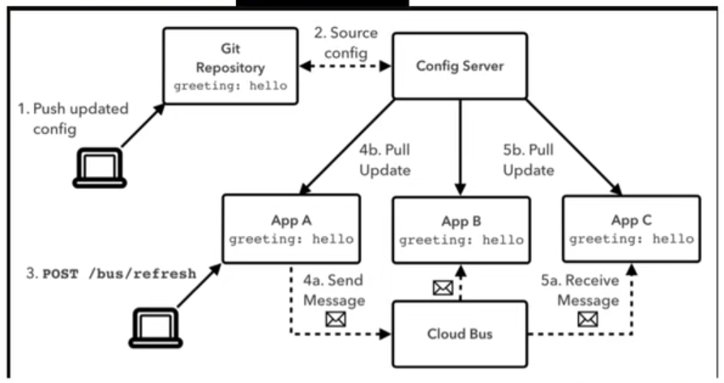

Spring Cloud Bus是用来将分布式系统的节点与轻量级消息系统连接起来的框架，它整合了Java的事件处理机制和消息中间件的功能。Spring Cloud Bus目前支持RabbitMQ和Kafka

### 9.1.3 作用

Spring Cloud Bus能管理和传播分布式系统间的消息，就像一个分布式执行器，可用于广播状态更改、事件推送等，也可以当做微服务间的通信通道

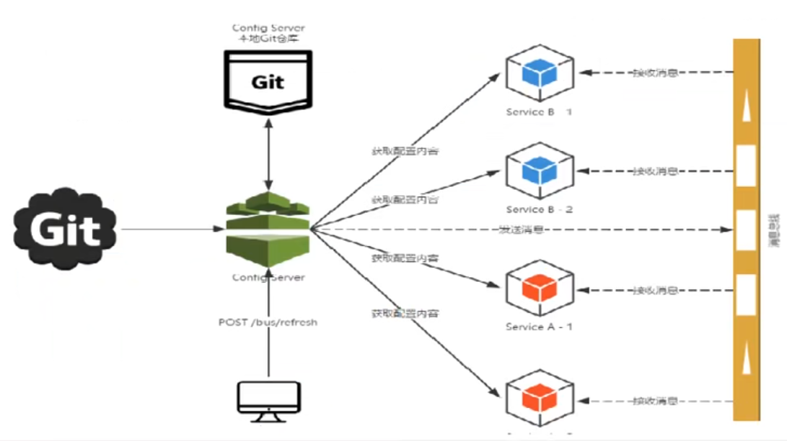

### 9.1.4 为何被称为总线

**什么是总线？**

在微服务架构的系统中，通常会使用轻量级的消息代理来构建一个共用的消息主题，并让系统中所有微服务实例都连接上来。由于该主题中产生的消息会被所有实例监听和消费，所以称它为消息总线。在总线上的各个实例，都可以方便地广播一些需要让其他连接在该主题上的实例都知道的消息。

**基本原理**

ConfigClient实例都监听MQ中同一个topic(默认是SpringCloudBus)。当一个服务刷新数据的时候，它会把这个信息放入到Topic中，这样其他监听同一个Topic的服务就能得到通知，然后去更新自身的配置

通知总结：

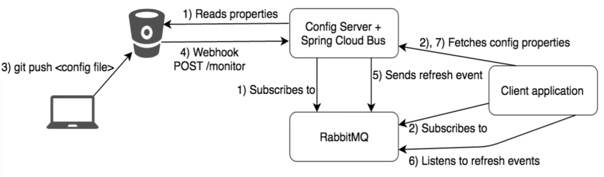

# 10. Spring Cloud Stream消息驱动

## 10.1 概述

### 10.1.1 是什么？

一句话：屏蔽底层消息中间件的差异，降低切换成本，统一消息的编程模型

官方定义Spring Cloud Stream是一个构建消息驱动微服务的框架

应用程序通过inputs或者outputs来与Spring Cloud Stream中binder对象交互。

通过我们配置来binding(绑定)，而Spring Cloud Stream的binder对象负责与消息中间件交互

所以，我们只需要搞清楚如何与Spring Cloud Stream交互就可以方便地使用消息驱动的方式

通过使用Spring Integration来连接消息代理中间件以实现消息事件驱动。

Spring Cloud Stream为一些供应商的消息中间件产品提供了个性化的自动化配置实现，引用了发布-订阅、消费组、分区的三个核心概念

目前仅支持RabbitMQ、kafka

### 10.1.2 Binder

在没有绑定器这个概念的情况下，我们的Spring Boot应用要直接与消息中间件进行信息交互的时候，由于各个消息中间件构建的初衷不同，它们的实现细节上会有较大的差异性，通过定义绑定器作为中间层，完美地实现了应用程序与消息中间件细节之间的隔离。Stream对消息中间件的进一步封装，可以做到代码层面对中间件的无感知，甚至于动态地切换中间件（rabbitmq切换为kafka），使得微服务开发高度解耦，服务可以关注更多自己的业务流程

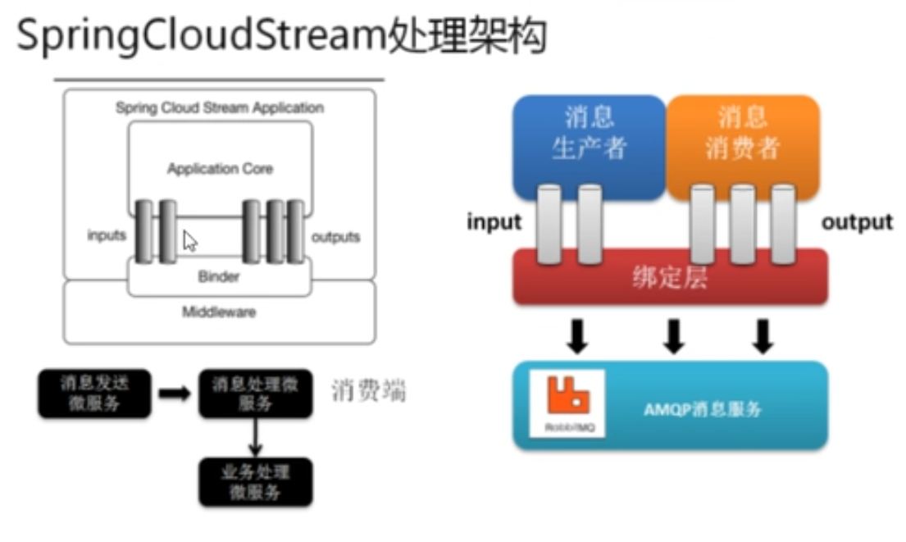

通过定义绑定器Binder作为中间层，实现了应用程序与消息中间件细节之间的隔离

Stream中的消息通信方式遵循了发布-订阅模式:使用topic主题进行广播

- 在RabbitMQ中就是Exchange
- 在kafka中就是Topic

### 10.1.3 Spring Cloud Stream标准流程套路

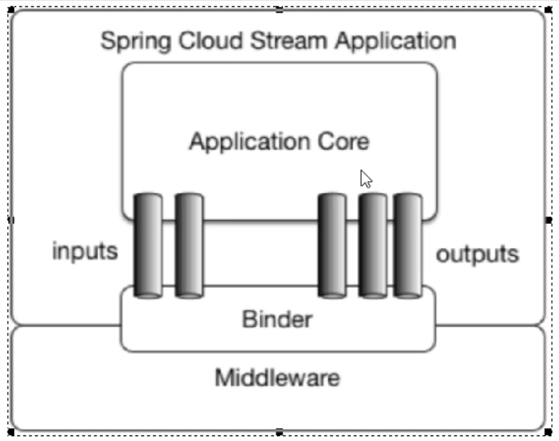

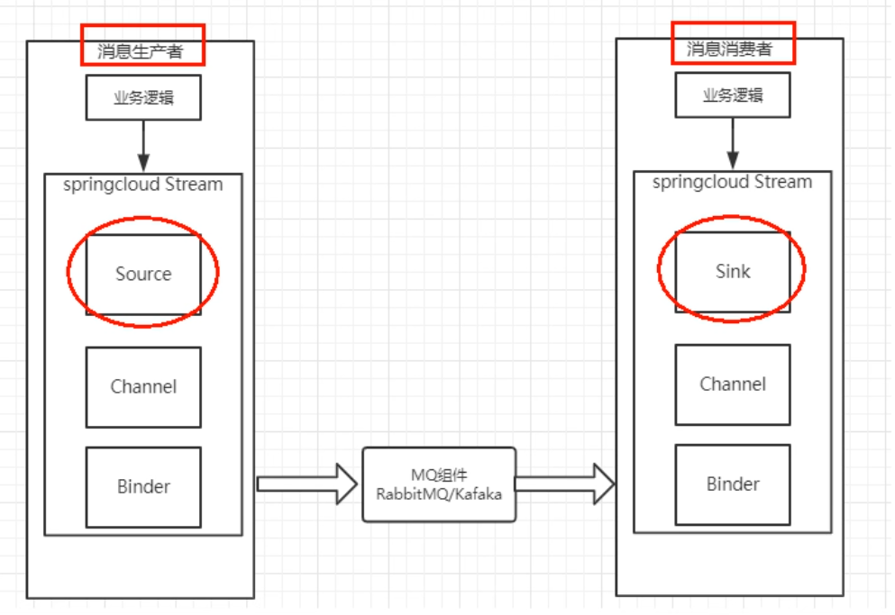

- Binder

  很方便地连接中间件，屏蔽差异

- Channel

  通道，是队列Queue的一种抽象，在消息通讯系统中就是实现存储和转发的媒介，通过Channel对队列进行配置

- Source和Sink

  简单的可理解为参照对象是Spring Cloud Stream自身，从Stream发布消息就是输出，接受消息就是输入

## 10.2 编码API和常用注解

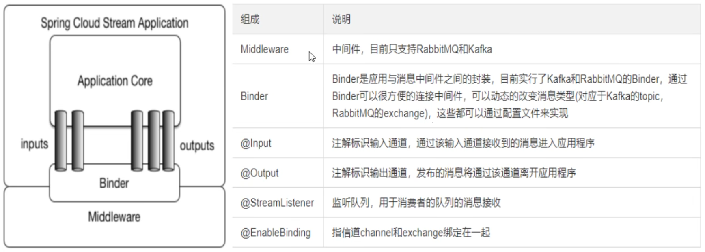

## 10.3 生产实际案例

比如在下面的场景中，订单系统我们做集群部署，都会从RabbitMQ中获取订单信息，那如果一个订单同时被两个服务获取到，那么就会造成数据错误，我们得避免这种情况。

这时我们就可以使用Stream中的消息分组来解决

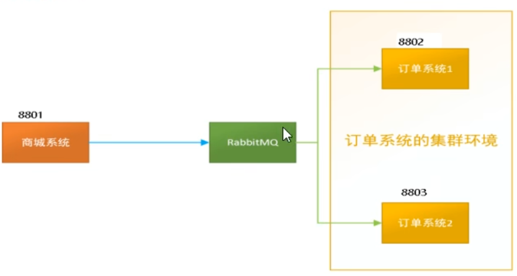

注意在Stream中处于同一个Group中的多个消费者是竞争关系，就能保证消息只会被其中一个应用消费一次。

不同组是可以全面消费的(重复消费)

# 11. Spring Cloud Sleuth 分布式请求链路跟踪

## 11.1 概述

### 11.1.1 为什么会出现Sleuth

在微服务框架中，一个由客户端发起的请求在后端系统中会经过不同的服务节点调用来协同产生最后的请求结果，每一个前端请求都会形成一条复杂的分布式服务调用链路，链路中的任何一环出现高延时或错误都会引起整个请求最后的失败

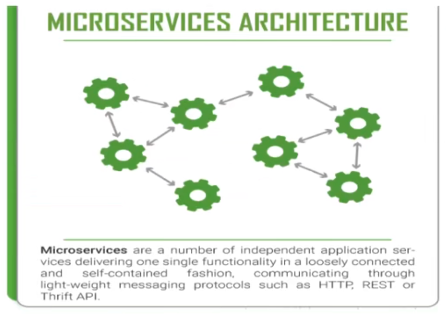

### 11.1.2 是什么？

Spring Cloud Sleuth提供了一套完整的服务跟踪的解决方案，在分布式系统中提供追踪解决方案并且兼容支持了zipkin

### 11.1.3 解决方案

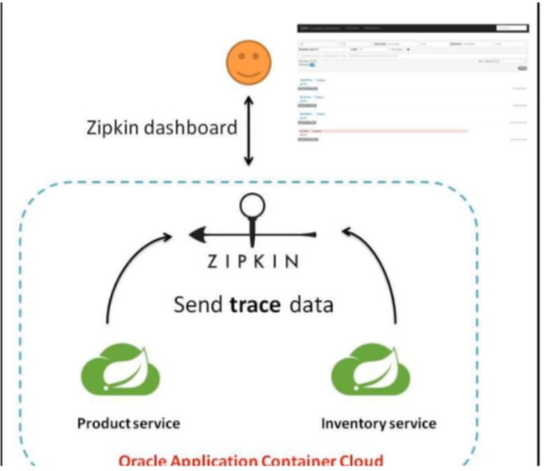

zipkin完整调用链路：

表示一请求链路，一条链路通过Trace Id唯一标识，Span表示发起的请求信息，各span通过parent id关联起来

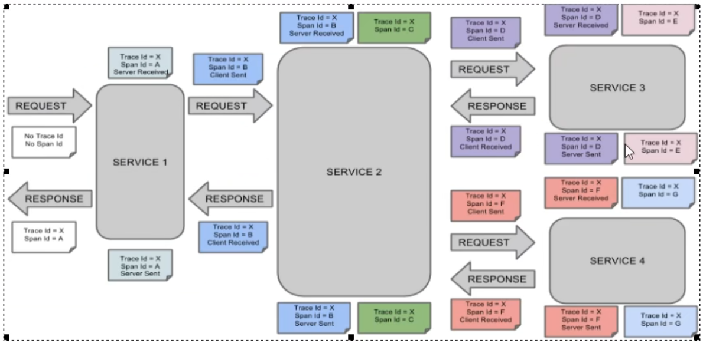

# 12. Spring Cloud Alibaba

## 12.1 为什么会出现Spring Cloud alibaba

Spring Cloud Netflix进入维护模式

什么是维护模式？

将模块置于维护模式，意味着Spring Cloud团队将不会再向模块添加新功能，我们将修复block级别的bug以及安全问题，我们也会考虑并审查社区的小型pull request

## 12.2 Spring Cloud alibaba带来了什么？

- 服务限流降级

  默认支持Servlet、Feign、RestTemplate、Dubbo和RocketMQ限流降级功能的接入，可以在运行时通过控制台实时修改限流降级规则，还支持查看限流降级Metrics监控

- 服务注册与发现

  适配Spring Cloud服务注册与发现标准，默认集成了Ribbon的支持

- 分布式配置管理

  支持分布式系统中的外部化配置，配置更改时自动刷新

- 消息驱动能力

  基于Spring Cloud Stream为微服务应用构建消息驱动能力

- 阿里云对象存储

  阿里云提供的海量、安全、低成本、高可靠的云存储服务。支持在任何应用、任何时间、任何地点存储和访问任意类型的数据。

- 分布式任务调度

  提供秒级、精准、高可靠、高可用的定时(基于Cron表达式)任务调度服务。同时提供分布式的任务执行模型，如网格任务。网格任务支持海量子任务均匀分配到所有Worker(schedulex-client)上执行

## 12.3 Spring Cloud alibaba学习资料获取

# 13. Spring Cloud alibaba Nacos服务注册与配置中心

## 13.1 简介

### 13.1.1 为什么叫Nacos

前4个字母分别为Naming和Configuration的前2个字母，最后的s为Service

### 13.1.2 是什么？

一个更易于构建云原生应用的动态服务发现、配置管理和服务管理平台

Nacos：Dynamic Naming and Configuration Service

Nacos就是注册中心+配置中心的组合

Nacos=Eureka+Config+Bus

### 13.1.3 作用

- 替代Eureka做服务注册中心
- 替代Config做服务配置中心

## 13.2 安装与运行

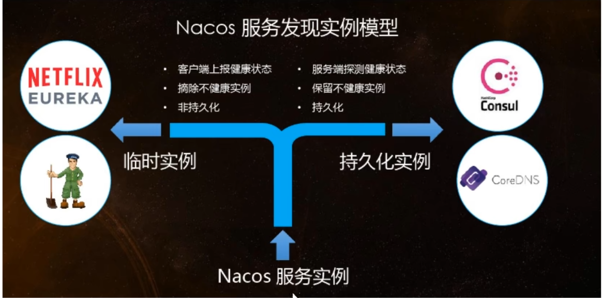

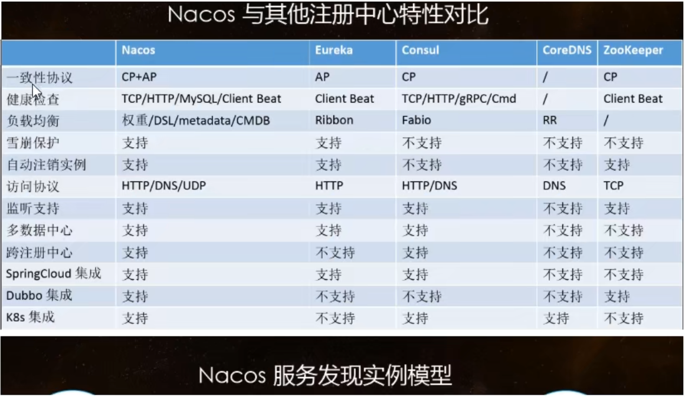

### 13.2.1 Nacos支持AP和CP模式的切换

C是所有节点在同一时间看到的数据是一致的；而A的定义是所有的请求都会收到响应

何时选择何种模式？

一般来说，

如果不需要存储服务级别的信息且服务实例是通过nacos-client注册，并能够保持心跳上报，那么就可以选择AP模式。当前主流的服务如Spring Cloud和Dubbo服务，都适用于AP模式，AP模式为了服务的可用性而减弱了一致性，因此AP模式下只支持注册临时实例

如果需要在服务级别编辑或存储配置信息，那么CP是必须，K8S服务和DNS服务则适用于CP模式

CP模式下则支持注册持久化实例，此时则是以Raft协议为集群运行模式，该模式下注册实例之前必须先注册服务，如果服务不存在，则会返回错误

### 13.2.2 服务配置中心

为什么配置两个？

Nacos同Springcloud-config一样，在项目初始化时，要保证先从配置中心进行配置拉取，拉取配置之后，才能保证项目的正常启动 

Springboot中配置文件的加载是存在优先级顺序的，bootstrap优先级高于application

### 13.2.3 Namespace+Group+Data ID三者关系？为什么这么设计？

1. 是什么？

   类似Java里面的的package名和类名

   最外层的namespace是可以用于区分部署环境的，Group和Data ID逻辑上区分两个目标对象

2. 三者情况

   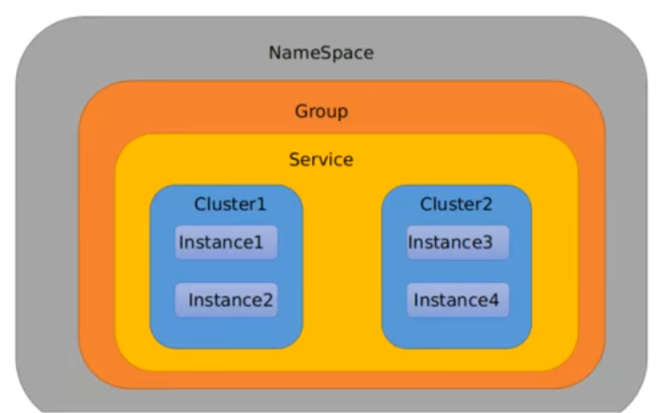

   默认情况：

   Namespace=public,Group=DEFAULT_GROUP,默认Cluster是DEFAULT

   Nacos默认的命名空间是public,Namespace主要用来实现隔离

   比方说我们现在有三个环境:开发、测试、生产环境，我们就可以创建三个Namespace,不同Namespace之间是隔离的

   Group默认是DEFAULT-GROUP,Group可以把不同的微服务划分到同一个分组里面去

   Service就是微服务；一个Service可以包含多个Cluster(集群)，Nacos默认Cluster是DEFAULT,Cluster是对指定微服务的一个虚拟划分。

   比方说为了容灾，将Service微服务分别部署在了杭州机房和广州机房

   这时就可以给杭州机房的Service微服务起一个集群名称(HZ),给广州机房的Service微服务起一个集群名称(GZ),还可以尽量让同一个机房的微服务相互调用，以提升性能

   最后是Instance,就是微服务的实例

## 13.3 集群和持久化配置(重要)

### 13.3.1 官网说明

默认Nacos使用嵌入式数据库实现数据的存储。所以，如果启动多个默认配置下的Nacos节点，数据存储是存在一致性问题的。为了解决这个问题，Nacos采用了集中式存储的方式来支持集群化部署，目前只支持MySQL的存储

**Nacos支持三种部署模式**

- 单机模式:用于测试和单机使用
- 集群模式:用于生产环境，确保高可用
- 多集群模式:用于多数据中心场景

**单机模式支持MySQL**

在0.7版本之前，在单机模式时nacos使用嵌入式数据库实现数据的存储，不方便观察数据存储的基本情况

0.7版本增加了支持MySQL数据源能力，具体操作步骤:

1. 安装数据库，版本要求：5.6.5+
2. 初始化MySQL数据库，数据库初始化文件：nacos-mysql.sql
3. 修改conf/application.properties文件，增加支持MySQL数据源配置(目前只支持MySQL)，添加MySQL数据源url、用户名和密码

再以单机模式启动nacos，nacos所有写嵌入式数据库的数据都写入到mysql

### 13.3.2 Nacos持久化配置解释

### 13.3.3 Linux版Nacos+MySQL生产环境配置

# 14. Sentinel实现熔断与限流

## 14.1 简介

### 14.1.1 Hystrix的缺点

1. 需要程序员自己手工搭建监控平台
2. 没有一套web界面可以给我们进行更加细粒度化的配置，流控、速率控制、服务熔断、服务降级

### 14.1.2 Sentinel的优点

1. 单独一个组件，可以独立出来
2. 直接界面化的细粒度统一配置

### 14.1.3 作用

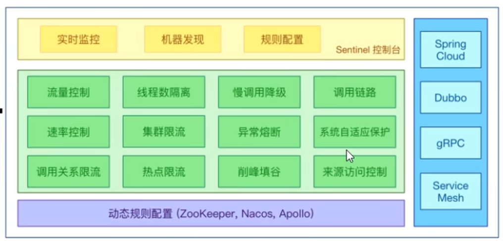

### 14.1.4 组成

Sentinel分为两部分：

- 核心库(Java客户端)不依赖任何框架/库，能够运行于所有Java运行时环境，同时对Dubbo/Spring Cloud等框架也有较好的支持
- 控制台(Dashboard)基于Spring Boot开发，打包后可以直接运行，不需要额外的Tomcat等应用容器

## 14.2 安装Sentinel控制台

## 14.3 初始化演示工程

## 14.4 流控规则

### 14.4.1 基本介绍

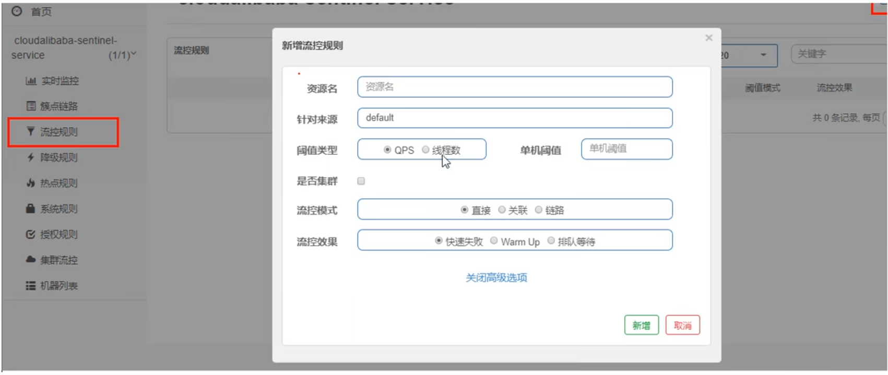

- 资源名

  唯一名称，默认请求路径

- 针对来源

  Sentinel可以针对调用者进行限流，填写微服务名，默认default(不区分来源)

- 阈值类型/单机阈值

  - QPS(每秒钟的请求数量):当调用该api的QPS达到阈值的时候，进行限流
  - 线程数：当调用该api的线程数达到阈值的时候进行限流

- 是否集群

  不需要集群

- 流控模式

  - 直接

    api达到限流条件时，直接限流

  - 关联

    当关联的资源达到阈值时，就限流自己

  - 链路

    只记录指定链路上的流量(指定资源从入口资源进来的流量，如果达到阈值，就进行限流)(api级别的针对来源)

- 流控效果

  - 快速失败：直接失败，抛出异常
  - Warm Up:根据codeFactor(冷加载因子，默认3)，从阈值/codeFactor,经过预热时长，才达到设置的QPS阈值
  - 排队等待：匀速排队，让请求以均匀的速度通过，阈值类型必须设置为QPS,否则无效

  

### 14.4.2 流控模式

1. 直接(默认)

   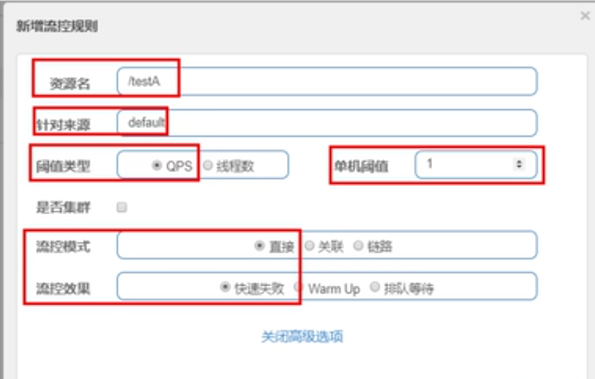

   表示1秒钟查询1次就是OK,若超过次数1，就直接快速失败，报默认错误

2. 关联

   当关联的资源达到阈值时，就限流自己

   当与A关联的资源B达到阈值后，就限流自己 

3. 链路

   多个请求调用了同一个微服务

### 14.4.3 流控效果

1. 直接->快速失败(默认的流控处理)

2. 预热

   应用场景:

   秒杀系统在开启的瞬间，会有很多流量上来，很有可能把系统打死，预热方式就是为了保护系统，可慢慢地把流量放进来，慢慢地把阈值增长到设置的阈值

3. 排队等待

   匀速排队，让请求以均匀的速度通过，阈值类型必须设成QPS,否则无效

   设置含义：/testA每秒1次请求，超过的话就排队等候，等待的超时时间为20000毫秒

   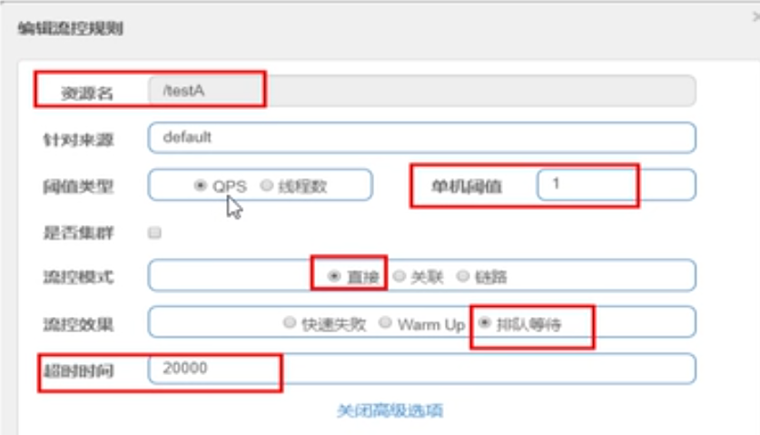

   匀速排队方式会严格控制请求通过的间隔时间，也就是让请求以均匀的速度通过，对应的是漏桶算法

   该方式的作用如下图所示:

   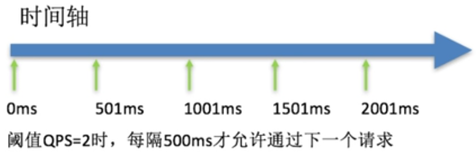

   这种方式主要用于处理间隔性突发的流量，例如消息队列。想象一下这样的场景，在某一秒有大量的请求到来，而接下来的几秒则处于空闲状态，我们希望系统能够在接下来的空闲期间逐渐处理这些请求，而不是第一秒直接拒绝多余的请求。

## 14.5 降级规则

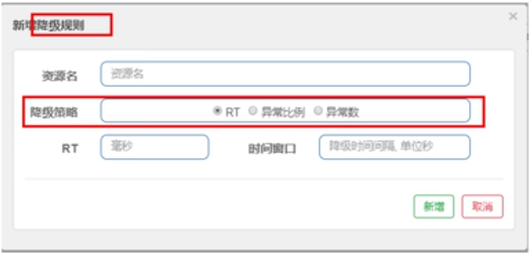

**RT(平均响应时间，秒级)**

平均响应时间 超出阈值 且在时间窗口内通过的请求≥5，两个条件同时满足后触发降级，窗口期过后关闭断路器

RT最大4900(更大的需要通过`-Dcsp.sentinel.statistic.max.rt=XXXX`才能生效)

**异常比例(秒级)**

QPS>=5 且 异常比例(秒级统计)超过阈值时，触发降级；时间窗口结束后，关闭降级

**异常数(分钟级)**

异常数(分钟统计)超过阈值时，触发降级；时间窗口结束后，关闭降级

**进一步说明**

Sentinel熔断降级会在调用链路中某个资源出现不稳定状态时(例如调用超时或异常比例升高)，对这个资源的调用进行限制，让请求快速失败，避免影响到其他的资源而导致级联错误

当资源被降级后，在接下来的降级时间窗口内，对该资源的调用都自动熔断(默认行为是抛出DegradeException)

**注意：Sentinel的断路器是没有半开状态的**

**什么是半开状态？**

半开的状态系统自动去检测是否请求有异常，没有异常就关闭断路器恢复使用，有异常则继续打开断路器。具体可以参考Hystrix

## 14.6 热点key限流

## 14.7 系统规则

## 14.8 @SentinelResource

## 14.9 服务熔断功能

## 14.10 规则持久化

# 15. Seata处理分布式事务

## 15.1 分布式事务问题

单体应用被拆分成微服务应用，原来的三个模块被拆分成三个独立的应用，分别是使用三个独立的数据源，业务操作需要调用三个服务来完成。此时每个服务内部的数据一致性由本地事务来保证，但是全局的数据一致性问题没法保证。

> 用户购买商品的业务逻辑。整个业务逻辑由3个微服务提供支持:
>
> - 仓储服务:对给定的商品扣除存储数量
> - 订单服务:根据采购需求创建订单
> - 账户服务:从用户账户中扣除余额

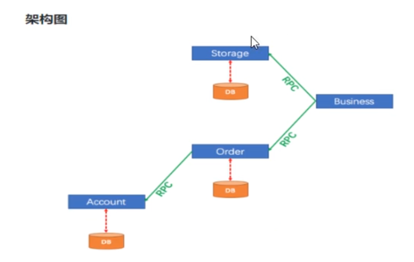

一次业务操作需要跨多个数据源或需要跨多个系统进行远程调用，就会产生分布式事务问题

## 15.2 Seata简介

官网：seata.io

### 15.2.1 是什么？

Seata是一款开源的分布式事务解决方案，致力于在微服务架构下提供高性能和简单易用的分布式事务服务

一个典型的分布式事务过程

分布式事务处理过程的一ID+三组件模型：

Transaction ID XID :全局唯一的事务ID

3组件概念：

- Transaction Coordinator(TC)

  事务协调器，维护全局事务的运行状态，负责协调并驱动全局事务的提交或回滚

- Transaction Manager(TM)

  控制全局事务的边界，负责开启一个全局事务，并最终发起全局提交或全局回滚的决议

- Resource Manager(RM)

  控制分支事务，负责分支注册、状态汇报，并接收事务协调器的指令，驱动分支(本地)事务的提交或回滚

### 15.2.2 处理过程

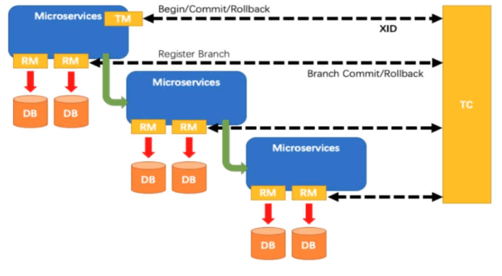

1. TM向TC申请开启一个全局事务，全局事务创建成功并生成一个全局唯一的XID
2. XID在微服务调用链路的上下文中传播
3. RM向TC注册分支事务,将其纳入XID对应全局事务的管辖
4. TM向TC发起针对XID的全局提交或回滚协议
5. TC调度XID下管辖的全部分支事务完成提交或回滚请求

### 15.2.3 Seata的分布式交易解决方案

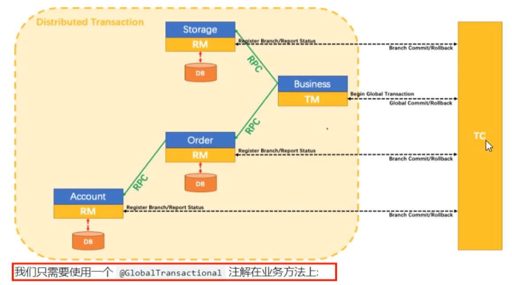

## 15.3 Seata-Server安装

# 16. 集群高并发情况下如何保证分布式唯一全局id生成？

