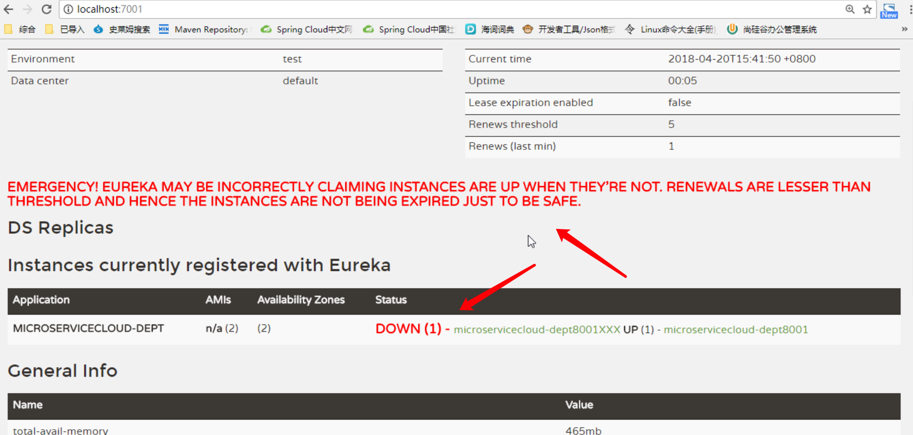

[TOC]

# 1. 从面试题开始

## 1.1 什么是微服务？


## 1.2 微服务之间是如何独立通讯的？


## 1.3 SpringCloud和Dubbo有哪些区别？


## 1.4 请谈谈你对SpringBoot和SpringCloud的理解


## 1.5 什么是服务熔断？什么是服务降级？


## 1.6 微服务的优缺点分别是什么？说下你在项目中碰到的坑


## 1.7 你所知道的微服务技术栈有哪些？列举一二


## 1.8 Eureka和Zookeeper都可以提供服务注册与发现功能，说说两者的区别

# 2. 微服务概述

## 2.1 是什么？

通常而言，微服务架构是一种架构模式或者说是一种架构风格，它**提倡将单一应用程序划分成一组小的服务，每个服务运行在其独立的自己的进程中**，服务之间相互协调、互相配合，为用户提供最终价值。服务之间采用轻量级的通信机制互相沟通(通常是基于HTTP的RESTful API)。每个服务都围绕着具体业务进行构建，并且能够被独立地部署到生产环境、类生产环境。另外，应尽量避免统一的、集中式的服务管理机制，对具体的一个服务而言，应根据业务上下文，选择合适的语言、工具对其进行构建，可以有一个非常轻量级的集中式管理来协调这些服务，可以使用不同的语言来编写服务，也可以使用不同的数据存储。

## 2.2 微服务与微服务架构

### 2.2.1 微服务

强调的是服务的大小，它关注的是某一个点，是具体解决某一个问题/提供落地对应服务的一个服务应用，狭义地看，可以看做eclipse里面的一个个微服务工程/Module

### 2.2.2 微服务架构

微服务架构是一种架构模式或者说是一种架构风格，它**提倡将单一应用程序划分成一组小的服务，每个服务运行在其独立的自己的进程中**，服务之间相互协调、互相配合，为用户提供最终价值。服务之间采用轻量级的通信机制互相沟通(通常是基于HTTP的RESTful API)。每个服务都围绕着具体业务进行构建，并且能够被独立地部署到生产环境、类生产环境。另外，应尽量避免统一的、集中式的服务管理机制，对具体的一个服务而言，应根据业务上下文，选择合适的语言、工具对其进行构建

## 2.3 微服务优缺点

### 2.3.1 优点

1. 每个服务足够内聚，足够小，代码容易理解，这样能聚焦一个指定的业务功能或者业务需求

2. 开发简单、开发效率高，一个服务可能就是专一地只干一件事情

3. 微服务能够被小团队单独开发，这个小团队是2到5人的开发人员组成

4. 微服务是松耦合的，是有功能意义的服务，无论是在开发阶段或部署阶段都是独立的

5. 微服务能使用不同的语言开发
6. 易于和第三方集成，微服务允许容易且灵活的方式集成自动部署，通过持续集成工具，如Jenkins,Hudson,bamboo
7. 微服务易于被一个开发人员理解，修改和维护，这样小团队能够更关注自己的工作成果。无须通过合作才能体现价值
8. 微服务允许利用融合新技术
9. 微服务只是业务逻辑代码，不会和HTML、CSS或者其他界面组件混合
10. 每个微服务都有自己的存储能力，可以有自己的数据库。也可以有统一的数据库

### 2.3.2 缺点

1. 开发人员要处理分布式系统的复杂性
2. 多服务运维难度，随着服务的增加，运维的压力也在增大
3. 系统部署依赖
4. 服务间通信成本
5. 数据一致性
6. 系统集成测试
7. 性能监控


## 2.4 微服务技术栈有哪些?

|               微服务条目               | 落地技术                                                   |
| :------------------------------------: | ---------------------------------------------------------- |
|                服务开发                | SpringBoot/Spring/SpringMVC                                |
|             服务配置与管理             | Netflix公司的Archaius/阿里的Diamond                        |
|             服务注册与发现             | Eureka、Consul、Zookeeper                                  |
|                服务调用                | Rest、RPC、gRPC                                            |
|               服务熔断器               | Hystrix、Envoy                                             |
|                负载均衡                | Ribbon、Nginx                                              |
| 服务接口调用(客户端调用服务的简化工具) | Feign                                                      |
|                消息队列                | Kafka、RabbitMQ、ActiveMQ                                  |
|            服务配置中心管理            | SpringCloudConfig、Chef                                    |
|           服务路由(API网关)            | Zuul                                                       |
|                服务监控                | Zabbix、Nagios、Metrics、Spectator                         |
|               全链路追踪               | Zipkin/Brave/Dapper                                        |
|                服务部署                | Docker、Openstack、Kubernetes                              |
|            数据流操作开发包            | SpringCloud Stream(封装与Redis,Rabbit/Kafka等发送接收消息) |
|              事件消息总线              | SpringCloud Bus                                            |

### 2.4.1 选型依据

1. 整体解决方案和框架成熟度
2. 社区热度
3. 可维护性
4. 学习曲线

### 2.4.2 当前各大IT公司用的微服务架构有哪些

1. 阿里 Dubbo/HSF
2. 京东JSF
3. 新浪微博Motan
4. 当当网DubboX

### 2.4.3 各微服务框架对比

|     功能点     | Netflix/Spring cloud                                         | motan                                                        | grpc                      | thrift   | dubbo/dubbox     |
| :------------: | ------------------------------------------------------------ | ------------------------------------------------------------ | ------------------------- | -------- | ---------------- |
|    功能定位    | 完整的微服务框架                                             | RPC框架，但整合了ZK或Consul，实现集群环境的基本的服务注册与发现 | RPC框架                   | RPC框架  | 服务框架         |
|    支持Rest    | 是，Ribbon支持多种可插拔的序列化选择                         | 否                                                           | 否                        | 否       | 否               |
|    支持RPC     | 否                                                           | 是(Hession2)                                                 | 是                        | 是       | 是               |
|   支持多语言   | 是(Rest形式)                                                 | 否                                                           | 是                        | 是       | 否               |
| 服务注册与发现 | 是(Eureka) Eureka服务注册表，Karyon服务端框架支持服务注册和健康检查 | 是(zookeeper/consul)                                         | 否                        | 否       | 是               |
|    负载均衡    | 是(服务端zuul+客户端Ribbon) Zuul-服务，动态路由 云端负载均衡 Eureka(针对中间层服务器) | 是(客户端)                                                   | 否                        | 否       | 是(客户端)       |
|    配置服务    | Netflix Archaius Spring cloud Config Server集中配置          | 是(Zookeeper提供)                                            | 否                        | 否       | 否               |
| 服务调用链监控 | 是(zuul),Zuul提供边缘服务，API网关                           | 否                                                           | 否                        | 否       | 否               |
|  高可用/容错   | 是(服务端Hystrix+客户端Ribbon)                               | 是(客户端)                                                   | 否                        | 否       | 是(客户端)       |
|  典型应用案例  | Netflix                                                      | Sina                                                         | Google                    | Facebook |                  |
|  社区活跃程度  | 高                                                           | 一般                                                         | 高                        | 一般     | 不再维护         |
|    学习难度    | 中等                                                         | 低                                                           | 高                        | 高       | 低               |
|   文档丰富度   | 高                                                           | 一般                                                         | 一般                      | 一般     | 高               |
|      其他      | SpringCloud Bus为我们的应用程序带来了更多的管理端点          | 支持降级                                                     | Netflix内部在开发集成gRPC | IDL定义  | 事件的公司比较多 |
|                |                                                              |                                                              |                           |          |                  |


## 2.5 为什么选择SpringCloud作为微服务架构


# 3. SpringCloud入门概述

## 3.1 是什么？

基于SpringBoot提供了一套微服务解决方案，包括服务注册与发现，配置中心，全链路监控，服务网关，负载均衡，熔断器等组件，除了基于Netflix的开源组件做高度抽象封装之外，还有一些选型中立的开源组件。


SpringCloud利用SpringBoot的开发便利性巧妙地简化了分布式系统基础设施的开发，SpringCloud为开发人员提供了快速构建分布式系统的一些工具，包括配置管理、服务发现、断路器、路由、微代理、事件总线、全局锁、决策竞选、分布式会话等，它们都可以用SpringBoot的开发风格做到一键启动和部署


SpringBoot并没有重复制造轮子，它只是将目前各家公司开发的比较成熟、经得起实际考验的服务框架组合起来，通过SpringBoot风格进行再封装屏蔽掉了复杂的配置和实现原理，最终给开发者留出了一套简单易懂、易部署和易维护的分布式系统开发工具包


**一句话概括：SpringCloud=分布式微服务架构下的一站式解决方案，是各个微服务架构落地技术的集合体，俗称微服务全家桶**

### 3.1.1 SpringCloud和SpringBoot是什么关系？

SpringBoot专注于快速方便的开发单个个体微服务

SpringCloud是关注全局的微服务协调整理治理框架，它将SpringBoot开发的一个个单体微服务整合并管理起来，为各个微服务之间提供配置管理、服务发现、断路器、路由、微代理、事件总线、全局锁、决策竞选、分布式会话等集成服务

SpringBoot可以离开SpringCloud独立使用开发项目，但是SpringCloud离不开SpringBoot,属于依赖关系


**一句话总结：**

SpringBoot专注于快速、方便的开发单个微服务个体，SpringCloud关注全局的服务治理框架


### 3.1.2 SpringCloud和Dubbo的对比

|    对比项    | dubbo         | springcloud                  |
| :----------: | ------------- | ---------------------------- |
| 服务注册中心 | Zookeeper     | Spring Cloud Netflix Eureka  |
| 服务调用方式 | RPC           | REST API                     |
|   服务监控   | Dubbo-monitor | Spring Boot Admin            |
|    断路器    | 不完善        | Spring Cloud Netflix Hystrix |
|   服务网关   | 无            | Spring Cloud Netflix Zuul    |
|  分布式配置  | 无            | Spring Cloud Config          |
|   服务跟踪   | 无            | Spring Cloud Sleuth          |
|   消息总线   | 无            | Spring Cloud Bus             |
|    数据流    | 无            | Spring Cloud Stream          |
|   批量任务   | 无            | Spring Cloud Task            |


**最大的区别：**SpringCloud抛弃了Dubbo的RPC通信，采用的是基于HTTP的REST方式

严格来说，这两种方式各有优劣。虽然从一定程度上来说，后者牺牲了服务调用的性能，但也避免了上面提到的原生RPC带来的问题。而且REST相比RPC更为灵活，服务提供方和调用方的依赖只依靠一纸契约，不存在代码级别的强依赖，这在强调快速演化的微服务环境下，显得更加合适


**Dubbo研发刘军对两者的对比总结：**

两者所解决的问题域不一样：Dubbo的定位始终是一款PRC框架，而Spring Cloud的目标是微服务架构下的一站式解决方案，Dubbo可以类比到Netflix OSS技术栈，而Spring Cloud集成了Netflix OSS作为分布式服务治理解决方案，但是初次之外Spring Cloud还提供了包括config、stream、security、sleuth等分布式问题解决方案

## 3.2 用途

1. 分布式/版本控制配置
2. 服务注册与发现
3. 路由
4. 服务到服务的调用
5. 负载均衡配置
6. 断路器
7. 分布式消息管理

## 3.3 下载地址

### 3.3.1 官网

http://projects.spring.io/spring-cloud

### 3.3.2 参考书

https://springcloud.cc/spring-cloud-netflix.html

spring cloud 中文网

https://www.springcloud.cc/

## 3.4 使用

1. 服务注册与发现(Eureka)
2. 服务消费者(rest+Ribbon)
3. 服务消费者(Feign)
4. 断路器(Hystrix)
5. 断路器监控(Hystrix Dashboard)
6. 路由网关(Zuul)
7. 分布式配置中心(Spring Cloud Config)
8. 消息总线(Spring Cloud Bus)
9. 服务链路追踪(Spring Cloud Sleuth)

# 4. Rest微服务构建案例工程模块

## 4.1 构建父工程(maven)

工程名：microservicecloud

pom.xml文件内容：

```xml
<?xml version="1.0" encoding="UTF-8"?>
<project xmlns="http://maven.apache.org/POM/4.0.0" xmlns:xsi="http://www.w3.org/2001/XMLSchema-instance"
         xsi:schemaLocation="http://maven.apache.org/POM/4.0.0 https://maven.apache.org/xsd/maven-4.0.0.xsd">
    <modelVersion>4.0.0</modelVersion>
    <parent>
        <groupId>org.springframework.boot</groupId>
        <artifactId>spring-boot-starter-parent</artifactId>
        <version>2.5.0</version>
        <relativePath/> <!-- lookup parent from repository -->
    </parent>
    <groupId>net.codeshow</groupId>
    <artifactId>microservicecloud</artifactId>
    <version>0.0.1-SNAPSHOT</version>
    <name>microservicecloud</name>
    <description>Demo project for Spring Boot</description>
    <properties>
        <java.version>1.8</java.version>
        <project.build.sourceEncoding>UTF-8</project.build.sourceEncoding>
        <maven.compiler.source>1.8</maven.compiler.source>
        <maven.compiler.target>1.8</maven.compiler.target>
        <junit.version>4.12</junit.version>
        <log4j.version>1.2.17</log4j.version>
        <lombok.version>1.16.18</lombok.version>

    </properties>
    <dependencyManagement>
        <dependencies>
            <dependency>
                <groupId>org.springframework.boot</groupId>
                <artifactId>spring-boot-starter</artifactId>
            </dependency>

            <dependency>
                <groupId>org.springframework.boot</groupId>
                <artifactId>spring-boot-starter-test</artifactId>
                <scope>test</scope>
            </dependency>
            <!-- https://mvnrepository.com/artifact/org.springframework.cloud/spring-cloud-dependencies -->
            <dependency>
                <groupId>org.springframework.cloud</groupId>
                <artifactId>spring-cloud-dependencies</artifactId>
                <version>Dalston.SR1</version>
                <type>pom</type>
                <scope>runtime</scope>
            </dependency>
            <!-- https://mvnrepository.com/artifact/org.springframework.boot/spring-boot-dependencies -->
            <dependency>
                <groupId>org.springframework.boot</groupId>
                <artifactId>spring-boot-dependencies</artifactId>
                <version>1.5.9.RELEASE</version>
                <type>pom</type>
                <scope>provided</scope>
            </dependency>
            <!-- https://mvnrepository.com/artifact/mysql/mysql-connector-java -->
            <dependency>
                <groupId>mysql</groupId>
                <artifactId>mysql-connector-java</artifactId>
                <version>5.0.4</version>
            </dependency>
            <!-- https://mvnrepository.com/artifact/com.alibaba/druid -->
            <dependency>
                <groupId>com.alibaba</groupId>
                <artifactId>druid</artifactId>
                <version>1.0.31</version>
            </dependency>

            <!-- https://mvnrepository.com/artifact/org.mybatis.spring.boot/mybatis-spring-boot-starter -->
            <dependency>
                <groupId>org.mybatis.spring.boot</groupId>
                <artifactId>mybatis-spring-boot-starter</artifactId>
                <version>1.3.0</version>
            </dependency>
            <!-- https://mvnrepository.com/artifact/ch.qos.logback/logback-core -->
            <dependency>
                <groupId>ch.qos.logback</groupId>
                <artifactId>logback-core</artifactId>
                <version>1.2.3</version>
            </dependency>
            <dependency>
                <groupId>junit</groupId>
                <artifactId>junit</artifactId>
                <version>${junit.version}</version>
                <scope>test</scope>
            </dependency>
            <dependency>
                <groupId>log4j</groupId>
                <artifactId>log4j</artifactId>
                <version>${log4j.version}</version>
            </dependency>
        </dependencies>
    </dependencyManagement>

    <build>
        <plugins>
            <plugin>
                <groupId>org.springframework.boot</groupId>
                <artifactId>spring-boot-maven-plugin</artifactId>
            </plugin>
        </plugins>
    </build>

</project>

```

## 4.2 公共子模块


## 4.3 部门微服务提供者模块


## 4.4 部门微服务消费者模块


# 5. Eureka服务注册与发现

## 5.1 是什么？

Netflix在设计Eureka时遵守的是AP原则

Eureka是Netflix的一个子模块，也是核心模块之一。Eureka是一个基于REST的服务，用于定位服务，以实现云端中间层服务发现和故障转移。服务注册与发现对于微服务架构来说是非常重要的，有了服务发现与注册，只需要使用服务的标识符，就可以访问到服务，而不需要修改服务调用的配置文件。功能类似于Dubbo的注册中心，比如Zookeeper

## 5.2 原理

### 5.2.1 基本架构

Spring Cloud封装了Netflix公司开发的Eureka模块来实现服务注册与发现(对比Zookeeper)

Eureka采用了C-S的设计架构。Eureka Server作为服务注册功能的服务器，它是服务注册中心

系统中的其他微服务，使用Eureka的客户端连接到Eureka Server并维持心跳连接，这样系统的维护人员就可以通过Eureka Server来监控系统中各个微服务是否正常运行。Spring Cloud的一些其他模块(比如Zuul)就可以通过Eureka Server来发现系统中的其他微服务，并执行相关的逻辑

下面是Eureka 的架构图


**下面是Dubbo的架构图**


Eureka包含两个组件：Eureka Server和Eureka Client

**Eureka Server提供服务注册服务:**

各个节点启动后，会在Eureka Server中进行注册，这样Eureka Server中的服务注册表中将会存储所有可用服务节点的信息，服务节点的信息可以在界面中直观的看到


Eureka Client是一个Java客户端，用于简化Eureka Server的交互，客户端同时也具备一个内置的、使用轮询(round-robin)负载算法的负载均衡器。在应用启动后，将会向Eureka Server发送心跳(默认周期为30秒)。如果Eureka Server在多个心跳周期内没有接收到某个节点的心跳，Eureka Server将会从服务注册表中把这个服务节点移出(默认是90秒)

### 5.2.2 三大角色

1. Eureka Server

   提供服务注册与发现

2. Service Provider

   服务提供方将自身服务注册到Eureka,从而使服务消费方能够找到

3. Service Consumer

   服务消费方从Eureka获取注册服务列表，从而能够消费服务

## 5.3 构建步骤

### 5.3.1 自我保护机制

**现象：**



**导致原因：**

一句话：某时刻某一个微服务不可用了，eureka不会立刻清理，一会会对该微服务的信息进行保存

详细版：

默认情况下，如果Eureka Server在一定时间内没有接收到某个微服务实例的心跳，Eureka Server将会注销该实例(默认是90秒)，但是当网络分区故障发生时，微服务与Eureka Server之间无法正常通信，以上行为就变得非常危险了--因为微服务本身其实是健康的，此时本不应该注销这个微服务。Eureka通过“自我保护模式”来解决这个问题--当Eureka Server节点在短时间内丢失过多客户端时(可能发生了网络分区故障)，那么这个节点就会进入自我保护模式。一旦进入该模式，Eureka Server就会保护服务注册表中的信息，不再删除服务注册表中的数据(也就是不会注销任何微服务)。当网络故障恢复后，该Eureka Server节点会自动退出自我保护模式


在自我保护模式中，Eureka Server会保护服务注册表中的信息，不再注销任何服务实例。当它收到的心跳数重新恢复到阈值以上时，该Eureka Server节点就会自动退出自我保护模式。它的设计哲学就是宁可保留错误的服务注册信息，也不盲目注销任何可能健康的服务实例。一句话讲解:好死不如赖活着


综上，自我保护模式是一种应对网络异常的安全保护措施。它的架构哲学是宁可同时保留所有微服务(健康的微服务和不健康的微服务都会保留)，也不盲目注销任何健康的微服务。使用自我保护模式，可以让Eureka集群更加的健壮、稳定。


在Spring Cloud中，可以使用`eureka.server.enable-self-preservation=false`禁用自我保护模式

## 5.4 集群配置


## 5.5 作为服务注册中心，Eureka比Zookeeper好在哪里

两者的区别点：Eureka遵守AP,Zookeeper遵守CP

**Zookeeper保证CP:**

当向注册中心查询服务列表时，我们可以容忍注册中心返回的是几分钟以前的注册信息，但不能接受服务直接down掉不可用。也就是说，服务注册功能对可用性的要求要高于一致性。但是zk会出现这样一种情况，当master节点因为网络故障与其他节点失去联系时，剩余节点会重新进行leader选举。问题在于，选举leader的时间太长，30-120s，且选举期间整个zk集群都是不可用的，这就导致在选举期间注册服务瘫痪。在云部署的环境下，因网络问题使得zk集群失去master节点是较大概率会发生的事，虽然服务能最终恢复，但是漫长的选举时间导致的注册长期不可用是不能容忍的。


**Eureka保证AP:**

Eureka各个节点都是平等的，介个节点挂掉不会影响正常节点的工作，剩余的节点依然可以提供注册和查询服务。而Eureka的客户端在向某个Eureka注册时如果发现连接失败，则会自动切换至其他节点，只要有一台Eureka还在，就能保证注册服务可用(保证可用性)，只不过查到的信息可能不是最新的(不保证强一致性)。除此之外，Eureka还有一种自我保护机制，如果在15分钟内超过85%的节点都没有正常的心跳，那么Eureka就认为客户端与注册中心出现了网络故障，此时会出现一下几种情况:

1. Eureka不再从注册列表中移除因为长时间没收到心跳而应该过期的服务
2. Eureka仍然能够接受新的注册和查询请求，但是不会被同步到其他节点上(即保证当前节点依然可用)
3. 当网络稳定时，当前实例新的注册信息会被同步到其他节点中

因此，Eureka可以很好地应对因网络故障导致部分节点失去联系的情况，而不会向Zookeeper那样使整个注册服务瘫痪


复习:

**ACID:**

A(Atomicity):原子性

C(Consistency):一致性

I(Isolation):独立性

D(Durability):持久性

**CAP:**

C(Consistency)：强一致性

A(Availabiliby):可用性

P(Partition tolerance):分区容错性


**BASE:**

B(Basically Available):基本可用

S(Soft State):软状态

E(Eventual Consistency):最终一致性


---

如下图所示，最多只能较好的满足两个

CAP理论的核心是:一个分布式系统不可能同时很好的满足一致性，可用性和分区容错性这三个需求，因此，根据CAP原理将NoSQL数据库分成了满足CA原则、满足CP原则和满足AP原则三大类

- CA-单点集群，满足一致性，可用性的系统，通常在可扩展性上不太强大
- CP-满足一致性，分区容忍性的系统，通常性能不是特别高
- AP-满足可用性，分区容忍性的系统，通常可能对一致性要求低一些


CAP理论就是说在分布式系统存储系统中，最多只能实现上面的两点。而由于当前的网络硬件肯定会出现延迟丢包等问题，所以分区容忍性是我们必须需要实现的。

所以我们只能在一致性和可用性之间进行权衡，没有NoSQL系统能同时保证这三点

# 6. Ribbon负载均衡

## 6.1 是什么？

Spring Cloud Ribbon是基于Netflix Ribbon实现的一套客户端负载均衡的工具

简单的说，Ribbon是Netflix发布的开源项目，主要功能是提供客户端的软件负载均衡算法，将Netflix的中间层服务连接在一起。Ribbon客户端组件提供一系列完善的配置项如连接超时，重试等。简单的说，就是在配置文件中列出Load Balancer(简称LB)后面所有的机器，Ribbon会自动的帮助你基于某种规则(如简单轮询，随机连接等)去连接这些机器。我们也很容易使用Ribbon实现自定义的负载均衡算法

## 6.2 用途

负载均衡：

LB，即负载均衡(Load Balance),在微服务或分布式集群中经常用的一种应用。

负载均衡简单的说就是将用户的请求平摊的分配到多个服务上，从而达到系统的HA

常见的负载均衡有软件Nginx,LVS,硬件F5等

相应的在中间件，例如dubbo和Spring Cloud中均给我们提供了负载均衡，Spring Cloud的负载均衡算法可以自定义

## 6.3 负载均衡分类

### 6.3.1 集中式LB

即在服务的消费方和提供方之间使用独立的LB设施(可以是硬件，如F5,也可以是软件，如Nginx),由该设施负责把访问请求通过某种策略转发至服务的提供方

### 6.3.2 进程内LB

将LB逻辑集成到消费方，消费方从服务注册中心获知有哪些地址可用，然后自己再从这些地址中选择出一个合适的服务器

Ribbon就属于进程内LB,它只是一个类库，集成于消费方进程，消费方通过它来获取服务提供方的地址


## 6.4 架构说明


Ribbon在工作时分成两步：

1. 选择Eureka Server，优先选择在同一个区域内负载较少的server
2. 根据用户指定的策略，在从server取到的服务注册列表中选择一个地址

其中Ribbon提供了多种策略:比如轮询、随机和根据响应时间加权


总结：

Ribbon其实就是一个软负载均衡的客户端组件，它可以和其他所需请求的客户端结合使用，和Eureka结合只是其中的一个实例


## 6.5 Rebbion核心组件IRule

IRule:根据特定算法从服务列表中选取一个要访问的服务

### 6.5.1 RoundRobinRule

轮询

### 6.5.2 RandomRule

随机

### 6.5.3 AvailabilityFilteringRule

会先过滤掉由于多次访问故障而处于断路器跳闸状态的服务，还有并发的连接数量超过阈值的服务，然后对剩余的服务列表按照轮询策略进行 访问

### 6.5.4 WeightedResponseTimeRule

根据平均响应时间计算所有服务的权重，响应时间越快服务权重越大被选中的概率越大，刚启动时如果统计信息不足，则使用RoundRobinRule策略，等统计信息足够时会切换到WeightedResponseTimeRule

### 6.5.5 RetryRule

先按照RoundRobinRule的策略获取服务，如果获取服务失败则在指定时间内会进行重试，获取可用的服务


### 6.5.6 BestAvailableRule

会先过滤掉由于多次访问故障而处于断路器跳闸状态的服务，然后选择一个并发量最小的服务


### 6.5.7 ZoneAvoidanceRule

默认规则，复合判断server所在区域的性能和server的可用性选择服务器


# 7. Feign负载均衡


# 8.Hystrix断路器


# 9.zuul路由网关


# 10. SpringCloud Config分布式配置中心


# 11. 总结

