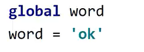
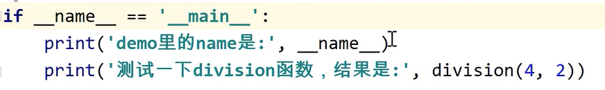
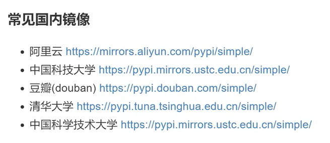

[TOC]

# 1. 变量和数据类型

## 1.1 数据类型

+ 数字类型

  整型int、浮点型float、复数complex

  注意长整型long在python3中已经被废弃了

+ 字符串类型

+ 布尔类型(bool)

  可取值：True,False   注意首字母是大写

+ 列表(list)

+ 元组(tuple)

+ 字典dict

+ 集合set

注意：在python里，变量是没有数据类型的，我们所说变量的数据类型，其实是变量对应的值的数据类型

## 1.2 标识符规范

在python里的变量、函数和模块名使用下划线连接，类名使用大驼峰命名法

## 1.3 运算符

1. 加法运算符

   在字符串中只能用于两个字符串类型的数据，用来拼接两个字符串，不支持字符串和整数进行加法运算

2. 乘法运算符

   在字符串中，乘法运算符可以用于数字和字符串之间，用来将一个字符串重复多次

   ```python
   print('hello' * 2) # hellohello
   ```

## 1.4 unpack(拆包)

```python
m, n = 3, 5
print(m, n) # 3 5
```

如果一个变量要接收多个拆包后的值，可以这样写

```python
o, *p, q = 1, 2, 3, 4, 5, 6
print(o, p, q) # 1 [2, 3, 4, 5] 6
```

上述代码中*p表示可变长度


## 1.5 逻辑运算的优先级

not >  and > or

## 1.6 字符串类型的操作

字符串类型是不可变的，对字符串的任何操作都不会改变原有字符串

find()和index()都是获取字符串中某个字符的索引，不同的是，如果目标字母没找到，find返回-1，index报错

 

## 1.7 切片

切片就是从字符串里复制一段指定的内容，生成一个新的字符串

s[`start:end:step`​]

包含start不包括end

step默认为1,不能为0，可以是负数，注意如果step是负数，start要大于end


## 1.8 交换两个变量的值的方法

1. 方法1：使用第三个变量

   ```python
   c=b
   b=a
   a=c
   ```

   

2. 使用运算符来实现，此时变量只能是数字

   ```python
   a=a+b
   b=a-b
   a=a-b
   ```

   

3. 使用异或运算符

   ```python
   a=a^b
   b=a^b
   a=a^b
   ```

4. python中特有的方法

   ```python
   a,b=b,a
   ```


## 1.9 可变类型和不可变类型

python里的数据都是保存到内存里的

python里的数据又分为可变类型和不可变类型

不可变类型：字符串、数字、元组

可变类型：列表、字典、集合

不可变数据类型如果修改值，内存地址会发生变化

可变数据类型，如果修改值，内存地址不会发生变化


# 2. 列表

列表可以使用extend方法将两个列表合并成为一个列表

```python
nums1 = [1, 2, 3, 4, 5]
num2 = [6, 7, 8, 9]
nums1.extend(num2)
print(nums1) # [1, 2, 3, 4, 5, 6, 7, 8, 9]
# 下面这种合并列表的方法也可以
print(nums1 + num2)# [1, 2, 3, 4, 5, 6, 7, 8, 9]
```


## 2.1 列表推导式

```python
# 列表推导式是使用简单的语法创建一个列表

nums = [i for i in range(10)]
print(nums) # [0, 1, 2, 3, 4, 5, 6, 7, 8, 9]

x = [i for i in range(10) if i % 2 == 0]
print(x) # [0, 2, 4, 6, 8]

points = [(x1, y1) for x1 in range(5, 9) for y1 in range(10, 20)]
print(points) # [(5, 10), (5, 11), (5, 12), (6, 10), (6, 11), (6, 12)]

```

## 2.2 深拷贝和浅拷贝

```python
import copy

# 浅拷贝
nums = [1, 2, 3, 4, 5]
nums1 = nums  # 这个既不是深拷贝也不是浅拷贝
nums2 = nums.copy()  # 浅拷贝 ，两个内容一模一样，但是不是同一个对象
nums3 = copy.copy(nums)  # 和 nums.copy()功能一样，都是浅拷贝

# 深拷贝只能使用copy模块来实现
words = ["hello", "good", [100, 200, 300], "yes", "hi", "ok"]
# words1是word的浅拷贝
words1 = words.copy()
# words[0] = "你好"
# words[2][0] = 1
# print(words1)
# 深拷贝
words2 = copy.deepcopy(words)
words[2][0] = 1
print(words2)
```

# 3. 元组

元组和列表很像，都是用来保存多个数据

使用()来表示元组

元组和列表的区别在于列表是可变的，而元组是不可变数据类型

和列表一样，元组也是一个有序的存储数据的容器，可以通过下标来获取元素

```python
words = ["hello", "good", "today", "hadoop"]
nums = (9, 4, 3, 1, 7, 6)
print(nums[3])
# nums[3] = 49 元组不可变，这里会报错
print(nums.index(7))
print(nums.count(9))
# 特殊情况：如何表示只有一个元素的元组？
ages = (18)
print(type(ages))  # <class 'int'>
# 如果元组里只有一个元组，需要在元素后面添加一个逗号
ages2 = (18,)
print(type(ages2))  # <class 'tuple'>

# 列表转元组
print(tuple(words))

# 元组转列表
print(list(nums))
```

## 3.2 元组的合并

使用`+` 进行合并


# 4. 字典

字典不仅可以保存值，还能对值进行描述

使用大括号来表示一个字典，不仅有值value还有值的描述key

字典里的数据都是以键值对key-value的形式保留的

key和value之间使用冒号连接

```python
person = {"name": "张三", "age": 18}
```

## 4.1 字典的使用注意事项

1. 字典里的key不允许重复，如果重复，后一个会覆盖前一个

   ```python
   person = {"name": "张三", "age": 18, "height": 190, "age": 22}
   print(person)# {'name': '张三', 'age': 22, 'height': 190}
   ```

   

2. 字典里的value可以是任意数据类型，但是key只能使用不可变数据类型，一般使用字符串

3. 字典的数据在保存时是无序的，不能通过下标来查

## 4.2 合并两个字典

```python
person1 = {"name": "张三", "age": 18}
person2 = {"height": 190, "addr": "深圳"}
person1.update(person2)
print(person1) # {'name': '张三', 'age': 18, 'height': 190, 'addr': '深圳'}
```

## 4.3 字典的遍历

```python
# 字典遍历

person = {"name": "张三", "age": 18, "height": 190, "addr": "深圳"}
# 第一种遍历方式
for x in person:
    print(x, "=", person[x])
# 第二种方式：获取到所有的key，然后遍历key，根据key获取value
keys = person.keys()
print(type(keys))
for x in person.keys():
    print(x, "=", person[x])

# 第三种遍历方式：获取到所有的vlaue
for v in person.values():
    print(v)

# 第四种遍历方式
print("-----------")
print(person.items())
for item in person.items():
    print(item[0], "=", item[1])
# 第四种方式的等价方式
print("-----------")
for k, v in person.items():
    print(k, "=", v)
   # name = 张三
   # age = 18
   # height = 190
   # addr = 深圳

```

## 4.4 字典推导式

```python
# 字典推导式
dict1 = {"a": 100, "b": 200, "c": 300}
dict2 = {}
for k, v in dict1.items():
    dict2[v] = k
print(dict2)  # {100: 'a', 200: 'b', 300: 'c'}
# 字典推导式
dict3 = {v: k for k, v in dict1.items()}
print(dict3) # {100: 'a', 200: 'b', 300: 'c'}
```

# 5. 集合 set

集合是不重复的、无序

可以使用{}或者set来表示

{}有两种意思：字典、集合

{}里放的是键值对，是字典，放的是单个值，是集合

注意空集合的表示方式不是{},{}表示的是空字典

## 5.1 集合支持的算术运算符 

```python
names1 = {"zhangsan", "lisi"}
names2 = {"zhangsan", "wangwu", "zhaoliu"}
# 求差集
print(names2 - names1) # {'zhaoliu', 'wangwu'}
```

## 

# 6. 函数

## 6.1 局部变量和全局变量

内置函数globals()可以查看全局变量，locals()可以查看局部变量

如果想在函数内部修改全局变量的值需要按照类似如下方式修改，其中word是全局变量



在python里只有函数能够分隔作用域

## 6.2 缺省参数

```python
def say_hello(name, age, city="深圳"):
    '''
    say hello
    :param name:
    :param age:
    :param city: 缺省参数，只能放在参数列表中最后一个位置
    :return:
    '''
    print("大家好，我是{},我今年{}岁了，我来自{}".format(name, age, city))


# 如果没有传递缺省参数的值，就是用缺省参数的默认值
say_hello("jack", 19)  # 大家好，我是jack,我今年19岁了，我来自深圳
# 如果传递了缺省参数的值，就是用传进来的值
say_hello("jack", 19, "北京")  # 大家好，我是jack,我今年19岁了，我来自北京
# 可以部分是用变量赋值的形式传参
# 如果同时有位置参数和关键字参数，关键字参数一定要放在位置参数的后面，而且位置参数必须在首位
say_hello("jerry", age=24, city="南京")# 大家好，我是jerry,我今年24岁了，我来自南京
```

### 6.3 可变参数

```python
def add(a, b, *args,mul=1,**kwargs):
    '''

    :param a:
    :param b:
    :param args: 可变位置参数
    :param mul:
    :param kwargs:可变的关键字参数，以字典的形式保存
    :return:
    '''
    return a + b


add(1, 2, 3, 4, 5, 6)
```

## 6.4 函数三要素

函数名、参数、返回值

python里不允许函数重名，如果重名了，后一个函数会覆盖前一个函数

python里函数名也可以理解为一个变量名


## 6.5 递归函数


## 6.6 匿名函数

除了使用def 关键字定义一个函数以外，我们还能用lambda表达式定义一个函数

调用匿名函数的两种方式：

1. 给匿名函数定义一个名称(很少这样使用)
2. 把这个函数当做参数传给另一个函数使用(使用场景比较多)

### 6.6.1 sort方法中使用匿名函数

```python
students = [
    {"name": "zhangsan", "age": 18, "score": 98, "height": 180},
    {"name": "lisi", "age": 21, "score": 97, "height": 185},
    {"name": "jack", "age": 22, "score": 100, "height": 175},
    {"name": "tony", "age": 23, "score": 90, "height": 176},
    {"name": "henry", "age": 20, "score": 95, "height": 172},
]


def cmp(ele):
    # print(ele)
    # 通过返回值告诉排序函数根据哪个字段进行排序
    return ele["height"]


# 需要传入key，指定比较规则
# students.sort(key=cmp)
# 上面的写法使用匿名函数的写法如下
students.sort(key=lambda ele: ele["height"])
print(students)  # TypeError: '<' not supported between instances of 'dict' and 'dict'
```

### 6.6.2 filter方法中使用匿名函数

```python
# filter方法中使用匿名函数
# filter:对可迭代对象进行过滤
ages = [12, 23, 30, 17, 16, 22, 19]
# 两个参数：第一个是函数，第二个是可迭代对象
res = filter(lambda ele: ele > 19, ages)

for i in res:
    print(i)
```

### 6.6.3 map方法中使用匿名函数

```python
# map中匿名函数的使用
ages = [12, 23, 30, 17, 16, 22, 19]
# 把列表中的每个元素都加2
res = map(lambda ele: ele + 2, ages)
print(list(res))
```

### 6.6.4 reduce方法中使用匿名函数

```python
from functools import reduce

# reduce以前是一个内置函数
# 内置函数和内置类都在buildins.py里
scores = [100, 89, 76, 87]
print(reduce(lambda ele1, ele2: ele1 + ele2, scores))

students = [
    {"name": "zhangsan", "age": 18, "score": 98, "height": 180},
    {"name": "lisi", "age": 21, "score": 97, "height": 185},
    {"name": "jack", "age": 22, "score": 100, "height": 175},
    {"name": "tony", "age": 23, "score": 90, "height": 176},
    {"name": "henry", "age": 20, "score": 95, "height": 172},
]


def bar(x, y):
    return x + y["age"]


# 计算年龄总和
# print(reduce(bar, students, 0))
# 使用匿名函数实现上面的代码
print(reduce(lambda x, y: x + y["age"], students, 0))
```

## 6.7 内置函数的总结

### 6.7.1 数学相关的内置函数

 1. abs

    取绝对值

	2. divmod

    求两个数相除的商和余数

	3. max

    求最大数

	4. min

    求最小数

	5. pow

    幂运算

	6. round

    四舍五入保留到指定小数位

	7. sum

    用来求和


### 6.7.2 可迭代对象相关的方法

1. all

   传入的可迭代对象中所有的元素转换为bool类型后都为True才返回True，否则返回False

2. any

   传入的可迭代对象中存在元素转换为bool类型后都为True才返回True，否则返回False

3. len

   获取长度(元素个数)

4. iter

   获取可迭代对象的迭代器

5. next

   for... in 的本质就是调用迭代器的next()方法


### 6.7.3 转换相关的方法

1. bin

   将数字转为二进制

2. chr

   将字符编码转换称为对应的字符，例如：chr(97) ==> a

3. ord

   将字符转换成对应的编码 例如：ord("a") ==> 97

4. eval

   执行字符串里的python代码

5. oct

   将数字转为八进制

6. hex

   将数字转换为十六进制

### 6.7.4 dir

列出对象所有的属性和方法

### 6.7.5 exit

以指定的退出码结束程序

### 6.7.6 变量相关

1. globals

   用来查看所有的全局变量

2. locals

   用来查看所有的局部变量

### 6.7.7 help

用来查看帮助文档

### 6.7.8 id

获取变量的内存地址

### 6.7.9 输入输出相关

1. print

   打印

2. input

   接收用户输入

### 6.7.10 判断对象相关的方法

1. isinstance

   判断一个对象是否是由一个类创建出来的

2. issubclass

   判断一个类是否是另一个类的子类

### 6.7.11 open

打开一个文件

### 6.7.12 repr

将传入的参数以字符串的形式显示	

## 6.8 高阶函数

1. 一个函数作为另一个函数的返回值

   ```python
   def test():
       print("我是test函数")
       return "hello"
   
   
   def demo():
       print("我是demo函数")
       return test()
   
   
   def bar():
       print("我是bar函数")
       return test()
   
   
   a = bar()
   print(a)
   x = demo()
   print(x)
   ```

   

2. 一个函数作为另一个函数的参数

   sort/filter/map/reduce lambda表达式的使用

3. 函数内部定义一个函数

   ```python
   # 高阶函数
   def outer():
       m = 100
   
       def inner():
           n = 90
           print("我是inner函数")
   
       print("我是outer函数")
       # 注意下面这行代码的inner后面不要加括号
       return inner
   
   outer()()
   ```

   

## 6.9 闭包

闭包是由函数及其相关的引用环境组合而成的实体(即：闭包=函数块+引用环境)

```python
# 闭包
def outer():
    x = 10  # 局部变量

    def inner():
        y = x + 1

    return inner
```

如果在一个内部函数里，对在外部作用域(但不是全局作用域)的变量进行引用，那么内部函数就被认为是闭包(closure)

## 6.10 装饰器

```python
import time


# 装饰器
def cal_time(fn):
    def inner():
        start = time.time()
        fn()
        end = time.time()
        print("代码耗时", end - start)

    return inner


@cal_time  # 1.调用cal_time 2. 把被装饰的函数传给fn 3.再次调用demo已经不是原来的demo,而是cal_time的返回值inner
def demo():
    x = 0
    for i in range(1, 100000):
        x += i
    print(x)


demo()
```

# 7. 导入模块

模块：在python里一个py文件就可以理解为一个模块

不是所有的Py文件都能作为一个模块来导入，如果想要一个py文件能够被导入，模块的名字必须遵循命名规则

Python为了方便我们开发，提供了很多内置模块

```python
# 1. 使用import 模块名直接导入一个模块
import time

# 导入这个模块以后，就可以使用这个模块里的方法和变量
print(time.time())
# 2.from 模块名 import 函数名,导入一个模块里的方法或者变量
from random import randint

# 生成[0,2]的随机数
randint(0, 2)
# 3.from 模块名 import * 导入这个模块里的所有方法和变量
from math import *

print(pi)
# 4.导入一个模块，并起别名
import datetime as dt

print(dt.MAXYEAR)

# 5.from 模块名 import 函数名 as 别名
from copy import deepcopy as dp

dp(["hello", [1, 2, 3], "good"])
```

使用from <module_name> import * 导入这个模块里"所有"的变量和函数，本质是读取模块里的`__all__`属性,看这个属性里定义了哪些变量和函数，如果模块里没有定义`__all__`才会导入所有不以`_`开头的变量和函数

以一个下划线开始的变量，建议只在本模块里使用


`__name__`:当直接运行当前py文件的时候，值是`__main__`,如果这个py文件作为一个模块导入的时候，值是文件名

这个可以用来不让自己对外提供的模块里的测试代码在别人调用自己的模块时执行使用




## 7.1 常见的内置模块

### 7.1.1 os模块

提供了调用操作系统里的方法

```python
import os

print(os.name)
print(os.sep)
#  os里的path常用
# abspath 获取文件的绝对路径
print(os.path.abspath("import_demo2.py"))
#  判断是否是文件夹
print(os.path.isdir("import_demo2.py"))
# 判断是否是文件
print(os.path.isfile("import_demo2.py"))
# 判断是否存在
print(os.path.exists("import_demo2.py"))

file_name = "2021.03.04.demo.py"
print(os.path.splitext(file_name))
```

### 7.1.2 sys模块

```python
# sys 系统相关的功能
import sys
# 结果是一个列表，表示查找模块的路径
print(sys.path)

# sys.stdin 接收用户的输入，和input相关
# sys.stdout 可以设置默认输出位置
# sys.stderr 可以设置错误信息的默认输出位置
```

### 7.1.3 math模块

```python
import math

# 求阶乘
print(math.factorial(6))
# 向下取整
print(math.floor(12.98))
# 向上取整
print(math.ceil(15.0001))
# 幂运算
print(math.pow(2, 10))
print(math.sin(math.pi / 6))
print(math.cos(math.pi / 3))
print(math.tan(math.pi / 2))
```

### 7.1.4 random模块

```python
import random

# randint(a,b) 用来生成[a,b]之间的整数
print(random.randint(2, 9))
# 生成[0,1)的随机浮点数
print(random.random())
# 生成[a,b)随机整数
print(random.randrange(2, 9))

# choice 用来在可迭代对象里随机抽取一个数据
print(random.choice(["张三", "李四", "王五", "赵丽", "jack"]))
# sample用来在可迭代对象里随机抽取n个数据
print(random.sample(["张三", "李四", "王五", "赵丽", "jack"], 2))
```

### 7.1.5 calendar模块

```python
import calendar  # 日历模块

# 设置每一周的第一天是周几
calendar.setfirstweekday(calendar.SUNDAY)
# 打印2021年的日历
print(calendar.calendar(2021))
# 判断是否是闰年
print(calendar.isleap(2021))
# 判断两个间隔年份之间由多少个闰年
print(calendar.leapdays(1996, 2010))
# 打印某一年某个月份的日志
print(calendar.month(2021, 3))
```

# 8. pip

pip install <package_name> 用来下载一个第三方的模块

pip uninstall  <package_name> 用来删除第三方模块

pip list 用来列出当前环境安装了哪些模块

pip freeze 用来列出当前环境安装了的模块名和版本号

pip freeze > file_name 将安装的模块名和版本号重定向到指定的文件

pip install -r file_name 读取文件里模块名和版本号并安装

指定中国的代理

```bash
pip install <package_name> -i https://pypi.douban.com/simple
```




# 9. 面向对象

## 9.1 基本语法

```python
#  class 类名：类名需要遵守大驼峰命名，第一个单词的首字母大写
class Student(object):
    def __init__(self, name, age, height):  # 在__init__方法里，以参数的形式定义属性
        self.name = name
        self.age = age
        self.height = height

    #     行为定义为一个个函数
    def run(self):
        print("正在跑步")

    def eat(self):
        print("正在吃东西")


# Student() 会自动调用 __init__方法
# 使用Student类创建了两个实例对象s1 s2
# s1和s2都会有name,age,height属性,同时都有run和eat方法
s1 = Student("小明", 18, 175)
s2 = Student("小美丽", 17, 165)

# 根据业务逻辑，让不同的对象执行不同的行为
s1.run()
s1.eat()

s2.eat()
```

## 9.2 self语句的使用

```python
class Student(object):
    def __init__(self, x, y):
        self.name = x
        self.age = y

    def say_hello(self):
        print("大家好，我是", self.name)


# Student("张三",18)到底做了什么?
# 1. 调用__new__方法，用来申请内存空间
# 2. 调用__init__方法，并让self指向申请好的那段内存空间，填充数据
# 3. 变量s1也指向创建好的那段内存空间
s1 = Student("张三", 18)
s2 = Student("jack", 21)
s2.say_hello()
```

## 9.3 __slots__属性

```python
class Student(object):
    __slots__ = ("name", "age", "city")  # 这个属性直接定义在类里，是一个元组，用来规定对象可以存在的属性

    def __init__(self, x, y):
        self.name = x
        self.age = y

    def say_hello(self):
        print("大家好，我是", self.name)


# Student("张三",18)到底做了什么?
# 1. 调用__new__方法，用来申请内存空间
# 2. 调用__init__方法，并让self指向申请好的那段内存空间，填充数据
# 3. 变量s1也指向创建好的那段内存空间
s = Student("张三", 18)
# 没有的属性，会报错
# print(s.height)

# 直接使用等号给一个属性赋值
# 如果这个属性以前不存在，会给对象添加一个新的属性
# 动态属性
s.city = "上海"  # 给对象添加了city属性
print(s.city)

# 如果这个属性以前存在，会修改这个属性对应的值
s.name = "jack"
print(s.name)
```

## 9.3 魔法方法

```python
import time


# 魔法方法，也叫魔术方法，是类里的特殊的一些方法
# 特点：
# 1. 不需要手动调用，会在合适的时机自动调用
# 2. 这些方法都是使用__开始，使用__结束
# 3. 方法名都是系统规定好的，在合适的时机自己调用


class Person(object):
    # 在创建对象时会自动调用这个方法
    def __init__(self, name, age):
        print("__init__方法被调用了")
        self.name = name
        self.age = age

    # 当对象被销毁时会自动调用该方法
    def __del__(self):
        print("__del__方法被调用了")

    def __repr__(self):
        return "hello"

    def __str__(self):
        return "姓名:{},年龄:{}".format(self.name, self.age)

    def __call__(self, *args, **kwargs):
        # print("__call__方法被调用了")
        #         args是一个元组，保存了(1,2)
        print("args={},kwargs={}".format(args, kwargs))
        fn = kwargs['fn']
        return fn(args[0], args[1])


p = Person("张三", 19)
# time.sleep(10)
# 如果不做任何修改，直接打印一个对象，是文件的__name__.类型 内存地址
# 当打印一个对象的时候，会调用这个对象的__str__或者__repr__方法
# 如果两个方法都写了，会走__str__
print(p)  # <__main__.Person object at 0x10eb1f9e8>
# print(repr(p))  # 调用内置函数repr,会触发对象的__repr__方法
# print(p.__repr__()) # 魔法方法一般不手动调用

# p()  # 对象名() 是调用对象的__call__方法，如果__call__方法没写会报错
# 可以传入参数
print(p(1, 2, fn=lambda x, y: x + y))
```

## 9.4 运算符相关的魔法方法

```python
# 运算符相关的魔法方法
class Person:
    def __init__(self, name, age):
        self.name = name
        self.age = age

    def __eq__(self, other):
        return self.name == other.name and self.age == other.age

    def __ne__(self, other):
        return "hello"

    def __gt__(self, other):
        return self.age > other.age

    def __ge__(self, other):  # 使用>=运算符时会自动调用
        pass

    def __le__(self, other):  # <=
        pass

    def __lt__(self, other):  # <
        pass

    def __add__(self, other):  # +
        return self.age + other.age

    def __sub__(self, other):
        return self.age - other.age

    def __mul__(self, other):  # *
        pass

    def __truediv__(self, other):  # 做除法运算 /
        pass

    def __pow__(self, power, modulo=None):
        pass

    def __int__(self):  # 调用int进行类型转换的时候会调用该方法
        pass

    def __float__(self):  # 调用float进行类型转换的时候会调用该方法
        pass


p1 = Person("张三", 19)
p2 = Person("张三", 19)
p3 = Person("李四", 20)
print(p1 is p2)
# ==运算符本质是调用对象的__eq__方法，获取__eq__的返回结果

print(p1 == p2)  # True
# != 本质是调用__ne__方法或者__eq__方法取反 not equal
print(p1 != p2)  # False

# 直接运行会报错
print(p1 > p3)
print(p1 + p2)
print(p1 - p2)

# 转换成字符串。默认会转换成为类型+内存地址
# str()将对象转换成字符串，会自动调用__str__方法
print(str(p1))  # <__main__.Person object at 0x110068080>
```

## 9.5 内置属性

```python
class Person(object):
    __slots__ = ("name", "age", "__dict__")
    '''
    这是一个人类
    '''

    def __init__(self, name, age):
        self.name = name
        self.age = age

    def eat(self):
        print(self.name + "正在吃饭")


p = Person("张三", 18)
# 查看对象所有的属性和行为
print(dir(p))
print(p.__class__)  # <class '__main__.Person'>
# 把对象属性和值转换成为一个字典
print(p.__dict__)  # {'name': '张三', 'age': 18}
print(p.__dir__())  # 等价于dir(p)
print(p.__doc__)  # 也可以直接使用类名调用
print(Person.__doc__)
# print(range.__doc__)
print(p.__module__)  # 模块名
print(p.__slots__)
```

## 9.6 把对象当做字典使用

```python
class Person(object):

    def __init__(self, name, age):
        self.name = name
        self.age = age

    def __setitem__(self, key, value):
        # print("__setitem__方法被调用,key={},value={}".format(key, value))
        self.__dict__[key] = value

    def __getitem__(self, item):
        return self.__dict__[item]


p = Person("张三", 18)
# 将对象转换称为字典
print(p.__dict__)  # {'name': '张三', 'age': 18}

# 不能直接把一个对象当做字典来用,需要重写__setitem__方法
p["name"] = "jack"  # []语法会调用对象的__set_item__方法
print(p.__dict__)  # {'name': '张三', 'age': 18}
print(p["name"])  # 会调用__getitem__方法
```

## 9.7 对象属性和类属性

```python
class Person(object):
    type = "人类"  # 这个属性定义在类里，函数之外，我们称之为类属性

    def __init__(self, name, age):
        self.name = name
        self.age = age


# p是通过Person创建出来的实例对象
# name和age是对象属性，在__init__方法里以参数的形式定义的，是每个实例对象都会单独保存一份的属性
# 每个实例对象之间的属性没有关联，互不影响
p1 = Person("张三", 18)
p2 = Person("李四", 19)

# 类属性可以通过对象和实例对象获取
print(Person.type)  # 通过类对象获取类属性
print(p1.type)  # 通过实例对象来获取类属性

# 类属性只能通过类对象来修改，实例对象无法修改类属性
p1.type = "human"
print(p1.type)  # 此处并没有修改类属性，只是给p1加了一个type属性
print(Person.type)

Person.type = "宇宙超人"
print(p2.type)  # 类属性已经修改
print(Person.type)
```

## 9.8 私有属性和方法

```python
import datetime


class Person:
    def __init__(self, name, age):
        self.name = name
        self.age = age
        # 私有属性 以两个_开始
        self.__money = 1000

    def test(self):
        self.__money += 10  # 在这里可以访问私有属性

    def get_money(self):
        print("{}查询了余额".format(datetime.datetime.now()))
        return self.__money

    def set_money(self, mon):
        if type(mon) != int:
            print("格式非法！")
            return
        print("{}修改了余额".format(datetime.datetime.now()))
        self.__money = mon

    def __demo(self):  # 以两个下划线开始的函数，是私有函数，在外部无法调用
        print("我是__demo,name={}".format(self.name))


p = Person("张三", 18)
# p.__money # 不能直接获取到私有变量

# 获取私有变量的方式：
# 方式1. 使用 对象._类名_私有变量名获取
print(p._Person__money)  # 通过这种方式也能获取到私有属性

p.test()
print(p._Person__money)

# 方式2. 定义get和set方法来获取
print(p.get_money())
p.set_money("hello")
print(p.get_money())
# p.__demo() # 调用私有函数报错，但是可以通过下面这种方式调用私有函数
p._Person__demo()
# 方式3. 使用property()来获取
```

## 9.9 类方法和静态方法

```python
class Calcultor(object):
    # 静态方法
    @staticmethod
    def add(a, b):
        return a + b

    @staticmethod
    def minus(a, b):
        return a - b


print(Calcultor.add(1, 4))
print(Calcultor.minus(9, 2))


class Person:
    type = "human"

    def __init__(self, name, age):
        self.name = name
        self.age = age

    # eat对象方法，可以直接使用实例对象.方法名(参数)调用
    # 使用对象名.方法名(参数)调用的方式，不需要传递self
    # 会自动将对象传递给self
    # 对象方法还可以使用 类对象来调用
    # 类名.方法名()
    # 这种方式不会自动给self传参，需要手动的指定
    def eat(self, food):  # 对象方法有一个参数self,指的是实例对象
        print(self.name + "正在吃" + food)

    # 如果一个方法里没有用到实例对象的任何属性，可以将这个方法定义成static
    @staticmethod
    def demo():  # 默认的方法都是对象方法
        print("hello")

    @classmethod
    def test(cls):  # 如果这个函数只用到了类属性，我们可以定义成一个类方法
        # 类方法有一个参数cls,也不需要手动传参，会自动传参
        # cls指定是类对象  cls == Person > True
        print("yes")


p = Person("张三", 18)
p2 = Person("李四", 19)
# 实例对象在调用方法时，不需要传self,会自动的把实例对象传递给self
p.eat("烧鸡")  # 直接使用实例对象调用方法

print(p.eat)
print(p2.eat)
print(p.eat is p2.eat)

print(Person.eat)
Person.eat(p2, "西红柿鸡蛋盖饭")

# 静态方法
Person.demo()
p.demo()

# 类方法可以使用实例对象和类对象调用
p.test()
Person.test()
```

## 9.10 单例模式

```python
class Singleton(object):
    __instance = None  # 类属性
    __is_first = True

    def __init__(self, a, b):
        if self.__is_first:
            self.a = a
            self.b = b
            self.__is_first = False

    def __new__(cls, *args, **kwargs):
        if cls.__instance is None:
            cls.__instance = object.__new__(cls)  # 申请内存，创建一个对象，并把对象的类型设置为cls

        return cls.__instance


# 如果不重写 __new__方法，会调用object的__new__方法
# object的__new__方法会申请内存
# 如果重写了__new__，需要手动申请内存
s1 = Singleton("呵呵呵", "嘿嘿嘿")
s2 = Singleton("哈哈哈", "噗噗噗")
print(s1 is s2)
print(s2.a, s2.b)
```

## 9.11 继承的基本使用

```python
# 继承的基本使用
class Animal(object):
    def __init__(self, name, age):
        self.name = name
        self.age = age

    def sleep(self):
        print(self.name + "正在睡觉")


class Dog(Animal):
    def bark(self):
        print(self.name + "正在叫")


class Student(Animal):
    def study(self):
        print(self.name + "正在学习")


# Dog()调用__new__方法，再调用__init__方法
# Dog里没有__new__方法，会查看父类是否重写了__new__方法
# 父类里也没有重写__new__方法，查找父类的父类，找到了object
d1 = Dog("大黄", 3)
print(d1.name)  # 父类里定义的属性，子类可以直接使用
d1.sleep()  # 父类的方法子类实例可以直接调用
d1.bark()

s1 = Student("小明", 18)
s1.sleep()
s1.study()
```

## 9.12 继承的特点

```python
class A(object):
    def demo_a(self):
        print("我是A里面的demo_a")


class B(object):
    def demo_b(self):
        print("我是B类里的方法demo_b")


# python里允许多继承
class C(A, B):  # 如果不写父类，python3以后默认继承object
    pass


c = C()
c.demo_a()
c.demo_b()

# 如果两个不同的父类有同名方法，有一个类属性可以查看方法的调用顺序
print(C.__mro__)# (<class '__main__.C'>, <class '__main__.A'>, <class '__main__.B'>, <class 'object'>)
```

## 9.13 私有属性继承的特点

```python
class Animal:
    def __init__(self, name, age):
        self.name = name
        self.age = age
        self.__money = 1000

    def eat(self):
        print(self.name + "正在吃东西")

    # 父类的私有方法不会被子类继承，但是子类可以通过子类对象名._父类名__私有方法名()
    def __test(self):
        print("我是Animal类里的test方法")


class Person(Animal):
    pass


p = Person("张三", 18)
print(p.name)
p.eat()
```

## 9.14 新式类和经典类

1. 新式类

   继承自object的类

2. 经典类

   不继承自object的类

在python2里，如果不手动指定一个类的父类是object,这个类就是一个经典类

python3里不存在经典类，默认都是新式类

## 9.15 面向对象中的运算符

```python
class Person:
    def __init__(self, name, age):
        self.name = name
        self.age = age


class X:
    pass


class Y:
    pass


class Student(Person, X):
    pass


p1 = Person("张三", 18)
p2 = Person("张三", 18)
s = Student("jack", 20)
# is是比较id(p1) 和 id(p2)
print(p1 is p2)  # is 身份运算符用来比较两个对象是否是同一个对象

# type(p1)获取的是类对象
if type(p1) == Person:
    print("p1是Person类创建的实例对象")

# isinstance用来判断一个对象是否是由指定的类(或者父类)实例化出来的
print(isinstance(s, Person))  # True
print(isinstance(s, (Student, Y)))  # True  # 有一个满足就返回True

# issubclass用来判断一个类是否是另一个类的子类
print(issubclass(Student, (Person, X)))  # True ,可以传多个，传多个父类的话需要使用元组
```

## 9.16 子类重写父类方法

```python
class Person:
    def __init__(self, name, age):
        self.name = name
        self.age = age

    def sleep(self):
        print(self.name + "正在睡觉")


class Student(Person):
    def __init__(self, name, age, school):
        # 调用父类方法方式1
        super().__init__(name, age)
        # 调用父类方法方式2
        # Person.__init__(name,age)
        self.school = school

    def study(self):
        print(self.name + "正在学习")

    def sleep(self):
        print(self.name + "正在课间休息时睡觉")


# 调用了父类的__init__方法
s = Student("jerry", 20, "川田")
# 调用了父类的sleep方法
s.sleep()

print(Student.__mro__)  # method resolution order

# 1. 子类的实现与父类的实现完全不一样，子类可以选择重写父类的方法
# 2. 子类在父类的基础上又有更多的实现
```

## 9.17 多态


# 10. 文件操作

## 10.1 文件的打开和关闭

```python
# python里使用open内置函数打开并操作一个文件
# file:用来打开指定的文件(不是文件的名字，而是文件的路径)
# mode:打开文件的模式,默认是r，只读
# encoding:打开文件时的编码方式
# 返回值是打开文件的对象
file = open("xxx.txt")
print(file.read())

# 操作完成文件以后，关闭文件
file.close()
```

## 10.2 文件的打开方式

```python
# mode指的是文件的打开方式
# r:只读模式，默认,如果文件不存在会报错
# w:写入模式，打开文件后只能写入，不能读取，如果文件存在，会覆盖文件，如果文件不存在，会创建
# b:以二进制的形式打开文件
# rb:以二进制读取
# wb:以二进制写入
# a:追加模式，如果文件不存在会创建文件
# r+:可读写，文件不存在会报错
# w+:可读写，文件不存在会创建，存在会覆盖


# file = open("xxx.txt", "r")
# print(file.read())
# file.write("hello")

# file = open("xxx.txt", "w")
# file = open("yyy.txt", "w")

# print(file.read()) # io.UnsupportedOperation: not readable
# file.write("hello")

file = open("xxx.txt", "rb")
print(file.read())
file.close()
```

## 10.3 文件的读取方式

```python
file = open("xxx.txt", encoding="utf8")
# print(file.read()) #将所有数据读取出来

# print(file.readline()) # 只读取一行
# print(file.readlines()) #将所有行的数据读取出来，保存到一个列表里
print(file.read(2)) # 数字表示读取的文件的长度
```

## 10.4 文件的拷贝功能


# 99. Python2和Python3的区别

## 99.1 八进制数据的表示方式

Python2里，`0o`开始的数字是八进制，以0开始的数字也是八进制

Python3里，八进制只能是`0o`开头

## 99.2 除法

Python2里两个整数相除得到的结果是一个整数，例如 10 / 3 = 3

Python3里两个整数相除得到的结果是一个浮点数 例如 10 / 3 = 3.33333


## 99.3 比较运算符

Python2里可以使用`<>`和`！=`来表示不等

Python3里只能使用`!=`

## 99.4 filter

filter在python2里是一个内置函数，在python3里变成了一个内置类

## 99.5 新式类和经典类

在python2里，如果不手动指定一个类的父类是object,这个类就是一个经典类

python3里不存在经典类，默认都是新式类


## 99.6 对中文的支持

python2默认不支持中文，python3支持

如果想让python2支持中文，需要在代码的最前面添加如下注释

```python
# -*-coding:utf8-*-
```

## 99.7 input语句

python2里的input会把用户的输入当做代码，根据用户输入的内容确定类型，python2里的raw_input和python3里的input功能一致

Python3直接接收用户的输入，所有的数据都是字符串类型，python3里不再支持raw_input


# 100. pip

```bash
# 查看pip的版本号
pip3 -V
# 查看pip管理的包
pip3 list
# 安装软件
pip3 install 软件名称
# 安装指定版本的软件，如果不指定版本，默认装最新的
pip3 install 软件名称==版本号
# 卸载软件
pip3 uninstall 软件名称
```

