# Scala语法总结
## 1.Scala概述
### 1.1 Scala特点
一门以JAVA虚拟机(JVM)为运行环境并将面向对象和函数式编程的最佳特性结合在一起的静态类型编程语言  
+ 多范式(multi-paradigm)编程语言，支持面向对象和函数式编程
+ 源代码(.scala)会被编译成java字节码(.class)，然后运行于JVM之上，并可以调用现有的java类库，实现两种语言的无缝对接  
### 1.2 开发环境搭建
+ 官方安装包下载地址  
http://www.scala-lang.org/
### 1.3 Scala执行流程分析
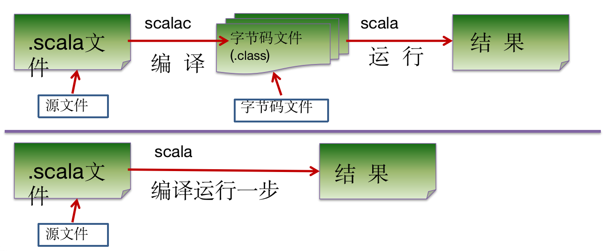
### 1.4 注意事项
+ 源文件以".scala"为扩展名
+ 程序的执行入口是main()函数
+ 严格区分大小写
+ 方法由一条条语句构成，每个语句后不需要分号
+ 如果在同一行有多条语句，除了最后一条语句不需要分号，其他语句需要分号
### 1.5 输出的三种方式
+ 字符串通过+号连接(类似Java)  
```scala
val name = "xiaoming"
println("name=" + name + "age=" + age + " url=" + url)
```
+ printf用法，字符串通过%传值(类似C)
```scala
val age = 1
printf("age=%d\n",age)
```
+ 字符串通过$引用(类似PHP)
```scala
val url = "www.baidu.com"
println(s"url=$url")
```

## 2.变量
### 2.1 变量声明基本语法
var | val 变量名[:变量类型] = 变量值
### 2.2 注意事项
+ 声明变量时，类型可以省略(编译器自动推导，即类型推导)
+ 类型确定后，不能修改(scala是强类型的语言)
+ 在声明/定义一个变量时，可以使用var/val修饰,var修饰的变量可改变，val修饰的变量不可改变
+ val修饰的变量在编译后，等同于加上final
+ var修饰的对象引用可以改变，val修饰的则不可改变，但对象的状态(值)是可以改变的(比如自定义对象、数组、集合等)
+ 变量声明时，需要初始值
### 2.3 程序中+号的使用
+ 当左右两边都是数值型时，做加法运算
+ 当左右两边有一方是字符串，做拼接运算    
### 2.4 数据类型
+ Scala 与Java有相同的数据类型，在Scala中数据类型都是对象，也就是说Scala没有Java中的原生类型
+ Scala数据类型分为两大类：AnyVal(值类型)和AnyRef(引用类型)，注意：不管是AnyVal还是AnyRef都是对象
+ Scala数据类型体系一览表  

+ Scala数据类型列表  
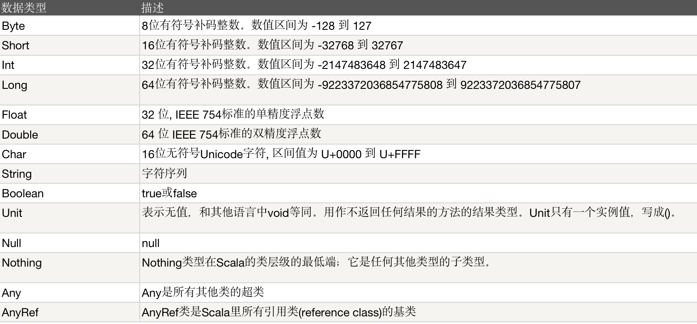
#### 2.4.1 整数类型
##### 2.4.1.1 使用细节
+ 各整数类型(Byte/Short/Int/Long)有固定的表示范围和字段长度,不受具体os的影响，以保证程序的可移植性
+ Scala的整型常量/字面量默认为Int类型，声明Long类型常量/字面量须后面加'l'或者'L'
+ Scala程序中变量声明为Int型，除非不足以表示大数，才使用Long
#### 2.4.2 浮点类型
##### 2.4.2.1 浮点类型的分类
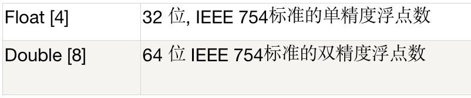
##### 2.4.2.2 使用细节
+ 与整数类型类似，浮点类型也有固定的表示范围和字段长度，不受具体os的影响
+ 浮点型常量默认为Double型,声明Float型常量，须在后面加'f'或者'F'
+ 浮点型常量的两种表示形式  
十进制数形式，例如：5.12 512.0f .512(必须有小数点)  
科学计数法形式，例如:5.12e2 = 5.12乘以10的2次方
+ 通常情况下应该使用Double类型，因为Double比Float型更精确
#### 2.4.3 字符类型
##### 2.4.3.1 基本介绍
字符类型可以表示单个字符，字符类型是Char，16位无符号Unicode字符(2个字节)，区间值为U+0000到U+FFFF
##### 2.4.3.2 使用细节
+ 字符常量是用单引号括起来的单个字符。例如：var c1='a'
+ Scala允许使用转义字符'\'来将其后的字符转变为特殊字符型常量。例如:var c3='\n'
+ 可以直接给Char赋一个整数，输出时会按照对应的unicode字符输出
+ Char类型是可以进行运算的，相当于一个整数，因为它们都有对应的Unicode编码
#### 2.4.4 布尔类型
##### 2.4.4.1 基本介绍
+ 布尔类型只允许取值true和false
+ 布尔类型占1个字节
+ 布尔类型适于逻辑运算，一般用于程序流程控制
#### 2.4.5 Unit/Null/Nothing类型
##### 2.4.5.1 基本说明
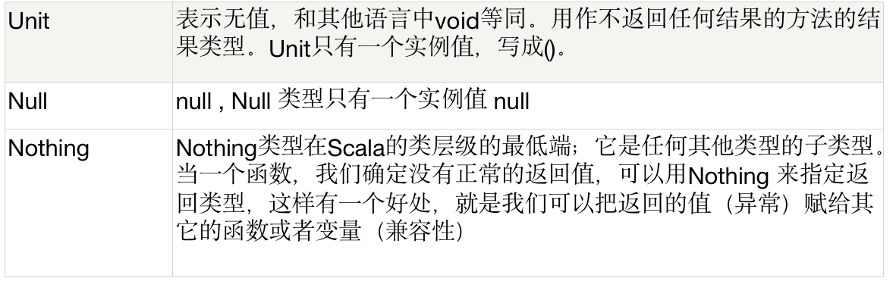
##### 2.4.5.2 使用细节和注意事项
+ Null类只有一个实例对象null,类似于Java中的null引用。null可以赋值给任意的引用类型(AnyRef),但是不能赋值给值类型(AnyVal:比如Int,Float,Char,Boolean,Long,Double,Byte,Short)
+ Unit类型用来标识过程，也就是没有明确返回值的函数。由此可见，Unit类似于Java中的void。Unit只有一个实例(),这个实例也没有实质的意义
+ Nothing,可以作为没有正常返回值的方法的返回类型，非常直观的说明这个方法不会正常返回，而且由于Nothing是其他任意类型的子类，它还能跟要求返回值的方法兼容
### 2.5 值类型转换
#### 2.5.1 值类型隐式转换
##### 2.5.1.1 基本介绍
Scala程序在进行赋值或运算时，精度小的类型自动转换为为精度大的数据类型  
数据类型按精度(容量)大小排序
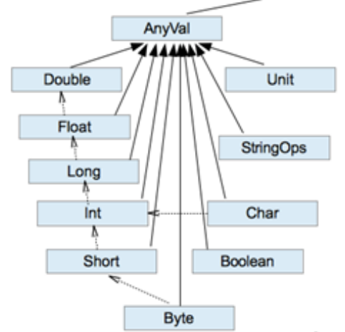
##### 2.5.1.2 自动类型转换细节说明
+ 有多种类型的数据混合运算时，系统首先自动将所有数据转换成容量最大的那种数据类型，然后再进行计算。例如: 5.6 + 10 > Double
+ 当我们把精度(容量)大的数据类型赋值给精度(容量)小的数据类型时会报错，反之会自动进行类型转换
+ (byte,short) 和 char之间不会相互自动转换
+ byte/short/char 三者可以计算，在计算时首先转换为int类型
+ 自动提升原则:表达式结果的类型自动提升为操作数中最大的类型
#### 2.5.2 强制类型转换
##### 2.5.2.1 基本介绍
自动类型转换的逆过程，将容量大的数据类型转换为容量小的数据类型。使用时要加上强制转换函数，但是可能会造成精度丢失
##### 2.5.2.2 使用细节
+ 当进行数据的从大类型向小类型的时候，需要使用强制类型转换
+ 强转符号只针对最近的操作数有效，往往会使用()来提升优先级
+ Char类型可以保存Int类型的常量值，但是不能保存Int的变量值，需要强转
+ Byte和Short类型在进行运算时，当做Int类型处理
### 2.6 值类型与String类型的转换
在程序开发中，经常需要将基本数据类型转成String类型，或者将String类型转成基本数据类型
#### 2.6.1 基本类型转String类型
语法:将基本类型的值+""即可
#### 2.6.2 String类型转基本数据类型
语法:通过基本类型的String的toXxx方法
#### 2.6.3 注意事项
在将String类型转成基本数据类型时，要确保String类型能够转成有效的数据

### 2.7标识符的命名规范
+ 首字符为字母，后续字符任意字母和数字、美元符号，可以后接下划线
+ 不可以数字开头
+ 首字符为操作符(比如 + - * /),后续字符也需要跟操作符，至少一个
+ 操作符(比如 + - * /)不能在标识符中间和最后
+ 用反引号包括的任何字符串，即使是关键字也可以
### 2.8. 关键字
package,import,class,object,trait,extends,with,type,forSome,private,protected,abstract,sealed,  
final,implicit,lazy,override,try,catch,finally,throw,if,else,match,case,do,while,for,return,yield,def,val,  
var,this,super,new,true,false,null

## 3.运算符
### 3.1 运算符介绍
运算符是一种特殊的符号，用以表示数据的运算、赋值和比较
+ 算术运算符
+ 赋值运算符
+ 比较运算符(关系运算符)
+ 逻辑运算符
+ 位运算符
### 3.2 算术运算符
#### 3.2.1 介绍
算术运算符是对数值类型的变量进行运算的
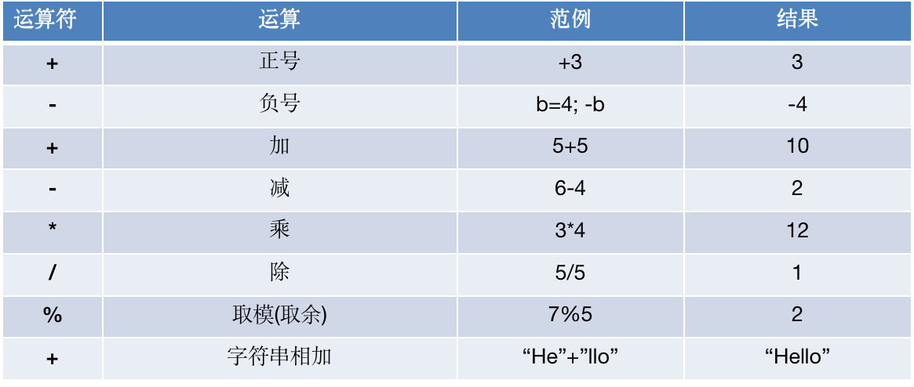
#### 3.2.2 细节说明
+ 对于除号 "/",它的整数除和小数除是有区别的，整数之间做除法，只保留整数部分而舍弃小数部分
+ 当对一个数取模时，可以等价a%b = a-a/b*b
+ 注意:Scala中没有++、--操作符，需要通过+=、-=来实现同样的效果
### 3.3 关系运算符(比较运算符)
+ 关系运算符的结果是boolean型
+ 关系表达式经常用在if结构的条件中或循环结构的条件中
+ 关系运算符的使用和Java一样
+ 关系运算符一览表
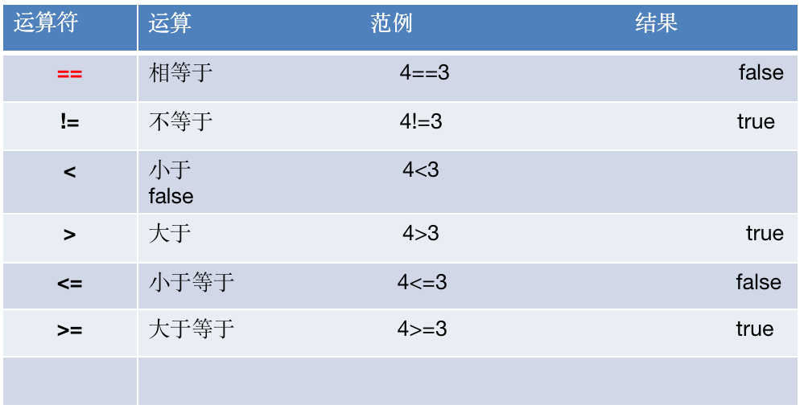
#### 3.3.1 细节说明
+ 关系运算符组成的表达式称为关系表达式
+ 比较运算符"=="不要误写成"="
+ 如果两个浮点数进行比较,应当保证数据类型一致
### 3.4 逻辑运算符
#### 3.4.1 逻辑运算符一览表
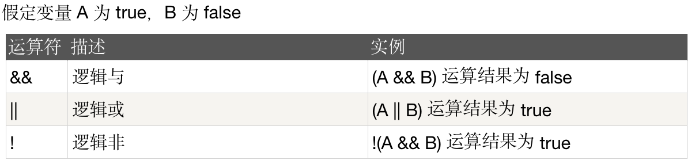

### 3.5 赋值运算符
#### 3.5.1 赋值运算符的分类
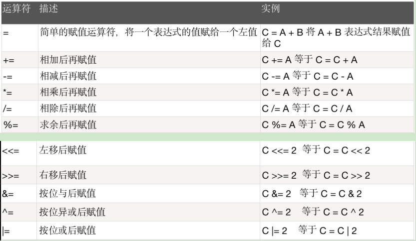

#### 3.5.2 赋值运算符的特点
+ 运算顺序从右往左
+ 赋值运算符的左边只能是变量，右边可以是变量、表达式、常量值、字面量
+ 复合赋值运算符等价于如下效果:a+=3 <=> a=a+3

### 3.6 位运算符
#### 3.6.1 位运算符一览表
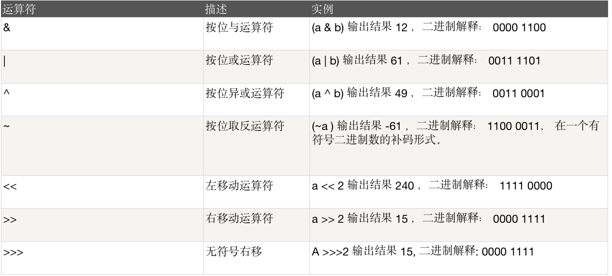

### 3.7 运算符的特别说明
+ Scala不支持三目运算符，可以使用if-else的方式实现类似的功能

### 3.8 运算符的优先级
#### 3.8.1 运算符优先级一览表
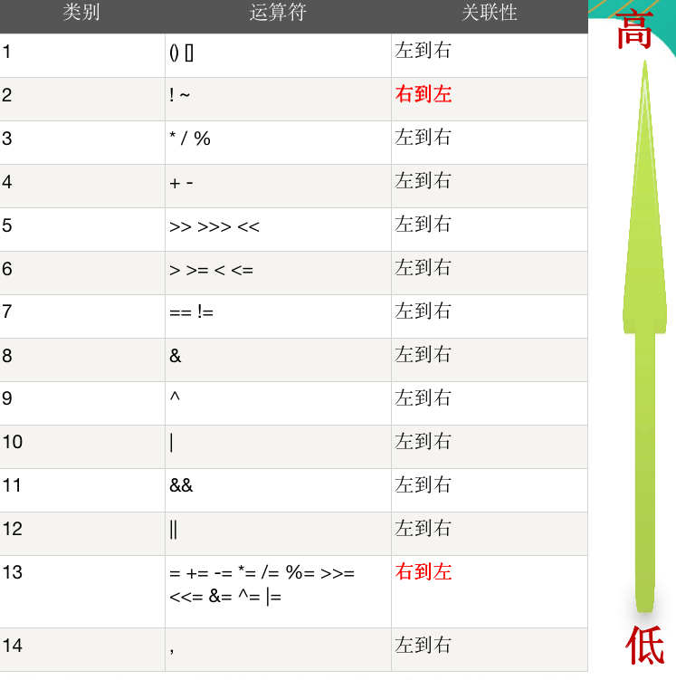
+ 运算符有不同的优先级，所谓优先级就是表达式运算中的运算顺序
+ 只有单目运算符、赋值运算符是从右向左运算的