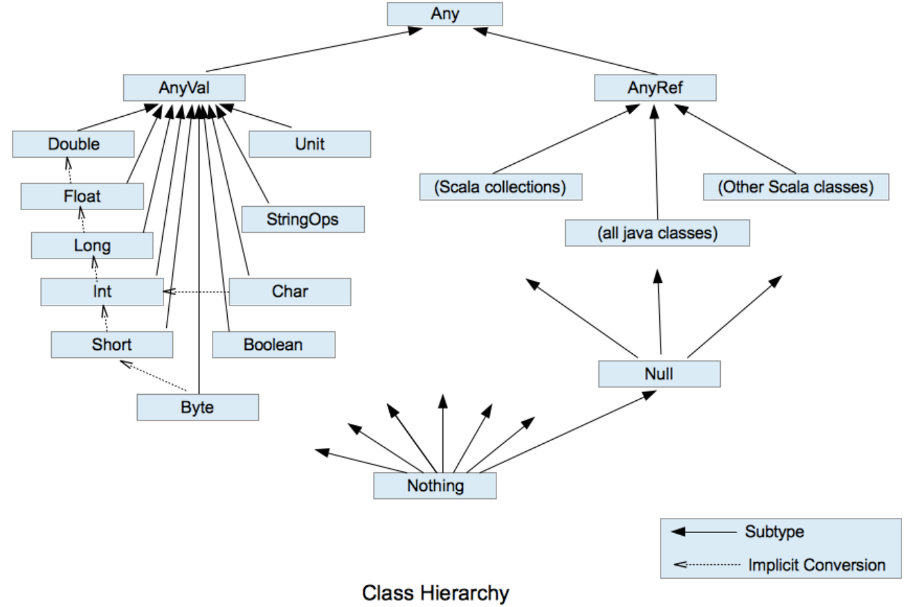

# Scala语法总结
## 1.Scala概述
### 1.1 Scala特点
一门以JAVA虚拟机(JVM)为运行环境并将面向对象和函数式编程的最佳特性结合在一起的静态类型编程语言  
+ 多范式(multi-paradigm)编程语言，支持面向对象和函数式编程
+ 源代码(.scala)会被编译成java字节码(.class)，然后运行于JVM之上，并可以调用现有的java类库，实现两种语言的无缝对接  
### 1.2 开发环境搭建
+ 官方安装包下载地址  
http://www.scala-lang.org/
### 1.3 Scala执行流程分析

### 1.4 注意事项
+ 源文件以".scala"为扩展名
+ 程序的执行入口是main()函数
+ 严格区分大小写
+ 方法由一条条语句构成，每个语句后不需要分号
+ 如果在同一行有多条语句，除了最后一条语句不需要分号，其他语句需要分号
### 1.5 输出的三种方式
+ 字符串通过+号连接(类似Java)  
```scala
val name = "xiaoming"
println("name=" + name + "age=" + age + " url=" + url)
```
+ printf用法，字符串通过%传值(类似C)
```scala
val age = 1
printf("age=%d\n",age)
```
+ 字符串通过$引用(类似PHP)
```scala
val url = "www.baidu.com"
println(s"url=$url")
```

## 2.变量
### 2.1 变量声明基本语法
var | val 变量名[:变量类型] = 变量值
### 2.2 注意事项
+ 声明变量时，类型可以省略(编译器自动推导，即类型推导)
+ 类型确定后，不能修改(scala是强类型的语言)
+ 在声明/定义一个变量时，可以使用var/val修饰,var修饰的变量可改变，val修饰的变量不可改变
+ val修饰的变量在编译后，等同于加上final
+ var修饰的对象引用可以改变，val修饰的则不可改变，但对象的状态(值)是可以改变的(比如自定义对象、数组、集合等)
+ 变量声明时，需要初始值
### 2.3 程序中+号的使用
+ 当左右两边都是数值型时，做加法运算
+ 当左右两边有一方是字符串，做拼接运算    
### 2.4 数据类型
+ Scala 与Java有相同的数据类型，在Scala中数据类型都是对象，也就是说Scala没有Java中的原生类型
+ Scala数据类型分为两大类：AnyVal(值类型)和AnyRef(引用类型)，注意：不管是AnyVal还是AnyRef都是对象
+ Scala数据类型体系一览表  

+ Scala数据类型列表  

#### 2.4.1 整数类型
##### 2.4.1.1 使用细节
+ 各整数类型(Byte/Short/Int/Long)有固定的表示范围和字段长度,不受具体os的影响，以保证程序的可移植性
+ Scala的整型常量/字面量默认为Int类型，声明Long类型常量/字面量须后面加'l'或者'L'
+ Scala程序中变量声明为Int型，除非不足以表示大数，才使用Long
#### 2.4.2 浮点类型
##### 2.4.2.1 浮点类型的分类

##### 2.4.2.2 使用细节
+ 与整数类型类似，浮点类型也有固定的表示范围和字段长度，不受具体os的影响
+ 浮点型常量默认为Double型,声明Float型常量，须在后面加'f'或者'F'
+ 浮点型常量的两种表示形式  
十进制数形式，例如：5.12 512.0f .512(必须有小数点)  
科学计数法形式，例如:5.12e2 = 5.12乘以10的2次方
+ 通常情况下应该使用Double类型，因为Double比Float型更精确
#### 2.4.3 字符类型
##### 2.4.3.1 基本介绍
字符类型可以表示单个字符，字符类型是Char，16位无符号Unicode字符(2个字节)，区间值为U+0000到U+FFFF
##### 2.4.3.2 使用细节
+ 字符常量是用单引号括起来的单个字符。例如：var c1='a'
+ Scala允许使用转义字符'\'来将其后的字符转变为特殊字符型常量。例如:var c3='\n'
+ 可以直接给Char赋一个整数，输出时会按照对应的unicode字符输出
+ Char类型是可以进行运算的，相当于一个整数，因为它们都有对应的Unicode编码
#### 2.4.4 布尔类型
##### 2.4.4.1 基本介绍
+ 布尔类型只允许取值true和false
+ 布尔类型占1个字节
+ 布尔类型适于逻辑运算，一般用于程序流程控制
#### 2.4.5 Unit/Null/Nothing类型
##### 2.4.5.1 基本说明

##### 2.4.5.2 使用细节和注意事项
+ Null类只有一个实例对象null,类似于Java中的null引用。null可以赋值给任意的引用类型(AnyRef),但是不能赋值给值类型(AnyVal:比如Int,Float,Char,Boolean,Long,Double,Byte,Short)
+ Unit类型用来标识过程，也就是没有明确返回值的函数。由此可见，Unit类似于Java中的void。Unit只有一个实例(),这个实例也没有实质的意义
+ Nothing,可以作为没有正常返回值的方法的返回类型，非常直观的说明这个方法不会正常返回，而且由于Nothing是其他任意类型的子类，它还能跟要求返回值的方法兼容
### 2.5 值类型转换
#### 2.5.1 值类型隐式转换
##### 2.5.1.1 基本介绍
Scala程序在进行赋值或运算时，精度小的类型自动转换为为精度大的数据类型  
数据类型按精度(容量)大小排序

##### 2.5.1.2 自动类型转换细节说明
+ 有多种类型的数据混合运算时，系统首先自动将所有数据转换成容量最大的那种数据类型，然后再进行计算。例如: 5.6 + 10 > Double
+ 当我们把精度(容量)大的数据类型赋值给精度(容量)小的数据类型时会报错，反之会自动进行类型转换
+ (byte,short) 和 char之间不会相互自动转换
+ byte/short/char 三者可以计算，在计算时首先转换为int类型
+ 自动提升原则:表达式结果的类型自动提升为操作数中最大的类型
#### 2.5.2 强制类型转换
##### 2.5.2.1 基本介绍
自动类型转换的逆过程，将容量大的数据类型转换为容量小的数据类型。使用时要加上强制转换函数，但是可能会造成精度丢失
##### 2.5.2.2 使用细节
+ 当进行数据的从大类型向小类型的时候，需要使用强制类型转换
+ 强转符号只针对最近的操作数有效，往往会使用()来提升优先级
+ Char类型可以保存Int类型的常量值，但是不能保存Int的变量值，需要强转
+ Byte和Short类型在进行运算时，当做Int类型处理
### 2.6 值类型与String类型的转换
在程序开发中，经常需要将基本数据类型转成String类型，或者将String类型转成基本数据类型
#### 2.6.1 基本类型转String类型
语法:将基本类型的值+""即可
#### 2.6.2 String类型转基本数据类型
语法:通过基本类型的String的toXxx方法
#### 2.6.3 注意事项
在将String类型转成基本数据类型时，要确保String类型能够转成有效的数据

### 2.7标识符的命名规范
+ 首字符为字母，后续字符任意字母和数字、美元符号，可以后接下划线
+ 不可以数字开头
+ 首字符为操作符(比如 + - * /),后续字符也需要跟操作符，至少一个
+ 操作符(比如 + - * /)不能在标识符中间和最后
+ 用反引号包括的任何字符串，即使是关键字也可以
### 2.8. 关键字
package,import,class,object,trait,extends,with,type,forSome,private,protected,abstract,sealed,  
final,implicit,lazy,override,try,catch,finally,throw,if,else,match,case,do,while,for,return,yield,def,val,  
var,this,super,new,true,false,null

## 3.运算符
### 3.1 运算符介绍
运算符是一种特殊的符号，用以表示数据的运算、赋值和比较
+ 算术运算符
+ 赋值运算符
+ 比较运算符(关系运算符)
+ 逻辑运算符
+ 位运算符
### 3.2 算术运算符
#### 3.2.1 介绍
算术运算符是对数值类型的变量进行运算的

#### 3.2.2 细节说明
+ 对于除号 "/",它的整数除和小数除是有区别的，整数之间做除法，只保留整数部分而舍弃小数部分
+ 当对一个数取模时，可以等价a%b = a-a/b*b
+ 注意:Scala中没有++、--操作符，需要通过+=、-=来实现同样的效果
### 3.3 关系运算符(比较运算符)
+ 关系运算符的结果是boolean型
+ 关系表达式经常用在if结构的条件中或循环结构的条件中
+ 关系运算符的使用和Java一样
+ 关系运算符一览表

#### 3.3.1 细节说明
+ 关系运算符组成的表达式称为关系表达式
+ 比较运算符"=="不要误写成"="
+ 如果两个浮点数进行比较,应当保证数据类型一致
### 3.4 逻辑运算符
#### 3.4.1 逻辑运算符一览表


### 3.5 赋值运算符
#### 3.5.1 赋值运算符的分类


#### 3.5.2 赋值运算符的特点
+ 运算顺序从右往左
+ 赋值运算符的左边只能是变量，右边可以是变量、表达式、常量值、字面量
+ 复合赋值运算符等价于如下效果:a+=3 <=> a=a+3

### 3.6 位运算符
#### 3.6.1 位运算符一览表


### 3.7 运算符的特别说明
+ Scala不支持三目运算符，可以使用if-else的方式实现类似的功能

### 3.8 运算符的优先级
#### 3.8.1 运算符优先级一览表

+ 运算符有不同的优先级，所谓优先级就是表达式运算中的运算顺序
+ 只有单目运算符、赋值运算符是从右向左运算的

## 4.程序流程控制
### 4.1 顺序控制
+ 程序从上到下逐行执行，中间没有任何判断和跳转
+ scala中定义变量时需要采用合法的前向引用

### 4.2 分支控制

### 4.3 switch分支结构

### 4.4 for循环控制
scala为for循环的这一常见的控制结构提供了非常多的特性，这些for循环的特定被称为for推导式或for表达式
#### 4.4.1 范围数据循环
+ 范围数据循环方式1
```go
for(i <- 1 to 3){
  println(i+" ")
}
```
注意使用to的话遍历的范围是[1,3]
+ 范围数据循环方式2
```go
for(i <- 1 until 3){
  println(i+" ")
}
```
注意使用until遍历的范围是[1,3)

#### 4.4.2 循环守卫
+ 基本案例
```go
for(i <- 1 to 3 if i!=2){
    println(i+" ")
}
```
循环守卫，即循环保护式(也称条件判断式，守卫)，保护式为true则进入循环体内部，为false则跳过，类似于continue  
上面的代码等价于下面的代码  
```go
for(i <- 1 to 3){
    if(1 != 2){
    println(i+" ")  
  }
}
```
#### 4.4.3 引入变量
+ 基本案例
```go
for(i <- 1 to 3; j = 4 -i){
    println(j+" ")
}
```
注意:没有关键字所以范围后一定要加分号来隔断逻辑  
上面的代码等价于下面的代码  
```go
for(i <- 1 to 3){
    val j = 4 - i
    println(j+" ")
}
```

#### 4.4.4 嵌套循环
+ 基本案例
```go
for(i <- 1 to 3;j <- 1 to 3){
    println("i="+i+" j="+j)
}
```
注意：没有关键字，所以范围后一定要加分号来隔断逻辑  
上面的代码等价于  
```go
for(i <- 1 to 3){
    for(j <- 1 to 3){
        println("i="+i+" j="+j)
    }
}
```
#### 4.4.5 循环返回值
+ 基本案例
```go
val res = for(i <- 1 to 10) yield i
println(res)
```
对案例的说明:将遍历过程中处理的结果返回到一个新的Vector集合中，使用yield关键字
#### 4.4.6 使用{}代替()
+ 基本案例
```go
for(i <- 1 to 3;j = i * 2){
    println("i ="+i+" j="+j)
}
```
上面的代码也可以写成下面这样  
```go
for{
    i <- 1 to 3
    j = i * 2
    println("i ="+i+" j="+j)
}
```
+ 对案例的基本说明  
{}和()对于for表达式来说都可以  
for 推导式有一个不成文的约定:当for推导式仅包含单一表达式时使用()，当其包含多个表达式时使用{}  
当使用{}来换行写表达式时，分号就不用写了
+ for循环步长控制
```go
for(i <- Range(1,3,2))

```

### 4.5 while循环控制
#### 4.5.1 基本语法
循环变量初始化
while(循环条件){
    循环体(语句)
    循环变量迭代
}
#### 4.5.2 注意事项和细节说明
+ 循环条件是返回一个布尔值的表达式
+ while循环是先判断再执行语句
+ 与if语句不同，while语句本身没有值，即整个while语句的结果是Unit类型的()
+ 因为while中没有返回值，所以当要用该语句来计算并返回结果时，就不可避免的使用变量，而变量需要声明在while循环的外部
，那么久等同于循环的内部对外部的变量造成了影响，所以不推荐使用，而是推荐使用for循环

### 4.6 do...while循环控制
#### 4.6.1 基本语法
循环变量初始化
do{
    循环体(语句)
    循环变量迭代
}while(循环条件)
#### 4.6.2 注意事项和细节说明
+ 循环条件是返回一个布尔值的表达式
+ 先执行再判断
+ 和while一样，因为do...while中没有返回值，所以当要用该语句来计算
并返回结果时，就不可避免的使用变量，而变量需要声明在do...while循环的外部，
那么就等同于循环的内部对外部的变量造成了影响，所以不推荐使用，而是推荐使用for循环
### 4.7多重循环控制
+ 将一个循环放在另一个循环体内，就形成了嵌套循环，其中for,while,do...while
均可以作为外层循环和内层循环
+ 实质上，嵌套循环是把内存循环当成外层循环的循环体。当只有内层循环的循环条件
为false时，才会完全跳出内层循环，才可结束外层的当次循环，开始下一次的循环
+ 设外层循环次数为m次，内层为n次，则内层循环体实际上需要执行m*n次

### 4.8 while循环的中断
#### 4.8.1 基本说明
scala内置控制结构特地去掉了break和continue,是为了更好的适应函数化编程推荐使用函数式的风格解决break和continue的
功能，而不是一个关键字

#### 4.8.2 案例演示
```scala
import util.control.Breaks._
var n = 10
breakable{
  while(n<=20){
    n+=1
    if(n==18){
      break()
    }
  }
  
}
println("n="+n)
```

#### 4.8.3 如何实现continue的效果
scala内置控制结构特地也去掉了continue,是为了更好地适应函数化编程，可以使用if-else或是循环守卫来实现continue的效果
+ 案例
```scala
for(i <- 1 to 10 if(i != 2 && i != 3 )){
  println("i="+i)
}
```

## 5.函数式编程基础
### 5.1 介绍
#### 5.1.1 概念说明
+ 在scala中，方法和函数几乎可以等同(比如他们的定义、使用、运行机制都一样)，只是函数的使用方式更加灵活
+ 函数式编程是从编程方式(范式)的角度来谈的，函数式编程把函数当做一等公民，充分利用函数、支持函数的多种使用方式，
比如函数是一等公民，像变量一样，既可以作为函数的参数使用，也可以将函数赋值给一个变量，函数的创建不用依赖于类或者对象，而在java中，
函数的创建则要依赖于类、抽象类或者接口
+ 面向对象编程是以对象为基础的编程方式
+ 在scala中函数式编程和面向对象编程融合在一起了

#### 5.1.2 函数式编程介绍
+ "函数式编程"是一种"编程范式"(programming paradigm)
+ "结构化编程"的一种，主要思想是把运算过程尽量协程一系列嵌套的函数调用
+ 函数式编程中，将函数也当做数据类型，因此可以接受函数当做输入(参数)和输出(返回值)
+ 函数式编程中，最重要的就是函数

### 5.2 函数的定义
#### 5.2.1 基本语法
def 函数名([参数名:参数类型],...)[[:返回值类型]=]{
    语句...
    return 返回值
}
+ 函数声明关键字为def(definition)
+ [参数名:参数类型],...:表示函数的输入(参数列表)可以没有，如果有，多个参数使用逗号间隔
+ 函数中的语句:表示为了实现某一个功能的代码块
+ 函数可以有返回值也可以没有
+ 返回值形式1: :返回值类型 =
+ 返回值类型2: = 表示返回值类型不确定，使用类型推导完成
+ 返回值形式3: 表示没有返回值，return 不生效
+ 如果没有return,默认以执行到最后一行的结果作为返回值

#### 5.2.2 函数递归调用
一个函数在函数体内又调用了本身，称为递归调用  
需要遵守的重要原则:  
+ 程序执行一个函数时，就创建一个新的受保护的独立空间(新函数栈)
+ 函数的局部变量是独立的，不会相互影响
+ 递归必须向退出递归的条件逼近，否则就是无限递归
+ 当一个函数执行完毕，或者遇到return就会返回，遵守谁调用，就将结果返回给谁
### 5.3 函数的注意事项和细节讨论
+ 函数的形参列表可以是多个，如果函数没有形参，调用时可以不带()
+ 形参列表和返回值列表的数据类型可以是值类型和引用类型
+ scala中的函数可以根据函数体最后一行代码自行推断函数返回值类型，那么在这种情况下，return关键字可以省略

+ 因为scala可以自行推断，所以在省略return关键字的场合，返回值类型也可以省略
+ 如果函数明确使用return关键字，那么函数返回就不能使用自行推断了，这时要明确写成:返回类型=，当然如果什么都不写，即使有return返回值为()
+ 如果函数明确声明无返回值(声明Unit),那么函数体中即使使用return关键字也不会有返回值
+ 如果明确函数无返回值或不确定返回值类型，那么返回值类型可以省略(或声明为Any)
+ scala语法中任何的语法结构都可以嵌套其他语法结构，即:函数中可以再声明/定义函数，类中可以再声明类，方法中可以再声明/定义方法
+ scala函数的形参，在声明参数时，直接赋初始值(默认值),这时调用函数时如果没有指定实参，则会使用默认值。如果指定了实参，则实参会覆盖默认值
+ 如果函数存在多个参数，每一个参数都可以设定默认值，那么这个时候，传递的参数到底是覆盖默认值还是赋值给没有默认值的参数，就不确定了(默认按照声明顺序[从左到右])，在这种情况下，可以采用带名参数
+ scala函数的形参默认是val的，因此不能在函数中进行修改
+ 递归函数未执行之前无法判断结果类型，在使用时必须有明确的返回值类型
+ scala函数支持可变参数
```scala
//支持0到多个参数
def sum(args:Int*):Int={

}
//支持1到多个参数
def sum(n1:Int,args:Int*):Int={

}
```
**说明:**  
(1).args是集合，通过for循环可以访问到各个值
(2).可变参数需要写在形参列表的最后
### 5.4 过程
#### 5.4.1 基本介绍
将函数的返回类型为Unit的函数称之为过程(procedure),如果明确函数没有返回值，那么等号可以省略
#### 5.4.2 案例说明
```scala
//f10没有返回值，可以使用Unit来说明
//这时，这个函数我们也叫过程
def f10(name:String):Unit={
  println(name+"hello ")
}
```
#### 5.4.3 注意事项和细节说明
+ 注意区分:如果函数声明时没有返回值类型，但是有=号，可以进行类型推断最后一行代码。这时这个函数实际是有返回值的，该函数并不是过程
### 5.5 惰性函数
#### 5.5.1 介绍
当函数返回值被声明为lazy时，函数的执行将被推迟，直到我们首次对此取值，该函数才会执行。这种函数我们称之为惰性函数
#### 5.5.2 注意事项和细节
+ lazy不能修饰var类型的变量
+ 不但是在调用函数时加了lazy会导致函数的执行被推迟，在声明一个变量时如果加了lazy,变量值的分配也会推迟
### 5.5 异常
#### 5.5.1 介绍
scala提供try和catch块来处理异常。try块用于包含可能出错的代码，catch块用于处理try块中发生的异常。可以根据需要在程序中有任意数量的try...catch块。
#### 5.5.2 异常处理小结
+ 可以将可疑代码放到try块中，在try块之后使用了一个catch处理程序来捕获异常。如果发生任何异常,catch处理程序将处理它,程序将不会异常终止
+ scala的异常的工作机制和Java一样，但是scala没有"checked(编译期)"异常，即scala没有编译异常这个概念，异常都是在运行的时候捕获处理
+ 用throw关键字抛出一个异常对象。所有异常都是Throwable的子类型，throw表达式是有类型的，就是Nothing,因为Nothing是所有类型的子类型，所以
throw表达式可以用在需要类型的地方
+ 在scala里借用了模式匹配的思想来做异常匹配，因此在catch的代码里是一系列case子句来匹配异常，当匹配上后=> 有多条语句可以换行写
+ 异常捕捉的机制和其他语言中一样，如果有异常发生，catch子句是按次序捕捉的，因此，在catch子句中，越具体的异常越要靠前，越普遍的异常越靠后，
如果把越普遍的异常写在前，把具体的异常写在后，在scala中也不会报错，但这样是非常不好的编程风格
+ finally 子句用于执行不管是正常处理还是异常发生时都需要执行的步骤，一般用于对象的清理工作，这点和java一样
+ scala提供了throws关键字来声明异常。可以使用方法定义声明异常，它向调用者函数提供了此方法可能引发此异常的信息。有助于调用函数处理并将该
代码包含在try-catch块中，以避免程序异常终止，在scala中可以使用throws注解来声明异常

## 6.面向对象编程基础
### 6.1 类与对象的区别和联系
+ 类是抽象的、概念的，代表一类事物
+ 对象是具体的、实际的，代表一个具体事物
+ 类是对象的模板，对象是类的一个个体，对应一个实例
+ scala中类和对象的区别和联系和Java中是一样的
### 6.2 定义类的基本语法
[修饰符]class类名{
    类体
}
### 6.3 定义类的注意事项
+ scala语法中，类并不声明为public，所有这些类都具有公有可见性(默认就是public)
+ 一个scala源文件可以包含多个类
### 6.4 属性
+ 属性是类的一个组成部分，一般是值数据类型，也可以是引用类型
### 6.5 属性和成员变量的注意事项和细节说明
+ 属性的定义语法同变量，示例:[访问修饰符] var 属性名称[:类型]=属性值
+ 属性的定义类型可以为任意类型，包含值类型或引用类型
+ scala中声明一个属性，必须显式地初始化，然后根据初始化数据的类型自动推断，属性类型可以省略
+ 如果赋值为null则一定要加类型，因为不加类型，那么该属性的类型就是Null类型
+ 如果在定义属性时，暂时不赋值，也可以使用符号_(下划线)，让系统分配默认值  

+ 不同对象的属性时独立的，互不影响，一个对象对属性的修改，不影响另外一个
### 6.6 如何创建对象
val | var 对象名[:类型] = new 类型()
+ 如果我们不希望改变对象的引用(内存地址)，应该声明为val性质的，否则声明为var,scala设计者推荐使用val,因为一般来说，在程序中，我们只是
改变对象属性的值，而不是改变对象的引用
+ scala在声明对象变量时，可以根据创建对象的类型自动推断，所以类型声明可以省略，但当类型和后面new对象类型有继承关系即多态时，就必须写了。
### 6.7 如何访问属性
基本语法:对象名.属性名
### 6.8 方法
#### 6.8.1 基本说明
scala中的方法其实就是函数，声明规则请参考函数式编程中的函数声明
#### 6.8.2 基本语法
def 方法名(参数列表)[:返回值类型]={
    方法体
}
#### 6.8.3 方法的调用机制原理
+ scala开始执行时，先在栈区开辟一个main栈，main栈最后被销毁
+ scala执行到一个方法时，总会开一个新的栈
+ 每个栈是独立的空间，变量(基本数据类型)是独立的，互不影响（引用类型除外）
+ 方法执行完毕后，该方法开辟的栈会被jvm回收

### 6.9 构造器
#### 6.9.1 基本介绍
+ 构造器(constructor)又叫构造方法，是类的一种特殊的方法，主要作用是完成对新对象的初始化，和Java一样，scala构造对象
也需要调用构造方法，并且可以有任意多个构造方法(即Scala中构造器也支持重载)
+ scala类的构造器包括:主构造器和辅助构造器
#### 6.9.2 构造器的基本语法
class 类名(形参列表){//主构造器
//类体
def this(形参列表){//辅助构造器

    }
def this(形参列表){//辅助构造器可以有多个
    
    }
}
#### 6.9.3 构造器的注意事项和细节
+ Scala构造器作用是完成对新对象的初始化，构造器没有返回值
+ 主构造器会执行类定义中的所有语句，构造器也是方法(函数)，传递参数和使用方法和前面的函数部分内容没有区别
+ 如果主构造器无参数，小括号可省略，构建对象时调用的构造方法的小括号也可以省略
+ 辅助构造器名称为this,多个辅助构造器通过不同参数列表进行区分，在底层就是构造器重载
+ 如果想让主构造器编程私有的，可以在()之前加上private,这样用户只能通过辅助构造器来构造对象了
+ 辅助构造器的声明不能和主构造器的声明一致，会发生错误(即构造器名重复)
#### 6.9.4 构造器参数
+ Scala类的主构造器的形参未用任何修饰符修饰，那么这个参数是局部变量
+ 如果参数使用val关键字声明，Scala会将参数作为类的私有只读属性使用
+ 如果参数使用var关键字声明，Scala会将参数作为类的成员属性使用，并会提供属性对应的xxx()[类似getter]/xxx_$eq()[类似setter]方法，
即这时的成员属性是私有的，但是可读写
#### 6.9.5 Bean属性
+ JavaBeans规范定义了Java的属性是像getXxx()和setXxx()的方法。许多Java工具(框架)都依赖这个命名习惯。为了Java的互操作性，
将Scala字段加@BeanProperty时，这样会自动生成规范的setXxx()/getXxx方法，这时可以使用对象.setXxx()和对象.getXxx()来调用属性
+ 注意:给某个属性加入@BeanProperty注解后，会生成getXxx和setXxx的方法，并且对原来底层自动生成类似xxx(),xxx_$eq()方法，没有冲突，
二者可以共存
#### 6.9.6 对象创建的流程
+ 加载类的信息(属性信息，方法信息)
+ 在内存中(堆)开辟空间
+ 使用父类的构造器(主和辅助)进行初始化
+ 使用主构造器对属性进行初始化
+ 使用辅助构造器对属性进行初始化
+ 将开辟的对象的地址赋给引用
## 7.面向对象编程(高级)
### 7.1 包
#### 7.1.1 基本介绍
和Java一样，Scala中管理项目可以使用包，但Scala中的包的功能更加强大，使用也相对复杂些
#### 7.1.2 包的特点概述
+ 基本语法
package 包名
+ 包的三大作用  
1.区分相同名字的类  
2.当类很多时，可以很好地管理类  
3.控制访问范围  
+ Scala中包名和源码所在的系统文件目录结构可以不一致，但是编译后的字节码文件路径和包名会保持一致(这个工作由编译器完成)
#### 7.1.3 包的命名规则
只能包含数字、字母、下划线、点，但是不能使用数字开头，也不要使用关键字
#### 7.1.4 Scala会自动引入的包
+ java.lang.*
+ scala包
+ Predef包
#### 7.1.5 Scala包注意事项和使用细节
+ Scala进行package打包时可以有如下形式

+ 包也可以像嵌套类那样嵌套使用（包中有包），使用第三种打包方式的好处是:程序员可以在同一个文件中，将类(class/object)、trait创建在不同的包中
+ 作用域原则:可以直接向上访问。即:scala中子包中直接访问父包中的内容，大括号体现作用域。在子包和父包类重命名时，默认采用就近原则，如果
希望指定使用某个类,则带上包名即可
+ 父包要访问子包的内容时，需要import对应的类
+ 可以在同一个.scala文件中，声明多个并列的package(建议嵌套的package不要超过3层)
+ 包名可以相对也可以绝对，比如访问BeanProperty的绝对路径是_root_.scala.beans.BeanProterty,在一般情况下，使用相对路径来引入包，
只有当包名冲突时，使用绝对路径来处理。
### 7.2 包对象
#### 7.2.1 基本介绍
包可以包含类、对象和特质trait,但不能包含函数/方法或变量的定义。这是Java虚拟机的局限，为了弥补这一不足，scala提供了包对象的概念来解决这个问题
#### 7.2.2 包对象的底层实现机制
+ 当创建包对象后，在该包下生成public final class package和public final class package$
+ 通过package$的一个静态实例完成对包对象中的属性和方法的调用
#### 7.2.3 包对象的注意事项
+ 每个包都可以有一个包对象，需要在父包中定义它
+ 包对象名称需要和包名一致，一般用来对包的功能进行补充
### 7.3 包的可见性
+ 当属性访问权限为默认时，从底层看属性是private的，但是因为提供了xxx_$eq()[类似setter]/xxx()[类似getter]方法，因此从使用效果看是任何地方都可以访问
+ 当方法访问权限为默认时，默认为public访问权限
+ private为私有权限，只在类的内部和伴生对象中可用
+ protected 为受保护权限，scala中受保护权限比java中更严格，只能子类访问，同包无法访问(编译器)
+ Scala中没有public关键字，即不能用public显式地修改属性和方法
+ 包访问权限（表示属性有了限制，同时包也有了限制），这点和java不一样，体现出Scala包使用的灵活性
### 7.3 包的引入
#### 7.3.1 基本介绍
scala引入包也是使用import,基本的原理和机制和Java一样，但是Scala中的import功能更加强大，也更灵活  
因为scala语言源自于java,所以java.lang包中的类会自动引入到当前环境中，而Scala中的Scala包和Predef包的类也会自动引入到当前环境中，
即其下面的类可以直接使用  
如果想要把其他包中的类引入到当前环境中，需要使用import
#### 7.3.2 引入包的细节和注意事项
+ import可以出现在任何地方，并不仅限于文件顶部，import语句的作用一直延伸到包含该语句的块末尾。
这种语法的好处是:在需要时引入包，缩小import包的作用范围，提高效率
+ java中如果想要导入包中所有的类，可以通过通配符*，Scala中采用_
+ 如果不想要某个包中的全部类，而是其中的几个类，可以采用选取器(大括号)

+ 如果引入的多个包中含有相同的类，可以将不需要的类进行重命名进行区分,这就是重命名

+ 如果某个冲突的类根本就不会用到，那么这个类可以直接隐藏掉


### 7.4 封装
#### 7.4.1 基本介绍
封装(encapsulation)就是把抽象出的数据和对数据的操作封装在一起，数据被保护在内部，程序的其他部分只有通过被授权的操作(成员方方法)才能对数据进行操作
#### 7.4.2 封装的注意事项和细节
+ Scala为了简化代码开发，当声明属性时，本身就自动提供了对应setter/getter方法，如果属性声明为private,那么自动生成的setter/getter方法
也是private的，如果属性省略访问权限修饰符，那么自动生成的setter/getter方法是public的
+ 如果只是对一个属性进行简单的set和get,只要声明一下该属性(属性使用默认的访问修饰符)，不用写专门的get/set,默认会创建，访问时直接使用
对象.变量，这样也是为了保持访问一致性
+ 从形式上看dog.food直接访问属性，其底层仍然是访问的方法
+ 有了上面的特性，目前很多新的框架，在进行反射时，也支持对属性的直接反射
### 7.5 继承
#### 7.5.1 基本语法
class 子类名 extends 父类名 {类体}  
子类继承了父类的所有属性，只是私有的属性不能直接访问，需要通过公共的方法访问
#### 7.5.2 重写方法
Scala明确规定，重写一个非抽象的方法需要用override修饰符，调用超类的方法使用super关键字
#### 7.5.3 类型检查和转换
要测试某个对象是否属于某个给定的类，可以用isInstanceOf方法。用asInstanceOf方法将引用转换为子类的引用。classOf获取对象的类名
+ classOf[String] 就如同Java中的String.class
+ obj.isInstanceOf[T]就如同Java的obj instanceof T 判断obj是不是T类型
+ obj.asInstanceOf[T]就如同java的(T)obj将obj强转成T类型  
类型检查和转换的最大价值在于:可以判断传入对象的类型，然后转对应的子类对象，进行相关操作，这里也体现出多条的特点

#### 7.5.4 超类的构造
+ 类有一个主构造器和任意数量的辅助构造器，而每个辅助构造器都必须先调用主构造器(可以是间接调用)
+ 只有主构造器可以调用父类的构造器，辅助构造器不能直接调用父类的构造器，在scala构造器中不能调用super(params)
#### 7.5.5 覆写字段
##### 7.5.5.1 基本介绍
在scala中，子类改写父类的字段，我们称为覆写/重写字段，覆写字段需要使用override修饰
##### 7.5.5.2 覆写字段的注意事项和细节
+ def只能重写另一个def(方法只能重写另一个方法)
+ val只能重写另一个val属性或重写不带参数的def
+ var只能重写另一个抽象的var属性  
抽象属性:声明未初始化的变量就是抽象的属性，抽象属性在抽象类
##### 7.5.5.3 var重写抽象的var属性小结
+ 一个属性没有被初始化，那么这个属性就是抽象属性
+ 抽象属性在编译成字节码文件时，属性并不会被声明，但是会自动生成抽象方法，所以类必须声明为抽象类
+ 如果是覆写一个父类的抽象属性，那么override关键字可省略[原因:父类的抽象属性生成的是抽象方法，因此就不涉及方法重写的概念，因此override可省略]

#### 7.5.6 抽象类
##### 7.5.6.1 基本介绍
在Scala中，通过abstract关键字标记不能被实例化的类，方法不用标记abstract,只要省略掉方法体即可，抽象类可以拥有抽象字段，抽象字段/属性就是
没有初始值的字段
##### 7.5.6.2 基本语法
```scala
abstract class Person(){
  var name:String //抽象字段，没有初始化
  def printName //抽象方法，没有方法体
}
```
说明:抽象类的价值更多的是在于设计，是设计者设计好后，让子类继承并实现抽象类(即:实现抽象类的抽象方法)
##### 7.5.6.3 抽象类使用的注意事项和细节讨论
+ 抽象类不能被实例化
+ 抽象类不一定要包含abstract方法，也就是说抽象类可以没有abstract方法
+ 一旦类包含了抽象方法或者抽象属性，则这个类必须声明为abstract,除非它自己也声明为abstract类
+ 抽象方法和抽象属性不能使用private、final来修饰，因为这些关键字都是和重写/实现相违背的
+ 抽象类中可以有实现的方法
+ 子类重写抽象方法不需要override,写上也不会报错

#### 7.5.7 匿名子类
##### 7.5.7.1 基本介绍
和java一样，可以通过包含带有定义或重写的代码块的方式创建一个匿名的子类
##### 7.5.7.2 继承层级

+ scala中，所有其他类都是AnyRef的子类，类似Java的Object
+ AnyVal和AnyRef都扩展子Any类，Any类是根节点
+ Any中定义了isInstanceOf、asInstanceOf方法以及哈希方法等
+ Null类型的唯一实例就是null对象，可以将null赋值给任何引用，但不能赋值给值类型的变量
+ Nothing类型没有实例，它对于泛型结构是有用处的，例如:空列表Nil的类型是List[Nothing],它是List[T]的子类型，T可以是任何类

### 7.8 静态属性和静态方法

#### 7.8.1 伴生对象

scala语言是完全面向对象的，所以并没有静态的操作(在scala中没有静态的概念)。但是为了能够和Java语言交互(因为java中有静态概念)，就产生了一种特殊的对象来模拟类对象，我们称之为类的伴生对象。这个类的所有静态内容都可以放置在它的伴生对象中声明和调用

####  7.8.2 伴生对象小结

+ Scala中伴生对象采用object关键字声明，伴生对象中声明的全是"静态"内容，可以通过伴生对象名称直接调用

+ 伴生对象对应的类称之为伴生类，伴生对象的名称应该和伴生类名一致

+ 伴生对象中的属性和方法都可以通过伴生对象(类名)直接调用访问

+ 从语法角度讲，所谓的伴生对象其实就是类的静态方法和成员的集合

+ 从技术角度讲，Scala还是没有生成静态的内容，只不过是将伴生对象生成了一个新的类，实现属性和方法的调用

+ 从底层原理看，伴生对象实现静态特性是依赖于public static final MODULE$实现的

+ 伴生对象的声明应该和伴生类的声明在同一个源码文件中(如果不在同一个文件中会运行错误)，但是如果没有伴生类，也就没有所谓的伴生对象了，所以放在哪里就无所谓了

+ 如果class A独立存在，那么A就是一个类，如果object A独立存在，那么A就是一个"静态"性质的对象[类对象]，在object A中声明的属性和方法可以通过A.属性和A.方法实现调用

+ 当一个文件中存在伴生类和伴生对象时，文件的图标会发生变化

  

#### 7.8.3 apply方法

在伴生对象中定义apply方法，可以实现:类名(参数)方式来创建实例


### 7.9 接口

#### 7.9.1 接口介绍

从面向对象来看，接口并不属于面向对象的范畴，Scala是面向对象的语言，在Scala中没有接口


Scala语言中，采用特质trait(特征)来代替接口的概念，也就是说多个类具有相同的特征，就可以将这个特质独立出来，采用关键字trait声明。理解trait等价于(interface+ abstract class)


#### 7.9.2 trait的声明

```scala
trait 特质名{
  trait 体
}
```

trait命名一般首字母大写

Serializable就是Scala的一个特质，在Scala中，Java中的接口可以当做特质使用

#### 7.9.3 trait的使用

一个类具有某种特质(特征)，就意味着这个类满足了这个特质(特征)的所有要素，所以在使用时也采用了extends关键字，如果有多个特质或存在父类，那么需要采用with关键字连接

+ 没有父类

  class 类名 extends 特质1  with 特质2 with 特质3..

+ 有父类

  class 类名 extends 父类 with 特质1 with 特质2 with 特质3

#### 7.9.4 特质的再说明

+ trait可以同时拥有抽象方法和具体方法，一个类可以实现/继承多个特质
+ trait中没有实现的方法就是抽象方法，类通过extends继承特质，通过with可以继承多个特质
+ 所有的java接口都可以当做Scala特质使用

#### 7.9.5 带有具体实现的特质

和Java的接口不太一样的是特质中的方法不一定是抽象的，也可以有非抽象的方法(实现了的方法)

#### 7.9.6 带有特质的对象-动态混入

+ 除了可以在类声明时继承特质以外，还可以在构建对象时混入特质，扩展目标类的功能
+ 此种方式也可以应用于对抽象类功能进行扩展
+ 动态混入是Scala特有的方式(java中没有动态混入)，可以在不修改类声明/定义的情况下扩展类的功能
+ 动态混入可以在不影响原有的继承关系的基础上，给指定的类扩展功能

#### 7.9.7 叠加特质

##### 7.9.7.1 基本介绍

构建对象的同时如果混入多个特质，称之为叠加特质

特质声明顺序从左到右，方法执行顺序从右到左

##### 7.9.7.2 叠加特质的注意事项和细节

+ 特质声明顺序从左至右
+ Scala在执行叠加对象的方法时，会数显从后面的特质(从右至左)开始执行
+ Scala中特质中如果调用super，并不是表示调用父特质的方法，而是向前(左边)继续查找特质，如果找不到，才会去父特质查找
+ 如果想要调用具体特质的方法，可以指定：super[特质].xxx(...) 其中的泛型必须是该特质的直接超类型

#### 7.9.8 当做富接口使用的特质

富接口:该特质中既有抽象方法，又有非抽象方法


#### 7.9.9 特质中的具体字段

特质中可以定义具体字段，如果初始化了就是具体字段，如果不初始化就是抽象字段。混入该特质的类就具有了该字段，字段不是继承，而是直接加入类，成为自己的字段

#### 7.9.10 特质中的抽象字段

特质中未被初始化的字段在具体的子类中必须被重写

#### 7.9.11 特质的构造顺序

特质也是有构造器的，构造器中的内容由"字段的初始化"和一些其他语句构成

##### 7.9.11.1 第1种特质构造顺序(声明类的同时混入特质)

1. 调用当前类的超类构造器
2. 第一个特质的父特质构造器
3. 第一个特质构造器
4. 第二个特质构造器的父特质构造器，如果已经执行过，就不再执行
5. 第二个特质构造器
6. ... 重复4，5的步骤(如果有第3、4个特质)
7. 当前类构造器

##### 7.9.11.2 第2种特质构造顺序(在构建对象时，动态混入特质)

1. 调用当前类的超类构造器
2. 当前类构造器
3. 第一个特质构造器的父特质构造器
4. 第一个特质构造器
5. 第二个特质构造器的父特质构造器，如果已经执行过，就不再执行
6. 第二个特质构造器
7. ...重复5，6的步骤(如果有第3、4个)
8. 当前类构造器

##### 7.9.11.3 分析两种方式对构造顺序的影响

第1种方式实际是构建类对象，在混入特质时，该对象还没有创建

第2种方式实际是构造匿名子类，可以理解成在混入特质时，对象已经创建了

#### 7.9.12 扩展类的特质

+ 特质可以继承类，以用来扩展该类的一些功能
+ 所有混入该特质的类，会自动成为那个特质所继承的超类的子类
+ 如果混入该特质的类，已经继承了另一个类(A类)，则要求A类是特质超类的子类，否则就会出现了多继承现象，发生错误。

#### 7.7.13 自身类型

主要是为了解决特质的循环依赖问题，同时可以确保特质在不扩展某个类的情况下，依然可以做到限制混入该特质的类的类型

### 7.10 嵌套类

#### 7.10.1 基本介绍

在Scala中几乎可以在任何语法结构中内嵌任何语法结构，如在类中可以再定义一个类，这样的类是嵌套类，其他语法结构也是一样，嵌套类类似于Java中的内部类

#### 7.10 类型投影

在方法声明上，如果使用 外部类#内部类 的方式，表示忽略内部类的对象关系，等同于Java中内部类的语法操作，将这种方式称之为类型投影(忽略对象的创建方式，只考虑类型)


## 8.隐式转换和隐式参数

### 8.1 基本介绍

隐式转换函数是以implicit关键字声明的带有单个参数的函数，这种函数将会自动应用，将值从一种类型转换为另一种类型

### 8.2 隐式转换的注意事项和细节

+ 隐式转换函数的函数名可以是任意的，隐式转换与函数名称无关，只与函数签名(函数参数类型和返回值类型)有关
+ 隐式函数可以有多个(即:隐式函数列表)，但是需要保证在当前环境下，只有一个隐式函数能被识别

### 8.3 隐式转换丰富类库功能

#### 8.3.1 基本介绍

如果需要为一个类增加一个方法，可以通过隐式转换来实现

### 8.4 隐式值

#### 8.4.1基本介绍

隐式值也叫隐式变量，将某个形参变量标记为implicit,所以编译器会在方法省略隐式参数的情况下去搜索作用于内的隐式值作为缺省参数

###  8.5 隐式类

#### 8.5.1 基本介绍

在Scala2.10后提供了隐式类，可以使用implicit声明类，隐式类非常的强大，同样可以扩展类的功能，比使用隐式转换丰富类库功能更加方便，在集合中隐式类会发挥重要的作用

#### 8.5.2 隐式类的特点

+ 隐式类所带的参数有且只能有一个
+ 隐式类必须被定义在"类"或"伴生对象"或"包对象"里，即隐式类不能是顶级的
+ 隐式类不能是case class
+ 作用域内不能有与之相同名称的标识符

### 8.6 隐式转换的时机

+ 方法中的参数类型与目标类型不一致
+ 对象调用所在类中不存在的方法或成员时，编译器会自动将对象进行隐式转换(根据类型)

###  8.7 隐式解析机制

编译器是如何找到缺失信息的，解析具有以下两种规则:

1. 首先会在当前代码作用域下查找隐式实体(隐式方法、隐式类、隐式对象)(一般是这种情况)
2. 如果第一条规则查找实体失败，会继续在隐式参数的类型的作用域里查找，类型的作用域是指与该类型相关联的全部伴生模块，一个隐式实体的类型T的查找范围如下(第二种情况范围广且复杂，在使用时，应当尽量避免出现):
   + 如果T被定义为T with A with B with C,那么A,B,C都是T的部分，在T的隐式解析过程中，它们的伴生对象都会被搜索
   + 如果T是参数化类型，那么类型参数和与类型参数相关联的部分都算作T的部分，比如List[String]的隐式搜索会搜索List的伴生对象和String的伴生对象
   + 如果T是一个单例类型p.T,即T是属于某个p对象内，那么这个p对象也会被搜索
   + 如果T是个类型注入S#T,那么S和T都会被搜索

### 8.8 隐式转换的前提

+ 不能存在二义性
+ 隐式操作不能嵌套使用

## 9.数据结构

### 9.1 集合

+ Scala同时支持不可变集合和可变集合，不可变集合可以安全的并发访问
+ 两个包:
  + 不可变集合:scala.collection.immutable
  + 可变集合:scala.collection.mutable
+ scala默认采用不可变集合，对于几乎所有的集合类，scala都同时提供了可变(mutable)和不可变(immutable)的版本
+ Scala集合有三大类:序列Seq、集Set、映射Map,所有集合都扩展自Iterable特质，在Scala中集合有可变(mutable)和不可变(immutable)两种类型

#### 9.1.1 可变集合和不可变集合举例

1. 不可变集合:Scala不可变集合,就是这个集合本身不能动态变化(类似java的数组，是不可以动态增长的)
2. 可变集合:就是这个集合本身可以动态变化(比如ArrayList是可以动态增长的)

#### 9.1.2 不可变集合继承层次


+ Set、Map是java中也有的集合
+ Seq是Java中没有的，可以从上图看出List归属到Seq了，因此这里的List就和java不是同一个概念了
+ for循环中的1 to 3 这样的操作用的数据结构就是IndexedSeq下的Vector
+ String也属于IndexSeq
+ 经典的数据结构Queue和Stack被归属到了LinearSeq
+ Map体系中一个SortedMap,说明Scala的Map可以支持排序
+ IndexSeq和LinearSeq的区别:
  + IndexSeq是通过索引来查找和定位，因此速度快，比如String就是一个索引集合，通过索引即可定位
  + LinearSeq是线性的，即有头尾的概念，这种数据结构一般是通过遍历来查找，它的价值在于应用到一些具体的场景(电商网站，大数据推荐系统:最近浏览的10个商品)

#### 9.1.3 可变集合继承层次


### 9.2 数组-定长数组(声明泛型)

#### 9.2.1 定义数组方式1

这里的数组等同于Java中的数组，中括号中的类型就是数组的类型

```scala
val arr1 = new Array[Int](10)
//赋值，集合元素采用小括号访问
arr1(1)=7

```

#### 9.2.2 定义数组方式2

在定义数组时，直接赋值

```scala
//使用apply方法创建数组对象
val arr1 = Array(1,2)
```

### 9.3 数组-变长数组(声明泛型)

```scala
//定义/声明
val arr2 = ArrayBuffer[Int]()
//追加值/元素
arr2.append(7)
//重新赋值
arr2(0)=7
```

#### 9.3.1 边长数组分析小结

+  ArrayBuffer是变长数组，类似java中的ArrayList
+ val arr2 = ArrayBuffer[Int]()也是使用的apply方法构建对象
+ def append(elems:A*){appendAll(elems)}接收的是可变参数
+ 每append一次，arr2在底层会重新分配空间，进行扩容，arr2的内存地址会发生变化，也就成为新的ArrayBuffer 

### 9.4 定长数组和变长数组之间的转换

#### 9.4.1 转换方法

定长数组转可变数组:arr1.toBuffer

可变数组转定长数组:arr2.toArray

+ arr2.toArray返回结果才是一个定长数组，arr2本身没有变化
+ arr1.toBuffer返回结构才是一个变长数组，arr1本身没有变化

#### 9.4.2 实例代码

```scala
package net.codeshow.arrayBufferDemo

import scala.collection.mutable.ArrayBuffer

object Array2ArrayBufferDemo {
  def main(args: Array[String]): Unit = {
    val arr2 = ArrayBuffer[Int]()
    //追加值
    arr2.append(1, 2, 3)
    println(arr2)
    val newArr = arr2.toArray
    println(newArr)

    val newArr2 = newArr.toBuffer
    newArr2.append(123)
    println(newArr2)
  }
}

```

### 9.5 数组-多维数组

#### 9.5.1 多维数组定义

```scala
val arr = Array.ofDim[Double](3,4)
```

上面定义的代码二维数组中有三个一维数组，每个一维数组中有四个元素

#### 9.5.2 代码示例

```scala
package net.codeshow.arrayBufferDemo

object MultiArray {
  def main(args: Array[String]): Unit = {
    //3行4列的二维数组
    val arr = Array.ofDim[Int](3, 4)
    //遍历
    for (item <- arr) {
      for (i <- item) {
        print(i + "\t")
      }
      println()
    }
    println("---取出指定元素---")
    //取出指定的元素
    println(arr(1)(1))
    //修改值
    arr(1)(1) = 99
    //遍历
    for (item <- arr) {
      for (i <- item) {
        print(i + "\t")
      }
      println()
    }
    println("---传统的下标的方式遍历")
    for (i <- arr.indices) {
      for (j <- arr(i).indices) {
        printf("arr[%d][%d]=%d\t", i, j, arr(i)(j))

      }
      println()
    }

  }

}

```

#### 9.5.3 scala数组与Java的List互转

```scala
package net.codeshow.arrayBufferDemo

import scala.collection.mutable.ArrayBuffer
import scala.collection.JavaConverters._

//scala集合与java的List互转
object ArrayBuffer2JavaList {
  def main(args: Array[String]): Unit = {
    val arr = ArrayBuffer("1", "2", "3")
    val javaArr = new ProcessBuilder(arr.asJava)
    val arrList = javaArr.command()
    println(arrList)
  }
}

```

#### 9.5.4 java中的List转成scala中的数组

```scala
package net.codeshow.arrayBufferDemo

import scala.collection.JavaConverters._
import scala.collection.mutable.ArrayBuffer

//Java中的Array转成scala中的ArrayBuffer
object JavaArray2ScalaArrayBuffer {
  def main(args: Array[String]): Unit = {
    val arr = ArrayBuffer("1", "2", "3")
    val javaArr = new ProcessBuilder(arr.asJava)
    val arrList = javaArr.command()
    import scala.collection.mutable

    val scalaArr: mutable.Buffer[String] = arrList.asScala
    scalaArr.append("jack")
    //移除元素
    scalaArr.remove(0)
    println(scalaArr)
  }
}
```

### 9.6 元组Tuple

#### 9.6.1 基本介绍

元组可以理解为一个容器，可以存放各种相同或不同类型的数据。说的简单点就是将多个无关的数据封装为一个整体，称为元组，特点：灵活、对数没有过多的约束

**注意:**元组中最多只能有22个元素

#### 9.6.2 元组的创建示例代码

```scala
package net.codeshow.tupleDemoes

object TupleDemo01 {
  def main(args: Array[String]): Unit = {
    //创建Tuple
    //tuple1 就是一个Tuple,类型是Tuple5
    //为了高效操作元组，编译器根据元素的个数不同，对应不同的元组类型
    //分别 Tuple1 ~ Tuple22
    val tuple1 = (1, 2, 3, "hello", 4)
    println(tuple1)
  }
}

```

#### 9.6.3 元组的创建小结

+ tuple1的类型是Tuple5,是Scala特有的类型

+ tuple1的类型取决于tuple1后面有多少个元素，有对应关系，比如4个元素=> Tuple4

+ 下面是一个Tuple5 的定义:

  ```scala
  /** A tuple of 5 elements; the canonical representation of a [[scala.Product5]].
   *
   *  @constructor  Create a new tuple with 5 elements. Note that it is more idiomatic to create a Tuple5 via `(t1, t2, t3, t4, t5)`
   *  @param  _1   Element 1 of this Tuple5
   *  @param  _2   Element 2 of this Tuple5
   *  @param  _3   Element 3 of this Tuple5
   *  @param  _4   Element 4 of this Tuple5
   *  @param  _5   Element 5 of this Tuple5
   */
  final case class Tuple5[+T1, +T2, +T3, +T4, +T5](_1: T1, _2: T2, _3: T3, _4: T4, _5: T5)
    extends Product5[T1, T2, T3, T4, T5]
  {
    override def toString(): String = "(" + _1 + "," + _2 + "," + _3 + "," + _4 + "," + _5 + ")"
    
  }
  ```
+ 元组中最多只能有22个元素，即 Tuple1 ~ Tuple22
#### 9.6.4 元组数据的访问

访问元组中的数据可以采用顺序号(_顺序号)，也可以通过索引(productElement)访问

```scala
package net.codeshow.tupleDemoes

object TupleDemo01 {
  def main(args: Array[String]): Unit = {
    //创建Tuple
    //tuple1 就是一个Tuple,类型是Tuple5
    //为了高效操作元组，编译器根据元素的个数不同，对应不同的元组类型
    //分别 Tuple1 ~ Tuple22
    val tuple1 = (1, 2, 3, "hello", 4)
    println(tuple1)
    //访问指定的元素,方式1,这种方式从1开始是第一个元素
    println(tuple1._1)
    //访问指定元素，方式2，这种方式下标从0开始
    println(tuple1.productElement(0))
  }
}
```

#### 9.6.5 元组的遍历

```scala
 println("---遍历元组---")
    for (item <- tuple1.productIterator) {
      println("item=" + item)
    }
```

### 9.7 List

#### 9.7.1 基本介绍

Scala中的List和Java中的List不一样，在Java中List是一个接口，真正存放数据是ArrayList,而Scala的List可以直接存放数据，就是一个object,默认情况下，Scala的List是不可变的，List属于序列Seq

#### 9.7.2 创建List的示例代码

```scala
package net.codeshow.listDemoes

object ListDemo01 {
  def main(args: Array[String]): Unit = {

    //说明
    //1.在默认情况下List是scala.collection.immutable.List,即不可变
    //2.在Scala中List就是不可变的，如果需要使用可变的List,可以使用ListBuffer
    //创建时直接分配元素
    val list01 = List(1, 2, 3)
    println(list01)
    val list02 = Nil
    println(list02)

  }
}
```

#### 9.7.3 List小结

+ List默认为不可变集合
+ List是在Scala包对象声明的，因此不需要引入其他包就可以使用
+ val List = scala.collection.immutable.List
+ List中可以放任何类型，比如arr1的类型为List[Any]
+ 如果希望得到一个空列表，可以使用Nil对象，在scala包对象声明的，因此不需要引入其他包也可以使用

##### 10.7.4 追加元素

向列表中追加元素，会返回新的列表/集合对象。注意:Scala中List元素的追加形式非常独特，和Java不一样

```scala
package net.codeshow.listDemoes

object ListDemo01 {
  def main(args: Array[String]): Unit = {
    //说明
    //1.在默认情况下List是scala.collection.immutable.List,即不可变
    //2.在Scala中List就是不可变的，如果需要使用可变的List,可以使用ListBuffer
    //创建时直接分配元素
    val list01 = List(1, 2, 3)
    println(list01)
    val list02 = Nil
    println(list02)
    //访问List中的元素
    val value1 = list01(1) //1是索引，表示取出第二个元素
    println("value1=" + value1)

    //通过:+ 和 +: 给list追加元素(本身的集合并没有变化)
    val list1 = List(1, 2, 3, "abc")
    //:+运算符表示在列表的最后增加数据
    val list2 = list1 :+ 4
    println("list1:" + list1) //list1没有变化
    println("list2:" + list2) //list2的内容：List(1, 2, 3, abc, 4)
    //+: 表示在List的前面添加元素
    val list3 = 10 +: list1
    println("list3:" + list3)

    //::符合的使用
    val list4 = List(1, 2, 3, "abc")
    val list5 = 4 :: 5 :: 6 :: list4 :: Nil
    println("list5:" + list5)

    //::: 的使用
    //:::两边都得是集合
    val list6 = 4 :: 5 :: 6 :: list4 ::: Nil
    println("list6:" + list6)
  }
}
```

说明:

+ 符号::表示向集合中 新建集合添加元素
+ 运算时，集合对象一定要放置在最右边
+ 运算规则，从右向左
+ :::运算符是将集合中的每一个元素加入到空集合中去

### 9.8 ListBuffer

ListBuffer是可变的list集合，可以添加，删除元素，ListBuffer属于序列

```scala
package net.codeshow.listBufferDemoes

import scala.collection.mutable.ListBuffer

object ListBufferDemo01 {
  def main(args: Array[String]): Unit = {
    val lst0 = ListBuffer[Int](1, 2, 3)
    println("lst0(2)=" + lst0(2))
    for (item <- lst0) {
      println("item=" + item)
    }

    val lst1 = new ListBuffer[Int] //空的
    lst1 += 4 //增加单个元素
    println("lst1:" + lst1)
    lst1.append(5) //支持增加多个元素
    println("lst1:" + lst1)

    lst0 ++= lst1
    println("lst0:" + lst0)
    val lst2 = lst0 ++ lst1
    println("lst2:" + lst2)
    val lst3 = lst0 :+ 5

    println("lst3:" + lst3)
    println("===删除===")
    println("lst1=" + lst1)
    lst1.remove(1)
    for (item <- lst1) {
      println("item=" + item)
    }
  }
}
```

### 9.9 队列(Queue)

#### 9.9.1 基本介绍

1. 队列是一个有序列表，在底层可以用数组或链表来实现
2. 队列的输入和输出要遵循先入先出的原则，即:先存入队列的数据要先取出，后存入的要后取出
3. 在Scala中由设计者直接给我们提供队列类型使用
4. 在Scala中有scala.collection.mutable.Queue和scala.collection.immutable.Queue,一般来说，我们在开发中通常使用可变集合中的队列

#### 9.9.2 操作队列

```scala
package net.codeshow.queueDemoes

import scala.collection.mutable

object QueueDemo01 {
  def main(args: Array[String]): Unit = {
    //创建队列
    val q1 = new mutable.Queue[Any]
    println(q1)//Queue()
    //向队列中增加单个元素
    q1 += 9
    println("q1:" + q1)//q1:Queue(9)

    q1 ++= List(4, 5, 7) //默认是追加到队列的末尾
    println("q1:" + q1)//q1:Queue(9, 4, 5, 7)

    q1 += List(10, 0) //这种方式表示将List(10,0)作为一个元素追加到q1中
    println("q1:" + q1)//q1:Queue(9, 4, 5, 7, List(10, 0))
  }
    //从队列中取出一个元素
    val value = q1.dequeue()
    println("value=" + value)
    println("q1:" + q1)
    //入队列，默认是从队列的尾部加入
    q1.enqueue(100, 991, 100, 888)
    println("q1:" + q1)
    //返回队列的元素
    //1.获取队列的第一个元素
    println("q1.head:" + q1.head)

    //2.获取队列的最后一个元素
    println("q1.last:" + q1.last)
    //3.取出队尾的数据，即:返回除了第一个以外的剩余的元素
    println("q1.tail:" + q1.tail)
    println("q1.tail:" + q1.tail.tail.tail)//可以连续取tail(级联使用)

}
```

#### 9.9.3 操作符重载

```scala
package net.codeshow.queueDemoes

object OperatorOverload {
  def main(args: Array[String]): Unit = {
    val cat = new Cat
    cat + 10
    cat.+(9) //这种用法也可以
    println("cat.age=" + cat.age)
  }
}

class Cat {
  var age = 0

  def +(n: Int): Unit = {
    this.age += n
  }
}

```

### 9.10 映射结构-Map

#### 9.10.1 基本介绍

HashMap是一个散列表(数组+链表)，存储的内容是键值对(key-value)映射

Scala中不可变的Map是有序的，可变的Map是无序的

Scala中有可变Map(scala.collection.mutable.Map)和不可变Map(scala.collection.immutable.Map)

#### 9.10.2 不可变Map构造

```scala
    //默认Map是immutable.Map
    //key-value类型支持Any
    //在Map的底层，每对key-value是Tuple2
    val map1 = Map("Alice" -> 10, "Bob" -> 20, "Kotlin" -> "北京")
    println("map1:" + map1)//map1:Map(Alice -> 10, Bob -> 20, Kotlin -> 北京)
```

1. 从输出的顺序可以看出，输出顺序和声明顺序一致
2. 构建Map集合中，集合中的元素其实是Tuple2类型
3. 默认情况下(没有引入其他包)，Map是不可变Map

#### 9.10.3 可变Map构造

```scala
    val map2 = mutable.Map("Alice" -> 10, "Bob" -> 20, "Kotlin" -> "北京")
    println("map2:" + map2)//map2:HashMap(Bob -> 20, Alice -> 10, Kotlin -> 北京)
```

从输出结果可以看出，输出顺序和声明顺序不一致

#### 9.10.4 创建空的Map

```scala
    val map3 = new mutable.HashMap[String, Int]()
    println("map3:" + map3)//map3:HashMap()
```

#### 9.10.4 对偶元组

```scala
    val map4 = mutable.Map(("Alice", 10), ("Bob", 20), ("Kotlin" -> "北京"))
    println("map4:" + map4)//map4:HashMap(Bob -> 20, Alice -> 10, Kotlin -> 北京)
```

对偶元组即创建包含键值对的二元组，和创建不可变Map方式等价，只是形式上不同而已，对偶元组就是只包含有两个数据的元组

#### 9.10.5 Map取值

```scala
  //使用contains方法检查是否存在Key
    if (map1.contains("Alice~")) {
      println("key存在，值=" + map1("Alice~"))
    } else {
      println("值不存在")
    }

    println("map1.get(\"Alice\"):" + map1.get("Alice"))
    println("map1.get(\"Alice\").get:" + map1("Alice")) //这种使用方式如果key对应的value不存在，会抛出异常
    println("map1.getOrElse(\"Alice\", \"默认的值\"):" + map1.getOrElse("Alice", "默认的值"))//10
    println("map1.getOrElse(\"Alice~\", \"默认的值\"):" + map1.getOrElse("Alice~", "默认的值"))//如果key对应的value不存在会返回默认的值，不会抛出异常
```

+ 如果确定map中中有目标key,应当使用map(key),速度快
+ 如果不能确定map中是否有目标key,而且有不同的业务逻辑，使用map.contains()先判断再加入逻辑
+ 如果只是简单地希望得到一个值，使用map.getOrElse(key,默认值)

#### 9.10.6 map的修改、添加、删除元素

```scala
    val map5 = mutable.Map(("A", 1), ("B", "北京"), ("C", 3))
    println("map5:" + map5)//map5:HashMap(A -> 1, B -> 北京, C -> 3)
    map5("AA") = 20 //没有这个key相当于添加 map5:HashMap(AA -> 20, A -> 1, B -> 北京, C -> 3)
    println("map5:" + map5)
    map5("A") = 20 //存在key则直接更新 map5:HashMap(AA -> 20, A -> 20, B -> 北京, C -> 3)
    println("map5:" + map5)
    map5 += ("A" -> 100) //如果key已经存在，则直接更新
    println("map5:" + map5)//map5:HashMap(AA -> 20, A -> 100, B -> 北京, C -> 3)
    map5 += ("D" -> 9090) //如果key不存在，则直接添加
    println("map5:" + map5)//map5:HashMap(AA -> 20, A -> 100, B -> 北京, C -> 3, D -> 9090)
    //删除元素
    map5 -= ("AA", "A") //如果key存在，删除对应的value,如果不存在，也不会报错
   println("map5:" + map5)//map5:HashMap(B -> 北京, C -> 3, D -> 9090, E -> 8080, F -> 7070)
```

#### 9.10.7 map的遍历

```scala
    val map6 = mutable.Map(("A", 1), ("B", "北京"), ("C", 3))
    //方式1
    for ((k, v) <- map6) println(k + " is mapped to " + v)
    //方式2
    for (v <- map6.keys) println(v)
    for (v <- map6.values) println(v)
    //方式3
    for (v <- map6) println(v) //此时v的类型是Tuple2
    //取出Tuple2类型的v中的Key和value
    for (v <- map6) println(v + " Key =" + v._1 + " val=" + v._2)
```

### 9.11 Set

不重复元素的集合，不保留顺序，默认是以hash集实现

默认情况下，Scala使用的是不可变集合，如果想要使用可变集合，需要引用scala.collection.mutable.Set包

#### 9.11.1 不可变集合的创建

```scala
    val set = Set(1, 2, 3) //不可变
    println(set)
```

#### 9.11.2 可变集合的创建

```scala
    val set2 = mutable.Set(1, 2, "Hello") //可变的
    println(set2)
```

#### 9.11.3 set元素的添加

```scala
    //元素的添加
    //方式1
    set2.add(4)
    println("set2:" + set2)//set2:HashSet(1, 2, 4, Hello)
    //方式2
    set2 += 5
    println("set2:" + set2)//set2:HashSet(1, 2, 4, Hello, 5)
    //方式3
    set2.+=(6)
    println("set2:" + set2)//set2:HashSet(1, 2, 4, Hello, 5, 6)
    set2 += 5//如果要添加的对象已经存在，不会重复添加，也不会报错
    println("set2:" + set2)//set2:HashSet(1, 2, 4, Hello, 5, 6)
```

## 10.集合操作

### 10.1 高阶函数案例1

```scala
package net.codeshow.mapOperateDemoes

object HighOrderFuncDemo01 {
  def main(args: Array[String]): Unit = {
    //使用高阶函数
    val res = test(sum2 _, 3.5)
    println("res=" + res)
    //在scala中可以把一个函数直接赋给一个变量
    val f1 = myPrint _
    //执行
    f1()

  }

  //test就是一个高阶函数
  //f: Double => Double 表示一个函数，该函数可以接收一个Double,返回Double
  //n1:Double 普通参数
  //f(n1)在test函数中执行传入的函数
  def test(f: Double => Double, n1: Double): Double = {
    f(n1)
  }

  //普通的函数，该函数可以接收一个Double,返回Double
  def sum2(d: Double): Double = {
    d + d
  }

  def myPrint(): Unit = {
    println("Hello,world!")
  }

}
```

### 10.2 高阶函数案例2

```scala
package net.codeshow.mapOperateDemoes

object HighOrderFuncDemo02 {
  def main(args: Array[String]): Unit = {

    test2(sayOk)
  }

  //test2是一个高阶函数，可以接收一个 没有输入，返回为Unit的函数
  def test2(f: () => Unit): Unit = {
    f()
  }

  def sayOk(): Unit = {
    println("sayOKKKK....")
  }
}
```

所谓高阶函数，就是可接收一个函数作为参数的函数

### 10.3 map映射操作

将集合中的每一个元素通过指定功能(函数)映射(转换)成新的结果集合	

这里其实就是所谓的将函数作为参数传递给另外一个函数，这是函数式编程的特点

```scala
package net.codeshow.mapOperateDemoes

object MapOperateDemo02 {
  def main(args: Array[String]): Unit = {
    val list = List(3, 5, 7)
    val list2 = list.map(multiple)
    println("list2:" + list2)
    //list.map(multiple)做了什么？
    //1.将list这个集合的元素依次遍历
    //2.将各个元素传递给multiple函数
    //3.将的到的新的int,放入到一个新的集合并返回
    //4.因此multiple函数会被调用3次

    val myList = MyList()
    val myList2 = myList.map(multiple)
    println("myList2=" + myList2)
  }
  def multiple(n: Int): Int = {
    2 * n
  }

}

//深刻理解map映射函数的机制-模拟实现
class MyList {
  val list1 = List(3, 5, 7, 9)
  //新的集合
  var list2 = List[Int]()

  //写Map
  def map(f: Int => Int): List[Int] = {
    //遍历集合
    for (item <- this.list1) {
      list2 = list2 :+ f(item)
    }
    list2
  }
}

object MyList {
  def apply(): MyList = new MyList()
}
```

### 10.4 map扁平化操作

将集合中的每个元素的子元素

```scala
package net.codeshow.faltDemoes

//扁平化
object FlatDemo01 {
  def main(args: Array[String]): Unit = {
    val names = List("Alice", "Bob", "Nick")
    val names2 = names.map(_.toUpperCase())
    println("names2:" + names2) //names2:List(ALICE, BOB, NICK)
    //扁平化操作
    val names3 = names.flatMap(_.toUpperCase())
    println("names3:" + names3) //names3:List(A, L, I, C, E, B, O, B, N, I, C, K)
  }
}
```

### 10.5 过滤-filter

将符合要求的数据(筛选)放置到新的集合中

```scala
package net.codeshow.faltDemoes

object FlatDemo02 {
  def main(args: Array[String]): Unit = {
    //选出首字母为A的元素
    val names = List("Alice", "Bob", "Nick")
    val names2 = names.filter(startA)
    println("names2:" + names2) //names2:List(Alice)
  }

  def startA(str: String): Boolean = {
    str.startsWith("A")
  }
}

```

### 10.6 化简-reduce

将二元函数引用于集合中的函数

```scala
package net.codeshow.reduceDemoes

object ReduceDemo01 {
  def main(args: Array[String]): Unit = {
    //使用化简的方式计算list集合的和
    val list = List(1, 20, 30, 4, 5)
    val res = list.reduceLeft(sum)
    println("res=" + res)

  }

  def sum(n1: Int, n2: Int): Int = {
    n1 + n2
  }

}
```

reduce 等价于ruduceRight

### 10.7 折叠

#### 10.7.1 基本介绍

fold函数将上一步返回的值作为函数的第一个参数继续传递参与运算，直到list中所有元素被遍历

fold、foldLeft、foldRight可以参考reduce相关方法理解

#### 10.7.2 缩写形式

foldLeft和foldRight的缩写形式分别是/:和:\

 ```scala
package net.codeshow.foldDemoes

object FoldDemo02 {
  def main(args: Array[String]): Unit = {
    val list = List(1, 9, 2, 8)

    def minus(num1: Int, num2: Int): Int = {
      num1 - num2
    }
    var i = (1 /: list) (minus)
  }

}
 ```

### 10.8 扫描

扫描，即对某个集合的所有元素做fold操作，但是会把产生的中间结果放置于一个集合中保存

```scala
package net.codeshow.scanDemoes

object ScanDemo01 {
  def main(args: Array[String]): Unit = {
    //普通函数
    def minus(num1: Int, num2: Int): Int = {
      num1 - num2
    }

    val i = (1 to 5).scanLeft(5)(minus)
    println("i=" + i)

    def add(num1: Int, num2: Int): Int = {
      num1 + num2
    }
    val i2 = (1 to 5).scanLeft(5)(add)
    println("i2=" + i2)
  }
}
```

### 10.9 拉链

#### 10.9.1 基本介绍

在开发中，当需要将两个集合进行 对偶元组合并，可以使用拉链

```scala
package net.codeshow.zipDemoes

object ZipDemo01 {
  def main(args: Array[String]): Unit = {
    val list1 = List(1, 2, 3)
    val list2 = List(4, 5, 6)
    val list3 = list1.zip(list2)
    println("list3=" + list3) //list3=List((1,4), (2,5), (3,6))
  }
}
```

#### 10.9.2 注意事项

+ 拉链的本质就是两个集合的合并操作，合并后每个元素是一个对偶元组
+ 如果两个集合个数不对应，会造成数据丢失
+ 集合不限于List,也可以是其他集合比如Array
+ 如果要取出合并后的各个对偶元组的数据，可以遍历

### 10.10 迭代器

#### 10.10.1 基本说明

通过iterator方法从集合获得一个迭代器，通过一个while循环和for表达式对集合进行遍历

```scala
package net.codeshow.iteratorDemoes

object IteratorDemo01 {
  def main(args: Array[String]): Unit = {
    val iterator = List(1, 2, 3, 4, 5).iterator
    //遍历方式1
    println("--遍历方式1--")

    while (iterator.hasNext) {
      println(iterator.next())
    }
    //遍历方式2
    println("--遍历方式2--")
    for (enum <- iterator) {
      println(enum)

    }
  }
}
```

iterator的构建实际是AbstractIterator的一个匿名子类

### 10.11 流-stream

#### 10.11.1 基本说明

Stream是一个集合，这个集合可以用于存放无穷多个元素，但是这无穷个元素并不会一次性生产出来，而是需要用到多大的空间就会动态的产生，末尾元素遵循lazy原则(要使用结果时才进行计算)

```scala
package net.codeshow.streamDemoes

object StreamDemo01 {
  def main(args: Array[String]): Unit = {
    //创建stream
    def numsForm(n: BigInt): Stream[BigInt] = n #:: numsForm(n + 1)

    val stream1 = numsForm(1)
    println(stream1) //Stream(1, <not computed>)
    //取出第一个元素
    println("head=" + stream1.head) //head=1
    println(stream1.tail) //Stream(2, <not computed>)
    println(stream1) //Stream(1, 2, <not computed>)
  }
}
```

注意:如果使用集合，就不能使用last属性，如果使用last集合就会进行无限循环

### 10.12 view-视图

#### 10.12.1 基本介绍

stream的懒加载特性，也可以对其他集合应用view方法来得到类似的效果，具有如下特点:

+ view方法产生一个总是被懒加载执行的集合
+ view不会缓存数据，每次都要重新计算，比如遍历view时

#### 10.12.2 应用案例

请找到1-100中数字倒序排列和它本身相同的所有数

```scala
package net.codeshow.viewDemoes

object ViewDemo01 {
  def main(args: Array[String]): Unit = {
    def multiple(num: Int): Int = {
      num
    }

    def eq(i: Int): Boolean = {
      i.toString.equals(i.toString.reverse)
    }

    //没有使用view
    val viewSquares1 = (1 to 100).filter(eq)
    println("viewSquares1:" + viewSquares1) //viewSquares1:Vector(1, 2, 3, 4, 5, 6, 7, 8, 9, 11, 22, 33, 44, 55, 66, 77, 88, 99)

    //使用view
    val viewSquares2 = (1 to 100).view.filter(eq)
    println("viewSquares2:" + viewSquares2) //viewSquares2:View(<not computed>)
    //遍历
    for (item <- viewSquares2) {
      println("item=" + item)
    }
  }
}
```

### 10.13 线程安全的集合

#### 10.13.1 基本介绍

所有线程安全的集合都是以Synchronzied开头的集合

SynchronizedBuffer

SynchronizedMap

SynchronizedPriorityQueue

SynchronizedQueue

SynchronizedSet

SynchronizedStack

### 10.14 并行集合

#### 10.14.1 基本介绍

+ scala为了充分使用多核CPU,提供了并行集合(有别于串行集合)，用于多核环境的并行计算

+ 主要用到的算法有:

  Divide and conquer:分治算法，scala通过splitters(分解器)，combines(组合器)等抽象层来实现，主要原理是将计算工作分解成很多任务，分发给一些处理器去完成，并将它们的处理结果合并后返回

  Work stealin算法，主要用于任务调度负载均衡(load-balancing),通俗点讲，完成自己的任务后，发现其他人还有或没干完，主动(或被安排)帮他人一起干，这样达到尽早干完的目的。

### 10.15 操作符

+ 如果想在变量名、类名等定义中使用语法关键字(保留字)，可以配合反引号

  ```scala
  val `val` = 42
  ```

+ 中置操作符：A操作符B等同于A.操作符(B)

+ 后置操作符:A操作符 等同于 A.操作符，如果操作符定义的时候不带()则调用时不能加括号

+ 前置操作符，+ - ! ~等操作符A等同于A.unary_操作符

+ 赋值操作符，A操作符=B等同于A=A操作符B,比如A+=B等价于A=A+B

```scala
package net.codeshow.operator

object OperatorDemo01 {
  def main(args: Array[String]): Unit = {
    val n1 = 1
    val n2 = 2
    val r1 = n1 + n2
    val r2 = n1.+(n2)
    val monster = new Monster
    monster + 10
    monster.+(10)
    println("monster.money=" + monster.money)
    monster.++()
    println("monster.money=" + monster.money)
    !monster
    println("monster.money=" + monster.money)
  }
}

class Monster {
  var money: Int = 0
  //对操作符进行重载
  def +(n: Int): Unit = {
    this.money += n
  }

  def ++(): Unit = {
    this.money += 1
  }

  //取反
  def unary_!(): Unit = {
    this.money = -this.money
  }
}
```

## 12. 模式匹配

### 12.1模式匹配

#### 12.1.1 基本介绍

Scala中的模式匹配类似于Java中的switch，但是更强大

模式匹配语法中，采用match关键字声明，每个分支采用case关键字进行声明，当需要匹配时，会从第一个case开始，如果匹配成功，那么执行对应给的代码逻辑，如果匹配不成功，继续执行下一个分支进行判断。如果所有的case都不匹配，那么执行case _分支，类似于Java中的default	

```scala
package net.codeshow.matchDemoes

object MatchDemo01 {
  def main(args: Array[String]): Unit = {
    val operator = '-'
    val n1 = 20
    val n2 = 10
    var res = 0
    operator match {
      case '+' => res = n1 + n2
      case '-' => res = n1 - n2
      case '*' => res = n1 * n2
      case '/' => res = n1 / n2
      case _ => println("operator err")
    }
    println("res=" + res)

  }
}
```

#### 12.1.2 细节和注意事项

+ 如果所有case都不匹配，那么会执行case _分支，类似于Java中的default语句
+ 如果所有case都不匹配，又没有写case _那么会抛出MatchError
+ 每个case中，不用break语句，自动中断case
+ 可以在match中使用其他类型，而不仅仅是字符
+ => 等价于java switch的:
+ => 后面的代码块到下一个case,是作为一个整体执行，可以使用{}括起来，也可以不括

### 12.2 守卫

#### 12.2.1 基本介绍

如果想要表达式匹配某个范围的数据，就需要在模式匹配中增加条件守卫

```scala
package net.codeshow.matchDemoes

object MatchIfDemo01 {
  def main(args: Array[String]): Unit = {
    for (ch <- "+-3!") {
      var sign = 0
      var digit = 0
      ch match {
        case '+' => sign = 1
        case '-' => sign = -1
          //如果case后有 条件守卫即if,那么这时的_不是表示默认匹配
          //而是表示忽略传入的ch
        case _ if ch.toString.equals("3") => digit = 3
        case _ if ch > 10 => println("ch > 10")
        case _ => sign = 2
      }

      println(ch + " " + sign + " " + digit)
    }
  }

}
```

### 12.2 模式中的变量

#### 12.2.1 基本介绍

如果在case关键字后跟变量名，那么match前表达式的值会赋给那个变量

```scala
package net.codeshow.matchDemoes

object MatchVar {
  def main(args: Array[String]): Unit = {
    val ch = 'v'
    ch match {
      case '+' => println("ok~")
      case mychar => println("ok~" + mychar)
      case _ => println("ok~~")
    }
    val ch1 = '+'

    //match是一个表达式，因此可以有返回值
    //返回值就是匹配到的代码块的最后一句话的值
    val res = ch1 match {
      case '+' => ch1 + " hello"
      case _ => println("ok~")

    }
    println("res=" + res)
  }
}
```

### 12.3 类型匹配

#### 12.3.1 基本介绍

可以匹配对象的任意类型，这样做避免了使用isInstanceOf和asInstanceOf方法

#### 12.3.2 示例代码

```scala
package net.codeshow.matchDemoes

object MatchTypeDemo01 {
  def main(args: Array[String]): Unit = {
    val a = 7
    //obj实例的类型根据a的值来返回
    val obj = if (a == 1) 1
    else if (a == 2) "2"
    else if (a == 3) BigInt(3)
    else if (a == 4) Map("aa" -> 1)
    else if (a == 5) Map(1 -> "aa")
    else if (a == 6) Array(1, 2, 3)
    else if (a == 7) Array("aa", 1)
    else if (a == 8) Array("aa")

    //根据obj的类型来匹配
    val result = obj match {
      case a: Int => a
      case b: Map[String, Int] => "对象是一个字符串-数字的Map集合"
      case c: Map[Int, String] => "对象是一个数字-字符串的Map集合"
      case d: Array[String] => "对象是一个字符串数组"
      case e: Array[Int] => "对象是一个数字数组"
      case f: BigInt => Int.MaxValue
      case _ => "啥也不是"
    }

    println("result="+result)
  }
}
```

#### 12.3.3 注意事项

+ Map[String,Int]和Map[Int,String]是两种不同的类型其他类推

+ 在进行类型匹配时，编译器会预先检查是否有可能的匹配，如果没有则报错

  ```scala
  val obj = 10
  val result = obj match {
  case a : Int => a
  case b : Map[String, Int] => "Map集合"//这一行会报错
  case _ => "啥也不是"
  }
  
  ```

+ 一个说明：

  ```scala
  val result = obj match { 
      case i : Int => i
  } 
  ```

  case i : Int => i 表示 将 i = obj (其它类推)，然后再判断类型

+ 如果case _ 出现在match中间，则表示隐藏变量名，即不使用，而不是表示默认匹配

### 12.4 匹配数组

#### 12.4.1 基本介绍

+ Array(0)匹配只有一个元素且为0的数组
+ Array(x,y)匹配有两个元素的数组，并将两个元素赋值为x和y。当然可以以此类推Array(x,y,z)匹配有3个元素的数组等等
+ Array(0,_*)匹配以0开头的数组

#### 12.4.2 示例代码

```scala
package net.codeshow.matchDemoes

object MatchArray {
  def main(args: Array[String]): Unit = {
    for (arr <- Array(Array(0), Array(1, 0), Array(0, 1, 0),
      Array(1, 1, 0)
      , Array(1, 1, 0, 1)
    )) {
      val result = arr match {
        case Array(0) => "0"
        case Array(x, y) => x + "=" + y
        case Array(0, _*) => "以0开头的数组"
        case _ => "什么集合都不是"

      }
      println("result=" + result)
      //      result=0
      //      result=1=0
      //      result=以0开头和数组
      //      result=什么集合都不是
      //      result=什么集合都不是
    }
  }
}
```

### 12.4 匹配列表

```scala
package net.codeshow.matchDemoes

object MatchList {
  def main(args: Array[String]): Unit = {
    for (list <- Array(List(0), List(1, 0), List(0, 0, 0), List(88), List(1, 0, 0))) {
      val result = list match {
        case 0 :: Nil => "0"
        case x :: y :: Nil => x + " " + y
        case x :: Nil => x
        case 0 :: tail => "0..."
        case _ => "something else"
      }
      println(result)
      //输出结果如下
      //      0
      //      1 0
      //      0...
      //      88
      //      something else
    }
  }
}
```

### 12.5 匹配元组

```scala
package net.codeshow.matchDemoes

object MatchTupleDemo01 {
  def main(args: Array[String]): Unit = {

    for (pair <- Array((0, 1), (1, 0), (10, 30), (1, 1), (1, 0, 2))) {
      val result = pair match {
        case (0, _) => "0 ..."
        case (y, 0) => y
        case (x, y) => (y, x)
        case _ => "other"
      }
      println(result)
    }
  }
}
```

### 12.6 对象匹配

#### 12.6.1 基本介绍

对象匹配，什么才算是匹配呢？规则如下:

+ case中对象的unapply方法(对象提取器)返回Some集合则为匹配成功
+ 返回None集合则为匹配失败

#### 12.6.2 应用案例

```scala
package net.codeshow.matchDemoes

object MatchObject {
  def main(args: Array[String]): Unit = {
    val number: Double = 36.0
    number match {
      //case Square(n)运行机制说明
      //1.当匹配到case Square(n)，调用Square的unapply方法
      //2.z的值就是number
      //3.如果对象提取器unapply(z: Double)返回的是Some(6),则表示匹配成功
      //同时将6赋值给Square(n)中的n
        //如果返回
      case Square(n) => println("匹配成功,n=" + n)
      case _ => println("nothing matched")
    }

  }

}

object Square {
  //unapply是对象提取器
  //接收z: Double类型
  //返回类型是Option[Double]
  //返回的值是Some(math.sqrt(z)),返回z的开平方的值并放入到Some中
  def unapply(z: Double): Option[Double] = {
    println("unapply 被调用")
    Some(math.sqrt(z))
  }

  def apply(z: Double): Double = z * z
}
```

```scala
package net.codeshow.matchDemoes

object MatchObject2 {
  def main(args: Array[String]): Unit = {
    val nameString = "Alice,Bob,Thomas"

    nameString match {
      //当执行 case Names(first, second, third)
      //1.会调用unapplySeq(str)方法，把"Alice,Bob,Thomas" 传入给 str
      //2.如果返回的是Some("Alice","Bob","Thomas") 分别给(first, second, third)
        //注意这里返回的值的个数要和(first, second, third) 保持一致
      case Names(first, second, third) => {
        println("the string contains three  people's names")
        println(s"$first $second $third")
      }
      case _ => println("nothing matched")
    }

  }

}

object Names {
  //当构造器是多个参数时，就会触发这个对象提取器
  def unapplySeq(str: String): Option[Seq[String]] = {
    if (str.contains(",")) Some(str.split(","))
    else None
  }
}
```

### 12.7 变量声明中的模式

#### 12.7.1 基本介绍

match中的每个case都可以单独提取出来，意思是一样的

#### 12.7.2 应用案例

```scala
package net.codeshow.matchDemoes

object MatchVarDemo {
  def main(args: Array[String]): Unit = {
    val (x, y, z) = (1, 2, "hello")
    println("x=" + x)
    val (q, r) = BigInt(10) /% 3
    val arr = Array(1, 7, 2, 9)
    val Array(first, second, _*) = arr
    println(first, second)
  }
}
```

### 12.8 for表达式中的模式

#### 12.8.1 基本介绍

for循环也可以进行模式匹配

#### 12.8.2 应用案例

```scala
package net.codeshow.matchDemoes

object MatchForDemo01 {
  def main(args: Array[String]): Unit = {
    val map = Map("A" -> 1, "B" -> 0, "C" -> 3)
    for ((k, v) <- map) {
      println(k + " -> " + v)
    }
    println("------")
    for ((k, 0) <- map) {
      println(k + " --> " + 0)
    }
    println("------")
    //下面的这种用法更加灵活
    for ((k, v) <- map if v == 0) {
      println(k + " --> " + v)
    }
  }
}
```

### 12.7 样例类

#### 12.7.1 基本介绍

+ 样例类仍然是类
+ 样例类用case关键字进行声明
+ 样例类是为模式匹配而优化的类
+ 构造器中的每个参数在底层都是val类型，除非被显式的声明为var(不建议这样做)
+ 在样例类对应的伴生对象中提供apply方法可以不用new关键字就能构造出相应的对象
+ 提供unapply方法让模式匹配可以工作
+ 将自动生成toString、equals、hashCode和copy方法(有点类似模板类，直接生成，供程序员使用)
+ 除上述外，样例类和其他类完全一样，可以添加方法和字段，扩展它们。

#### 12.7.2 应用实例

```scala
package net.codeshow.matchDemoes

object CaseClassDemo01 {
  def main(args: Array[String]): Unit = {

  }
}

abstract class Amount {

  //下面的均是样例类
  case class Dollar(value: Double) extends Amount

  case class Currency(value: Double, unit: String) extends Amount

  case object NoAmount extends Amount
}
```

#### 12.7.3 最佳实践1

当我们有一个类型为Amount类型的对象时，可以用模式匹配来匹配它的类型，并将属性值绑定到变量(把样例类的属性值提取到某个变量)

```scala
package net.codeshow.matchDemoes

object CaseClassDemo02 {
  def main(args: Array[String]): Unit = {
    //该案例的作用就是体验使用样例类方式进行对象的匹配简洁性
    for (amt <- Array(Dollar(1000.0), Currency(1000.0, "RMB"), NoAmount)) {
      val result = amt match {
        case Dollar(v) => "$" + v
        case Currency(v, u) => v + " " + u
        case NoAmount => ""
      }
      println(amt + ":" + result)
      //输出结果
//      Dollar(1000.0):$1000.0
//      Currency(1000.0,RMB):1000.0 RMB
//        NoAmount:

    }
  }


}

//下面的均是样例类
abstract class Amount

case class Dollar(value: Double) extends Amount

case class Currency(value: Double, unit: String) extends Amount

case object NoAmount extends Amount
```

#### 12.7.4 最佳实践2

样例类的copy方法和带名参数

copy创建一个与现有对象相同的新对象，并可以通过带名参数来修改某些属性

```scala
package net.codeshow.matchDemoes

object CaseClassDemo03 {
  def main(args: Array[String]): Unit = {
    val amt = new Currency3(3000.0, "RMB")
    val amt2 = amt.copy() //克隆，创建的对象和amt的属性一样
    println("amt2.value=" + amt2.value, ",amt2.unit=" + amt2.unit)
    val amt3 = amt.copy(value = 8000.0)
    println(amt3)
    val amt4 = amt.copy(unit = "美元")

  }

}

abstract class Amount3

case class Dollar3(value: Double) extends Amount3

case class Currency3(value: Double, unit: String) extends Amount3

case object NoAmount3 extends Amount3
```

### 12.8 case语句中的中缀表达式

什么是中置表达式？ 1+2，这是一个中置表达式。如果unapply方法产出一个元组，可以在case语句中使用中置表示法。比如可以匹配一个List序列

```scala
package net.codeshow.matchDemoes

object MidCase {
  def main(args: Array[String]): Unit = {
    List(1, 3, 5, 9) match {
      //1.两个元素间::叫中置表达式，至少first和second两个匹配才行
      //2.first 匹配第一个second 匹配第二个，rest匹配剩余部分(5,9)
      case first :: second :: rest => println(first + " " + second + " " + rest.length + " " + rest)
      case _ => println("匹配不到...")
    }
  }
}
```

### 12.9 匹配嵌套结构

#### 12.9.1 基本介绍

操作原理类似于正则表达式

#### 12.9.2 最佳实践案例-商品捆绑打折出售

现在有一些商品，亲使用Scala设计相关的样例类，完成商品捆绑打折出售。要求:

1. 商品捆绑可以是单个商品，也可以是多个商品
2. 打折时按照折扣x元进行设计
3. 能够统计出所有捆绑商品打折后的最终价格

```scala
package net.codeshow.matchDemoes

object SalesDemo {
  def main(args: Array[String]): Unit = {
    //这里给出了一个具体的打折的案例
    val sale = Bundle("书籍", 10, Book("漫画", 40), Bundle("文学作品", 20, Book("《阳关》", 80), Book("《围城》", 30)))
    //使用case语句得到"漫画"
    val res = sale match {
      //如果我们进行对象匹配时，不想接受某些值，则使用_忽略即可，_*表示所有
      case Bundle(_, _, Book(desc, _), _*) => desc

    }
    println("res=" + res) //res=漫画

    //通过@表示法将嵌套的值绑定到变量
    val res2 = sale match {
      case Bundle(_, _, art@Book(_, _), rest@_*) => (art, rest)

    }
    println("res2=" + res2) //res2=(Book(漫画,40.0),Bundle(文学作品,20.0,ArraySeq(Book(《阳关》,80.0), Book(《围城》,30.0))))
    //不使用_*绑定剩余Item到rest

    val res3 = sale match {
      case Bundle(_, _, art@Book(_, _), rest) => (art, rest)

    }
    println("res3=" + res3) //res3=(Book(漫画,40.0),Bundle(文学作品,20.0,ArraySeq(Book(《阳关》,80.0), Book(《围城》,30.0))))


  }

}

abstract class Item

case class Book(description: String, price: Double) extends Item

case class Bundle(description: String, discount: Double, item: Item*) extends Item

```

### 12.10 密封类

#### 12.10.1 基本介绍

+ 如果想让case类的所有子类都必须在声明该类的相同的资源文件中定义，可以将样例类的通用超类声明为sealed,这个超类称之为密封类
+ 密封就是不能在其他文件中定义子类
+ 、