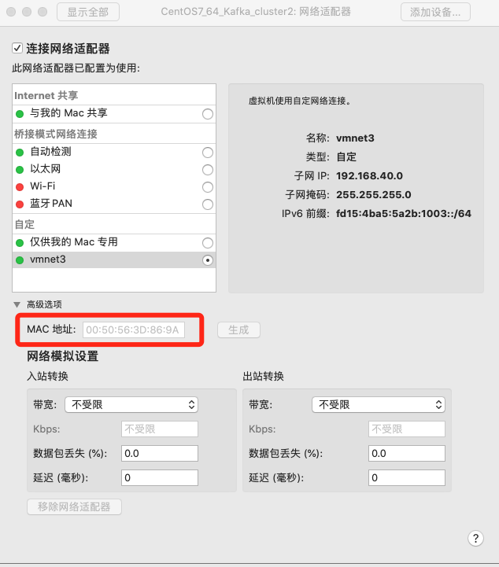

# Linux相关总结
## 1.scp传输文件
### 1.1 本地向服务器发送文件
scp 本地文件路径 远程服务器用户名@服务器ip:远程服务器路径
### 1.2 从服务器向本地传输文件
scp 远程服务器用户名@服务器ip:远程服务器路径  本地路径

## 2. 程序启动后端口被占用排查方法
### 2.1 mac
lsof -i tcp:端口号

### 2.2 linux
netstat -tulp | grep 端口号

## 3. 常用命令
### 3.1 端口本占用排查
netstat -nultp | grep 端口号

## 4. vmware虚拟机
### 4.1 固定IP

00:50:56:2B:D1:5E

+ 编辑ip地址文件  
vim /etc/udev/rules.d/70-persistent-ipoib.rules  
追加以下内容:  
ACTION=="add", SUBSYSTEM=="net", DRIVERS=="?*", ATTR{type}=="1", ATTR{address}=="00:50:56:3D:86:9A", NAME="eth0",KERNEL="eth*"  
标红的地方是虚拟机的mac地址，要根据具体情况进行修改，在下图所示位置可以找到  

+ 编辑网卡配置文件
vim /etc/sysconfig/network-scripts/ifcfg-eth0  
编辑这个文件，这个文件可能不存在，如果不存在则新建，写入以下内容  
CE="eth0"  
BOOTPROTO="static"  
NM_CONTROLLED="yes"  
ONBOOT="yes"  
TYPE="Ethernet"  
IPADDR=192.168.40.101 #这个地方要与宿主机在同一个网段  
NETMASK=255.255.255.0  
GATEWAY=192.168.40.2  #最后为2  
DNS1=114.114.114.114
+ 编辑网络配置文件  
执行以下命令:  
vim /etc/sysconfig/network  
编辑文件，写入以下内容:  
NETWORKING=yes  
HOSTNAME=Hadoop01  
+ 编辑DNS配置文件  
vim /etc/hosts
写入以下内容:  
192.168.40.101 Hadoop01  
192.168.40.102 Hadoop02  
重启网络服务使配置生效  

## 5. Centos7 防火墙相关操作  
### 5.1 防火墙的开启、关闭、禁用命令

### 5.1.1 设置开机启用防火墙  
systemctl enable firewalld.service
### 5.1.2 设置开机禁用防火墙  
systemctl disable firewalld.service
### 5.1.3 启动防火墙  
systemctl start firewalld
### 5.1.4 关闭防火墙  
systemctl stop firewalld
### 5.1.5 检查防火墙状态  
systemctl status firewalld 

## 5.2 使用firewall-cmd配置端口
### 5.2.1 查看防火墙状态  
firewall-cmd --state
### 5.2.2 重新加载配置  
firewall-cmd --reload
### 5.2.3 查看开放的端口  
firewall-cmd --list-ports
### 5.2.4 开启防火墙端口  
firewall-cmd --zone=public --add-port=9200/tcp --permanent
#### 5.2.4.1 命令含义
+ zone #作用域
+ add-port=9200/tcp #添加端口，格式为：端口/通讯协议
+ permanent #永久生效，没有此参数重启后失效  
**注意：添加端口后，必须用命令firewall-cmd --reload重新加载一遍才会生效**

### 5.2.5 关闭防火墙端口  
firewall-cmd --zone=public --remove-port=9200/tcp --permanent

