# 1. 常用命令

面试题:生产环境服务器变慢，谈谈诊断思路和性能

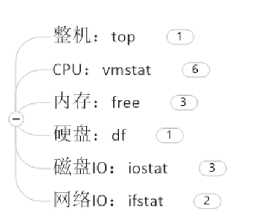

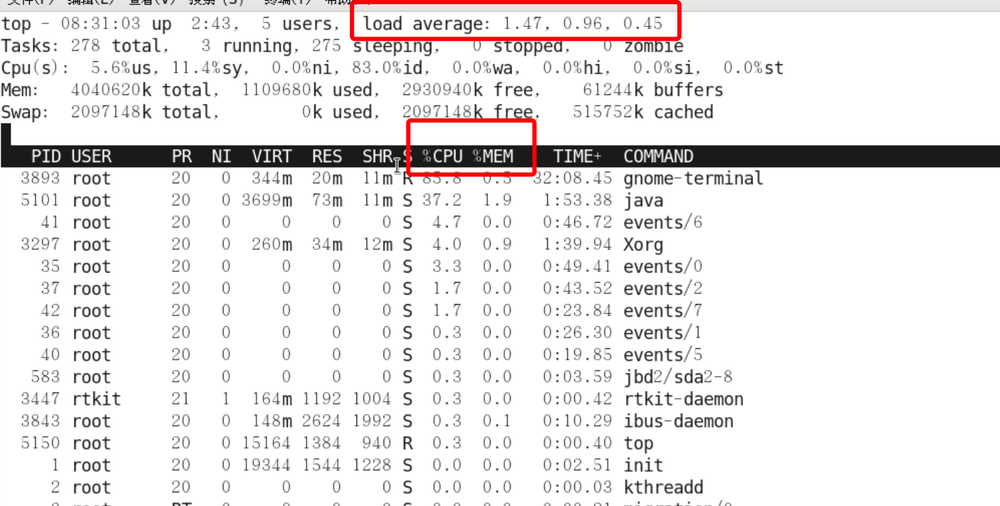

通过`top`命令主要看两个地方，一个是`CPU/MEM`，另外一个是`load average` 3个数值的含义分别是1分钟、5分钟、15分钟负载，如果3个数相加后除以3，越接近1说明系统负载越高

`uptime`命令是`top`命令的精简版

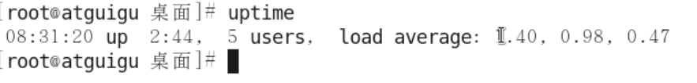

---

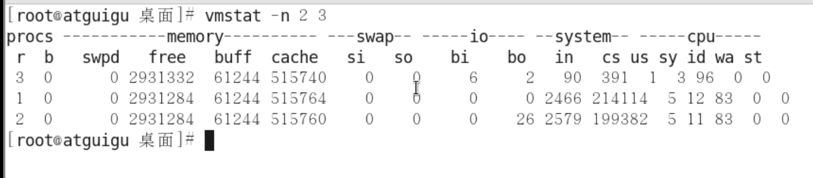

上图数字`2 3`的含义分别是每2秒采样一次，共采样3次，这个命令的结果主要是查看`procs`和`cpu`两个列

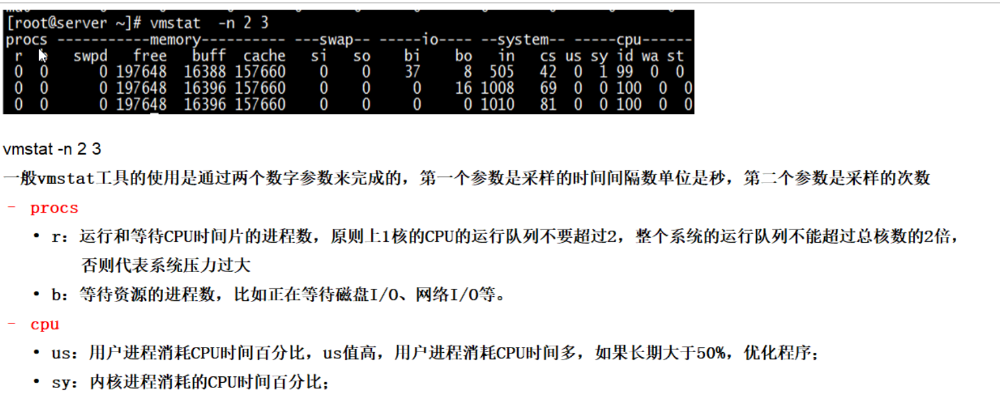

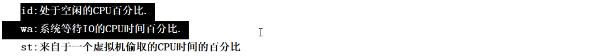

---

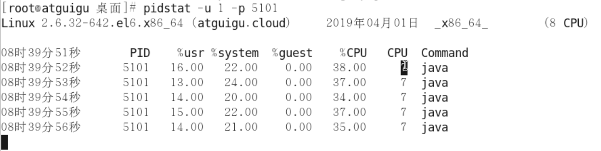

上图中`pidstat`命令的含义： -u 对于用户每秒钟采用一次，`-p`后接进程id号

---

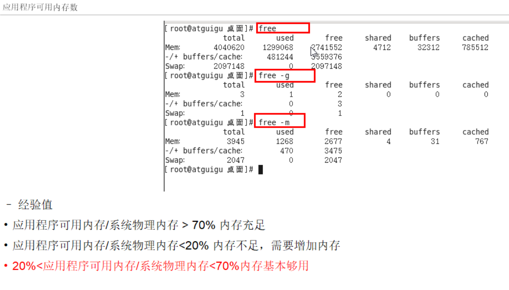

---

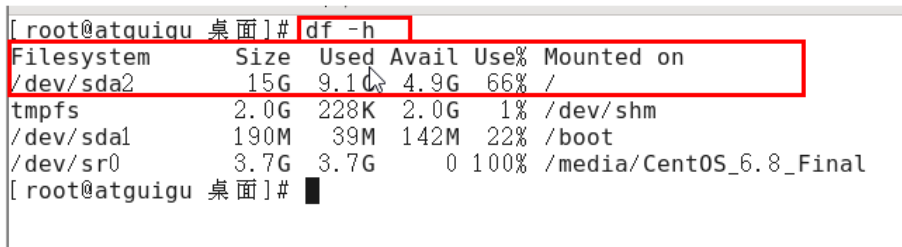

---

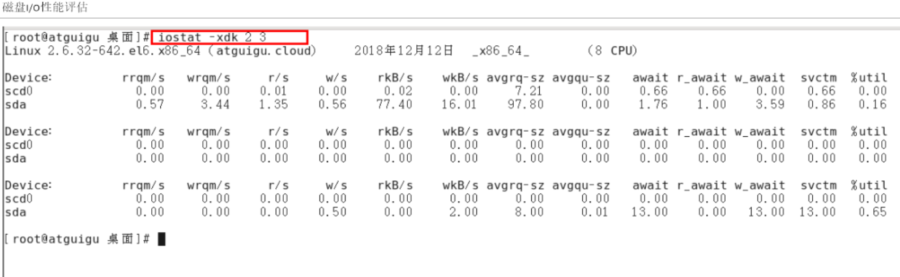

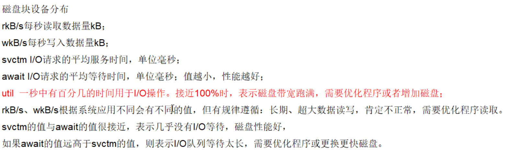

---

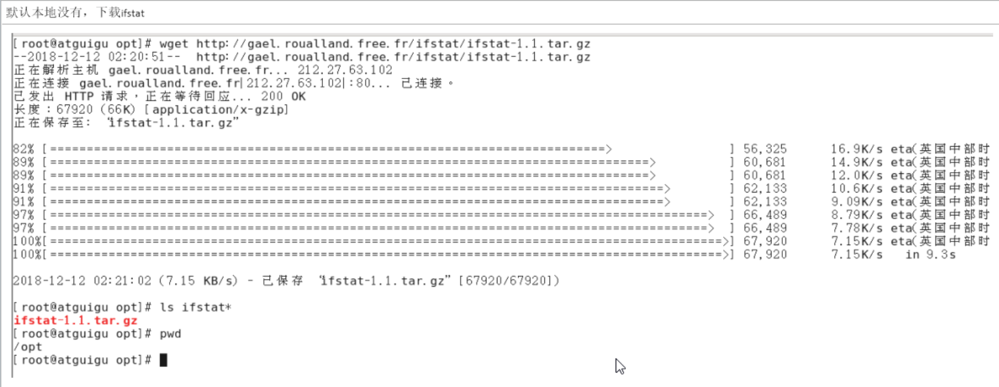

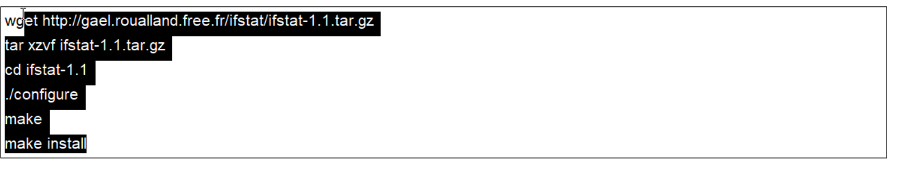

# 2. CPU占用过高定位思路

面试题:假如生产环境出现CPU占用过高，请谈谈你的分析思路和定位

1. 先用`top`命令找出CPU占比最高的

   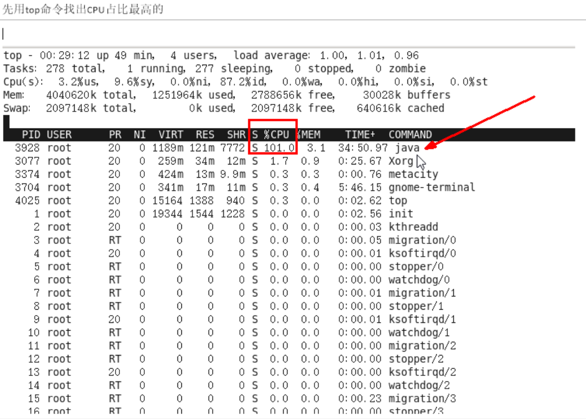

   

2. `ps -ef`或者`jps`进一步定位，得知是一个怎么样的后台程序导致CPU占用过高

   

   

3. 定位到具体线程或者代码

   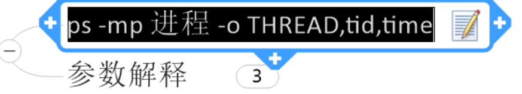

   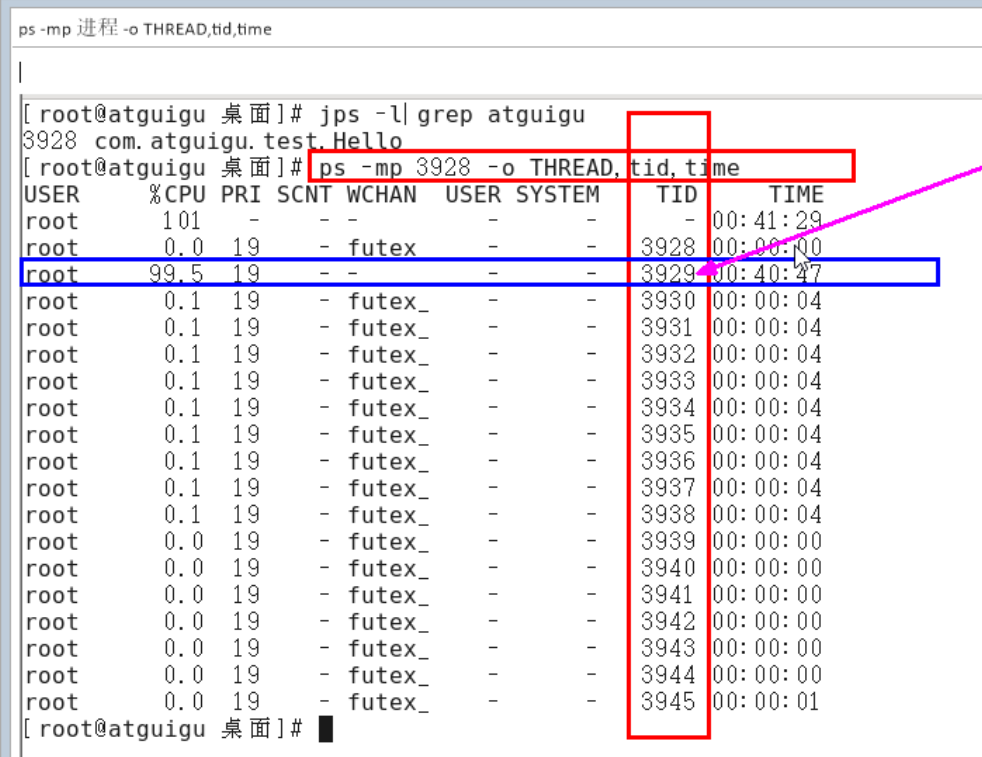

   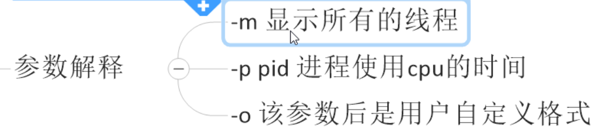

   

4. 将需要的线程id转换为16进制格式(英文小写格式)

   

   

5. `jstack 进程id | grep tid(16进制线程id小写英文) -A60`

