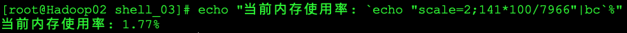

[TOC]

# 1. shell介绍

## 1.1 介绍


## 1.2 功能

+ 命令行解释功能
+ 启动程序
+ 输入输出重定向
+ 管道连接
+ 文件名置换
+ 变量维护
+ 环境控制
+ shell编程


# 2. Shell脚本语法

## 2.1 如何书写shell脚本


## 2.2 shell脚本运行方法


## 2.3 shell中的符号


## 2.4 管道


## 2.5 重定向


## 2.6 shell脚本中的数学运算


内存使用率统计案例

```bash
echo "当前内存使用率: `echo "scale=2;141*100/7966"|bc`%"
```



**注：**bc为linux自带的一款交互式计算器程序

## 2.7 脚本退出

 


 # 3. 格式化输出

## 3.1 echo语法


## 3.2 颜色字体


# 4. 格式化输入

## 4.1 read命令


​	


# 5. shell变量

## 5.1 变量介绍


## 5.2 变量分类


## 5.3 变量管理


# 6. shell数组

## 6.1 shell数组介绍


## 6.2 默认数组


## 6.3 关联数组


# 7. shell五大运算

## 7.1 赋值运算


## 7.2 数学运算


## 7.3 比较运算


## 7.4 关系运算


## 7.5 文件类型比较


# 8. 流程控制

## 8.1 if判断

### 8.1.1 单if语法


### 8.1.2 if ... else语法


### 8.1.3 if...elif...else语法


### 8.1.4 if高级语法


## 8.2 for 循环


### 8.2.1 循环介绍


### 8.2.2 for语法


### 8.2.3 循环控制


+ sleep
+ continue
+ Break

## 8.3 while循环

### 8.3.1 while循环介绍


### 8.3.2 while语法


### 8.3.3 while实战


## 8.4 until循环

### 8.4.1 until介绍


### 8.4.2 until语法


#  9. 流程控制-case

## 9.1 case介绍


## 9.2 case语法


## 9.3 特殊变量


# 10. shell函数

## 10.1 函数介绍


## 10.2 函数语法


## 10.3 函数应用


# 11. 正则表达式

## 11.1 正则表达式介绍


## 11.2 特殊字符


## 11.3 POSIX字符


# 12. shell对文件的操作

## 12.1 介绍


## 12.2 sed命令


## 12.3 sed小技巧


# 13. Shell对输出流的处理

## 13.1 awk介绍


## 13.2 awk语法


## 13.3 awk高级用法


## 13.4 awk高级用法


## 13.5 awk高级用法


# 14. shell案例


# 15. shell面试集


