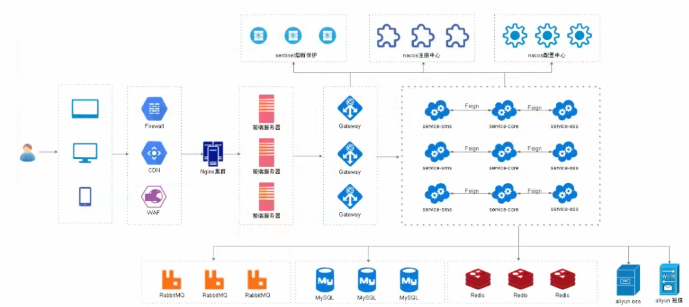
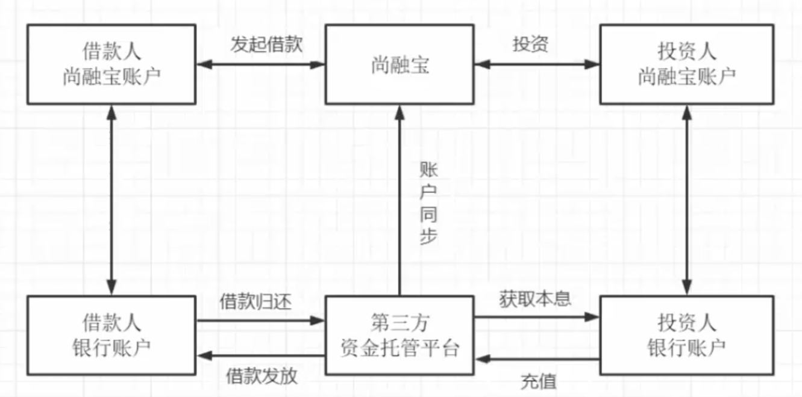
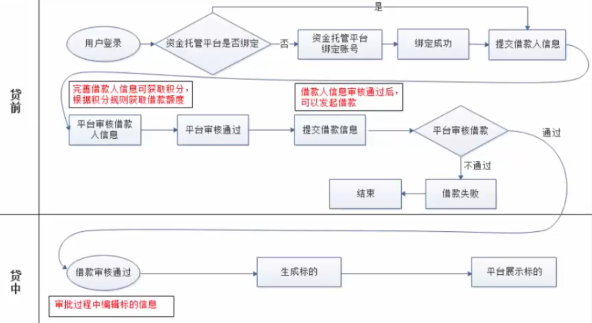
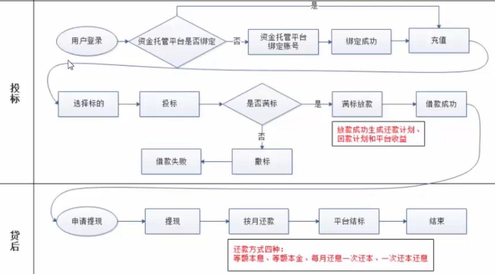

[TOC]

# 1. 项目简介

## 1.1 平台定位

尚融宝是一个网络借贷信息中介服务平台，为个人投资者、个人融资用户和小微企业提供专业的线上信贷以及出借撮合服务。

行业案例:

- 人人贷:https://www.renrendai.com
- 拍拍贷:https://www.paipaidai.com

## 1.2 项目架构

1. 用户通过不同的终端访问应用程序
2. 经过CDN/防火墙访问到Nginx集群
3. 来到前端服务器
4. 前端服务器通过微服务网关Gateway将业务请求分发到微服务模块
5. 微服务之间通过Feigin进行远程访问
6. 通过sentinle做熔断保护和限流
7. 所有的业务服务器会在nacos注册中心和nacos配置中心的治理下工作
8. 数据存储使用MySQL
9. 缓存系统使用redis
10. 消息服务器使用的是RabbitMQ
11. 文件存储使用阿里云oss
12. 项目中还引入了阿里云的短信服务

## 1.3 业务流程

### 1.3.1 用户注册

### 1.3.2 用户登录

### 1.3.3 贷前与贷中

### 1.3.4 投标与贷后

## 1.4 技术栈

### 1.4.1 后端

- SpringBoot 2.3.4.RELEASE

- SpringCloud Hoxton.SR8

  微服务基础设施:服务注册、服务发现、服务熔断、微服务网关、配置中心等

- SpringCloud Alibaba 2.2.2.RELEASE

- MyBatis Plus:持久化层框架和代码生成器

- Lombok:简化实体类开发

- Swagger2:Api接口文档生成工具

- Logback:日志系统

- Alibaba-easyexcel:excel读写

- Spring Data Redis：Spring项目中访问Redis缓存

- HttpClient:基于Http协议的客户端，用来实现远程调用

- Spring Task：定时任务

### 1.4.2 数据库和中间件

- MySQL 5.7

  关系型数据库，管理工具：Navicat

- Redis 5.0

  缓存技术 管理工具：RedisDesktopManager

- RabbitMQ 3.8

  消息中间件

### 1.4.3 三方接口

- 阿里云短信:短信网关
- 阿里云OSS:分布式文件存储
- 资金托管平台API对接：汇付宝

### 1.4.4 前端

- Node.js

  JavaScript运行环境

- ES6

  JavaScript的模块化版本

- axios

  一个发送Ajax请求的工具

- Vue.js

  web界面的渐进式框架

- Element-UI

  前端组件库

- NPM

  模块资源管理器

- vue-element-admin

  基于Vue.js的后台管理系统UI集成方案

- NuxtJS

  基于Vue.js构建的服务器端渲染应用的轻量级框架

## 1.5 信用贷款平台的类别

### 1.5.1 银行系

- 优势

  1. 资金雄厚，流动性充足
  2. 项目质地优良，大多来自银行原有中小型客户
  3. 风险控制能力强，如恒丰银行、招商银行等旗下都有信用贷款平台

- 劣势

  收益率偏低，预期年化收益率处于5.5%-8.6之间，略高于银行其他理财产品，对投资人吸引力有限

### 1.5.2 国资系

- 优势

  拥有国有背景股东的隐形背书，兑付能力有保障，业务模式较为规范，从业人员金融专业素养较高

- 劣势

  缺乏互联网基因；项目标的较大，起投门槛较高且产品种类有限，多为企业信用贷；较为谨慎，层层审核的机制严重影响了平台运营效率；收益率不具有吸引力

### 1.5.3 民营系

民营系平台数量最多，起步最早，但鱼龙混杂，不胜枚举

- 优势

  普惠金融，手续便捷；门槛极低，投资起点低，最低起投金额甚至50元；强大的互联网思维，产品创新能力高，市场化程度高，投资收益率具有吸引力

- 劣势

  风险偏高，资本实力及风控能力偏弱，跑路以及倒闭的高发区

# 2. MyBatis-Plus

## 2.1 简介

### 2.1.1 官网

https://mp.baomidou.com/

## 2.2 乐观锁

# 3. 前端

# 4. 项目整体

从P103开始正式的项目

## 4.1 树形数据的两种加载方案

### 4.1.1 非延迟加载

### 4.1.2 延迟加载

该看173

