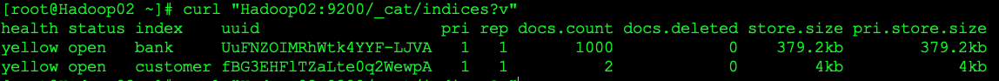

[TOC]

# 0.图书信息

书名:Elasticsearch权威指南

作者:赵建亭


# 1. 快速入门

## 1.1 基本概念

### 1.1.1 集群

集群由唯一的名称标识(elasticserach.yml配置文件中对应参数cluster.name)，集群名称是leasticsearch.yml配置we年中最重要的一个配置参数，默认名称为Elasticsearch，节点只能通过集群名称加入集群。


### 1.1.2 节点

节点(node)是一个Elasticsearch的运行实例，也就是一个进程(process),多个节点组成集群，节点存储数据，并参与集群的索引、搜索和分析功能。


### 1.1.3 索引

索引(index)是具有某种相似特性的文档集合。

索引由一个名称(必须全部小写)标识，当对其中的文档执行索引、搜索、更新和删除操作时，该名称指向这个特定的索引。

在单个集群中，可以定义任意多个索引

### 1.1.4 类型

类型(type)这个概念在7.0版本以后已经被彻底移除。


### 1.1.5 文档

文档(document)是可以被索引的基本信息单元，文档以JSON表示

在单个索引中，理论上可以存储任意多的文档


### 1.1.6 分片和副本

索引可能会存储大量数据，这些数据可能会超过单个节点的硬件限制。为了解决这个问题，Elasticsearch提供了将索引水平切分为多段(称为分片,shard)的能力。创建索引时，只需定义所需的分片数量。每个分片本身就是一个具有完全功能的独立“索引”，可以分布在集群中的任何节点上。

分片很重要，主要原因:

1. 分片可以水平拆分数据，实现大数据存储和分析
2. 可以跨分片(可能在多个节点上)，进行分发和并行操作，从而提高性能和吞吐量

在随时可能发生故障的网络或云环境中，如果某个分片或节点以某种方式脱机或因何种原因丢失，则强烈建议用户使用故障转移机制。为此Elasticsearch提出了将索引分片复制一个或多个拷贝，称为副本(replica)

副本很重要，主要有两个原因:

1. 副本在分片或节点发生故障时提供高可用性
2. 通过副本机制，可以提高搜索性能和水平扩展吞吐量，因为可以在所有副本上并行执行搜索

可以在创建索引时为每个索引定义分片和副本的数量。创建索引后，还可以随时动态更改副本的数量。分片的数量理论上不可变更，唯一的办法重建索引，重新定义分片数量。但还是可以使用`_shrink`和`_split` API更改索引的分片数量，但这不是通常的做法，预先评估准确的分片数量才是最佳方法。


分片和副本机制是Elasticsearch实现分布式、水平扩展、高并发、高容错功能的核心


**分片和副本的区别：**

- 本质上分片和副本都是一个完整的Lucenes索引，存储的数据也是完全相同的，都可以称为分片
- 假设一个索引定义了3个分片、2个副本，那么总共就是9个分片，其中3个是主分片，每个主分片有2个副本。主分片就是建立索引时首先建立的分片，或者说当主分片失效时会重新选出一个副本作为主分片。
- 当索引时，数据会首先到达主分片，然后再把请求分发到其他副本
- 当搜索时，主分片和副本都可以接受请求、搜索和分片数据，二者没有区别


## 1.2 安装部署

下载地址

https://www.elastic.co/downloads/past-releases

## 1.3 开始使用集群

使用API可以执行的操作包括:

1. 检查集群、节点和索引的运行状况、状态和统计信息
2. 管理集群、节点和索引数据和元数据
3. 对索引执行CRUD(创建、读取、更新和删除)和搜索操作
4. 执行高级搜索操作，如分页、排序、过滤、脚本、聚合和其他操作

### 1.3.1 集群健康信息

```bash
curl -X GET "Hadoop02:9200/_cat/health?v"
```


集群的健康状态有绿色(green)、黄色(yellow)、红色(red)三种:

- 绿色:一切正常(集群功能全部可用)
- 黄色:所有数据都可用，但某些副本尚未分配(集群完全正常工作)
- 红色:由于某些原因，某些数据不可用(集群只有部分功能正常工作)

注意:当集群为红色时 ，可用的分片可以继续提供搜索请求，但需要尽快修复它，因为存在未分配的分片。

获取集群中节点列表:

```bash
curl -X GET "Hadoop02:9200/_cat/nodes?v"
```


### 1.3.2 列出集群中的索引信息

```bash
curl -X GET "Hadoop02:9200/_cat/indices?v"
```

如果出现下图，说明还没有索引


### 1.3.3 创建一个索引

创建一个名为`customer`的索引

```bash
curl -X PUT "Hadoop02:9200/customer?pretty"
```


添加数据 PUT

```bash
http://hadoop02:9200/customer/_doc/1?pretty
```

### 1.3.4 删除索引

发DELETE请求

```bash
http://hadoop02:9200/customer?pretty
```

### 1.3.5 访问数据模式

```bash
<HTTP Verb>/<Index>/<Endpoint>/<ID>
```

## 1.4 修改数据

### 1.4.1 索引和覆盖文档

如果文档的id相同会覆盖，否则新建

### 1.4.2 更新文档

Elasticsearch更新文档实际上并不是进行就地更新，每当进行更新时，Elasticsearch会删除旧文档，然后索引一个新文档，但这对用户来说是一次调用。实际上Elasticsearch的数据存储结构决定了其不能像关系数据库那样进行字段级的更新，所有的更新都是先删除旧文档，再插入一条新文档，但这个过程对用户来说是透明的。

```bash
POST http://hadoop02:9200/customer/_update/1?pretty
{
    "doc":{"name":"Jane Doe","age":20}
}
```

也可以使用脚本，下面示例使用脚本将年龄增加5:

```bash
POST http://hadoop02:9200/customer/_update/1?pretty
{
    "script":"ctx._source.age +=5"
}
```

### 1.4.3 删除文档

对于删除操作，并不会立即删除对应的源文档，因为删除只需要删除文档的ID

### 1.4.4 批量操作

批量API不会由于其中一个操作失败而失败。如果一个操作由于某种原因失败，它将继续处理后面的其余操作。当批量API返回时，它将为每个操作提供一个状态(以相同的发送顺序)，以便用户检查特定操作是否失败。

## 1.5 探索数据

### 1.5.1 加载数据集

在`accounts.json`文件所在目录执行下面的命令导入数据集

```bash
curl -H "Content-Type:application/json" -XPOST "Hadoop02:9200/bank/_bulk?pretty&refresh" --data-binary "@accounts.json"
```

查看索引

```bash
curl "Hadoop02:9200/_cat/indices?v"
```



### 1.5.2 搜索API

查询bank索引中的所有文档：

```bash
curl -XGET "Hadoop02:9200/bank/_search?pretty"
```

返回结果:

```json

{
  "took" : 75, #took表示Elasticsearch执行搜索所用的时间，单位是ms
  "timed_out" : false, # 表示搜索是否超时
  "_shards" : { # 表示 搜索了多少分片，以及搜索成功和失败的分片的计数
    "total" : 1,
    "successful" : 1,
    "skipped" : 0,
    "failed" : 0
  },
  "hits" : { # 用来展示实际搜索结果集
    "total" : { # 包含与搜索条件匹配的文档总数信息的对象
      "value" : 1000, # 表示总命中计数的值(必须在hits.total.relation上下文中解释)
      "relation" : "eq" # 确切来说，默认情况下，hits.total.value是不确切的命中计数，在这种情况下，当        	                       # hits.total.relation的值是eq时，hits.total.value的值是准确计数。当
                        # hits.total.relation的值是gte时，hits.total.value的值是不准确的。
    },
    "max_score" : 1.0,
    "hits" : [# hits.hits是存储搜索结果的实际数组(默认为前10个文档)
      {
        "_index" : "bank",
        "_type" : "_doc",
        "_id" : "1",
        "_score" : 1.0,
        "_source" : {
          "account_number" : 1,
          "balance" : 39225,
          "firstname" : "Amber",
          "lastname" : "Duke",
          "age" : 32,
          "gender" : "M",
          "address" : "880 Holmes Lane",
          "employer" : "Pyrami",
          "email" : "amberduke@pyrami.com",
          "city" : "Brogan",
          "state" : "IL"
        }
      },
      {
        "_index" : "bank",
        "_type" : "_doc",
        "_id" : "6",
        "_score" : 1.0,
        "_source" : {
          "account_number" : 6,
          "balance" : 5686,
          "firstname" : "Hattie",
          "lastname" : "Bond",
          "age" : 36,
          "gender" : "M",
          "address" : "671 Bristol Street",
          "employer" : "Netagy",
          "email" : "hattiebond@netagy.com",
          "city" : "Dante",
          "state" : "TN"
        }
      },
      {
        "_index" : "bank",
        "_type" : "_doc",
        "_id" : "13",
        "_score" : 1.0,
        "_source" : {
          "account_number" : 13,
          "balance" : 32838,
          "firstname" : "Nanette",
          "lastname" : "Bates",
          "age" : 28,
          "gender" : "F",
          "address" : "789 Madison Street",
          "employer" : "Quility",
          "email" : "nanettebates@quility.com",
          "city" : "Nogal",
          "state" : "VA"
        }
      },
      {
        "_index" : "bank",
        "_type" : "_doc",
        "_id" : "18",
        "_score" : 1.0,
        "_source" : {
          "account_number" : 18,
          "balance" : 4180,
          "firstname" : "Dale",
          "lastname" : "Adams",
          "age" : 33,
          "gender" : "M",
          "address" : "467 Hutchinson Court",
          "employer" : "Boink",
          "email" : "daleadams@boink.com",
          "city" : "Orick",
          "state" : "MD"
        }
      },
      {
        "_index" : "bank",
        "_type" : "_doc",
        "_id" : "20",
        "_score" : 1.0,
        "_source" : {
          "account_number" : 20,
          "balance" : 16418,
          "firstname" : "Elinor",
          "lastname" : "Ratliff",
          "age" : 36,
          "gender" : "M",
          "address" : "282 Kings Place",
          "employer" : "Scentric",
          "email" : "elinorratliff@scentric.com",
          "city" : "Ribera",
          "state" : "WA"
        }
      },
      {
        "_index" : "bank",
        "_type" : "_doc",
        "_id" : "25",
        "_score" : 1.0,
        "_source" : {
          "account_number" : 25,
          "balance" : 40540,
          "firstname" : "Virginia",
          "lastname" : "Ayala",
          "age" : 39,
          "gender" : "F",
          "address" : "171 Putnam Avenue",
          "employer" : "Filodyne",
          "email" : "virginiaayala@filodyne.com",
          "city" : "Nicholson",
          "state" : "PA"
        }
      },
      {
        "_index" : "bank",
        "_type" : "_doc",
        "_id" : "32",
        "_score" : 1.0,
        "_source" : {
          "account_number" : 32,
          "balance" : 48086,
          "firstname" : "Dillard",
          "lastname" : "Mcpherson",
          "age" : 34,
          "gender" : "F",
          "address" : "702 Quentin Street",
          "employer" : "Quailcom",
          "email" : "dillardmcpherson@quailcom.com",
          "city" : "Veguita",
          "state" : "IN"
        }
      },
      {
        "_index" : "bank",
        "_type" : "_doc",
        "_id" : "37",
        "_score" : 1.0,
        "_source" : {
          "account_number" : 37,
          "balance" : 18612,
          "firstname" : "Mcgee",
          "lastname" : "Mooney",
          "age" : 39,
          "gender" : "M",
          "address" : "826 Fillmore Place",
          "employer" : "Reversus",
          "email" : "mcgeemooney@reversus.com",
          "city" : "Tooleville",
          "state" : "OK"
        }
      },
      {
        "_index" : "bank",
        "_type" : "_doc",
        "_id" : "44",
        "_score" : 1.0,
        "_source" : {
          "account_number" : 44,
          "balance" : 34487,
          "firstname" : "Aurelia",
          "lastname" : "Harding",
          "age" : 37,
          "gender" : "M",
          "address" : "502 Baycliff Terrace",
          "employer" : "Orbalix",
          "email" : "aureliaharding@orbalix.com",
          "city" : "Yardville",
          "state" : "DE"
        }
      },
      {
        "_index" : "bank",
        "_type" : "_doc",
        "_id" : "49",
        "_score" : 1.0,
        "_source" : {
          "account_number" : 49,
          "balance" : 29104,
          "firstname" : "Fulton",
          "lastname" : "Holt",
          "age" : 23,
          "gender" : "F",
          "address" : "451 Humboldt Street",
          "employer" : "Anocha",
          "email" : "fultonholt@anocha.com",
          "city" : "Sunriver",
          "state" : "RI"
        }
      }
    ]
  }
}
```

`hits.total`的准确性由请求参数`track_total_hits`控制，当设置为true时，请求将准确跟踪总命中数("relatoin":"eq").它默认为10000，这意味着总命中数精确跟踪多达10000个文档，当结果集大于10000时，`hits.total.value`的值将是10000,这意味着总命中数精确跟踪多达10000个文档，当结果集大于10000时，`hits.total.value`的值将是10000，也就是不准确的。可以通过将`track_total_hits`显式设置为true强制进行精确计数，但这会增大集群资源的开销。


下面是使用请求body进行的相同搜索

```bash
GET http://hadoop02:9200/bank/_search
{
    "query":{"match_all":{}},
    "sort":[
        {"account_number":"asc"}
    ]
}
```

**指定查询返回的条数(通过`size`)**

如果没有指定`size`，则默认返回10条

```bash
GET http://hadoop02:9200/bank/_search
{
    "query":{"match_all":{}},
    "size":1
}
```

**返回指定范围的结果(`from`和`size`配合实现)**

```bash
GET http://hadoop02:9200/bank/_search
{
    "query":{"match_all":{}},
    "from":10,
    "size":10
}
```

对返回的结果进行排序

```bash
GET http://hadoop02:9200/bank/_search
{
    "query":{"match_all":{}},
    "sort":{"balance":{"order":"desc"}}
}
```

### 1.5.3 Elasticsearch查询语言

### 1.5.4 搜索文档

- **返回特定字段**

```bash
GET http://hadoop02:9200/bank/_search
{
    "query":{"match_all":{}},
    "_source":["account_number","balance"]
}
```

- **匹配查询**

```bash
GET http://hadoop02:9200/bank/_search
{
    "query":{"match":{"account_number":20}}  
}
```

- **布尔查询**

下面的示例包含两个匹配查询，返回地址中包含mill和lane的所有账户信息

`must`要求地址中必须同时包括词mill和lane

```bash
GET http://hadoop02:9200/bank/_search
{
    "query":{
        "bool":{
            "must":[
                {"match":{"address":"mill"}},
                {"match":{"address":"lane"}}
            ]
        }

    }
}
```

下面的示例包含两个匹配查询，返回地址中包含次mill或lane的所有账户信息

```bash
GET http://hadoop02:9200/bank/_search
{
    "query":{
        "bool":{
            "should":[
                {"match":{"address":"mill"}},
                {"match":{"address":"lane"}}
            ]
        }

    }
}
```

下面的示例包含两个匹配，返回地址中既不包含词mill也不包含lane的所有账户信息

```bash
GET http://hadoop02:9200/bank/_search
{
    "query":{
        "bool":{
            "must_not":[
                {"match":{"address":"mill"}},
                {"match":{"address":"lane"}}
            ]
        }

    }
}
```

可以在bool查询中同时组合must、should和must_not子句。此外，还可以在这些bool子句中嵌套bool查询，以模拟任何复杂的多级布尔逻辑。

下面的示例返回年龄(age字段)是40岁但不再ID(AHO)中居住(state字段)的所有账户信息

```bash
GET http://hadoop02:9200/bank/_search
{
    "query":{
        "bool":{
            "must":[
                {"match":{"age":40}}
            ],
            "must_not":[
                {"match":{"state":"ID"}}
            ]
        }

    }
}
```

### 1.5.5 条件过滤

如下示例使用bool查询返回余额(balance字段)在20000~30000(包括20000和30000)的所有账户信息。

```bash
GET http://hadoop02:9200/bank/_search
{
    "query":{
        "bool":{
            "must": {"match_all":{}},
            "filter":{
                "range":{
                    "balance":{
                        "gte":20000,
                        "lte":30000
                    }
                }
            }
            
        }

    }
}
```

注意:查询和过滤在功能上是相同的，只不过过滤不计算相似度得分，性能更高

### 1.5.6 聚合查询

如下示例按状态(state.keyword)对所有账户进行分组，然后返回按计数降序排序的前10个(默认值)分组结果:

```bash
GET http://hadoop02:9200/bank/_search
{
    "size":0, # size=0表示不显示搜索结果，因为此处只希望在响应结果中看到聚合结果
    "aggs":{
        "group_by_state":{
            "terms":{
                "field":"state.keyword"
            }
        }
    }
}
```

如下示例中，按降序对账户平均余额进行排序

```bash
GET http://hadoop02:9200/bank/_search
{
    "size": 0,
    "aggs": {
        "group_by_state": {
            "terms": {
                "field": "state.keyword",
                "order": {
                    "average_balance": "desc"
                }
            },
            "aggs": {
                "average_balance": {
                    "avg": {
                        "field": "balance"
                    }
                }
            }
        }
    }
}
```

如下示例，演示了如何按年龄段(20~29岁、30~39岁和40~49岁)进行分组，然后再按性别(gender.keyword)分组，最后得到每个年龄段每个性别的账户平均余额

```bash
GET http://hadoop02:9200/bank/_search
{
    "size": 0,
    "aggs": {
        "group_by_age": {
            "range": {
                "field": "age",
                "ranges": [
                    {
                        "from": 20,
                        "to": 30
                    },
                    {
                        "from": 30,
                        "to": 40
                    },
                    {
                        "from": 40,
                        "to": 50
                    }
                ]
            },
            "aggs": {
                "group_by_gender": {
                    "terms": {
                        "field": "gender.keyword"
                    },
                    "aggs": {
                        "average_balance": {
                            "avg": {
                                "field": "balance"
                            }
                        }
                    }
                }
            }
        }
    }
}
```

# 2. 安装部署

## 2.1 安装JDK

## 2.2 安装Elasticsearch

### 2.2.1 调整Linux系统的相关参数

1. 修改最大文件数和锁内存限制

   ```shell
   vim /etc/security/limits.conf
   ```

   ```shell
   * soft nofile 65536
   * hard nofile 65536
   * soft nproc 131072
   * hard nproc 131072
   eric - memlock unlimited
   eric - fsize unlimited
   eric - as unlimited
   ```

   

2. 更改一个进程能拥有的最大内存区域限制

   ```bash
   vim /etc/sysctl.conf
   ```

   ```bash
   vm.max_map_count=262144
   vm.swappiness = 1
   ```

   修改完后执行`sysctl -p`

3. 修改用户最大线程数

   ```bash
   vim  /etc/security/limits.d/20-nproc.conf
   ```

   ```bash
   root       soft    nproc     unlimited
   * soft nofile unimited
   * hard nofile 65536
   * soft nproc 131072
   * hadr nproc 131072
   ```

   

### 2.2.2 创建用户


### 2.2.3 下载Elasticsearch


## 2.3 配置Elasticsearch

### 2.3.1 配置文件的位置

- Elasticsearch.yml

  用于配置Elasticsearch的最主要的配置文件

- jvm.options

  用于配置Elasticsearch JVM设置

- Log4j2.properties

  用于配置Elasticsearch日志记录的属性

### 2.3.2 配置文件的格式


### 2.3.3 环境变量替换


### 2.3.4 设置JVM参数

`jvm.options`文件包含遵循一下特殊语法的以行分割的JVM参数列表

- 以`-`开头的行被视为独立于JVM版本应用的JVM选项

  例如`-Xms2g`

- `n:-`开头的行，这个参数依赖于数字指明的JVM版本

  例如`8:-Xmx2g`

- `n-:`开始的行，要求JVM版本高于最前面的数字

  例如`8-:-Xmx2g`

- `n-n`开始的行，指明了要求的JVM版本号

  例如`8-9:-Xmx2g`

- 所有除了注释、以及上述以外的行都被拒绝

### 2.3.5 安全设置


### 2.3.6 创建密钥库


### 2.3.7 列出密钥库中的设置项


### 2.3.8 添加字符串设置


### 2.3.9 添加文件设置


### 2.3.10 删除设置属性


### 2.3.11 可重载的安全设置


### 2.3.12 日志配置


### 2.3.13 配置日志级别


### 2.3.14 JSON日志格式


## 2.4 跨集群赋值设置(用于多个集群间的数据恢复)


### 2.4.1 远程恢复设置


### 2.4.2 高级远程恢复设置


### 2.4.3 索引生命周期管理设置


### 2.4.4 序列号设置


### 2.4.5 监控功能设置


### 2.4.6 一般的监控设置


### 2.4.7 监控收集设置


### 2.4.8 本地导出器设置


### 2.4.9 HTTP导出器设置


### 2.4.10 X-Pack监控TLS/SSL相关设置


### 2.4.11 X-Pack监控TLS/SSL密钥和可信证书设置


### 2.4.12 PEM编码文件


## 2.5 重要的Elasticsearch配置


### 2.5.1 数据和日志存放目录


### 2.5.2 集群名称


### 2.5.3 节点名称


### 2.5.4 网络设置


### 2.5.5 重要节点发现和集群初始化设置

1. 种子列表

   在没有任何网络配置的情况下，Elasticsearch将绑定到可用的环回地址，并扫描本地的端口9300到9305，以尝试连接到同一服务器上运行的其他节点。这提供了一种自动组件集群的功能，而无须进行任何配置。

   当要与其他主机上的节点组成集群时，必须使用`discovery.seed_hosts`设置提供集群中其他节点的列表，这些节点可以是活动的和可通信的，以便为发现过程设定种子

2. 候选主节点列表

   当第一次启动一个全新的Elasticsearch集群时，有一个集群引导过程，它确定在第一次主节点选举中计票的合格主节点集。在开发模式下，在没有配置发现设置的情况下，此步骤由节点本身自动执行。由于这种自动引导固有的不安全性，当在生产模设计下启动一个全新集群时，必须明确列出合格主节点的名称或IP地址，这些节点的投票应在第一次主节点选举中计算。此列表是使用`cluster.initial_master_nodes`设置的

   注意：`cluster.initial_master_nodes`的用途是你准备让哪些节点参与主节点的选举

### 2.5.6 Heap设置


### 2.5.7 JVM heap dump目录设置

默认情况下，Elasticsearch将jvm内存不足异常上的堆转储到默认数据目录，即data目录。如果此路径不适合接收堆转储，则应修改条目`-xx:heapDumpPath=...`,此参数在`jvm.options`中进行设置。如果指定目录，则JVM将根据正在运行的实例的PID为堆转储生成一个文件。如果指定的是文件而不是目录，则当JVM需要对内存不足异常执行堆转储时，该文件不能存在，否则堆转储将失败。

### 2.5.8 GC日志设置

默认情况下，Elasticsearch启动GC日志。它们在`jvm.options`中配置，并默认为与Elasticsearch日志相同的默认位置。默认配置为每64MB回滚一次日志，最多可占用2GB的磁盘空间。

### 2.5.9 临时文件存储目录


### 2.5.10 JVM致命错误日志设置

默认情况下，Elasticsearch配置JVM将致命错误日志写入默认日志目录。这些文件会记录当JVM遇到致命错误(列入分段错误)时由JVM生成的日志信息。如果此路径不适合接收日志，则应修改条目`-xx:errorfile=...`，把致命错误日志存储到合适的路径下

## 2.6 重要的系统参数设置


### 2.6.1 配置系统设置


### 2.6.2 禁用交换区


### 2.6.3 文件描述符


### 2.6.4 虚拟内存


### 2.6.5 线程数量限制


### 2.6.6 DNS缓存设置


### 2.6.7 JNA临时目录挂载位置


## 2.7 启动检查

### 2.7.1 Heap大小检查


### 2.7.2 文件描述符检查


### 2.7.3 内存锁定检查


### 2.7.4 线程数限制核查


### 2.7.5 最大文件大小检查


### 2.7.6 最大虚拟内存检查


### 2.7.7 最大mmap映射区域数量检查


### 2.7.8 JVM模式检查


### 2.7.9 JVM垃圾手机机制检查


### 2.7.10 系统调用过滤器检查


### 2.7.11 发现功能配置检查


## 2.8 启动和停止Elasticsearch


## 2.9 集群水平扩展


# 3. API规范

## 3.1 多索引


## 3.2 日期数学格式


## 3.3 通用选项

### 3.3.1 格式化搜索结果


### 3.3.2 可读输出


### 3.3.3 格式化日期值


### 3.3.4 返回信息过滤


### 3.3.5 展开设置


### 3.3.6 布尔值


### 3.3.7 数字值


### 3.3.8 时间单位


### 3.3.9 数据单位


### 3.3.10 缩略处理


### 3.3.11 距离单位


### 3.3.12 模糊性


### 3.3.13 启用堆栈跟踪


### 3.3.14 查询字符串中的请求正文


### 3.3.15 Content-Type要求


## 3.4 基于URL的访问控制


# 4. 操作文档

## 4.1 读写文档

### 4.1.1 基本写模型


### 4.1.2 写流程错误处理


### 4.1.3 基本读模型


### 4.1.4 读流程错误处理


### 4.1.5 一些简单的知识点


## 4.2 索引API


### 4.2.1 自动创建索引


### 4.2.2 ID自动生成


### 4.2.3 路由


### 4.2.4 分发


### 4.2.5 等待活动分片


### 4.2.6 detect_noop参数


## 4.3 GET API

### 4.3.1 实时性


### 4.3.2 字段选择


### 4.3.3 存储字段


### 4.3.4 直接获取_source


### 4.3.5 路由


### 4.3.6 preference参数


### 4.3.7 refresh参数


### 4.3.8 分发


### 4.3.9 版本支持


## 4.4 删除API


## 4.5 查询删除


### 4.5.1 URL参数


### 4.5.2 返回体


### 4.5.3 任务API


### 4.5.4 取消任务API


### 4.5.5 动态调整API


### 4.5.6 切片


## 4.6 更新API

### 4.6.1 使用script更新


### 4.6.2 部分字段更新


### 4.6.3 避免无效更新


### 4.6.4 upsert元素


### 4.6.5 scripted_upsert参数


### 4.6.6 doc_as_upsert参数


## 4.7 查询更新


### 4.7.1 URL参数


### 4.7.2 请求体


### 4.7.3 任务API


### 4.7.4 取消任务API


### 4.7.5 动态调整API


### 4.7.6 切片


### 4.7.7 获取新属性


## 4.8 MGet API

### 4.8.1 _source过滤


### 4.8.2 存储字段


### 4.8.3 路由


### 4.8.4 重新索引


## 4.9 跨集群索引


## 4.10 批量操作API


### 4.10.1 路由


### 4.10.2 更新


## 4.11 Term向量


### 4.11.1 返回值

### 4.11.2 Term过滤


### 4.11.3 行为过滤


### 4.11.4 获取多个文档的Term向量


## 4.12 refresh参数

### 4.12.1 如何选择refresh的值


### 4.12.2强制刷新


## 4.13 乐观并发控制


# 5.搜索数据

## 5.1 基本概念和机制

## 5.2 搜索API


## 5.3 URI模式


## 5.4 Body模式

### 5.4.1 Explain参数


### 5.4.2 折叠结果


### 5.4.3 对结果分页


### 5.4.4 高亮结果


### 5.4.5 索引加权


### 5.4.6 命中文档嵌套


### 5.4.7 分数值过滤


### 5.4.8 查询命名


### 5.4.9 post_filter过滤


### 5.4.10 分片选择


### 5.4.11 重排序


### 5.4.12 脚本字段


### 5.4.13 滚动查询


### 5.4.14 search_after参数


### 5.4.15 搜索类型


### 5.4.16 排序


### 5.4.17 _source字段过滤


### 5.4.18 存储字段


### 5.4.19 total返回值详解


### 5.4.20 版本


## 5.5 返回搜索分片信息


## 5.6 Count API


## 5.7 Validate API


## 5.8 调试搜索请求


# 6. 聚合

## 6.1 度量值聚合

### 6.1.1 均值聚合


### 6.1.2 带权重的均值聚合


### 6.1.3 计数聚合


### 6.1.4 统计聚合


### 6.1.5 地理范围聚合


### 6.1.6 地理距离质心聚合


### 6.1.7 最大值聚合、最小值聚合、和值聚合


### 6.1.8 百分位数聚合


### 6.1.9 百分比排名聚合


### 6.1.10 脚本聚合


### 6.1.11 顶部命中聚合


### 6.1.12 单值度量聚合


### 6.1.13 中位数绝对偏差聚合


## 6.2 存储桶聚合

### 6.2.1 邻接矩阵聚合


### 6.2.2 区间聚合


### 6.2.3 日期区间聚合


### 6.2.4 IP区间聚合


### 6.2.5 Term聚合


### 6.2.6 直方图聚合


### 6.2.7 过滤器聚合


# 7. 查看API


## 7.1 查看子目录


## 7.2 应用实例及参数

### 7.2.1 v参数


### 7.2.2 help参数


### 7.2.3 h参数


### 7.2.4 常用接口汇总


# 8. 集群API

## 8.1 节点过滤


## 8.2 节点类型


## 8.3 常用API

### 8.3.1 查看集群及节点信息


### 8.3.2 动态更新集群设置


### 8.3.3 重置路由


# 9. 索引API

## 9.1 创建索引API

### 9.1.1 索引设置


### 9.1.2 映射


### 9.1.3 别名


## 9.2 删除索引


## 9.3 判断索引是否存在


## 9.4 打开关闭索引


## 9.5 收缩索引


## 9.6 映射

### 9.6.1 数据类型


### 9.6.2 映射属性设置


# 10. 特定域查询语言(DSL)

## 10.1 查询和过滤上下文


### 10.1.1 查询上下文


### 10.1.2 过滤上下文


## 10.2 匹配所有文档


## 10.3 全文检索


### 10.3.1 匹配查询


### 10.3.2 模糊匹配


### 10.3.3 短语匹配查询


### 10.3.4 查询字符串


# 11. SQL接口

## 11.1 功能体验


## 11.2 术语和约定


## 11.3 SQL REST API

### 11.3.1 返回数据格式


### 11.3.2 过滤结果


### 11.3.3 支持的参数


## 11.4 SQL Translate API


## 11.5 SQL语法介绍


### 11.5.1 词法结构

### 11.5.2 SQL命令

# 12. Elasticsearch原理剖析

## 12.1 为什么需要搜索引擎


## 12.2 搜索引擎雏形


## 12.3 搜索引擎实现原理

### 12.3.1 分析


### 12.3.2 Lucene倒排索引


### 12.3.3 搜索过程


### 12.3.4 结果排序


## 12.4 分布式原理

### 12.4.1 分布式索引过程


### 12.4.2 分布式检索过程


### 12.4.3 分布式局部更新文档


## 12.5 节点发现和集群形成机制

### 12.5.1 集群形成过程


### 12.5.2 重要配置

# 13. Kibana入门介绍

## 13.1 安装Kibana


### 13.1.1 下载Kibana


### 13.1.2 简单配置Kibana


### 13.1.3 启动Kibana


## 13.2 基础操作

### 13.2.1 加载样例数据集


### 13.2.2 探索航班数据集


### 13.2.3 过滤数据


### 13.2.4 查询数据


### 13.2.5 探索数据


### 13.2.6 编辑可视化组件


## 13.3构建Dashboard


### 13.3.1 导入样例数据


### 13.3.2 定义索引模式


### 13.3.3 可视化组件介绍


### 13.3.4 构建Dashboard


# 14. 构建集约化日志管理平台


## 14.1 Elastic stack介绍


## 14.2 日志的特征

### 14.2.1 日志的重要性


### 14.2.2 日志的特征


### 14.2.3 日志的复杂性


## 14.3 集约化解决方案


