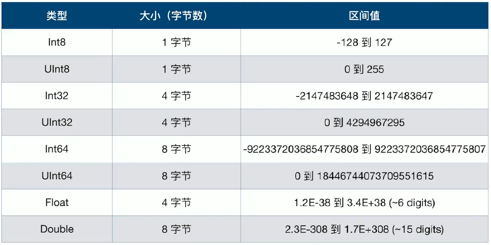

[TOC]

# 1. Swift基础语法和特性

## 1.1 Swift简介

### 1.1.1 版本历史和个版本特性

### 1.1.2 Swift2特性

### 1.1.3 Swift3特性

### 1.1.4 Swift4特性

### 1.1.5 Swift5特性

### 1.1.6 Swift与Object-C的主要区别

1. 编程范式

   + Swift可以面向协议编程、函数式编程、面向对象编程
   + Object-C以面向对象编程为主，当然可以引入类似ReactiveCocoa的类库来进行函数式编程

2. 类型安全

   + Swift是一门类型安全的语言。鼓励程序员在代码中清楚明确值的类型。如果代码中使用一个字符串String,那么就不能错误地传递一个整型Int,因为Swift是类型安全的，会在代码编译的时候做类型检查，并且把所有不匹配的类型作为一个错误标记出来。这样使得程序员在开发中尽可能早地发现和纠正错误
   + 而Oject-C则不然，声明一个NSString变量，仍然可以传一个NSNumber给它，尽管编译器会抱怨，但是你仍然可以作为NSNumber来使用它

3. 值类型增强

   + 在Swift中，典型的有struct、enum以及tuple都是值类型。而平时使用的Int、Double、Float、String、Array、Dictionary、Set其实都是用结构体实现的，也是值类型
   + Object-C中NSNumber、NSString以及集合类对象都是指针类型

4. 枚举增强

   + Swift的枚举可以使用整型、浮点型、字符串等，还能拥有属性和方法，甚至支持泛型、协议、扩展等
   + Object-C里面的枚举则鸡肋很多

5. 泛型

   + Swift中支持泛型，也支持泛型的类型约束等特性
   + 苹果推出了Swift2.0版本，为了让开发者从Object-C更好地过渡到Swift上，苹果也为Object-C带来了Generics泛型支持，不过Object-C的泛型约束也仅停留在编译器警告阶段

6. 协议和扩展

   + Swift对协议的支持更加丰富，配合扩展(extension)、泛型、关联类型等可以实现面向协议编程，从而大大提高代码的灵活性。同时，Swift中的protocol还可以用于值类型，如结构体和枚举
   + Object-C的协议缺乏强约束，提供的optional特性往往成为很多问题的来源，而如果放弃optional又会让实现代价过大。

   

7. 函数和闭包

   + Swift函数是一等公民，可以直接定义函数类型变量，可以作为其他函数参数传递，可以作为函数返回值返回
   + Object-C里面函数仍然是次等公民，需要selector封装或者使用block才能模拟Swift中类似的效果

### 1.1.7 命令行工具

1. 编译过程

   

   

2. swiftc

   

### 1.1.8 REPL

Xcode 6.1 引入了另外一种以交互式的方式来体验Swift的方法

Read Eval PrintLoop,简称REPL

### 1.1.9 Playground

## 1.2 基本数据类型

### 1.2.1 整数

**数值范围**

### 1.2.2 Bool

### 1.2.3 类型别名

### 1.2.4 变量和常量

声明常量和变量

### 1.2.5 类型标注

### 1.2.6 变量和常量命名

### 1.2.7 打印常量和变量

## 1.3 运算符和表达式

## 1.4 流程控制

## 1.5 集合类

## 1.6 函数和闭包

 ## 1.7 面向对象编程

## 1.8 泛型

# 2. 多线程

## 2.1 理论与实践

## 2.2 GCD

## 2.3 基础设施与编程范式

# 3. 常见第三方库

# 4. SwiftUI

# 5. Swift运行时

