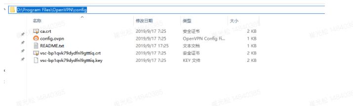

# VPN使用说明

李龙龙 11月7日 保存 [查看历史版本](https://tower.miliantech.com/teams/580151/repository_documents/64573/versions) 

## **客户端配置**

### **Windows客户端配置**

1、下载并安装openVPN客户端

[内部Tower下载地址--Win10](https://tower.miliantech.com/attfiles/a354f588e29bfadd9638075506b3a41c?download=true&filename=openvpn-install-2.4.8-I601-Win10.exe)

[内部Tower下载地址--Win7](https://tower.miliantech.com/attfiles/3f7f368ad3aa4606091efd0ce4fcdf6c?download=true&filename=openvpn-install-2.4.8-I602-Win7.exe)

2、配置证书

**注：文档最后有申请步骤**

在：企业微信-审批-IT-系统账号权限申请 里面申请VPN，会得到一个config证书

将下载的证书解压，并复制到config文件夹中

默认安装在C盘，如果修改安装路径，放在**C****:\Program Files\OpenVPN\config**中即可。

如果修改安装路径，则需要放放到对应目录：

如：软件安装在D:\Program Files\OpenVPN，则需要把证书文件拷贝到

D:\Program Files\OpenVPN\config

3、打开客户端，单击Connect发起连接（或者在任务栏右键点击VPN图标，选择连接）

图标变成绿色，则表示已经连接成功

4、连接测试

在客户端能telnet通堡垒机IP，即是正常连接

telnet 172.16.225.143 60022

 

### **Mac客户端配置-openvpn**

1、下载并安装OpenVPN客户端

[内部Tower下载地址](https://tower.miliantech.com/attfiles/bbef13abf1bd98068930045ac6bb1205?download=true)

[老版本openVPN客户端](https://tower.miliantech.com/attfiles/b279648188212b156dc2564cdbb25ef3?download=true&filename=openvpn-connect-2.7.1.100_signed.dmg)

2、将下载的证书解压

在：企业微信-审批-IT-系统账号权限申请 里面申请VPN，会得到一个config证书

3、安装并运行客户端，导入解压的证书文件

然后点击connect即可发起连接

看到下图，则说明已经成功拨入VPN

### **Mac客户端配置-tunnelblick**

[下载地址](https://tower.miliantech.com/teams/580151/repository_uploads/179871)

下载并安装

拖动config.ovpn至配置窗口选择安装

点击连接发起连接

选择 VPN详情，如下图配置，可关闭软件打开DNS和外部IP检查警告

 

4、连接测试

在客户端能telnet通堡垒机IP，即是正常连接

telnet 172.16.225.143 60022

 

 

 

### Linux客户端

1、执行以下命令安装OpenVPN客户端

yum install -y openvpn

2、将证书解压拷贝到/etc/openvpn/conf/目录

unzip certs.zip -d /etc/openvpn/conf/

3、执行以下命令启动Openvpn客户端软件

openvpn --config /etc/openvpn/conf/config.ovpn –-daemon

4、连接测试

在客户端能telnet通堡垒机的内网IP，即是正常连接

telnet 172.16.225.143 60022

 

 

### **安卓手机客户端**

1、从浏览器下载并安卓客户端

[**安卓VPN客户端**](https://tower.miliantech.com/attfiles/a7956b52e48979e14cda2d6f2bbbac8e?download=true)

2、将证书上传到手机，在“文件管理”中，找到证书并解压。

3、运行客户端，导入证书（from file）

4、获取地址后，即可连内网服务。

 

### IOS客户端

1、自行注册非国区Apple ID (或联系李龙龙借用Apple ID)

2、【设置】->【iTunes Store 与 App Store】选择 现有Apple ID退出登陆，并登陆非国区ID

3、【App Store】搜索选择（OpenVPN Connect) 下载安装